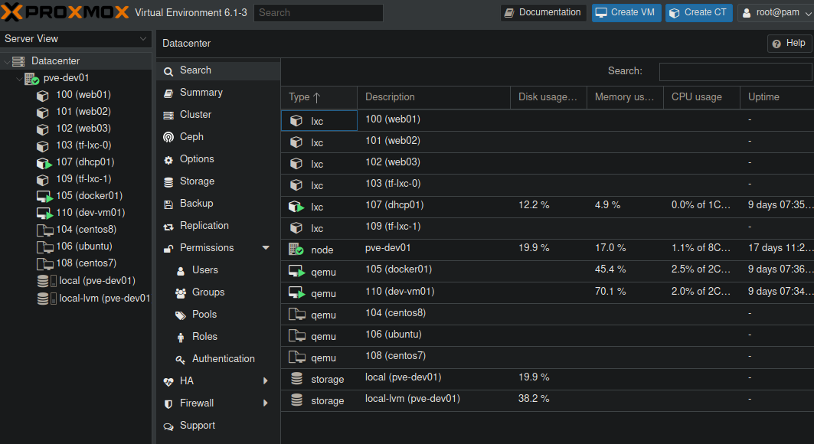

# အနားမသပ်နိုင် သေးတဲ့ Infrastructure as Code \(IaC\) - အပိုင်း\(၃\)

အရှေ့ post မှာတော့ Vagrant ကိုအသုံးပြုပြီး dev/test environment တစ်ခုကို ဘယ်လိုမျိုး IaC နည်းနဲ့ တည်ဆောက်ရသလဲဆိုတာကို လက်တွေ့အသုံးပြုနည်း ၂မျိုး ၃မျိုးလောက်ကို ရှင်းပြခဲ့ပါတယ်။ Instant deployment နဲ့ Scale-up/down တို့အပြင် teardown လုပ်ရတာ လွယ်ပုံလွယ်နည်းကိုလည်း ရှင်းခဲ့တယ်။ ဒီလိုဆိုတော့ မေးစရာရှိတာက Vagrant ဟာ Virtualbox နဲ့ အချို့ သော provider တွေနဲ့သာ အလုပ်လုပ်ပြီးတော့ cloud platform တွေမှာ limit အရမ်းကို ဖြစ်လွန်းပါတယ်။ စာရေးသူ အနေနဲ့တော့ Vagrant ကိုအသေးစား စမ်းသပ်မူမျိုးအတွက်သာ ကိုယ့် local machine မှာ Virtualbox နဲ့ တွဲပြီး သုံးသင့်ပါတယ်။ ဒီ့ထက်ကြီးတဲ့ infrastructure ကိုတည်ဆောက်ဖို့အတွက်တော့ Terraform ကိုသာ သုံးသင့်ပါတယ်။ ဒီတစ်ခုမှာတော့ Terraform အကြောင်းကို ဆက်ပြီးတော့သွားလိုက်ရအောင်ဗျာ။

### Terraform မိတ်ဆက်

Terraform ကိုလည်း HashiCorp ကနေပဲ opensource အနေနဲ့ ဖန်တီးထားတာဖြစ်ပြီးတော့ Vagrant နဲ့ မတူတာတစ်ခုက HashiCorp Configuration Language \(HCL\) ဆိုတဲ့ declarative configuration language ပုံစံကို အသုံးပြုထားပါတယ်။ ဒါကြောင့် Terraform မှာ desired state တွေကိုပြောလိုက်ရုံနဲ့ အနောက်မှာလုပ်စရာရှိတာတွေ အကုန်လုံးကို သူဟာသူ API တွေနဲ့တွဲကာ လုပ်ဆောင်နိုင်စွမ်းရှိပါတယ်။ သူ့မှာလည်း provider ဆိုတဲ့ concept ကို Vagrant မှာလိုပဲ အသုံးပြုထားတာဖြစ်ပြီးတော့ virtualisation နဲ့ cloud platform တွေတော်တော်များများမှာ အလုပ်လုပ်ပါတယ်။ အချို့သော support လုပ်တဲ့ platform တွေကို ပြောရမယ်ဆိုရင်တော့ AWS, Azure, IBM cloud, GCP, DigitalOcean, Oracle Cloud Infrastructure, VMware vSphere နဲ့ OpenStack တို့လိုမျိုး platform တွေမှာ အလုပ်လုပ်ပါတယ်။ စာရေးသူ သိသလောက်တော့ Terraform ရဲ့ အနောက်မှာအသုံးပြုတဲ့ core language က Golang လို့လည်း သိရပါတယ်။ Terraform ရဲ့ GitHub repo ကိုတော့ ဒီမှာ [https://github.com/hashicorp/terraform](https://github.com/hashicorp/terraform) သွားပြီးတော့ ကြည့်ရှုလေ့လာလို့ ရနိုင်ပါတယ်။ Golang ဟာ system နဲ့ infrastructure တွေနဲ့ တိုက်ရိုက် အလုပ်လုပ်တဲ့ အခါမှာ မြန်အောင်ပေါ့အောင် လုပ်ထားတဲ့ language တစ်ခုဖြစ်တဲ့ အတွက် အခုအချိန်မှာ အငယ်တော့ တီးမိခေါက်မိလောက် အောင်သိထားသင့်တဲ့ အရာတစ်ခုပါ။ ဒါကြောင့်လည်း စာရေးသူလေ့လာချင်နေတဲ့ language ထဲမှာ Golang ဟာလည်း တစ်ခုသော programming language တစ်ခုပါ။ Python တို့ Ruby တို့မှာလိုပဲ code တွေကို ဖတ်ရလွယ်ပြီးတော့ စွမ်းဆောင်ရည်ပိုင်းမှာလည်း အခြေခံကစလို့ အဆင့်မြင့်မြင့် လုပ်ဆောင်ချက်တွေကို လုပ်နိုင်တာကြောင့် တော်တော်လေးကို မျက်စိကျမိနေပါတယ်။ Docker လိုမျိုး ဆန်းပြားတဲ့ containerisation platform တစ်ခုလုံးကို Golang တစ်ခုတည်းနဲ့ ရေးလို့ ရနိုင်ပါတယ်။ ဒီလောက်ဆိုရင် Golang နဲ့ ဆိုဘယ်လောက်ထိခရီးပေါက်မလဲဆိုတာ သိနိုင်ပါပြီ။ 

### Terraform ကို install လုပ်ပုံ

Terraform ကို Ubuntu/Debian ကိုအခြေခံထားတဲ့ distro တွေမှာအသုံးပြုချင်ရင်တော့ အောက်ကအတိုင်း command တွေကို run ရမှာဖြစ်ပါတယ်။ ပထမဆုံး HashiCorp ရဲ့ GPG ကို ကိုယ့်ရဲ့ apt package manager အတွက် အခုလိုအရင်ဆုံး ထည့်သွင်းရပါ့မယ်။

```text
$ curl -fsSL https://apt.releases.hashicorp.com/gpg | sudo apt-key add -
```

ပြီးနောက်... သူ့ရဲ့ repo ကို package manager ရဲ့ repository list ထဲမှာသွားပြီးတော့ အောက်ကအတိုင်းပေါင်းထည့်ပါ။ 

```text
$ sudo apt-add-repository "deb [arch=amd64] https://apt.releases.hashicorp.com $(lsb_release -cs) main"
```

ပြီးသွားရင်တော့... အောက်ကအတိုင်း apt package manager ကို update လုပ်ပြီးတော့၊ Terraform ကို install လုပ်ရုံပါပဲ။ 

```text
$ sudo apt-get update && sudo apt-get install terraform
```

ကိုယ်က Apple ကိုအသုံးပြုတယ်ဆိုရင်တော့ Homebrew ကိုအသုံးပြုပြီးတော့ အောက်ကအတိုင်း install လုပ်လို့ရပါတယ်။ 

```text
$ brew tap hashicorp/tap
$ brew install hashicorp/tap/terraform
$ brew upgrade hashicorp/tap/terraform
```

ဒါမှမဟုတ်ဘူး... Windows မှာအသုံးပြုချင်ရင်တော့ Chocolatety ကိုသုံးပြီးတော့ အခုလိုမျိုး install လုပ်လို့ရနိုင်ပါတယ်။

```text
$ choco install terraform
```

ဒီတော့... Terraform ကို ကိုယ်အသုံးပြုတဲ့ OS ပေါ်မှာမူတည်ပြီးတော့ ပုံစံအမျိုးမျိုးနဲ့ install လုပ်နိုင်တာကိုတွေ့ရမှာဖြစ်ပါတယ်။ 

### Terraform ကိုလက်တွေ့အသုံးချနည်း 

Terraform ကို install လုပ်ပြီးသွားတဲ့နောက်မှာတော့ စတင်ပြီးတော့ အသုံးပြုနိုင်ပြီဖြစ်တဲ့အတွက် ပထမဆုံး အနေနဲ့ Promox Virtualisation platform မှာသုံးတဲ့ပုံစံကို အရင်ဆုံးကြည့်လိုက်ရအောင်။ 


```text
terraform {
  required_providers {
    proxmox = {
      source  = "ondrejsika/proxmox"
    }
  }
}

provider "proxmox" {
    pm_api_url = "https://192.168.122.10:8006/api2/json"
    pm_user = "root@pam"
    pm_password = "yourpasswordhere!"
    pm_tls_insecure = "true"
}

variable "ssh_key" {
  default = "ssh-rsa AAAAB3NzaC1yc2EAAAADAQABAAABAQDrejVdImAkcPtmdNjTRpiEIJI1xyiUyBg4XKBHU7PJzC/qNpXAjuAAMSIQFu933LUUP0qIdpdnC+ttpVum8w9eAyXmtA3SeFfHQvs442v6Hq+KpFAizd2uZbsfe5w+eUzVvCeFCt08N3UW4Pr/P/kbqe1CrekQ3Fdd4j6olGAcprd1zj8NACbNH0F44f8GPkA3OCiwt9EbN8gW9Xj7CzP0+HTD/r33DwNd00G9q7/yayMO7tJ4UxkGf4b0uP7sit9LBzjdnUM5Ku52tUEFqqGDooHYdS5gTdDXTSw2rRSPzWqaiX3qQ6uWCHI3nb63A5CPbhVusz8zk1P3egx/9eXT tyla@promox"
}

resource "proxmox_vm_qemu" "proxmox_vm" {
  count             = 3
  name              = "tf-vm-${count.index}"
  target_node       = "pve-dev01"
  clone             = "ubuntu"
  os_type           = "cloud-init"
  cores             = 1
  sockets           = "1"
  cpu               = "host"
  memory            = 1024
  scsihw            = "virtio-scsi-pci"
  bootdisk          = "scsi0"

disk {
    id              = 0
    size            = 10
    type            = "scsi"
    storage         = "local-lvm"
    storage_type    = "lvm"
    iothread        = true
  }

network {
    id              = 0
    model           = "virtio"
    bridge          = "vmbr0"
  }
# Cloud Init Settings
  ipconfig0 = "ip=192.168.122.10${count.index + 1}/24,gw=192.168.122.1"
sshkeys = <<EOF
  ${var.ssh_key}
  EOF
}
```


အပေါ်ဆုံးမှာတော့... ကိုယ်ဘယ် provider ကိုအသုံးပြုမလဲဆိုတာကိုပြောပေးလိုက်ရုံပါပဲ။ ဒီလိုဆိုရင် သက်ဆိုင်ရာ အပိုင်းတွေကို terraform ကသွားပြီးတော့ download ဆွဲယူပြီးတော့ install လုပ်ပါလိမ့်မယ်။ ဒီလို download နဲ့ install လုပ်တာလည်း ပထမဆုံးအကြိမ် တခေါက်ပဲ လုပ်ဖို့လိုတာ ဖြစ်ပြီးတော့ နောက်အခါတွေအတွက်တော့ provider ကြေငြာပေးလိုက်ရုံပါ။ ပြီးတာနဲ့ ကိုယ်ရဲ့ Promox VE ရဲ့ IP address နဲ့ login ကိုထည့်သွင်းပေးပြီးတော့ ssh\_key ဆိုတဲ့ variable ကိုကြေငြာပြန်ပါတယ်။ ဒီ variable မှာဆိုရင်တော့ ကိုယ့်ရဲ့ ssh public key ကိုထည့်ပါ။ ဒီလိုလုပ်လိုက်တာနဲ့ အောက်ဆုံးအပိုင်းမှာ Cloud Init Settings ဆိုတဲ့နေရာ ပြန်လည် အသုံးပြုနိုင်အောင်လုပ်ဆောင်လိုက်ခြင်းဖြစ်ပါတယ်။ အဲ့ဒီနောက်မှာတော့ ကိုယ် deploy လုပ်ချင်တဲ့ resource ကိုထပ်မံပြီးတော့ define လုပ်ရပါတယ်။ ဒီနေရာမှာ သတိထားရမှာက VM ဖြစ်တဲ့အတွက် Promox VE မှာ ကိုယ်သုံးမယ် VM template တွေကို အရင်ဆုံးဖန်တီးရပါလိမ့်မယ်။ Cloud Init ကိုလည်း ကိုယ်သုံးမယ်ပုံစံ မှာမူတည်ပြီးတော့ လိုရင်လိုသလို ကြိုပြီးတော့ configure လုပ်ရပါတယ်။ Terraform အကြောင်းရေးတာ ဖြစ်တဲ့အတွက် Promox VE မှာ VM template တည်ဆောက်ပုံနဲ့ cloud init ကို configure လုပ်ပုံကို အသေးစိတ် မသွားလိုတော့ပါဘူး။ နောက်မှ... Promox VE နဲ့ ပတ်သတ်တဲ့ post တွေမှပဲ ရေးပါတော့မယ်။ ဒီ resource နေရာမှာ ကိုယ်လိုချင်တဲ့ VM count အရေအတွက်နဲ့ system specification နဲ့ အခြားသော attribute တွေကို JSON ပုံစံနဲ့ ရေးရပါတယ်။ နောက်ဆုံးမှာတော့... VM တစ်လုံးချင်စီရဲ့ IP configuration နဲ့ ssh public key ကို ကူးယူပြီးတော့ ထည့်သွင်းပေးလိုက်ပါ။ ပြီးရင်တော့ လိုအပ်တဲ့ code ကို ပြင်ဆင်ပြီးဖြစ်ပါတယ်။ နောက်တခါ... VM နဲ့ မဟုတ်ပဲနဲ့ Promox VE ရဲ့ LXC container တွေနဲ့ ဘယ်လို deploy လုပ်နိုင်သလဲဆိုတာလည်း တချက်ကြည့်လိုက်ရအောင်။ 


```text
terraform {
  required_providers {
    proxmox = {
      source  = "ondrejsika/proxmox"
    }
  }
}

provider "proxmox" {
    pm_api_url = "https://192.168.122.10:8006/api2/json"
    pm_user = "root@pam"
    pm_password = "yourpasswordhere!"
    pm_tls_insecure = "true"
}

resource "proxmox_lxc" "lxc" { 
    count = 2
    hostname = "tf-lxc-${count.index}"
    cores = 1
    memory = "1024"
    swap = "2048"
    network {
        name = "eth0"
        bridge = "vmbr0"
        ip = "192.168.122.10${count.index + 1}/24"
        gw = "192.168.122.1"
        firewall = true
    }
    ostemplate = "local:vztmpl/ubuntu-18.04-standard_18.04.1-1_amd64.tar.gz" 
    password = "yourpasswordhere!"
    rootfs = "local-lvm:8" 
    storage = "local-lvm"
    target_node = "pve-dev01"
    unprivileged = true
}
```


မြင်တွေ့ရတဲ့အတိုင်း... resource ကို define လုပ်တဲ့ပုံစံ အနည်းငယ်ကွာတာကိုတွေ့ရပါလိမ့်မယ်။ Declarative ဖြစ်တဲ့အတွက် ကိုယ်လိုချင်တဲ့ ပုံစံကိုပြောပေးလိုက်ရုံနဲ့ terraform ဟာကျန်တဲ့ အပိုင်းတွေကို ဆက်ပြီးတော့ တာဝန်ယူသွားပါလိမ့်မယ်။ LXC container တွေကိုတော့ အရင်ဆုံး container template နေရာမှာ သွားပြီးတော့ download ဆွဲထားဖို့လိုပါတယ်။ အားလုံး အဆင်သင့်ဖြစ်ပြီ ဆိုတာနဲ့ terraform ကို စတင်အသုံးပြုဖို့အတွက် အောက်မှာပြထားတဲ့ terraform CLI commands တွေနဲ့ စလို့ရပါပြီ။

```bash
$ terraform init

Initializing the backend...

Initializing provider plugins...
- Finding latest version of ondrejsika/proxmox...
- Installing ondrejsika/proxmox v2020.9.21...
- Installed ondrejsika/proxmox v2020.9.21 (self-signed, key ID 410FB99F8F08737F)

Partner and community providers are signed by their developers.
If you'd like to know more about provider signing, you can read about it here:
https://www.terraform.io/docs/plugins/signing.html

Terraform has created a lock file .terraform.lock.hcl to record the provider
selections it made above. Include this file in your version control repository
so that Terraform can guarantee to make the same selections by default when
you run "terraform init" in the future.

Terraform has been successfully initialized!

You may now begin working with Terraform. Try running "terraform plan" to see
any changes that are required for your infrastructure. All Terraform commands
should now work.

If you ever set or change modules or backend configuration for Terraform,
rerun this command to reinitialize your working directory. If you forget, other
commands will detect it and remind you to do so if necessary.

$ terraform plan

An execution plan has been generated and is shown below.
Resource actions are indicated with the following symbols:
  + create

Terraform will perform the following actions:

  # proxmox_lxc.lxc[0] will be created
  + resource "proxmox_lxc" "lxc" {
      + arch         = "amd64"
      + cmode        = "tty"
      + console      = true
      + cores        = 1
      + cpulimit     = 0
      + cpuunits     = 1024
      + hostname     = "tf-lxc-0"
      + id           = (known after apply)
      + memory       = 1024
      + onboot       = false
      + ostemplate   = "local:vztmpl/ubuntu-18.04-standard_18.04.1-1_amd64.tar.gz"
      + password     = "yourpasswordhere!"
      + protection   = false
      + rootfs       = "local-lvm:8"
      + start        = false
      + storage      = "local-lvm"
      + swap         = 2048
      + target_node  = "pve-dev01"
      + tty          = 2
      + unprivileged = true
      + vmid         = 0

      + network {
          + bridge   = "vmbr0"
          + firewall = true
          + gw       = "192.168.122.1"
          + ip       = "192.168.122.101/24"
          + name     = "eth0"
        }
    }

  # proxmox_lxc.lxc[1] will be created
  + resource "proxmox_lxc" "lxc" {
      + arch         = "amd64"
      + cmode        = "tty"
      + console      = true
      + cores        = 1
      + cpulimit     = 0
      + cpuunits     = 1024
      + hostname     = "tf-lxc-1"
      + id           = (known after apply)
      + memory       = 1024
      + onboot       = false
      + ostemplate   = "local:vztmpl/ubuntu-18.04-standard_18.04.1-1_amd64.tar.gz"
      + password     = "yourpasswordhere!"
      + protection   = false
      + rootfs       = "local-lvm:8"
      + start        = false
      + storage      = "local-lvm"
      + swap         = 2048
      + target_node  = "pve-dev01"
      + tty          = 2
      + unprivileged = true
      + vmid         = 0

      + network {
          + bridge   = "vmbr0"
          + firewall = true
          + gw       = "192.168.122.1"
          + ip       = "192.168.122.102/24"
          + name     = "eth0"
        }
    }

Plan: 2 to add, 0 to change, 0 to destroy.

------------------------------------------------------------------------

Note: You didn't specify an "-out" parameter to save this plan, so Terraform
can't guarantee that exactly these actions will be performed if
"terraform apply" is subsequently run.

$ terraform apply

An execution plan has been generated and is shown below.
Resource actions are indicated with the following symbols:
  + create

Terraform will perform the following actions:

  # proxmox_lxc.lxc[0] will be created
  + resource "proxmox_lxc" "lxc" {
      + arch         = "amd64"
      + cmode        = "tty"
      + console      = true
      + cores        = 1
      + cpulimit     = 0
      + cpuunits     = 1024
      + hostname     = "tf-lxc-0"
      + id           = (known after apply)
      + memory       = 1024
      + onboot       = false
      + ostemplate   = "local:vztmpl/ubuntu-18.04-standard_18.04.1-1_amd64.tar.gz"
      + password     = "yourpasswordhere!"
      + protection   = false
      + rootfs       = "local-lvm:8"
      + start        = false
      + storage      = "local-lvm"
      + swap         = 2048
      + target_node  = "pve-dev01"
      + tty          = 2
      + unprivileged = true
      + vmid         = 0

      + network {
          + bridge   = "vmbr0"
          + firewall = true
          + gw       = "192.168.122.1"
          + ip       = "192.168.122.101/24"
          + name     = "eth0"
        }
    }

  # proxmox_lxc.lxc[1] will be created
  + resource "proxmox_lxc" "lxc" {
      + arch         = "amd64"
      + cmode        = "tty"
      + console      = true
      + cores        = 1
      + cpulimit     = 0
      + cpuunits     = 1024
      + hostname     = "tf-lxc-1"
      + id           = (known after apply)
      + memory       = 1024
      + onboot       = false
      + ostemplate   = "local:vztmpl/ubuntu-18.04-standard_18.04.1-1_amd64.tar.gz"
      + password     = "yourpasswordhere!"
      + protection   = false
      + rootfs       = "local-lvm:8"
      + start        = false
      + storage      = "local-lvm"
      + swap         = 2048
      + target_node  = "pve-dev01"
      + tty          = 2
      + unprivileged = true
      + vmid         = 0

      + network {
          + bridge   = "vmbr0"
          + firewall = true
          + gw       = "192.168.122.1"
          + ip       = "192.168.122.102/24"
          + name     = "eth0"
        }
    }

Plan: 2 to add, 0 to change, 0 to destroy.

Do you want to perform these actions?
  Terraform will perform the actions described above.
  Only 'yes' will be accepted to approve.

  Enter a value: yes
  
proxmox_lxc.lxc[0]: Creating...
proxmox_lxc.lxc[1]: Creating...
proxmox_lxc.lxc[0]: Creation complete after 8s [id=pve/lxc/103]
proxmox_lxc.lxc[1]: Still creating... [10s elapsed]
proxmox_lxc.lxc[1]: Creation complete after 10s [id=pve/lxc/109]

Apply complete! Resources: 2 added, 0 changed, 0 destroyed.
```



အခုဆိုရင်... lab/test environment တစ်ခုကို terraform HCL နဲ့ တခါရေးပြီး code တွေကို အခါခါပြန်သုံးလို့ ရနိုင်ပါပြီ။ ကိုယ်တည်ဆောက်ထားတဲ့ environment ကိုပြန်လည် tear-down လုပ်ချင်ရင်တော့ အောက်ကအတိုင်း လုပ်လို့ရပါတယ်။ 

```bash
$ terraform destroy 

An execution plan has been generated and is shown below.
Resource actions are indicated with the following symbols:
  - destroy

Terraform will perform the following actions:

  # proxmox_lxc.lxc[0] will be destroyed
  - resource "proxmox_lxc" "lxc" {
      - arch                 = "amd64" -> null
      - bwlimit              = 0 -> null
      - cmode                = "tty" -> null
      - console              = true -> null
      - cores                = 1 -> null
      - cpulimit             = 0 -> null
      - cpuunits             = 1024 -> null
      - force                = false -> null
      - hostname             = "tf-lxc-0" -> null
      - id                   = "pve-dev01/lxc/103" -> null
      - ignore_unpack_errors = false -> null
      - memory               = 1024 -> null
      - onboot               = false -> null
      - ostype               = "ubuntu" -> null
      - protection           = false -> null
      - restore              = false -> null
      - rootfs               = "local-lvm:vm-103-disk-0,size=8G" -> null
      - start                = false -> null
      - storage              = "local" -> null
      - swap                 = 2048 -> null
      - target_node          = "pve-dev01" -> null
      - template             = false -> null
      - tty                  = 2 -> null
      - unique               = false -> null
      - unprivileged         = true -> null
      - vmid                 = 0 -> null

      - network {
          - bridge   = "vmbr0" -> null
          - firewall = true -> null
          - gw       = "192.168.122.1 -> null
          - ip       = "192.168.122.101/24" -> null
          - name     = "eth0" -> null
        }
    }

  # proxmox_lxc.lxc[1] will be destroyed
  - resource "proxmox_lxc" "lxc" {
      - arch                 = "amd64" -> null
      - bwlimit              = 0 -> null
      - cmode                = "tty" -> null
      - console              = true -> null
      - cores                = 1 -> null
      - cpulimit             = 0 -> null
      - cpuunits             = 1024 -> null
      - force                = false -> null
      - hostname             = "tf-lxc-1" -> null
      - id                   = "pve-dev01/lxc/109" -> null
      - ignore_unpack_errors = false -> null
      - memory               = 1024 -> null
      - onboot               = false -> null
      - ostype               = "ubuntu" -> null
      - protection           = false -> null
      - restore              = false -> null
      - rootfs               = "local-lvm:vm-109-disk-0,size=8G" -> null
      - start                = false -> null
      - storage              = "local" -> null
      - swap                 = 2048 -> null
      - target_node          = "pve-dev01" -> null
      - template             = false -> null
      - tty                  = 2 -> null
      - unique               = false -> null
      - unprivileged         = true -> null
      - vmid                 = 0 -> null

      - network {
          - bridge   = "vmbr0" -> null
          - firewall = true -> null
          - gw       = "192.168.122.1" -> null
          - ip       = "192.168.122.102/24" -> null
          - name     = "eth0" -> null
        }
    }

Plan: 0 to add, 0 to change, 2 to destroy.

Do you really want to destroy all resources?
  Terraform will destroy all your managed infrastructure, as shown above.
  There is no undo. Only 'yes' will be accepted to confirm.

  Enter a value: yes
  
proxmox_lxc.lxc[0]: Destroying... [id=pve-dev01/lxc/103]
proxmox_lxc.lxc[1]: Destroying... [id=pve-dev01/lxc/109]
proxmox_lxc.lxc[0]: Still destroying... [id=pve-dev01/lxc/103, 10s elapsed]
proxmox_lxc.lxc[1]: Still destroying... [id=pve-dev01/lxc/109, 10s elapsed]
proxmox_lxc.lxc[0]: Destruction complete after 11s
proxmox_lxc.lxc[1]: Destruction complete after 11s

Destroy complete! Resources: 2 destroyed.
```

Terraform ဟာ self-host virtualisation environment တွေအပြင်၊ cloud native တွေအတွက်လည်း သက်ဆိုင်ရာ provider တွေရှိပါတယ်။ အောက်မှာတော့ Vultr ဆိုတဲ့ cloud platform ကိုသုံးပြီးတော့ main.tf ကို အခုလိုမျိုးရေးလို့ ရပါတယ်။ 


```javascript
terraform {
  required_providers {
    vultr = {
      source = "vultr/vultr"
      version = "2.1.1"
    }
  }
}

// Configure the Vultr provider.
// Alternatively, export the API key as an environment variable: `export VULTR_API_KEY=<your-vultr-api-key>`.
provider "vultr" {
  api_key = "yourapikeyhere!"
}

resource "vultr_instance" "my_instance" {
    plan = "vc2-1c-1gb"
    region = "sea"
    os_id = "167"
    label = "my-instance-label"
    tag = "my-instance-tag"
    hostname = "my-instance-hostname"
    enable_ipv6 = true
    backups = "enabled"
    ddos_protection = true
    activation_email = false
}
```


ဒီလောက်ဆိုရင်တော့... Terraform နဲ့ ဆိုင်တဲ့အပိုင်းတွေ အခြေခံအားဖြင့်တော့ နားလည်သဘောပေါက်လိမ့်မယ်လို့ ထင်ပါတယ်။ အခြေခံကို သိထားပြီးရင်ဖြင့် ကိုယ်လိုချင်တဲ့ ပုံစံမျိုးစုံကို ထပ်မံရှာဖွေပြီးတော့ ချဲ့ကားပြင်ဆင်သွားလိုက်ရင်ဖြင့် ဒီ code ဟာစွမ်းဆောင်နိုင်ရေး ဘယ်လောက်တောင်ရှိနိုင်သလဲဆိုတာ တွေးကြည့်လို့ရနိုင်ပါပြီ။ နောက်တပိုင်းမှာတော့ Ansible ကိုသုံးပြီးတော့ network automation lab တစ်ခုကို တည်ဆောက်တဲ့ ပုံစံကို ဆက်လက်ပြီးတော့ ဖော်ပြချင်ပါသေးတယ်။ တော်တော်လေးကို powerful ဖြစ်တဲ့ automation tool set တွေပဲဖြစ်ပါတယ်။ ဒီအပိုင်းကိုတော့ အခုလောက်နဲ့ပဲရပ်လိုက်ပါတော့မယ်။

