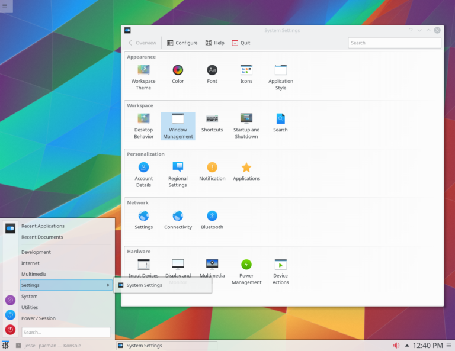
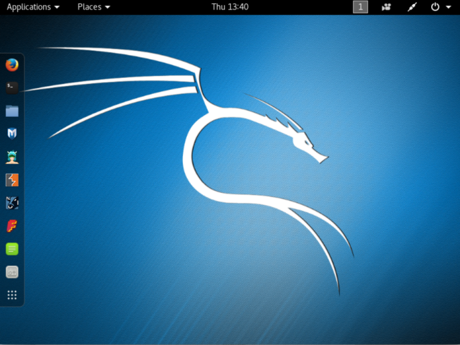
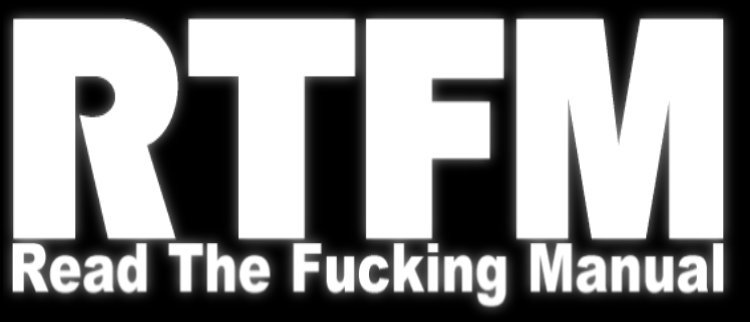
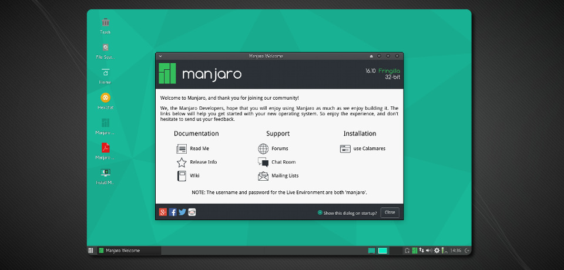

# လူသုံးများ ရေပန်းစားသော GNU/Linux Distro များ အပိုင်း (၇)

**၇. Arch Linux**

Linux ဆိုတာကို နဖူးတွေ့ ဒူးတွေ့သိချင်တယ်။ Linux ရဲ့အလုပ်လုပ်ပုံ၊ တည်ဆောက်ပုံ၊ command syntax တွေကိုအသေးစိတ်သိချင်တယ်ဆိုရင်တော့ Arch Linux က မသုံးမဖြစ် သုံးရမည့် distro တစ်ခုဖြစ်ပါတယ်။ Linux ရဲ့mainstream တွေ ဖြစ်တဲ့ Red Hat နဲ့ Debian တို့ ကနေလည်းလုံးဝ ခွဲထွက်သွားတဲ့ distro တစ်ခုပါ။ Arch Linux ကိုတော့ မတ်လ ၂၀၀၂ ခုနှစ် မှာ ကနေဒါနိုင်ငံမှ Judd Vinet ဆိုတဲ့သူက CRUX ဆိုတဲ့ Lightweight distro တစ်ခုကို သဘောကျလို့ အဲ့လို ပုံစံတူ distro တစ်ခုကို အစကနေပြန်ပြီးရေးခဲ့တဲ့ distro ပါ။ Judd Vinet က ၁ရက်နေ့အောက်တိုဘာလ ၂၀၀၇ခုနှစ်မှာတော့ သူ့ရဲ့ Arch Project ကို Aaron Griffin ဆိုတဲ့သူကို project အတွက်အချိန်မပေးနိုင်လို့ထပ်လွဲပြောင်းပေးအပ်ခဲ့ပါတယ်။ CRUX ကလည်း mainstream ဖြစ်နေတဲ့ GNU/Linux တွေနဲ့ ဆင်မတူနေပဲ BSD လိုပုံစံ ဘက်ကိုပိုပြီး ယိုင်တဲ့ distro တစ်ခုပါ။ Lightweight ဆိုတဲ့အတိုင်း ပေါ့ပါးသွက်လက်အောင် အလုပ်ဖြစ်အောင် ရေးထားတာဖြစ်တဲ့အတွက် အရိုးရှင်းဆုံးဖြစ်အောင်လုပ်ထားပါတယ်။ Arch ရဲ့လက်သုံးစကား KISS (keep it simple, stupid) ဖြစ်ပြီးတော့ အဓိပ္ပာယ်ကတော့ ရိုးရှင်းအောင်ပဲထားပါပေါ့။ အခုနောက်ပိုင်းမှာခေတ်စားလာတဲ့ Minimalism နဲ့Simplicity ဆိုတဲ့ ideology ကိုလိုက်ထားတဲ့ distro တစ်ခုလို့ဆိုရမှာပါ။ Arch Linux ကတော့ rolling release ဆိုတဲ့ အချိန်နဲ့ အမျှ update တွေ upgrade တွေကိုပေးပါတယ်။ အဲ့ဒါကြောင့် သူ့ မှာ stable ဆိုတဲ့ edition မျိုးမရှိပါဘူး။ တခါ install လုပ်ပြီးတာနဲ့ လိုအပ်ရင် လိုအပ်သလို update လုပ်သွားရုံပါပဲ။ ပြဿနာတစ်ခုကတော့ stable ဖြစ်လား မဖြစ်လားဆိုတာတော့ သုံးကြည့်ပြီး ကိုယ့် hardware တွေနဲ့ အဆင်ပြေလား မပြေဘူးလားဆိုတာသိနိုင်တဲ့ သဘောပါ။ ကျွမ်းကျင်သူတွေအတွက်သာ ရည်ရွယ်ပြီးထုတ်ထားတဲ့ distro တစ်ခုဖြစ်ပါတယ်။ စတင်အသုံးပြုတွေအနေနဲ့ တော့ နည်းနည်းလေး စိတ်ရှုပ်ရမှာပါ။ Pacman ဆိုတဲ့ Package Manager ကိုအသုံးပြုထားပြီး Arch User Repository (AUR) ပေါ်မှာ လိုအပ်တဲ့ package တွေကိုစုစည်းပြီးတော့တင်ထားပါတယ်။

<figure><figcaption></figcaption></figure>

Arch Linux ကိုသုံးဖို့ကိုတော့ Linux ရဲ့ တခြား အလွယ်တကူ အသုံးပြုလို့ရမယ့် distro တွေကို စပြီးတော့ အသုံးပြုသင့်ပါတယ်။ ဒါမှမဟုတ်ပဲနဲ့တော့ Arch Linux ကို စပြီး install လုပ်ကတည်းက အခက်အခဲတွေရှိနိုင်ပါတယ်။ စပြီးတော့ install လုပ်ပြီဆိုတာနဲ့ Linux command တွေနဲ့စရပါတယ်။ root နဲ့ swap ဆိုတဲ့ partition တွေပေးဖို့ကိုလည်း command တွေနဲ့ပဲ disk manager တစ်ခုကနေလုပ်ရပါတယ်။ အဲ့ဒါတွေ အပြင် language ရွေးတာတွေ timezone ရွေးတာတွေကအစ cfg လို file တွေကို nano သို့မဟုတ် vim လို့ text editor တွေနဲ့command line interface (CLI) မှာ သွားပြီး ပြင်ရပါတယ်။ နောက်ပြီး ကိုယ်သုံးမယ့် package တွေကိုပဲရွေးပြီး pacstrap လို installation tool တွေကိုသုံးပြီးတော့ install လုပ်ရပါတယ်။ ထားပါတော့ ကိုယ်က desktop မလိုဘူး command ပဲသီးသန့် သုံးမယ်ဆိုရင် လည်း base system ကို install လုပ်ပြီးတော့သုံးလို့ ရပါတယ်။ install လုပ်နေတုန်းတော့ internet connection ရှိဖို့ လိုပါတယ်။ Arch ရဲ့ download ISO က minimal installation လောက်လုပ်ဖို့ ပဲပါတာပါ။ ပြောရရင်တော့ bootloader သက်သက်ကိုပဲထည့်ပေးလိုက်ပြီး ကျန်တဲ့ဟာတွေ အကုန်လုံးကို Arch ရဲ့ repository ကနေ ဆွဲယူ install လုပ်ရပါတယ်။ install လုပ်နေစဉ်ကိုယ်က Xfec တို့ Gnome တို့ လိုကိုယ်လိုချင်တဲ့ desktop environment တစ်ခုကို ရွေးချယ် install လုပ်လို့ ရပါတယ်။ တခုရှိတာက boot တက်ရင်တော့ CLI ကိုပဲအရင်တက်ပြီးတော့ ကိုယ်က desktop ကိုအသုံးပြုချင်တယ် ဆိုရင်တော့ သက်ဆိုင်ရာ command ကို အသုံးပြုပြီးတော့ desktop ကိုထပ်ပြီးခေါ်ရပါတယ်။ သူ့ ဟာသူ desktop ချက်ချင်းတက်အောင်လည်း ပြင်ယူလို့ ရပါတယ်။ အဲ့ဒါကြောင့် Arch ကို highly customizable လို့ ဆိုပါတယ်။ အဓိပ္ပာယ်ကတော့ ကိုယ်ကြိုက်သလောက် လိုသလို ပြင်ယူလို့ ရတယ်လို့ ဆိုတာပါ။ အဲ့ဒါကြောင့် Linux geek တော်တော်များများ Arch ကို ကြိုက်ပါတယ်။ Hacker တွေကကလည်း Penetration Test (Pen Test လို့အတိုကောက်ခေါ်ပါတယ်။) လို့ ခေါ်တဲ့ system security နဲ့network security ဘယ်လောက်လုံခြုံလဲ မလုံခြုံဘူးလဲလို့စမ်းသပ် နေရာမှာ Arch ကိုနောက်ပိုင်းမှာ သုံးကြပါတယ်။အခု နောက်ပိုင်းမှာတော့ BlackArch Linux လို့ ခေါ်တဲ့ distro တစ်ခုကို ethical hacking အတွက် hacking tool ပေါင်း ၁၆၀၀ လောက်နဲ့ လာတယ်လို့မကြာသေးခင်က ကြားသိရပါတယ်။ Kali Linux လို hacking အတွက် သီးသန့်ထုတ်တဲ့ distro ပုံစံမျိုးပါ။ Kali ကတော့ လက်ရှိ hacker တွေ သဘောအတွေ့ distro တစ်ခုပါ။ hacking tool တော်တော်များများ ကို နဂိုအတိုင်းထည့်ထားပေးထားတဲ့ distro တစ်ခုပါ။ Mr. Robot ဆိုတဲ့ TV Series တစ်ခုမှာတော့ Kali ကို လက်တွေအသုံးချပြီး hack နည်းပေါင်းများစွာကို ဖော်ပြပေးခဲ့ပါတယ်။ ရုပ်ရှင်ဆိုပေမယ့်လည်း အဲ့ဒီ Mr. Robot ကိုရိုက်တဲ့ ဒါရိုက်တာက နာမည်ကြီး hacker ပေါင်းများစွာရဲ့အကြံဉာဏ်ကိုယူပြီး တစ်ခန်းပြီး တစ်ခန်း command တွေကိုလက်တွေ့အတိုင်းသဘာဝကျအောင်ရိုက်ထားတဲ့အတွက် နည်းပညာဘက်တွေ လူတွေကတော်တော်လေးကြိုက်ကျပါတယ်။ အထူးသဖြင့် Linux အသုံးပြုသူတွေအတွက်တော့ လုံးဝကြည့်သင့်တဲ့ TV Series ပါ။ ကဲ… Mr. Robot ကြော်ငြာဒီမှာတော့ဒီလောက်နဲ့ရပ်လိုက်ပြီးတော့ Arch အကြောင်း ဆက်ချင်ပါတယ်။

<figure><figcaption></figcaption></figure>

<figure><figcaption></figcaption></figure>

<figure><figcaption></figcaption></figure>

**Arch Linux ရဲ့အားသာချက်များ**

Linux စပြီးအသုံးပြုသူတွေအတွက်တော့ အဆင်မပြေနိုင်ပေမယ့်လည်း အတွေ ့အကြုံရှိပြီးသား Linux user တွေအတွက်တော့ Arch ရဲ့ ကောင်းမွန်လှတဲ့ AUR တို့ABS တို့ Pacman တို့လို software management infrastructure တစ်ခုရှိပါတယ်။ Linux ကို တကယ့်ကို ရှုးသွပ်စွာ လေ့လာလိုတယ် ဆိုရင်တော့ Arch ကို ကိုယ်တိုင် install လုပ်ပြီး အချိန်အတိုင်းအတာတစ်ခုလောက်ထိ အသုံးပြုလေ့လာသင့်ပါတယ်။ အထူးသဖြင့် ethical hacking ဘက်ကိုလိုက်ချင်တဲ့သူတွေအတွက်တော့ မသုံးမဖြစ်သုံးသင့်တဲ့ distro တစ်ခုပါ။ နောက်ပြီး ကိုယ်လိုသလို သတ်မှတ်ချက်မရှိပဲ ပြင်လို့ရတဲ့ Arch ရဲ့ ထူးခြားမှုကတော့ BSD လို distro တွေနဲ့လည်းဆင်တူ ကျွမ်းကျင် Linux user တွေ အတွက်လည်း အကြိုက်တွေ့စေမယ့် စွမ်းဆောင်ရည်တစ်ခုဖြစ်ပါတယ်။ ဒါ့အပြင် Arch ရဲ့ wiki ကတော့ တော်တော်လေးကို စုံတယ်လို့ပြောရမလိုပါ။ Installation ကစလို့ customization အဆုံးကိုယ်လုပ်ချင်တဲ့ဟာအကုန်လုံးကို အဲ့ဒီ wiki ပေါ်မှာပြပေးထားပါတယ်။ မရှိတာဆို မရှိသလောက်ပြီးပြည့်စုံတဲ့ သူ့ရဲ့ wiki ရှိတာကြောင့် Arch ပြဿနာတစ်ခုခုတက်ရင် forum တွေ community တွေမှာ မမေးခင် Arch user တွေက RTFM လို့ ဆိုပြီး Arch wiki မှာအရင်ရှာဖတ်ကြည့်ပြီးပြီလားလို့ သတိပေးပါတယ်။ RTFM ရဲ့ အရှည်ကတော့ read the fucking manual ဖြစ်ပါတယ်။ ဆိုချင်တာကတော့ Arch wiki မှာအရင်ရှာဖတ်ပြီးသွားပြီးလား ဒီမှာမမေးခင်ကိုလို့ ပြောချင်တာပါ။ Pacman လို package manager အသုံးပြုထားတဲ့အတွက် dependency ပြဿနာလည်း တော်တော်နည်းအောင်လုပ်ထားပါတယ်။

<figure><figcaption></figcaption></figure>

**Arch Linux လိုဆင်တူတဲ့ distro များ**

Manjaro ဆိုတဲ့ distro ကတော့ Arch ကို အခြေခံထားပြီးတော့ Cinnamon ကို နဂိုအတိုင်း desktop အနေနဲ့ အသုံးပြုထားတဲ့ distro ဖြစ်ပါတယ်။ Arch Linux ထက်အများကြီး install လုပ်ရတာနဲ့ အသုံးပြုရတာလွယ်ကူတဲ့ distro ပါ။ Cinnamon အပြင် Enlightment, KDE, LXDE, MATE, Openbox, Xfec တို့ လို desktop တွေကို ရွေးပြီး အသုံးပြုလို့ ရပါတယ်။ Manjaro အပြင် Antergos (Gnome 3), ArchBang Linux (Openbox), Chakra GNU/Linux (KDE), Bridge Linux (Gnome, KDE, LXDE and Xfec), Parabola GNU/Linux, KaOS (KDE) တို့ လို Arch ကို အခြေခံထားတဲ့ Arch နဲ့ဆင်တူ distro တွေလည်းရှိပါတယ်။ Manjaro ကတော့ အခု နောက်ပိုင်းမှာ Linux အသုံးပြုတွေကြားမှာ နာမည်ရ လာပါတယ်။ သူ့ ကို Arch မသုံးခင် ကြားခံ အနေနဲ့ အသုံးပြုမယ် ဆိုရင်လည်း အဆင်ပြေပါတယ်။ စာရေးသူ စမ်းသပ်သုံးကြည့်တာတော့ Manjaro မှာသုံးတဲ့ command တွေက Debian နဲ့ Red Hat တို့ လို distro တွေက command တွေနဲ့ လုံးဝကို ကွဲထွက်လာပါတယ်။ နောက်ပိုင်းမှာတော့ DistroWatch ရဲ့ Top 10 မှာတောင်ဝင်လာနိုင်တယ်လို့ တချို့ ထင်ကြေးပေးထားကျပါတယ်။

<figure><figcaption></figcaption></figure>

**လက်ရှိ Arch Linux version/release**

လက်ရှိမှာတော့ Arch Linux က မကြာသေးခင်လေးမှထုတ်လိုက်တဲ့ version မှာတော့ 2019.09.01 ရောက်နေပါပြီ။ rolling release ရဲ့ သဘောအရ မကြာခဏ update ထွက်ပါတယ်။ update လိုက်လုပ်ရင်းနဲ့လည်း တခါတလေ compatibility ပြဿနာတွေကြောင့် boot မတက်တော့တဲ့အထိလည်းဖြစ်တတ်ပါတယ်။ နောက်ပြီး PC အဟောင်း Laptop အဟောင်းတွေမှာလည်း update အသစ်တွေက hardware အသစ်တွေအတွက် ရည်ရွယ်တာမို့ လို့ hardware compatibility ပြဿနာရှိနိုင်ပါတယ်။ အရမ်းမဟောင်းသေးတဲ့ စက်တွေအတွက်တော့ အဆင်ပြေနိုင်ပါတယ်။ သုံးထားတဲ့ kernel version ကတော့ 5.2.11 ဖြစ်ပါတယ်။
