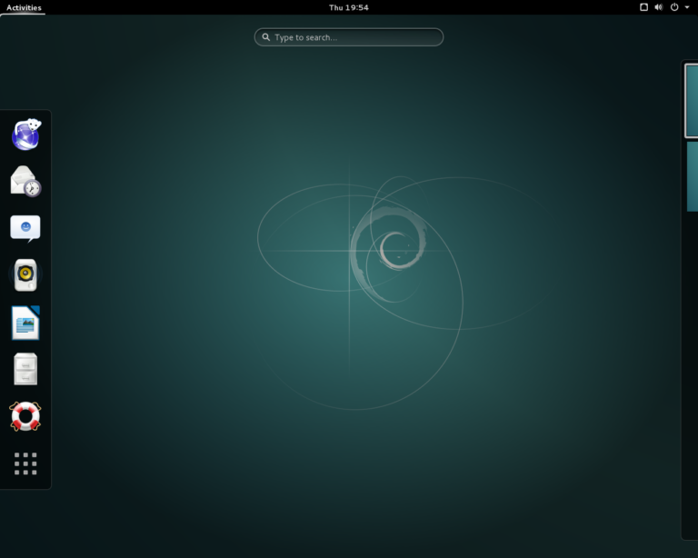
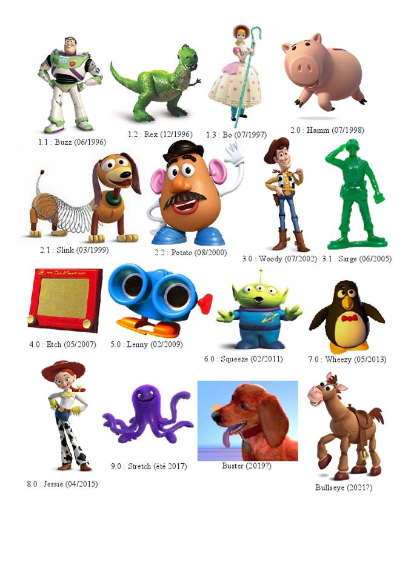

# လူသုံးများ ရေပန်းစားသော GNU/Linux Distro များ အပိုင်း (၃)

**၃. Debian GNU/Linux**

Debian GNU/Linux ကိုတော့ ၁၉၉၃ ခုနှစ်မှာ Ian Murdock ဆိုတဲ့ Software Engineer တစ်ယောက်က စတင်မိတ်ဆက် ပေးခဲ့ပါတယ်။ ၁၉၉၃ခုနှစ်ဆိုတော့ GNU/Linux အတွက် အရမ်းစောလွန်း ရှေ့ရောက်လွန်း တယ်လို့ပြောရမှာဖြစ်ပါတယ်။ Debian က Linux kernel ကိုသုံးပြီးရေးတဲ့ OS ထဲမှာ အစောဆုံးထဲကတစ်ခု ဖြစ်ပါတယ်။ အစပိုင်းမှာ Debian project ကို စီးပွားဖြစ်လုပ်ဖို့လုံးဝ စိတ်မကူးထားပါဘူး။ ဝါသနာပါလို့ စိတ်တူကိုယ်တူတွေစု ပြီး လုပ်လိုက်ကြတဲ့ project ဖြစ်တဲ့ အတွက် အခုလက်ရှိလောက်ထိ အောင်မြင်လာ လိမ့်မယ်လို့လည်း Debian team က မှန်းထားကြ ပုံမရပါဘူး။ အခုလက်ရှိ GNU/Linux ကမ္ဘာမှာတော့ Debian က အရှေ့ အပိုင်းမှာပြော ပြခဲ့တဲ့ Ubuntu တို့ Linux Mint တို့ရဲ့ ဘိုးအေ upstream distro သွားဖြစ်နေပါတယ်။ ဘာလို့လဲဆိုတော့ Ubuntu က Debian ကနေ ဆင်းသက် လာတဲ့ distro တစ်ခုဖြစ်နေလို့ပါ။

Debian ဆိုတာကတော့ အင်္ဂလိပ်လို ဘာလိုမှ အဓိပ္ပာယ်ပြန်လို့မရပါဘူး။ Ian Murdock က Debian project ကိုစတုန်းက သူ့မှာ အရမ်းကို ချစ်ရတဲ့ ချစ်သူကောင်မလေး တစ်ယောက်ရှိခဲ့ပါတယ်။ အဲ့ဒီကောင်မလေး နာမည်ကတော့ Debra Lynn လို့ခေါ်ပါတယ်။ သူက သူ့ကောင်မလေး နာမည် Debra က Deb နဲ့သူ့နာမည် Ian ကိုပေါင်းပြီးတော့ Debian ဆိုပြီး project ကိုနာမည်ပေးခဲ့ပါတယ်။ နောက်ပိုင်း မှာလည်း သူအဲ့ဒီ ကောင်မလေး နဲ့ပဲလက်ထက် ပြီးတော့ ကလေးသုံးယောက်ရသည့် တိုင်အောင် အိမ်ထောင် မြဲခဲ့တယ်။ ၂၀၀၈ ခုနှစ်မှာတော့ အကြောင်းမတိုက်ဆိုင်လို့ အိမ်ထောင်ပြတ်ခဲ့ပါတယ်။ Ian Murdock ကို Internet Activist တစ်ယောက် အနေနဲ့လည်း စာရေးသူသိထားပါတယ်။ Anonymous လို Internet Activist group တွေနဲ့ပတ်သတ် ခဲ့တယ်လို့လူပြောများပါတယ်။ သူဟာ အကျင့်ပျက် ချစားနေတဲ့ အမေရိကန် အစိုးရနဲ့အစိုးရ အဖွဲ့ဝင်တွေ အထူးသဖြင့် အမေရိကန် ရဲတပ်ဖွဲ့ကိုအထူး ပုတ်ခတ် တိုက်ခိုက်ခဲ့ပါတယ်။ သူဟာ လူကောင်းတစ်ယောက် ဖြစ်ခဲ့သော်လည်း ရဲတပ်ဖွဲ့ရဲ့ခြောက်လန့်ဖိနှိပ်မှု အောက်မှာ တော်တော်လေး ကြာအောင် နေခဲ့ရတယ်လို့လည်းသိရပါတယ်။ နောက်ဆုံးမှာ ကိုယ့်ကိုကိုယ် သေကြောင်း ကြံစည်ပြီး သေသွားခဲ့တယ်လို့ရဲတပ်ဖွဲ့ထုတ်ပြန်ပါတယ်။ သူကတော့ ၂၈ ရက် ဒီဇင်ဘာလ ၂၀၁၅ ခုနှစ်မှာ သေဆုံးသွားခဲ့ပါပြီ။ Anonymous ကတော့ Ian Murdock ကို FBI နဲ့CIA ကလုပ်ကြံသတ်ဖြတ် ခဲ့တယ်လို့လည်းဆိုပါတယ်။ လူမသိ သူမသိ ကြွေလွင့်သွား ခဲ့ရတဲ့ နည်းပညာ လောကထဲက ကြွယ်တစ်ပွင့် အနေနဲ့သူ့ကိုအမှတ်ရနေ ရမှာပါ။ နောက်ပိုင်းမှာ အချိန်ရရင် နည်းပညာ လောကထဲက Internet Activist တွေ အကြောင်းကို post သက်သက်ရေး ပါ့မယ်။ အခုတော့ Debian အကြောင်းနည်းနည်း ပြန်ပြီးဆက်လိုက် ရအောင်နော်။

Debian ဟာ developer တွေ အားရင် အားသလို ဝင်ရေး ပြင်ရေး ရင်းနဲ့စခဲ့လို့ဘယ်သူကမှာ စနစ်တကျ ဦးစီးဦးဆောင်ပြီး မလုပ်ခဲ့လို့အခုလောက် ဖြစ်လာဖို့ကို ဘယ်သူကမှ မထင်ထားခဲ့ပါဘူး။ Microsoft တို့Apple တို့လို developer တွေ အားလုံး ပူးပေါင်းပြီး စနစ်တကျ ရေးထားတာမဟုတ်တဲ့ အတွက် အပျော်တမ်း ဝါသနာရှင် (Hobbyist) တွေ လက်သွေးကြတဲ့ project လည်းဖြစ်ပါတယ်။ တကယ်တမ်းမှာတော့ Debian ဟာ Open Source community အတွက် ဥပမာကောင်းတစ်ခုလို ဖြစ်လာပါတယ်။ ဆယ်စုနှစ်တစ်ခုကျော်ကျော် လောက်ကို Debian က ပြိုင်ဘက် မရှိလောက်အောင် အောင်ပွဲဆင်ခဲ့တာ အခုထိတောင် Server environment တွေမှာ နာမည် ရနေတုန်းဖြစ်တဲ့ distro လည်းဖြစ်ပါတယ်။ project သက်တမ်းကလည်း ရှည်ကြာလာတာနဲ့အမျှ developer တော်တော် များများလက်စွမ်း ဝင်ပြထားတွေကြောင့် package အများဆုံး application အပေါဆုံး distro တစ်ခု အနေနဲ့လည်း Debian ကရပ်တည်လျှက်ပါ။ နောက်ပြီး ပြဿနာ နည်းပြီး သုံးရတာ stableဖြစ်တယ်လို့လည်း လူသိများပါတယ်။ Debian project ရဲ့ဒီမိုကရေစီ ဆန်းလွန်းမှု က developer တွေကို တခါတလေ တွေဝေစေပါတယ်။ တစ်နှစ်တခါ Debian project အတွက် Leader တစ်ယောက်ကိုမဲပေးတဲ့ စနစ်နဲ့ရွေးချယ်ပါတယ်။ အဲ့လို developer တွေကို လွတ်လပ်ခွင့်ပေးထားက အခုချိန်မှာတော့ Debian ရဲ့ကြံကမ္မာကို အနာဂတ်မှာ ခြိမ်းခြောက်နေသလို ဖြစ်နေပါတော့တယ်။ လက်ရှိထိတော့ Debian ကို Linux ကမ္ဘာကလူသုံးများနေဆဲပါ။ အခုလက်ရှိ Debian 8 – Jessie ကတော့ Gnome 3 desktop ကို နဂိုအတိုင်း သုံးထားပါတယ်။ Debian ကို install လုပ်တဲ့ အခါမှာ ကိုယ်ကြိုက်တဲ့ desktop environment တွေကို ရွေးချယ် လို့ရပါတယ်။ Debian ကို install လုပ်ရတာ Ubuntu တို့ Linux Mint တို့လောက်တော့ မလွယ်ပါဘူး။ Linux kernel ကိုရေး ဂုရုကြီး Linus Torvalds ကိုယ်တိုင် Linux Users Group forum တစ်ခုမှာ Debian ကို install လုပ်ရတာ အရမ်းခက်တာပဲ ရှုပ်လွန်းတယ်လို့တောင် ဖြေခဲ့ပါတယ်။ အဲ့ဒါကတော့ ဟိုအရင်တုန်းကပါ။ အခုတော့ နည်းနည်းလွယ်လာပါပြီ။ ဒါပေမယ့် Ubuntu တို့လောက်လည်း ရှင်းလင်း မလွယ်ကူဘူး install လုပ်ရတာ။

<figure><figcaption></figcaption></figure>

**Debian GNU/Linux ရဲ့အားသာချက်များ**

အသုံးပြုသူတွေ အတွက် stable ဖြစ်တဲ့ အပိုင်းမှာ နာမည်ရပြီးသား upstream distro ဖြစ်ပါတယ်။ Debian မှာ အသုံးပြုနိုင်တဲ့ software package ၃ သောင်းကျော်ရှိပါတယ်။ Ubuntu ရဲ့ software package နဲ့ယှဉ်လိုက်ရင် Ubuntu မှာ ၅ ထောင်ကျော် ၁ သောင်း ကြားလောက်ပဲရှိမယ်ထင်ပါတယ်။ ပြီးတော့ Debian က Ubuntu ရဲ့ ဘိုးအေကြီးပါ။ server environment တွေမှာတော့ Debian ရဲ့ စွမ်းဆောင်ရည်မြင့်မှုကြောင့် လက်ရှိ web server တွေက Debian ပေါ်မှာ run တာများပါတယ်။ CPU တော်တော် များများကို support လုပ်တဲ့နေရာမှာ Debian ကို ယှဉ်နိုင်တဲ့ distro မရှိသေးပါဘူး။ Linux ကို စတင် ပြီး စမ်းသပ် အသုံးပြုချင်သူတွေ အတွက်တော့ Ubuntu လောက် အဆင်ပြေမှာမဟုတ်သလို၊ တော်ရုံ application လေးတွေ install လုပ်ဖို့ဆိုတာတောင် ခေါင်းစားရပါတယ်။ စာရေးသူ ကိုယ်တိုင် install လုပ်ပြီး တစ်လလောက်တောင် မသုံးဖြစ်လိုက်ပါဘူး။ developer တွေကတော့ ကြိုက်မယ်လို့ထင်ပါတယ်။

**Debian GNU/Linux နဲ့ဆင်တူ distro များ**

လူသိများ ကျော်ကြားလာတဲ့ Ubuntu၊ ပြီးတော့ SparkyLinux, SolydXK, KNOPPIX, Tanglu နဲ့ Siduction ဆိုပြီးတော့ ထွက်ကြပါတယ်။ နှစ်စဉ် Debian အောက်ကနေ distro အသစ်တွေ ထွက်ထွက်လာတာကြောင့် နောက်ပိုင်းမှာ ရွေးချယ်စရာပိုများ လာမှာလည်းဖြစ်ပါတယ်။

**လက်ရှိ Debian GNU/Linux Version နဲ့Codename**

Debian ရဲ့ လက်ရှိ version ကတော့ Debian 8 – Jessie ဖြစ်ပါတယ်။ သူ့ကို ၂၅ရက်နေ့ဧပြီလ ၂၀၁၅ ခုနှစ် မှာ ထုတ်ခဲ့တာဖြစ်ပြီးတော့ အခုအချိန် ဒီစာရေးနေချိန်မှာတော့ Debian 8.6.0 ရောက်နေပါပြီ။ Debian ကပုံမှန်အားဖြင့် stable release တစ်ခုထုတ်ဖို့ကို ၁ နှစ်ကနေ ၃ နှစ်ထိကြာတတ်ပါတယ်။ Debian ကတော့ သူ့ distro release တွေရဲ့code-name တွေကို Pixar ရဲ့ Toy Story အမေရိကန် animated ကာတွန်းထဲက ဇာတ်ဆောင်တွေ နာမည်ကို ယူသုံးထားပါတယ်။ ဥပမာ Debian 7 ကို Wheezy ဆိုတဲ့ Toy Story ထဲက Penguin ဇာတ်ဆောင်လေးနာမည်ပေးထာပါတယ်။ လက်ရှိ Debian 8 ကိုတော့ Jessie ဆိုတဲ့ အရုပ်မလေးရဲ့ နာမည်ပေးထားပြီး နောက်ထွက်မဲ့ release ကိုတော့ Stretch ဆိုပြီး နာမည်ပေးဖို့လုပ်ထားပါတယ် တဲ့ဗျာ။ အောက်မှာတော့ ကာတွန်းဇာတ်ဆောင်တွေနဲ့သူတို့နာမည်လေးတွေ တွဲမိအောင် ပုံကိုရှာပြီးတော့ ထည့်ပေးလိုက်ပါတယ်။

<figure><figcaption></figcaption></figure>

စာကြွင်း။ ။ အခုအချိန်မှာ Debian 10 ဆိုတဲ့ version ကိုရောက်လို့လာပါပြီ။ code-name ကိုတော့ Buster လို့မှည့်ထားပါတယ်။ နောက်ထွက်မယ့် version မှာတော့ Bullseye လို့ ခေါ်မယ်လို့လည်း သိရပါတယ်။
