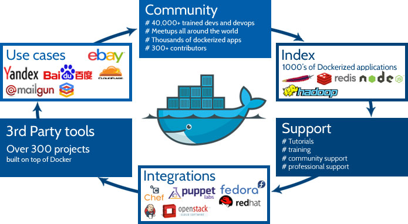
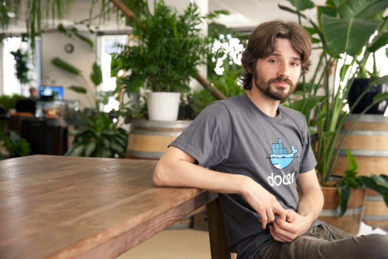
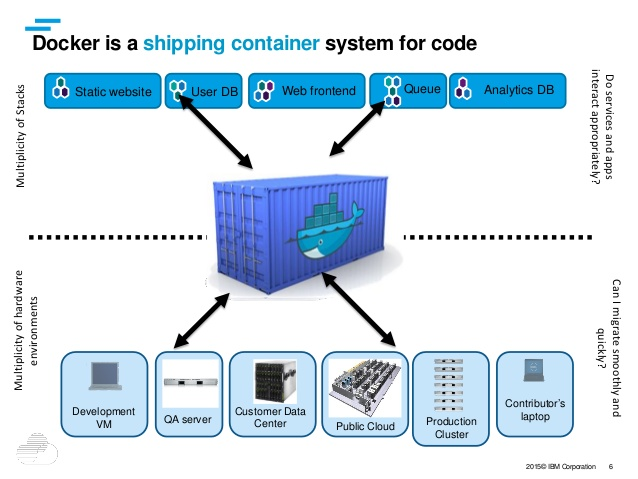

# Docker မိတ်ဆက် အပိုင်း(၁)

နည်းပညာ ခေတ် တစ်ပိုင်းစီမှာ အချိုးအကွေ့ ပေါင်းများစွာနဲ့ မှတ်တမ်းတင်သွား တတ်တဲ့ အစိတ်အပိုင်းလေးတွေတော့ အမြဲရှိနေပါတယ်။ ဆိုပါတော့ Linux kernel ဟာ လက်ရှိ လူတွေသုံးနေတဲ့ GNU/Linux operating system တည်ဆောက်ဖို့အတွက် အရေးပါတဲ့ အစိတ်အပိုင်းလေး တစ်ခုပါ။ အမှတ်တမဲ့ ကနေ မှတ်ကျောက်တင်လောက် အောင် အကျိုးပြုသွားတဲ့ သာဓက လို့ဆိုရင်လည်း မမှားပါဘူး။ Linus Torvalds ဟာ Linux kernel ကို အစကနေ တီထွင်လိုက်တာ မဟုတ်ပဲ နဲ့ ရှိပြီးသား နည်းပညာ ဖြစ်တဲ့ Unix ပေါ်မှာ အခြေခံ ပြီးတော့ community ထဲက တခြားလူတွေပါသုံးလို့ရအောင်လို့ ပြန်ပြီး reinvent the wheel လုပ်လိုက်တဲ့ နည်းပညာလောကထဲက evolution တစ်ခုဆိုရမှာပါ။ နောက်တခါ Linux kernel မှတဆင့် open source project ပေါင်းများစွာ ထက်ဆင့်ပေါက်ဖွား လာပုံကိုတော့ စာရေးသူ အကျယ်တဝင့် ထပ်စောင်း ရေးစရာတောင်လိုမယ် မထင်ပါဘူး။ Open source project တွေဟာ ဖြောင့်ဖြူးတဲ့လမ်းမဟုတ်သလို ရန်သူလည်းများလွန်းလှပါတယ်။ Open source ကမ္ဘာမှာ project တစ်ခုအောင်မြင်ဖို့ဆိုရင် အချိန်တော်တော်လည်း ပေးရပါတယ်။ နှစ်ပေါင်းများစွာ အနည်ထိုင်ပြီးသွားတဲ့နောက်မှာတော့ Linux ဟာ open source community အတွက် အများကြီးလည်း အကျိုးပြုပြီးသွားတဲ့ အပြင် Data Center technology တွေနဲ့ networking appliance တော်တော်များများ ရဲ့ backend အနေနဲ့ အခုဆို နေရာတော်တော်လည်း ယူထားလိုက်ပါပြီ။ တဘက်မှာလည်း DevOp အပိုင်းမှာ Linux နဲ့ တည်ဆောက်ထားရတဲ့ ဟာမှာလည်း တချို့နေရာတွေမှာ အဆင်မပြေတာလေးတွေလည်း ရှိတတ်တာမို့ developer တွေဟာ အမြဲတီထွင် ကြံဆပြီးတော့ အဆင်ပြေအောင် လုပ်နေရတတ်တာ ထုံးစံလိုလိုပါပဲ။ အခုခေတ် Devs ကမ္ဘာက များလွန်းလှတဲ့ programming language ပေါင်းများစွာနဲ့ integration လုပ်ထားရတဲ့ လက်တွေ့ production အပိုင်းမှာတော့ ထင်သလောက်တော့ မလွယ်လွန်းလှပါဘူး။ ဒါ့အပြင် language တစ်ခုနဲ့ တစ်ခု ချိတ်ဆက်ရတဲ့ API အပိုင်းမှာလည်း dependency တွေရှိပြန်တာကြောင့် build environment ကနေ staging၊ staging ကနေတဆင့် production environment အဆင့်ဆင့် အဖန်ဖန် အခါခါ စမ်းသပ်ပြီးတော့မှ စတင် အသုံးပြုဖို့ အဆင့်ကိုရောက်ပါတယ်။ အဲ့ဒီလို environment တစ်ခုကနေ တစ်ခုကို ပြောင်းယူသွားတာကို shipping လုပ်တယ်လို့ သုံးကြပါတယ်။ Docker ဟာ အဲ့လို shipping process မှာ အဆင်ပြေအောင် တီထွင်ကြံဆထားပြီး အလွန်အသုံးတည့်တဲ့ နည်းပညာ အစိတ်အပိုင်း တစ်ခု evolution တစ်ခုလို့ ဆိုရမှာပါ။

<figure><figcaption></figcaption></figure>

### Docker မတိုင်မှီ DevOp ကမ္ဘာထဲက shipping ပြဿနာ

Docker အကြောင်းဆက်မသွားခင် Docker ဟာ ဘယ်လိုမျိုး ပြဿနာတွေကို ဖြေရှင်းဖို့အတွက် ထွက်ပေါ်လာရသလဲဆိုတာကို အနည်းငယ် ဆွေးနွေးသွားလိုပါတယ်။ ပထမ ပြဿနာက developer တွေဟာ program တစ်ခု software တစ်ခုကို ဖန်းတီးဖို့အတွက် သူတို့ရဲ့ Laptop သို့မဟုတ် PC တွေကို အသုံးပြုပြီးကြပါတယ်။ build environment လို့ ဆိုကြပါတော့။ အဲ့လို စတင်ဖန်တီးတဲ့အခါမှာလည်း developer တွေဟာ မတူတဲ့ programming language ပေါင်းစုံ version ပေါင်းစုံ ကို အသုံးပြုကြရပါတယ်။

အားလုံး အဆင်ပြေပြီဆိုရင် staging ဆိုတဲ့အဆင့်ကို ရောက်ပါတယ်။ အဲ့ဒီအဆင့်မှာတော့ program/software တွေကို host လုပ်ဖို့ အတွက် အသုံးပြုမဲ့ server နဲ့ ခပ်ဆင်ဆင် server ပေါ်မှာထပ်ပြီး စမ်းသပ် ရပါတယ်။ များသောအားဖြင့် developer တွေရဲ့စက်တွေကနေ staging server ကိုရွှေ့တဲ့ အခါမှာ ပြဿနာက စပါတယ်။ developer တွေရဲ့ စက်မှာ သုံးတဲ့ hardware နဲ့ staging server ပေါ်မှာသုံးတဲ့ hardware အမျိုးအစား မတူတဲ့ အတွက် developer စက်မှာတော့ program ကအလုပ်လုပ်တယ်၊ staging server ပေါ်မှာတော့ crash ဖြစ်သွားတယ်၊ error တွေတက်လာတယ်ဆိုတာမျိုးက ထုံးစံလိုလိုပါပဲ။ ဒါ့အပြင် Ops အပိုင်းမှာ deploy လုပ်တဲ့ automation နဲ့ provision tool အမျိုးအစား (ဥပမာ – Puppet၊ Ansible၊ Chef) ပေါ်မူတည်ပြီးတော့ အဆင်ပြေမပြေဆိုတာလည်း ရှိပါတယ်။ ပြီးတော့ compiler ရဲ့ version၊ hosting platform ရဲ့ dependency ဆိုတာတွေက များလွန်းလှပါတယ်။ Staging အဆင့်မှာတင် developer တွေဟာ အချိန်ရော လူပါ တော်တော်လေး သုံးရပါတယ်။ တခါတခါ program/software ကို develop လုပ်တာထက် staging အဆင့် အဖန်ဖန် ပြင်ဆင်ရပြီး ပိုကြာနေတတ်တာမျိုးပါ။

Staging အဆင့်မှာ အားလုံး အဆင်ပြေတယ်၊ စိတ်ချရပြီဆိုရင်တော့ နောက်တဆင့် အနေနဲ့ production environment ထဲကို implement လုပ်ကြရပြန်ပါတယ်။ အခပ်မသင့်ရင် staging ကနေ production ကိုရွှေ့ရတဲ့ အခါမှာလည်း အဆင်မပြေလေးတွေရှိနေတတ်ပါသေးတယ်။ Developer တွေမှာ ထပ်ပြီးနောက်တခါ အချိန် အကုန်ခံပြီးတော့ လိုအပ်တာတွေကို ပြင်ဆင်ရ ပြန်ပါတယ်။ အဲ့ဒီလို environment တစ်ခုကနေ တစ်ခုကို shipping လုပ်ရတဲ့ အခါမှာ ပြဿနာပေါင်းစုံနဲ့ ကြုံတွေ့ရပါတယ်။ တစ်နေရာနဲ့ တစ်နေရာ software development လုပ်တဲ့ process အနည်းအကျဉ်းကွာ နိုင်ပေမယ့် အကျဉ်းချုပ်အားဖြင့်တော့ အတူတူ နီးပါး ဖြစ်ပါတယ်။

<figure><figcaption></figcaption></figure>

Virtualization နည်းပညာ တွေကို တွင်တွင်ကျယ်ကျယ် အသုံးပြုလာတဲ့နောက်ပိုင်းမှာတော့ Virtual Machine တွေကို အသုံးချပြီးတော့ အနီးစပ်ဆုံး environment တစ်ခုကို အဆင့်ဆင့်မှာ တည်ဆောက်ပြီး develop လုပ်ကြတဲ့ အတွက် အနည်းငယ်တော့ ပြဿနာ နည်းသွားပါတယ်။ Sandboxing လုပ်တယ်လို့လည်း ပြောကြပါတယ်။ တခြား Sandboxing လုပ်တဲ့ tool တွေလည်းရှိပါတယ်။ တခုရှိတာက Sandbox လုပ်တဲ့အခါမှာလည်း အသုံးပြုတဲ့ tool တွေက ပြီးပြည့်စုံတဲ့ environment ကို အလုံးစုံ မပေးနိုင်ပြန်ပါဘူး။ အဲ့ဒီတော့ libraries စုံစုံလင်လင် နဲ့ သုံးချင်ရင် VM ပေါ်မှာ ကိုယ်လိုချင်တဲ့ environment ကို ဖန်တီးပြီးတော့ ကြိုတင်ပြင်ဆင်ရပါတယ်။ VM ကို အသုံးဖို့အတွက် Hypervisor လိုလို့ install လုပ်ရပါတယ်။ ပြီးတော့မှ VM ကို configure လုပ်ရပြန်ပါတယ်။ မပြီးသေးပါဘူး… VM ပေါ်မှာ သုံးမယ့် Operating System ကို install လုပ်၊ configure လုပ်ရပြန်ပါတယ်။ ပြီးမှလိုအပ်တဲ့ dependencies တွေကို download လုပ်ပြီး install လုပ်ရပါတယ်။ လိုအပ်ပါက VM ရဲ့ OS ကို update လုပ်ရပါတယ်။ နောက်ပြီးတော့ VM က resource intensive ဖြစ်ပါတယ်။ ဆိုလိုတာက VM ကို run ဖို့အတွက် CPU နဲ့ RAM လုံလုံလောက်လောက်ရှိဖို့လိုပါတယ်။ VM က software development process မှာ သိသိသာသာ အဆင်ပြေအောင် ဖြေရှင်းနိုင်ပေမယ့် overhead တွေတော့ရှိပါတယ်။ ဒီနေရာမှာ မေးစရာရှိတာက Sandbox လိုမျိုးပေါ့တော့ ပေါ့ပါရဲ့ မပြည့်စုံ၊ VM လိုမျိုး ပြည့်စုံတော့ ပြည့်စုံပါရဲ့ overhead ကများ နှစ်ခုမှာ သူတို့ရဲ့ ကောင်းတာလေးတွေယူပြီးတော့ တည်ဆောက်ဖို့အတွက် tool မျိုးမရှိနိုင်ဘူးလား။ Containerization ဆိုတဲ့ နည်းပညာ ဟာ အဲ့ဒီကောင်းတဲ့ trait နှစ်ခုပေါင်းစပ်ထားတဲ့ platform သို့မဟုတ် tool ဆိုရင်လည်းမှား နိုင်မယ်မထင်ပါဘူး။ ဥပမာ Linux Containers (LXC) မျိုးဟာကို ပြောတာပါ။ LXC ကတော့ Linux kernel ရဲ့ cgroups နဲ့ namespace isolation နှစ်ခုရဲ့ စွမ်းဆောင်နိုင်ရည်ပေါ်မှာ အခြေခံပြီးတော့ operating-system-level virtualization ဆိုတဲ့ feature ကိုပေးနိုင်တဲ့ နည်းပညာတစ်ခုဖြစ်ပါတယ်။ Docker ဟာလည်း LXC လိုမျိုး ခပ်ဆင်ဆင် containerization နည်းပညာတစ်ခုပါ။

Docker ဟာ နည်းပညာ အသစ်တော့မဟုတ်ပါဘူး။ အရှေ့မှာပြောထားတဲ့ reinvent the wheel ဆိုသလိုမျိုး ရှိပြီးသား နည်းပညာတစ်ခုကို ပြန်ပြီးတော့ ချဲ့ကားတီထွင်လိုက်တဲ့ နည်းပညာတစ်ခုပါ။ နောက်ပြီးတော့ containers ဆိုတဲ့ဟာကလည်း ဟိုအရင်ကတည်း Linux ကမ္ဘာမှာ တွင်တွင်ကျယ်ကျယ် အသုံးပြုတဲ့ နည်းပညာပါ။ ဥပမာ OpenVZ လိုမျိုး operating system-level virtualization ဟာ container ဆိုတဲ့ concept ကို အသုံးပြုပါတယ်။ OS/Full container လိုလည်းခေါ်ကြပါတယ်။ Docker မှာတော့ application container လို့ခေါ်ကြပါတယ်။ နာမည်အတိုင်း OS/Full container ဆိုတာကတော့ VM နဲ့ တော်တော်လေးသွားဆင်တူပါတယ်။ အလုပ်လုပ်ပုံတော့ ကွာပါတယ်။ OS/Full container အတွက်တော့ LXC တို့၊ BSD Jails တို့ လိုမျိုး နည်းပညာတွေရှိပါတယ်။ Application container အတွက်တော့ Docker တို့၊ Rocket တို့လိုမျိုး နည်းပညာတွေရှိပါတယ်။ ဒီ post မှာကတော့ application container ဖြစ်တဲ့ Docker အကြောင်းဖြစ်တဲ့အတွက် တခြား containerization တွေအကြောင်းကို ဖြန့်ပြီးတော့ မရေးတော့ပါဘူး။ Docker ဘယ်လို မွေးဖွားလာပုံကို ဆက်လိုက်ရအောင်…

### Docker စတင်ပုံအကျဉ်း

Docker ကို Solomon Hykes ဆိုတဲ့ ပုဂ္ဂိုလ်က ၁၃ရက်နေ့ မတ်လ ၂၀၁၃ နှစ်မှာ open source အနေနဲ့ စတင်မိတ်ဆက်ပေးလိုက်ပါတယ်။ သူဟာ ပြင်သစ်ကုမ္ပဏီဖြစ်တဲ့ dotCloud ကို စဦးတည်ထောင်သူတစ်ယောက်လည်းဖြစ်ပါတယ်။ dotCloud ဟာ platform-as-a-service (PaaS) ကုမ္ပဏီ တစ်ခုပါ။ အစပိုင်းမှာတော့ Docker ဟာ dotCloud အတွင်းမှာပဲ အသုံးပြုဖို့အတွက်ပါ။ Solomon Hykes ဟာ အရှေ့မှာပြောခဲ့တဲ့ shipping process ရှုပ်ထွေးပုံကို ဖြေရှင်းဖို့အတွက် နည်းပညာတစ်ခုဖန်းတီးရာမှာ Docker ဖြစ်လာပါတော့တယ်။ နောက်ပိုင်းမှာတော့ github ပေါ်မှာ open source project အနေနဲ့ Docker ကို မိတ်ဆက်ပေးပြီးနောက် တိုးတက်မှု အဟုန်ဟာ ထိပ်ဆုံးကိုရောက်ခဲ့တယ်လို့ ဆိုရမှာပါပဲ။ လက်ရှိမှာတော့ Docker ဟာ နေရာတိုင်းမှာ integrate လုပ်လို့ရတဲ့ နည်းပညာ တစ်ခုလိုဖြစ်နေပါပြီ။ Microsoft လိုမျိုး heavily proprietary ကုမ္ပဏီကြီးကတောင် Docker ကို adopt လုပ်ပါတယ်။ Cloud Computing မှာတော့ Docker ဟာ နေရာတော်တော်လေးလည်းရလာပါပြီ။

<figure><figcaption></figcaption></figure>

Solomon Hykes က Docker ကို မိတ်ဆက်တဲ့ပွဲမှာ ဘာဖြစ်လို့ Docker ကို ဖန်တီး တည်ဆောက်လိုက်ပုံကို စိတ်ဝင်စားဖွယ်ရာ ရှင်းပြပါတယ်။ သူ့ ကုမ္ပဏီဖြစ်တဲ့ dotCloud ဟာ application ပေါင်းများစွာကို deploy လုပ်ရပါတယ်။ အဲ့ဒီမှာ အထက်မှာရှင်းပြပြီးဖြစ်တဲ့ shipping process မှာ ပြဿနာတွေနဲ့ နေ့စဉ် ကြုံတွေရပါတယ်။ ပြဿနာ ဖြေရှင်းဖို့အတွက် အဖြေရှာကြတဲ့အခါမှာ Solomon Hykes က တခြား အပြင်က ကုန်တင်သင်္ဘောကြီးတွေ ပေါ်မှာ ပစ္စည်းတွေကို ဘယ်လိုတင်ဆောင်သလဲဆိုတာကို သွားပြီးတော့ သတိရလိုက်ပါတယ်။ ပြီးတော့ အဲ့ဒီ ကုန်တင် သင်္ဘော တွေရဲ့ လုပ်ငန်းစဉ်မှာ ဘယ်လိုမျိုး အဆင့်ဆင့်တိုးတက် ပြောင်းလဲလာသလဲဆိုတာလည်း ရှာဖွေကြည့်ပါတဲ့တယ်။ ဟိုအရင်က ကုန်တင်သင်္ဘောတွေဟာ တင်ဆောင်ရမယ့် ကုန်ပစ္စည်းတွေကို တစ်ခုနဲ့ တစ်ခု ထပ်ထပ်ပြီးတော့ ဒီအတိုင်း သယ်ဆောင်ကြပါတယ်။ ကုန်ပစ္စည်းက အမျိုးအစားတူရင် ဘာပြဿနာမှ မရှိပါဘူး။ သို့သော်… အမျိုးအစားမတူရင်တော့ ပြဿနာတော်တော်လေးများပါတယ်။ ဥပမာ ကုန်သယ်တစ်ဦးက အာလူး တင်ချင်တယ်၊ နောက် တစ်ဦးက စန္ဒရားတင်ချင်တယ်၊ နောက်တစ်ဦးက ဝိုင် (wine) ကို ဂါလံပုံး နဲ့တင်ချင်တယ်လို့ ဆိုကြပါတော့။ ပြဿနာက အဲ့မှာစတာပါပဲ… အာလူးပေါ်ကို စန္ဒရား ထပ်ပြီးတော့တင်လို့ မရသလို စန္ဒရားပေါ်မှာ အားလူး သွားပြီးထပ်တင်လို့ မရပါဘူး။ ပြီးတော့ တင်လာတဲ့ ဝိုင်က မတော်တဆ ပေါက်ပြီးတော့ ထွက်ကြရင် အာလူးကော၊ စန္ဒရားပါ ပျက်စီးပါပြီ။ Logistic မှာ ပြဿနာများသလို နေရာလည်းကုန် အချိန်လည်း ကုန်ခဲ့ရပါတယ်။ အဲ့ဒါကို ဖြေရှင်းဖို့ အတွက် ကုန်တင် သင်္ဘော ကုမ္ပဏီတွေက အလေးချိန်လည်းတူ အရွယ်အစားလည်းတူ ပုံစံလည်းတူ တဲ့ လက်ရှိ ကုန်တင်သင်္ဘောတွေ မှာသုံးနေတဲ့ container ကို တသတ်မှတ်တည်း သုံးဖို့ကို သဘောတူညီလိုက်ပါတယ်။ အဲ့ဒီ container တွေကြောင့် ကုန်ပစ္စည်းတွေကို သယ်ယူရာမှာ အများကြီးလွယ်ကူလာပါတယ်။ မတူတဲ့ ကုန်ပစ္စည်းတွေကို သူ့ container နဲ့သူ ထည့်ပြီးတော့ သယ်ယူပို့ဆောင်လာကြပါတယ်။ ကုန်ကူး သင်္ဘော ကုမ္ပဏီတွေက ကုန်ပို့ချင်တဲ့သူတွေကို လိုအပ်တဲ့ container အရေအတွက်ကိုပေးလိုက်ပါတယ်။ ကုန်ပို့တဲ့သူက container ထဲမှာသူတို့ လိုသလို ပစ္စည်းတွေကို ထည့်လိုက်ပါတယ်။ ပြီးတော့ ကုန်ကူး သင်္ဘော ကုမ္ပဏီက container လိုက်ကို အတင်အချလုပ်ပါတယ်။ container ထဲမှာဘာပါသလဲဆိုတာမသိလို၊ ကွဲရှပျက်စီးပါကလည်း တာဝန်မယူပါဘူး။ အဲ့ဒါက ကုန်ပို့တဲ့သူရဲ့ တာဝန်ပါ။ ဒါအပြင် အဲ့ဒီ container တွေကို ကုန်ကူး သင်္ဘောမှာ သာမက ကုန်တင်ကား၊ ရထားလိုမျိုး မတူတဲ့ ယာဉ်တွေပေါ်မှာပါ ဘယ်လို အခက်အခဲမှ မရှိပဲနဲ့ တင်ဆောင်နိုင်တဲ့အတွက် တစ်နေရာကနေ တစ်နေရာ သယ်ဆောင်ရတာလည်း ပိုမိုလွယ်သွား ပြန်ပါတယ်။ ဒီဥပမာမှာကြည့်မယ်ဆိုရင် အထက်ကရှင်းပြထားတဲ့ ကုန်ပစ္စည်း သယ်ယူပို့ဆောင်ရေးလုပ်ငန်းမှာ container ဟာ logistic ပိုင်းက ပြဿနာတွေတော်တော်များများကို ဖြေရှင်းလိုက်ပါတယ်။ Solomon Hykes ဟာအဲ့ဒီ အပြင်က shipping process ကြည့်ပြီးတော့ နည်းပညာပိုင်းမှာ container တွေကို ကျယ်ကျယ်ပြန့်ပြန့် အသုံးမပြုနိုင်သေးတာကို အံ့အားသင့်ခဲ့ရပါတယ်တဲ့။ Docker ဆိုတဲ့နာမည်နဲ့ လက်ရှိ Docker ရဲ့ logo ကိုကြည့်လိုက်ရင် ဆိုလိုရင်းကို နားလည်လိမ့်မယ်လို့ထင်ပါတယ်။ နောက်ပြီး အပြင်က shipping process ရဲ့ concept ကိုယူပြီးတော့ Docker image နဲ့ application container ကို စတင်တည်ဆောက်ခဲ့ပါတယ်တဲ့။ အစပိုင်းမှာ Docker ကို dotCloud အတွင်းမှာသာ သုံးဖို့ ရည်ရွယ်ခဲ့သော်လည်း နောက်မှာတော့ github ပေါ်က open source project တစ်ခုအနေနဲ့ Solomon Hykesက မိတ်ဆက်ပေးလိုက်ပါတယ်။

### Conventional containerization နဲ့ Docker ကွာခြားပုံ

ဒီနေရာမှာ ပြောစရာရှိတာက container ဆိုတာအရင်ကတည်းရှိတယ်၊ လက်တွေ့မှာလည်း အသုံးပြုလို့ရတယ် ဆိုရင်ဘယ်ဖြစ်လို့ Docker လိုသလဲဆိုတဲ့ မေးခွန်းပါ။ ကွာသလားဆိုတော့ ကွာပါတယ်၊ အလုံးစုံကွာခြားသွားတာမျိုးတော့လည်း မဟုတ်ပါဘူး။ Boston မှာလုပ်တဲ့ OpenStack 2017 Summit မှာ OpenStack က Adrian Otto ဆိုတဲ့ပုဂ္ဂိုလ် ရှင်းပြသွားတာကို သဘောကျလို့ သူ ပြောတဲ့ story လေး တစ်ခုကို တင်ပြသွားပါ့မယ်။ သူက သွားတိုက်ဆေးလေး အကြောင်းလေးကို Docker container အကြောင်းမပြောခင်မှာ စကားပုလ္လင်ခံပါတယ်။ သူပြောသွားတဲ့ သွားတိုက်ဆေး ပုံပြင်လေး အကြောင်းကို နည်းနည်းလေးပြန် ဝေမျှချင်ပါတယ်။

<figure><figcaption></figcaption></figure>

၁၈၇၃ ခုနှစ်မှာ Colgate က သွားတိုက်ဆေးကို အမုန့် (dental powder) ပုံစံနဲ့ ဆေးပုလင်းထဲမှာ စတင်ထည့်ရောင်းပါတယ်။ နောင်နှစ်ပေါင်း နှစ်ဆယ်ကျော်လောက်ကျမှ သွားတိုက်ဆေးကို လက်ရှိအသုံးပြုတဲ့ dental cream ပုံစံမျိုး ဖြစ်လာတာပါတဲ့။ နှစ်တိုင်း Colgate သွားတိုက်ဆေးကို ကောင်းသတဲ့ ကောင်းအောင် လုပ်လာလိုက်တာ ၁၉၀၈ ခုနှစ်လောက်တော့မှာတော့ ရှိပြီးသား သွားတိုက်ဆေးပုံစံထက် ပိုကောင်းအောင်လုပ်လို့ မရလောက်တော့လို့ သွားတိုက်ဆေးထည့်တဲ့ tube ကို ပိုကောင်းအောင်လို့လုပ်နေရပါတယ်လို့ဆိုပါတယ်။ ၁၉၆၂ ခုနှစ်မှာတော့ Colgate ဟာ Colgate Research Center ကိုစတင်တည်ထောင်လိုက်ပါတယ်။ နောက် ၁၉၇၈ ခုနှစ်ကြတော့ အဲ့ဒီ Research Center မှာလုပ်တဲ့ Lab Assistant တစ်ယောက်က တခြားလူတွေနဲ့ မတူတဲ့ idea တစ်ခုကိုရပါတယ်။ သူမက Colgate က management ကို ချင်းကပ်ပြီးတော့ အခုလိုပြောပါတယ်။ ပြောတဲ့ဟာကတော့ သူမမှာ ရောင်းအားမြင့်တက်အောင်လို့ လုပ်လို့ရတဲ့ idea တစ်ခုရှိတယ်တဲ့၊ အဲ့ဒီ idea အတွက် Colgate အနေနဲ့ ကုန်ကျစရိတ် လုံးဝမရှိဘူးလို့လည်း ဆိုပြန်ပါတယ်။ သူမဟာ management ကို သူမ idea ကိုယူသုံးစေလိုပြီး အကျိုးအမြတ်နှစ်ဆ လက်ရှိထက်ပိုရပါက သူမကို အဲ့ဒီ အမြတ်ရဲ့ ၁ ရာခိုင်နှုန်း ကိုသာပေးဖို့ တောင်းဆိုပါတယ်။ အကျိုးအမြတ်မရှိပါက ဘာမှာပေးစရာ မလိုဘူးလို့ သူမကပြောတော့ management ကလည်း သဘောတွေ့သွားပါတယ်။ ဟုတ်ပြီပေါ့… စမ်းကြည့်မယ်ပေါ့ ဆိုပြီး Colgate ရဲ့ management ကလည်း သဘောတူလိုက်ပါတယ်။ လိုအပ်တဲ့ စာချုပ်စာတမ်းတွေကို ချုပ်ဆိုပြီးတဲ့နောက်မှာ management က ကဲ… မင်းရဲ့ idea ကို မှတ်တမ်းတင် စာတန်းပြုစုပေါ့လို့လည်းပြောတဲ့အချိန်မှာ သူမက အဲ့ဒါတွေမလိုပါဘူးတဲ့၊ သူမ idea က စကားလုံး ၆လုံးတည်းမို့ အခုချက်ချင်းပြောပေးပါမယ်လို့ဆိုပါတယ်။ အဲ့ဒီစကား ၆လုံးကတော့တဲ့ လက်ရှိ tube ရဲ့ cream ထွက်တဲ့ အပေါက်ကို နှစ်ဆချဲ့လိုက်ပါတဲ့။ management ကလည်း အဲ့ဒါကို လက်ခံပြီး စမ်းကြည့်တဲ့အခါမှာ တွက်ထားသလိုပဲ အမြတ်အစွန်း နှစ်ဆဖြစ်သွားပါတယ်ပေါ့။ ပုံပြင်သက်သက်ပါတဲ့ အပြင်မှာ တကယ်ဖြစ်ခဲ့တာတော့ မဟုတ်ပါဘူးတဲ့။ ဆိုလိုရင်းက ရိုးရှင်းတဲ့ idea ကနေပြီးတော့ သက်ရောက်မှုမှာ အများကြီးကွာခြားသွားနိုင်ပုံကို တင်စားပြောဆိုလိုတာဖြစ်ပါတယ်။

<figure><figcaption></figcaption></figure>

ဒီလိုပါပဲတဲ့… Docker ဟာရှိပြီးသား Linux ရဲ့ container နည်းပညာကိုယူပြီးတော့ ဆန်းသစ်ထားတဲ့ နည်းပညာတစ်ခုပါ။ conventional container နဲ့ အများကြီး မကွာသွားပေမယ့် သက်ရောက်မှုမှာတော့ များစွာကွာခြား ပါတယ်။ တကယ်တမ်း ကွာခြားချက်ကတော့ container image သို့မဟုတ် Docker image ဆိုတဲ့ လိုအပ်နေတဲ့ component ကို container နည်းပညာမှာထည့်သုံးလိုက်ပြီး၊ ကျန်တဲ့ အပိုင်းလေးတွေမှာ လိုသလို ပြင်ဆင်ပြီး production မှာထိသုံးလို့ ရအောင်ထိ reinvent လုပ်လိုက်သဘောပါ။ ထူးခြားတာက Docker ဟာ lightweight ဖြစ်ပြီး DevOp အပိုင်းက နည်းပညာသမားတွေအတွက် သုံးရတာလည်း လွယ်ကူတာကြောင့် တော်တော်များများက adopt လုပ်လာကြပါတယ်။ နောက်တစ်ခုက open source project ဖြစ်တဲ့အတွက် backend မှာတိုးတက်မှုဟာ တော်တော်လေးမြန်ပါတယ်။ Docker ရဲ့သက်တမ်းဟာ အခုဆိုရင် ၄နှစ်ကျော် ၅နှစ်လောက်ပဲရှိသေးသော်လည်း အသုံးပြုမူ အပိုင်းမှာ တော်တော်လေးကို ရင့်ကျက်နေပြီလို့ဆိုရမှာပါ။

ဒီတပိုင်းမှာတော့ ဒီလောက်နဲ့ပဲရပ်လိုက်ပါတော့မယ်။ နောက် တပိုင်းမှာတော့ Docker ဘယ်လို အလုပ်လုပ်သလဲ၊ ဘယ်လိုမျိုး သုံးသလဲ၊ security ပိုင်းမှာ virtualization နဲ့ ဘယ်လို ကွာခြားသလဲဆိုတာကို ဆက်လက် ဆွေးနွေး တင်ပြချင်ပါတယ်။
