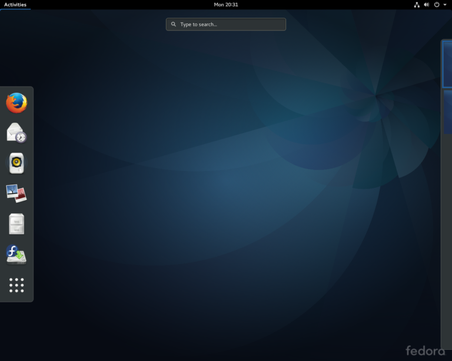
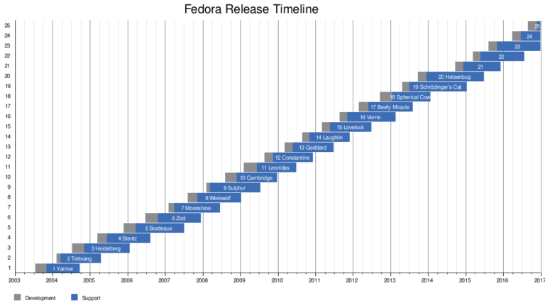

# လူသုံးများ ရေပန်းစားသော GNU/Linux Distro များ အပိုင်း (၅)

**၅. Fedora**

Fedora ကတော့ လူသိများပြီးသား distro တစ်ခုဖြစ်ပါတယ်။ စက်တင်ဘာလ ၂၀၀၄ခုနှစ်ကြမှ Fedora ဆိုတဲ့ နာမည်ကို တရားဝင် မိတ်ဆက်ပေးလိုက်တာဖြစ်ပြီး၊ တကယ်ကတော့ သိကြပြီးသားဖြစ်တဲ့အတိုင်း Red Hat Linux ရဲ့ အစမ်းသပ်ခံ distro တစ်ခုဖြစ်ပါတယ်။ Red Hat အကြောင်းဒီမှာ နည်းနည်းတော့ ပြောပြချင်ပါတယ်။ Red Hat ကို Bob Young နဲ့Marc Ewing ဆိုတဲ့သူ နှစ်ယောက်ကစတင်ခဲ့တာပါ။ Red Hat ကတော့ Free and Open Source တွေရဲ့ project တွေကနေ တကယ်တမ်း အမြတ်အစွန်းရအောင် ကြံဆောင်လို့ရတယ်ဆိုတာကို သက်သေထူသွားခဲ့တဲ့ ပထမဆုံး Linux ကမ္ဘာက distro တစ်ခုပါ။ အဲ့ဒီမတိုင်ခင်တုန်းကတော့ လူတွေတော်တော်များများ open source ကိုဘယ်လိုမှ စီးပွားရေးလောကကို ယူဆောင်သွားလို့မရဘူး လို့ပဲ ထင်ခဲ့ကြပါတယ်။ ဒါပေမယ့်လည်း GNU Manifesto ကိုအသေးစိတ်ဖတ်ကြည့်လိုက်မယ်ဆိုရင်တော့ Richard Stallman ကြီးကအဲ့ဒီအပိုင်းကိုပါအောင်ထည်သွင်းပေးထားခဲ့ပြီးသာပါ။ အဲ့ဒီ GNU Manifesto မှာတော့ “Programmers need to make a living somehow.” ဆိုတဲ့အပိုင်းလေးကို ဖတ်ကြည့်လိုက်တာနဲ့Richard Stallman ရဲ့ကြိုတင်သိမြင်တတ်မူ ပညာကိုလေးစားရမှာပါ။ အဲ့ဒါလေးကို အစတည်ပြီးတော့ Red Hat Linux ကို Enterprise တွေအတွက် Bob Young နဲ့Marc Ewing တို့က project ကို အသက်သွင်းလိုက်တာပါ။ အဓိကအားဖြင့်တော့ product support ကို ရောင်းတာပါ။ Enterprise ကိုရောင်းမှာဖြစ်တဲ့အတွက် community မှာရတဲ့ support ထက်တော့သာရမှဖြစ်မှာကိုလည်းသိတဲ့အတွက် တော်တော်လေးကို ဂရုပြုပြီးတော့ စခဲ့ရတာလည်းဖြစ်ပါတယ်။ အဲ့ဒါကြောင့်လည်း Red Hat က support ဘက်မှာတော်တော်လေးကို နာမည်ကြီးပါတယ်။ ကုမ္ပဏီအကြီးတွေမှာတော့ Red Hat ကို desktop အနေနဲ့ကော server အနေနဲ့ပါ တွင်တွင်ကျယ်ကျယ် အသုံးပြုပါတယ်။ နောက်ပြီးတော့ နာမည်ကျော် RPM (Red-Hat Package Manager) ကိုလည်း နာမည်မှာပါတဲ့အတိုင်း Red Hat ကစတင်မိတ်ဆက်ပေးခဲ့တဲ့ package manager တစ်ခုဖြစ်ပါတယ်။ တကယ်တမ်းတော့ Google တို့လို ကုမ္ပဏီ အကြီးတွေမှာ Linux ကိုသုံးပါတယ်။ Goobuntu လို့ခေါ်တဲ့ Ubuntu ကိုအခြေခံပြီး လိုအပ်သလို ပြန်ပြင်ထားတဲ့ distro ဖြစ်ပါတယ်။ ထားပါတော့ လိုရင်းဖြစ်တဲ့ Fedora အကြောင်းကိုသွားလိုက်ရအောင်ဗျာ။

<figure><figcaption></figcaption></figure>

Fedora ရဲ့အဓိပ္ပာယ်ကတော့ ဦးထုပ်တမျိုးပါ။ Red Hat logo မှာပါတဲ့ ဦးထုပ်မျိုးပါ။ Red Hat က Fedora ကို sponsor ပေးပြီး လိုအပ်တဲ့ feature အသစ်တွေ function အသစ်တွေကို Fedora မှာအရင်စမ်းသပ်စေပြီးတော့မှ Red Hat မှာ stable ဖြစ်ပြီးသားတွေကိုပဲထည့်ပေးလိုက်တဲ့ သဘောပါ။ Fedora ကတော့ သူ့community ကတော်တော်ကြီးတယ်လို့ပြောရမှာပါ။ ဖေဖဝါရီလ ၂၀၁၆ခုနှစ် ရဲ့မှတ်တမ်းမှာတော့ အသုံးပြုသူပေါင်း ၁.၂ သန်းကျော်လောက်ရှိပါတယ်။ Linux kernel ရဲ့ god ဖြစ်တဲ့ Linus Torvalds ရဲ့ အနှစ်သက်ဆုံး distro လည်းဖြစ်ပါတယ်။ နောက်ပိုင်းမှာတော့ Fedora က Gnome 3.x နဲ့KDE 4.x ကိုအစောဆုံး စတင်အသုံးပြုတဲ့ distro တစ်ခုဖြစ်လို့ အသုံးပြုတွေတော်တော်များများ ဝေဖန်တာကို ခံခဲ့ရပါတယ်။ တချိန်တည်းမှာပဲ Fedora က နောက်ဆုံးပေါ် နည်းပညာနဲ့တီထွင်ဆန်းသစ်မှုကိုသာ ဦးစားပေးတတ်တဲ့ သဘောကြောင့် သူ့မှာ အနာဂတ်အတွက် ဦးတည်ချက် ရပ်တည်ချက်သေချာမရှိတာကိုလည်း FLOSS community ဝေဖန်ခဲ့ပါတယ်။ ဘာဖြစ်လို့လဲဆိုတော့ Fedora က Red Hat ရဲ့အောက်မှာ လိုသလိုသုံးဖို့စခဲ့တဲ့ project ဖြစ်သည့်အလောက် Red Hat ကပဲ ဆုံးဖြတ်ချက်တော်တော်များများကို အပြီးသတ်ချမှတ်ရတဲ့သဘောရှိတာကြောင့် လောင်ရိပ်မိနေတဲ့ distro တစ်ခုအနေနဲ့လည်း တချို ့ကသုံးသပ်ကြပါတယ်။ ပြီးခဲ့တဲ့ မကြာသေးမီမှာတော့ Fedora 25 (F25 လို့လည်းအတိုကောက်ခေါ်ပါတယ်။) ထွက်ပါတယ်။ Fedora က F25 မှာတော့ အကြီးစားပြင်ဆင်မူတွေနဲ့အတူအများကြီး ဆန်းသစ်ထားတာကို တွေ့ရပါတယ်။ ဥပမာ X.11 အစား Wayland ဆိုတဲ့ display server protocol ကို အသုံးပြုထားတာပါ။ F25 က Wayland ကို အစောဆုံးအသုံးပြုလိုက်ပြန်ပါတယ်။ အဲ့ဒါကတော့ Fedora အတွက်တော့ သူ့ရဲ့ community ကိုအကြီးမားဆုံး အားစမ်းမူလည်းဖြစ်ပါတယ်။ စာရေးသူ F25 ကို install လုပ်ပြီး အသုံးပြုကြည့်သလောက်တော့ သူ့ရဲ့ Gnome 3 desktop ကို သိပ်အကြိုက်မတွေ့ခဲ့ပါဘူး။ Graphic ကို လိုတာထက် ပိုသုံးထားသလိုလည်းခံစားရပါတယ်။ ကွန်ပြူတာ အဟောင်းတွေပေါ်မှာ အသုံးပြုဖို့တော့ သိပ်အဆင်မပြေပါဘူး။ Wayland ကို ပြောင်းလိုက်တာကိုတော့ အကြိုက်တွေ့မိပါတယ်။ Linux ရဲ့ X.11 က graphic မှာ အားနည်းချက်တွေရှိနေတုန်းပါတယ်။ အဲ့ဒါကြောင့်လည်း Nvidia တို့graphic card တွေမှာ ပြဿနာတတ်တယ်လို့တော့ထင်မိပါတယ်။ Wayland ကတော့ အဲ့ဒီလို ပြဿနာတွေကို တဖြေးဖြေး ဖြေရှင်းပေးသွားမယ်လို့ မျှော်လင့်ရပါတယ်။

Fedora မှာလည်း DE ကို ရွေးချယ်စရာတွေရှိပါတယ်။ Gnome အပြင် KDE, LXDE, MATE နဲ့Xfce တို့လို desktop တွေနဲ့လည်းလာပါတယ်။ နဂိုအတိုင်းကတော့ Gnome 3 နဲ့ပါ။ Red Hat စာမေးပွဲတွေ ဖြေဖို့ပြင်ဆင်နေရင်တော့ Fedora က လေ့ကျင့်ဖို့open source version ဖြစ်ပါတယ်။ နောက်ပိုင်းမှာလည်း အချိန်ရရင် Linux Certification တွေအကြောင်းကို ရေးချင်ပါတယ်။ Demand တော်တော်ဖြစ်သလောက် လူသိသိပ်မများဘူးလို့တော့ စာရေးသူထင်မိပါတယ်။

<figure><figcaption></figcaption></figure>

**Fedora ရဲ့အားသာချက်များ**

macOS လိုအလှကြိုက်တယ်၊ open source လည်းဖြစ်ရမယ် ဆိုရင်တော့ Fedora ကို ရွေးချယ်သင့်ပါတယ်။ Linux မှာ နောက်ဆုံးပေါ် နည်းပညာများကိုသာ အသုံးပြုထားတဲ့ distro တစ်ခုဖြစ်တဲ့အတွက် လုံခြုံရေးနည်းပညာနဲ့အမြင်ပိုင်းမှာအမြဲ ဆန်းသစ်နေတဲ့ Fedora ကိုတော့ Linux အသုံးပြုသူတိုင်းအကြိုက်တွေ့မှာပါ။ နောက်ပြီး သူ့ရဲ့Package Manager ဖြစ်တဲ့ RPM ကလည်း support စနစ်ကောင်းကောင်းရှိတဲ့အတွက် စိတ်ချလက်ချအသုံးပြုလို့ရတဲ့ distro ပါ။ သေချာတာတစ်ခုကတော့ Fedora ဟာ ဘယ်တော့မှာ အကျိုးမြတ်ရစေဖို့အခကြေးငွေ ယူသွားမှာမဟုတ်တဲ့ အတွက်ကြောင့်မို့ community အတွက်ကော အသုံးပြုသူတွေအတွက်ပါ ရေရှည်ရပ်တည်သွားမယ့် distro လို့ပြောချင်ပါတယ်။

**Fedora နဲ့ဆင်တူ distro များ**

Korora၊ လက်ရှိမှာ နာမည်အရမ်းကြီးလာတဲ့ Red Hat ရဲ့ ကိုယ်ပွားဖြစ်တဲ့ CentOS (နောက်အပိုင်းတစ်ခုမှာ အသေးစိတ်ရေးပါ့မယ်။) နဲ့Scientific Linux တို့ပဲဖြစ်ပါတယ်။

**လက်ရှိ Fedora version နဲ့codename**

ဒီစာရေးနေတဲ့ အချိန် အရှေ့တစ်လမှာပဲ Fedora 25 ထွက်ပါတယ်။ ထုံးစံအတိုင်း Workstation၊ Server နဲ့Cloud ဆိုပြီး edition ၃ခုထွက်ပါတယ်။ အရင်တုန်းကတော့ codename ကို developer တွေကစုပြီးတော့ နာမည်ပေးကြပါတယ်။ သတ်မှတ်ချက်သေချာမရှိပါဘူး။ ပန်းနာမည် မြို ့နာမည် လူနာမည် ပေးချင်တဲ့ နာမည်ကို စုပြီးတော့ ပေးခဲ့ကြပါတယ်။ နောက်ပိုင်းတော့ Fedora community ကို object-oriented programming ရဲ့ “is-a” relationship test လို ဟာမျိုးလေးတွေနဲ့ဉာဏ်စမ်းလည်းပါ voting ပေးတဲ့ ပုံစံမျိုးကို Fedora 20 နဲ့Fedora 21 ထိလုပ်ပါတယ်။ အဲ့ဒီနောက်မှာ အဲ့ဒါကိုလည်းမလုပ်တော့ပဲ ရိုးရိုး Fedora 25 Workstation လို့သာခေါ်ပါတော့တယ်။ အရင်တုန်းကနာမည်ပေးတဲ့ပုံစံ ကိုအသေးစိတ်လေ့လာလိုတယ်ဆိုရင်တော့ Fedora Project website မှာသွားရောက်လေ့လာလို့ရပါတယ်။

<figure><figcaption></figcaption></figure>

စာကြွင်း။ ။ နောက်ဆုံးထွက်တဲ့ version ကတော့ Fedora 30 ဖြစ်ပါတယ်။ Red Hat က အခုအချိန်ထိတော့ ဆက်လက် sponsor လုပ်နေတုန်းပါ။ လက်ရှိ IBM ရဲ့ acquisition အပြီးမှာ ဘယ်လိုမျိုး အပြောင်းအလဲ ဖြစ်မလဲဆိုတာတော့ သတင်းမထွက်လာသေးပါဘူး။
