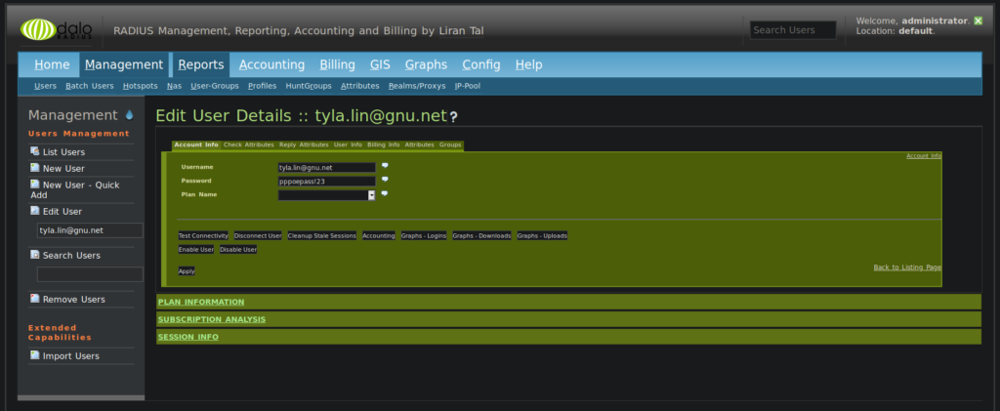

# FreeRADIUS နဲ့ PPPoE Authentication အပိုင်း (၂)

အရှေ့တပိုင်းမှာတော့ FreeRADIUS ရယ်၊ သူနဲ့တွဲပြီး အသုံးပြုဖို့အတွက် mariadb mysql ရယ်ကို အကုန်ပြင်ဆင်ပြီးသွားပါပြီ။ ဒီအဆင့်မှာတော့ daloRADIUS webUI ကိုဘယ်ထည့်သွင်းပုံနဲ့ သူ့အပေါ်မှာ user၊ nas နဲ့ attribute တွေကို ဘယ်လိုမျိုး manage လုပ်သလဲဆိုတာကို ဆက်ပြီးတော့ ဖော်ပြပေးပါ့မယ်။ နောက်ဆုံးမှာတော့ အားလုံး ready ဖြစ်တဲ့ FreeRADIUS server နဲ့ ကိုယ်ရဲ့ internet service provider platform မှာဘယ်လိုမျိုးတွဲပြီး အသုံးပြုလို့ရသလဲဆိုတာကို ဆက်ပြီးတော့ ရှင်းသွားပါ့မယ်။ အချပ်ပို အနေနဲ့တော့ အခု setup လုပ်ထားတဲ့ RADIUS server နဲ့ device login တွေကို ဘယ်လို manage လုပ်လို့ရသလဲဆိုတာ ကို ဆက်ပြီးတော့ ဖော်ပြသွားပါ့မယ်။ production environment မှာတော့ management network နဲ့ customer PPPoE database ဟာ အတူတူမရှိသင့်ပါဘူး။ ဒီမှာတော့ FreeRADIUS က setup လုပ်ပြီးသားဖြစ်တာနဲ့ ဆက်ပြီးတော့ management network မှာလည်း RADIUS ကို device management အတွက် အသုံးပြုလို့ရပုံကို ဖော်ပြရခြင်းဖြစ်ပါတယ်။ ပထမဆုံးအနေနဲ့ Apache web server နဲ့ daloRADIUS ကို install လုပ်ပုံကို အရင်သွားလိုက်ရအောင်။

## Apache web server ကို setup လုပ်ပုံ

```
# hop in to sudo
[tyla@rpm-dev01 ~]$ sudo -i
[sudo] password for tyla:
[root@rpm-dev01~]#  

# install Apache web server
[root@rpm-dev01 ~]# yum groupinstall "Development Tools" -y
[root@rpm-dev01 ~]# yum -y install httpd httpd-devel

# start and enable Apache's httpd
[root@rpm-dev01 ~]# systemctl enable httpd
[root@rpm-dev01 ~]# systemctl start httpd

# check the status of httpd
[root@rpm-dev01 ~]# systemctl status httpd
● httpd.service - The Apache HTTP Server
   Loaded: loaded (/usr/lib/systemd/system/httpd.service; enabled; vendor preset: disabled)
   Active: active (running) since Fri 2019-10-11 18:11:24 UTC; 3 weeks 1 days ago
     Docs: man:httpd(8)
           man:apachectl(8)
 Main PID: 1288 (httpd)
   Status: "Total requests: 571; Current requests/sec: 0; Current traffic:   0 B/sec"
   CGroup: /system.slice/httpd.service
           ├─ 1288 /usr/sbin/httpd -DFOREGROUND
           ├─ 1801 /usr/sbin/httpd -DFOREGROUND
           ├─ 1876 /usr/sbin/httpd -DFOREGROUND
           ├─11861 /usr/sbin/httpd -DFOREGROUND
           ├─12084 /usr/sbin/httpd -DFOREGROUND
           ├─12085 /usr/sbin/httpd -DFOREGROUND
           ├─12089 /usr/sbin/httpd -DFOREGROUND
           ├─12090 /usr/sbin/httpd -DFOREGROUND
           ├─13091 /usr/sbin/httpd -DFOREGROUND
           ├─13093 /usr/sbin/httpd -DFOREGROUND
           └─13145 /usr/sbin/httpd -DFOREGROUND

Oct 11 18:11:22 rpm-dev01 systemd[1]: Starting The Apache HTTP Server...
Oct 11 18:11:23 rpm-dev01 httpd[1288]: AH00558: httpd: Could not reliably determine the server's fully qualified domain name, using 192.168.105.7. Set the 'ServerName' dire...this message
Oct 11 18:11:24 rpm-dev01 systemd[1]: Started The Apache HTTP Server.
Hint: Some lines were ellipsized, use -l to show in full.
```

## daloRADIUS ကို setup လုပ်ပုံ

```
# download daloradius packages from github
[root@rpm-dev01 ~]# wget https://github.com/lirantal/daloradius/archive/master.zip

# unzip the downloaded zip file
[root@rpm-dev01 ~]# unzip master.zip

# rename the folder name to daloradius
[root@rpm-dev01 ~]# mv daloradius-master/ daloradius
[root@rpm-dev01 ~]# cd daloradius

# import daloradius mysql scheme into frad db
[root@rpm-dev01 ~]# mysql -u root -p frad < contrib/db/fr2-mysql-daloradius-and-freeradius.sql
password:     # input the mysql root password previously set
[root@rpm-dev01 ~]# mysql -u root -p frad < contrib/db/mysql-daloradius.sql
password:     # input the mysql root password previously set

# move daloradius folder to /var/www/html directory
[root@rpm-dev01 ~]# cd ..
[root@rpm-dev01 ~]# mv daloradius /var/www/html/

# give Apache the ownership of /var/www/html/daloradius/
[root@rpm-dev01 ~]# chown -R apache:apache /var/www/html/daloradius/
[root@rpm-dev01 ~]# chmod 664 /var/www/html/daloradius/library/daloradius.conf.php
```

## daloRADIUS php config file အား MySQL နဲ့ တွဲပြီးအသုံးပြုနိုင်ရန်ပြင်ဆင်ပုံ

```
[root@rpm-dev01 ~]# vi /var/www/html/library/daloradius.conf.php

 All Rights Reserved.
 *
 * This program is free software; you can redistribute it and/or
 * modify it under the terms of the GNU General Public License
 * as published by the Free Software Foundation; either version 2
 * of the License, or (at your option) any later version.
 *
 * You should have received a copy of the GNU General Public License
 * along with this program; if not, write to the Free Software
 * Foundation, Inc., 59 Temple Place - Suite 330, Boston, MA  02111-1307, USA.
 *
 *********************************************************************************************************
 * Description:
 *              daloRADIUS Configuration File
 *
 * Modification Date:
 *              Mon Mar 28 22:55:00 EDT 2011
 *********************************************************************************************************
 */


$configValues['DALORADIUS_VERSION'] = '1.1-2';
$configValues['DALORADIUS_DATE'] = '08 Aug 2019';
$configValues['FREERADIUS_VERSION'] = '2';
$configValues['CONFIG_DB_ENGINE'] = 'mysqli';
$configValues['CONFIG_DB_HOST'] = 'localhost';
$configValues['CONFIG_DB_PORT'] = '3306';
$configValues['CONFIG_DB_USER'] = 'frad';
$configValues['CONFIG_DB_PASS'] = 'fradpass!23';
$configValues['CONFIG_DB_NAME'] = 'frad';
$configValues['CONFIG_DB_TBL_RADCHECK'] = 'radcheck';
$configValues['CONFIG_DB_TBL_RADREPLY'] = 'radreply';
$configValues['CONFIG_DB_TBL_RADGROUPREPLY'] = 'radgroupreply';
$configValues['CONFIG_DB_TBL_RADGROUPCHECK'] = 'radgroupcheck';
$configValues['CONFIG_DB_TBL_RADUSERGROUP'] = 'radusergroup';
$configValues['CONFIG_DB_TBL_RADNAS'] = 'nas';
$configValues['CONFIG_DB_TBL_RADHG'] = 'radhuntgroup';
$configValues['CONFIG_DB_TBL_RADPOSTAUTH'] = 'radpostauth';
$configValues['CONFIG_DB_TBL_RADACCT'] = 'radacct';
$configValues['CONFIG_DB_TBL_RADIPPOOL'] = 'radippool';
$configValues['CONFIG_DB_TBL_DALOOPERATORS'] = 'operators';
$configValues['CONFIG_DB_TBL_DALOOPERATORS_ACL'] = 'operators_acl';
$configValues['CONFIG_DB_TBL_DALOOPERATORS_ACL_FILES'] = 'operators_acl_files';
$configValues['CONFIG_DB_TBL_DALORATES'] = 'rates';
$configValues['CONFIG_DB_TBL_DALOHOTSPOTS'] = 'hotspots';
$configValues['CONFIG_DB_TBL_DALOUSERINFO'] = 'userinfo';
$configValues['CONFIG_DB_TBL_DALOUSERBILLINFO'] = 'userbillinfo';
$configValues['CONFIG_DB_TBL_DALODICTIONARY'] = 'dictionary';
$configValues['CONFIG_DB_TBL_DALOREALMS'] = 'realms';
$configValues['CONFIG_DB_TBL_DALOPROXYS'] = 'proxys';
$configValues['CONFIG_DB_TBL_DALOBILLINGPAYPAL'] = 'billing_paypal';
$configValues['CONFIG_DB_TBL_DALOBILLINGMERCHANT'] = 'billing_merchant';
$configValues['CONFIG_DB_TBL_DALOBILLINGPLANS'] = 'billing_plans';
$configValues['CONFIG_DB_TBL_DALOBILLINGRATES'] = 'billing_rates';
$configValues['CONFIG_DB_TBL_DALOBILLINGHISTORY'] = 'billing_history';
$configValues['CONFIG_DB_TBL_DALOBATCHHISTORY'] = 'batch_history';
$configValues['CONFIG_DB_TBL_DALOBILLINGPLANSPROFILES'] = 'billing_plans_profiles';
$configValues['CONFIG_DB_TBL_DALOBILLINGINVOICE'] = 'invoice';
$configValues['CONFIG_DB_TBL_DALOBILLINGINVOICEITEMS'] = 'invoice_items';
$configValues['CONFIG_DB_TBL_DALOBILLINGINVOICESTATUS'] = 'invoice_status';
$configValues['CONFIG_DB_TBL_DALOBILLINGINVOICETYPE'] = 'invoice_type';
$configValues['CONFIG_DB_TBL_DALOPAYMENTS'] = 'payment';
$configValues['CONFIG_DB_TBL_DALOPAYMENTTYPES'] = 'payment_type';
$configValues['CONFIG_DB_TBL_DALONODE'] = 'node';
$configValues['CONFIG_FILE_RADIUS_PROXY'] = '/etc/freeradius/proxy.conf';
$configValues['CONFIG_PATH_RADIUS_DICT'] = '';
$configValues['CONFIG_PATH_DALO_VARIABLE_DATA'] = '/var/www/daloradius/var';
$configValues['CONFIG_DB_PASSWORD_ENCRYPTION'] = 'cleartext';
$configValues['CONFIG_LANG'] = 'en';
$configValues['CONFIG_LOG_PAGES'] = 'no';
$configValues['CONFIG_LOG_ACTIONS'] = 'no';
$configValues['CONFIG_LOG_QUERIES'] = 'no';
$configValues['CONFIG_DEBUG_SQL'] = 'no';
$configValues['CONFIG_DEBUG_SQL_ONPAGE'] = 'no';
$configValues['CONFIG_LOG_FILE'] = '/tmp/daloradius.log';
$configValues['CONFIG_IFACE_PASSWORD_HIDDEN'] = 'no';
$configValues['CONFIG_IFACE_TABLES_LISTING'] = '25';
$configValues['CONFIG_IFACE_TABLES_LISTING_NUM'] = 'yes';
$configValues['CONFIG_IFACE_AUTO_COMPLETE'] = 'yes';
$configValues['CONFIG_MAINT_TEST_USER_RADIUSSERVER'] = '127.0.0.1';
$configValues['CONFIG_MAINT_TEST_USER_RADIUSPORT'] = '1812';
$configValues['CONFIG_MAINT_TEST_USER_NASPORT'] = '0';
$configValues['CONFIG_MAINT_TEST_USER_RADIUSSECRET'] = 'testing123';
$configValues['CONFIG_USER_ALLOWEDRANDOMCHARS'] = 'abcdefghijkmnpqrstuvwxyzABCDEFGHJKMNPQRSTUVWXYZ23456789';
$configValues['CONFIG_MAIL_SMTPADDR'] = '127.0.0.1';
$configValues['CONFIG_MAIL_SMTPPORT'] = '25';
$configValues['CONFIG_MAIL_SMTPAUTH'] = '';
$configValues['CONFIG_MAIL_SMTPFROM'] = 'root@daloradius.xdsl.by';
$configValues['CONFIG_DASHBOARD_DALO_SECRETKEY'] = 'sillykey';
$configValues['CONFIG_DASHBOARD_DALO_DEBUG'] = '1';
$configValues['CONFIG_DASHBOARD_DALO_DELAYSOFT'] = '5';
$configValues['CONFIG_DASHBOARD_DALO_DELAYHARD'] = '15';

// invoice templates - optional
$configValues['CONFIG_INVOICE_TEMPLATE'] = 'invoice_template.html';
$configValues['CONFIG_INVOICE_ITEM_TEMPLATE'] = 'invoice_item_template.html';

/*
// Locations Configuration directives
// Locations directives are support for accessing different databases from the daloRADIUS Login console
// adjust the locations below for databases you are running (if you are running more than one).
// You could configure invoice templates for each location - optional.
$configValues['CONFIG_LOCATIONS'] =                     array(

        "Location Example 1" =>                 array(
                "Engine"   => "mysql",
                "Username" => "root",
                "Password" => "",
                "Database" => "radius",
                "Hostname" => "127.0.0.1",
				"CONFIG_INVOICE_TEMPLATE" => "invoice_template_location_1.html",
				"CONFIG_INVOICE_ITEM_TEMPLATE" => "invoice_item_template_location_1.html"
        ),

        "Location Example 2" =>                 array(
                "Engine"   => "mysql",
                "Username" => "db_usertest",
                "Password" => "db_passtest",
                "Database" => "test_db1",
                "Hostname" => "localhost"
        )
);
*/
```

အထက်က daloradius.conf.php file မှာတော့ line number ၃၄ ကနေ ၃၆ အထိပဲ အထက်မှာပြထားတဲ့ အတိုင်း ပြင်ဖို့လိုပါတယ်။ ကျန်တဲ့ line တွေကိုတော့ reference အနေနဲ့ အားလုံးပစ်ပြီးတော့ထည့် ထားတာဖြစ်ပါတယ်။ အားလုံး ပြီးသွားပြီဆိုရင် နောက်ဆုံးအဆင့် အနေနဲ့ daemon အားလုံး ကို error တက်မတက်သိရအောင်လို့ restart လုပ်ရပါမယ်။ ပြီးတော့မှ php နဲ့တွဲပြီးတော့ အသုံးပြုလို့ရအောင် php-pear ကို install လုပ်ရမှာဖြစ်ပါတယ်။

```
# restart all installed daemons to check if there are any errors
[root@rpm-dev01 ~]# systemctl restart radiusd
[root@rpm-dev01 ~]# systemctl restart mariadb
[root@rpm-dev01 ~]# systemctl restart httpd

# install php-pear
[root@rpm-dev01 ~]# yum install php-pear
[root@rpm-dev01 ~]# pear install DB
```

ဘာ error မှမတက်ဘူး၊ အားလုံး အဆင်ပြေတယ်ဆိုရင်တော့ web browser ကနေပြီးတော့ အောက်မှာလိုစတင် အသုံးပြုနိုင်ပါပြီ။ စာရေးသူ အတွက်တော့ DNS server နဲ့ မချိတ်ထားတဲ့ အတွက် IP address ကို အသုံးပြုပြီးတော့ daloRADIUS webUI ကို access လုပ်ပါတယ်။ default username နဲ့ password ကို အသုံးပြုပြီးတော့ initial setup မှာ ဝင်ရောက်အသုံးပြုနိုင်ပါတယ်။

```
http://192.168.105.7/login.php
 Username: administrator
 Password: radius
```

<figure><figcaption></figcaption></figure>

User အသစ်ကိုဖန်တီးရန် daloRADIUS webUI တွင် အောက်မှာဖော်ပြထားတဲ့အတိုင်း လုပ်ဆောင်ပါ။

```
# create a user on daloradius
Management > Users > New User
Username: tyla.lin@gnu.net
Password: pppoepass!23
```

<figure><figcaption></figcaption></figure>

အခုဆိုရင် new user ဖြစ်တဲ့ tyla.lin@gnu.net ဆိုတဲ့ user ကိုဖန်တီးပြီးသွားပါပြီ။ attribute ကို စမ်းသပ်ဖို့ရာ စာရေးသူ reply attribute တစ်ခုကို ထည့်သွင်း အသုံးပြုကြည့်ပါ့မယ်။ အဲ့ဒီအတွက် Edit users details အောက်က attribute မှာ အောက်ကအတိုင်း ထည့်သွင်းလိုက်ပါ။ ပြီးရင် Add attribute ဆိုတဲ့ button ကို နှိပ်လိုက်ပါ။

မှတ်ချက် – ဒီ attribute ကတော့ end customer ရဲ့ CPE ကို static IP address နဲ့ assign လုပ်တဲ့ attribute ဖြစ်ပါတယ်။

```
# set a RADIUS attribute for end customer's CPE
Locate Attribute via Vendor/Attribute 
Vendor: dictionary.rfc2865
Attribute: Framed-IP-Address
Value: 103.215.192.101
Op: :=
Target: reply
```

<figure><figcaption></figcaption></figure>

PPPoE sessions တွေကို manage လုပ်မယ့် LNS router အတွက် DaloRADIUS မှာ nas အနေနဲ့အောက်ကအတိုင်း ထည့်ပေးရပါမယ်။ ပြီးသွားရင် Add button ကို နှိပ်ပြီးတော့ add လိုက်ပါ။

```
# add a nas for LNS router 
Management > Nas > New NAS
NAS IP/Host: 192.168.105.70
NAS Secret: secret!23
NAS Type: cisco
NAS Shortname: lns
```

<figure><figcaption></figcaption></figure>

အခုဆိုရင် core network ဘက်မှာလိုအပ်တာတွေအကုန် ပြင်ဆင်ပြီးသွားပါပြီ။ အောက်မှာတော့ အခု configure လုပ်နေနဲ့ FreeRADIUS server ကို ထည့်သွင်း အသုံးပြုမယ့် network topology အကြမ်းဖြစ်ပါတယ်။

<figure><figcaption></figcaption></figure>

နောက်တဆင့် အနေနဲ့ LNS router ပေါ်မှာ PPPoE sessions တွေအတွက် ဘယ်လိုပြင်ဆင်သလဲဆိုတာကို ဆက်ပြီးတော့ရှင်းပါ့မယ်။ သို့သော် upstream provider ရဲ့ LAC router ဆီကို VPDN နဲ့ L2TP tunnel ဘယ်လို တည်ဆောက်သလဲဆိုတာတော့ မရှင်းတော့ပါဘူး။ နောက်ပိုင်း networking နဲ့ဆိုင်တဲ့ post တွေမှပဲ အသေးစိတ် ဆက်ရှင်းပါမယ်။ အောက်မှာတော့ PPPoE နဲ့ ပတ်သတ်တဲ့ config ကို LNS router ပေါ်မှာ ဘယ်လို configure လုပ်သလဲဆိုတာ ဆက်သွားပါ့မယ်။

## PPPoE sessions တွေအတွက် LNS router အား configure လုပ်ပုံ

```
!
conf t
!
!
! # create loopback101 interface for unnumbered tunnel interfaces
interface Loopback0
 description IP for Unnumbered Tunnel Interfaces
 ip address 192.168.1.1 255.255.255.255
!
!
! # configure router interface facing towards Internet Uplink
interface GigabitEthernet0/0
 description to Internet Uplink
 ip address dhcp
 no shutdown
!
!
! # configure router interface facing towards freeRADIUS server
 interface GigabitEthernet0/1
 description to freeRADIUS server
 ip address 192.168.105.70 255.255.255.0
 no shutdown
!
!
! # configure router interface facing towards fixed-line upstream provider's LACs 
interface GigabitEthernet0/2
 description to Fixed-line Upstream Provider's LACs
 no ip address
 pppoe enable group global
 no shutdown
!
!
! # create PPPoE profile uses virtual-template 1
bba-group pppoe global
 virtual-template 1
!
!
! # configure interface virtual-template 1 
interface Virtual-Template1
 description to customer's CPE thru L2TP tunnel
 ip unnumbered Loopback101
 peer default ip address pool pppoe-pool1
 ppp authentication chap
!
!
! # create an ip pool called pppoe-pool1 to assign customer's CPE
ip local pool pppoe-pool1 192.168.1.2 192.168.1.101
!
!
! # configure radius config to work with freeRADIUS server
aaa new-model
radius server pppoe-frad
 address ipv4 192.168.105.7 auth-port 1812 acct-port 1813
 key secret!23
!
!
! # configure radius authentication and authorization config
aaa authentication ppp default group radius
! # allow freeRADIUS server to push Framed-IP-Address to customer's CPE
aaa authorization network default group radius
```

အခုဆိုရင် LNS router မှာလည်း PPPoE အတွက်လိုအပ်တဲ့ config တွေကို ထည့်သွင်းပြီးသွားပါပြီ။ နောက်တဆင့် အနေနဲ့ customer ရဲ့ CPE devices တွေမှာဘယ်လိုမျိုး configure လုပ်သလဲဆိုတာ ဆက်သွားပါ့မယ်။ စာရေးသူ customer ရဲ့ CPE ကို Cisco IOS အနေနဲ့ရော၊ MikroTik RouterOS အနေနဲ့ပါ PPPoE client ကို configure လုပ်ပြသွားပါ့မယ်။

## Cisco IOS CPE ပေါ်တွင် PPPoE client အတွက် configure လုပ်ပုံ

```
!
config t
!
!
! # configure CPE router interface facing towards WAN Uplink
interface GigabitEthernet0/1
 description to WAN Uplink
 pppoe enable pppoe-client dial-pool-number 1
 no shutdown
!
!
! # configure PPP encapsulation interface dailer 
interface Dialer1
 ip address negotiated
 encapsulation ppp
 dialer pool 1
 dialer-group 1
 ppp authentication chap callin
 ppp chap hostname tyla.lin@gnu.net
 ppp chap password 0 pppoepass!23
!
!
! # configure interface dailer to actively allow all PPPoE sessions
dialer-list 1 protocol ip permit
!
!
! # configure a static route as default gateway pointing to interface dialer 1
ip route 0.0.0.0 0.0.0.0 Dialer1
```

## MikroTik RouterOS ပေါ်တွင် PPPoE client အတွက် configure လုပ်ပုံ

```
# create an access bridge called lan
/interface bridge
add name=lan

# leave these as default
/interface ethernet
set [ find default-name=ether1 ] disable-running-check=no
set [ find default-name=ether2 ] disable-running-check=no
set [ find default-name=ether3 ] disable-running-check=no
set [ find default-name=ether4 ] disable-running-check=no
set [ find default-name=ether5 ] disable-running-check=no

# configure interface pppoe-client for authentication
/interface pppoe-client
add add-default-route=yes disabled=no interface=ether1 keepalive-timeout=60 
    name=pppoe-out1 password=pppoepass!23 use-peer-dns=yes user=
    tyla.lin@gnu.net

# create ip dhcp pool0 for lan interfaces
/ip pool
add name=dhcp_pool0 ranges=192.168.0.2-192.168.0.254

# assign ether2-5 to lan access bridge and assign IP address to lan bridge
/interface bridge port
add bridge=lan interface=ether2
add bridge=lan interface=ether3
add bridge=lan interface=ether4
add bridge=lan interface=ether5
/ip address
add address=192.168.0.1/24 interface=lan network=192.168.0.0

# configure dhcp-client on ether1
/ip dhcp-client
add disabled=no interface=ether1

# configure dhcp-server network for lan network
/ip dhcp-server network
add address=192.168.0.0/24 dns-server=1.1.1.1 gateway=192.168.0.1

# configure PAT with source NAT chain
/ip firewall nat
add action=masquerade chain=srcnat out-interface=pppoe-out1 src-address=
    192.168.0.0/24

# configure a static route as default gateway pointing to pppoe-out1
/ip route
add distance=1 dst-address=0.0.0.0/32 gateway=pppoe-out1
```

End-to-end PPPoE configuration ကို freeRADIUS နဲ့ ဘယ်လိုမျိုးတွဲပြီး အသုံးပြုလို့ရသလဲဆိုတာ ဖော်ပြပေးသွားတာပါ။ အချပ်ပိုအနေနဲ့ MikroTik RouterOS မှာ RADIUS ကို အသုံးပြုပြီးတော့ device login ကိုဘယ်လို control လုပ်သလဲဆိုတာ ဆက်သွားပါ့မယ်။

## MikroTik RouterOS ပေါ်တွင် RADIUS ကိုသုံးပြီး device login setup လုပ်ပုံ

```
# configure radius for device login
/radius
add address=192.168.105.7 secret=secret!23 service=login
/radius incoming
set accept=yes
/user aaa
set use-radius=yes
```

ဒီလောက်ဆိုရင်တော့ freeRADIUS နဲ့ PPPoE sessions တွေရဲ့ authentication ကို ဘယ်လို ထိန်းချုပ် နိုင်သလဲဆိုတာ ဂဃဏန သေသေချာချာ လေ့လာနိုင်မယ်လို့ မျှော်လင့်ပါတယ်။ ဒီ post ကိုတော့ ဒီမှာပဲ အဆုံးသတ်လိုက် ပါတော့မယ်။
