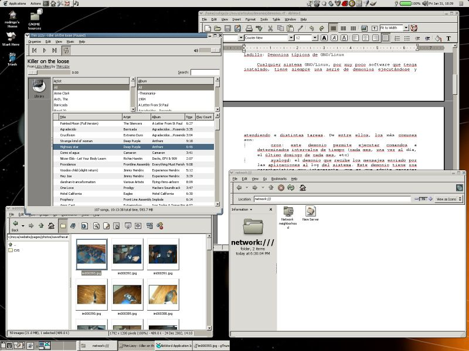
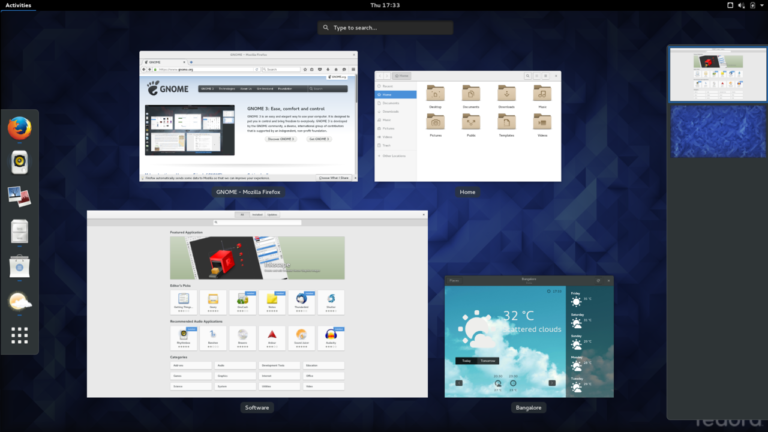

# GNU/Linux Desktop Environment များအကြောင်း အပိုင်း (၁)

GNU/Linux မှာ အယူမှားတာလေး တစ်ခုရှိပါတယ်။ အဲ့ဒါကတော့ Ubuntu နဲ့ default အတိုင်း ပါလာတဲ့ icons တွေ desktop ပုံစံလေးတွေကို မကြိုက်လို့ ဆိုပြီး Fedora ပြောင်းသုံးတယ် Manjaro ေပြာင်းသုံးတယ် ဆိုတာပါပဲ။ ဆိုလိုရင်းကတော့ GNU/Linux မှာ Microsoft Windows မှာလိုမျိုး desktop ပုံစံ တစ်မျိုးတည်းနဲ့ လာတာမဟုတ်ပါဘူး။ ဥပမာ Windows XP မှာဆို နဂိုအတိုင်းပါလာတဲ့ Luna ဆိုတဲ့ default desktop တစ်ခုပဲရှိပါတယ်။ အဲ့ဒါကိုမှ မကြိုက်လို့ရှိရင် Theme ေတွထည့်ပြီးတော့ သုံးလို့တော့ရပါတယ်။ သို့သော် Theme ဆိုတာက desktop environment တစ်ခုကို အဝတ်တစ်ထည်နဲ့ အုပ်လိုက်သလိုမျိုးသာ ဖြစ်ပြီးတော့ အောက်က ကိုယ်ထည်ကတော့ ဘာမှ မပြောင်းလဲတဲ့ သဘောမျိုးသာဖြစ်ပါတယ်။ အဲ့… GNU/Linux မှာတော့ Free and Open Source community က ဝါသနာရှင် နည်းပညာသမားများက ကိုယ်လိုချင်တဲ့ desktop environment တွေကို အစကနေပြီးတော့ ရေးကြပါတယ်။ ပြောရတာလွယ် သလောက် desktop environment ကို အစကနေရေးရတယ် ဆိုတာ လက်တွေမှာတော့ အဲ့ဒီလောက်တော့လည်း မလွယ်ကူလှပါဘူး။ desktop environment တစ်ခုနဲ့ အလုပ်လုပ်တဲ့ components ကိုပါထည့်ပြီးတော့ design လုပ်ရတာဖြစ်တဲ့ အတွက် ဟန်ချက်ညီညီ နဲ့ ဖြစ်ဖို့ဆိုတာ အများကြီးကို အားစိုက်ထုတ်ရတဲ့ အလုပ်တစ်ခုပါတယ်။

<figure><figcaption></figcaption></figure>

ဟုတ်ပြီ desktop environment တစ်ခုဖြစ်လာဖို့ဆိုတာ လွယ်တော့ မလွယ်ဘူး ဆိုတာသိပြီ။ ဒါနဲ့ desktop environment ဆိုတာဘာလဲ၊ ဘာလို့ OS တစ်ခုမှာ DE ကမရှိမဖြစ်လိုအပ်တာလဲ၊ DE တစ်ခုမှာ ဘာတွေပါလဲ ဆိုတဲ့ မေးခွန်းတွေကို ရှင်းသွားအောင်လို့ ဒီနေရာမှာ နည်းနည်းလေး ဆွေးနွေးကြည့်ရအောင်ဗျာ။ Desktop Environment ဆိုတဲ့ နေရာမှာလည်း computer တွေကို command ပေးဖို့ကို shell လို့ ခေါ်တဲ့ user interface တွေလိုအပ်ပါတယ်။ CLI ကတော့ရှင်းပါတယ်။ command တွေကို screen မဲမဲကြီးပေါ်မှာရိုက်ထည့်မယ်။ GUI မှာတော့ အစောပိုင်းကပြောသွားတဲ့ icons တွေ၊ window တွေကို ဘယ်လိုမျိုး graphical shell မှာထည့်သုံးမလဲဆိုတာမျိုးတွေကို ထည့်သွင်း စဥ်းစားရပါတော့တယ်။ OS တစ်ခု boot တက်လာတဲ့ screen၊ login screen ပုံစံ၊ OS ထဲမှာပါတဲ့ window နဲ့ icons တွေ ပုံစံ အပြင် OS ရဲ့ desktop နဲ့ တွဲပြီးတော့ သုံးလို့ရတဲ့ program တွေ application တွေကို စုစည်းပေးထားတာကိုတော့ desktop environment လို့ ခေါ်ပါတယ်။ ဆိုပါတော့ Ubutun 16.10 Unity 7 မှာ Ubuntu Software Center ကို သုံးထားသော်လည်း Ubuntu 17.04 မှာ GNOME ကို Official Desktop အနေနဲ့ သုံးထားတာကြောင့် GNOME ရဲ့ Software ဆိုတဲ့ software တွေကို install လုပ်တဲ့ program ကိုသုံးထားပါတယ်။ အကြမ်းအားဖြင့် တော့ Desktop Environment ဆိုတာ OS တစ်ခုရဲ့ GUI မှာ လိုအပ်တဲ့ program တွေ application တွေကို စုစည်းပေးထားပြီးတော့ တမူထူးခြားတဲ့ ကိုယ်ပိုင်ဟန် graphic တွေကို သုံးထားတဲ့ software bundle တစ်ခုအနေနဲ့ မြင်ကြည့်လို့ရမယ်ထင်ပါတယ်။

Open Source ဖြစ်တဲ့ Unix-like operating system တွေမှာ desktop environment ပေါင်းများစွာရှိပါတယ်။ ပုံမှန်အားဖြင့် ကိုယ်သုံးတဲ့ distribution ေပါ်မှာ မူတည်ပြီးတော့ Official လာတဲ့ Desktop Environment (DE) တွေရှိပါတယ်။ ဥပမာအားဖြင့် Ubuntu မှာဆိုရင် 16.10 အထိကို Official DE က Unity ဖြစ်ပါတယ်။ Ubuntu 16.10 မှာတော့ Unity 7 ေတာင်ဖြစ်နေပါပြီ။ တကယ်လို့ ကိုယ့်အနေနဲ့ Unity ကိုမကြိုက်ဘူး ဆိုကြပါစို့ Ubuntu ကိုတော့ သုံးရတာလွယ်လို့ သုံးချင်သေးတယ်ဆိုရင် ဖြင့် မတူတဲ့ flavour တွေနဲ့လည်း လာပါတယ်။ Ubuntu မှာတော့ KDE ကို သုံးထားတဲ့ Kubuntu၊ ပေါ့ပါးလှတဲ့ LXDE ကိုသုံးထားတဲ့ Lubuntu၊ MythTV မှာသုံးလို့ရအောင်ထုတ်ထားတဲ့ Mythbuntu၊ နောက်ပိုင်းမှာ နာမည်ရလာတဲ့ Budgie DE ကို အသုံးပြုထားတဲ့ Ubuntu Budgie၊ လူကြိုက်များပြီး နောက်ဆုံး Ubuntu 17.04 မှာ official DE အဖြစ်သုံးထားတဲ့ GNOME နဲ့ Ubuntu ကို Ubuntu GNOME ဆိုပြီးတော့ ခေါ်ခဲ့ကြပါတယ်။ နောက်ပြီးတော့ Ubuntu Kylin၊ Ubuntu MATE၊ Ubuntu Studio နဲ့ Xubuntu ဆိုပြီးတော့ လည်း ရှိကြပါသေးတယ်။ Ubuntu တစ်ခုတည်းမှာရှိတဲ့ DE ကို ပြောပြတာပဲရှိပါသေးတယ်။ ဒီထက်မကတဲ့ DE ေပါင်းများစွာလည်း ကျန်ပါသေးတယ်။ ပြောမယ်ဆိုရင်တော့ အများကြီး ကျန်ပါသေးတယ်။

GNU/Linux သုံးမယ်ဆိုရင်တော့ ကိုယ် ဘယ်လိုမျိုး DE flavour ကို ကြိုက်ပြီးတော့ ဘယ်လိုမျိုး distribution ကို ကြိုက်တယ်ဆိုတာကိုတော့ ခွဲခြားပြီးတော့ သိထားဖို့လိုပါလိမ့်မယ်။ အဲ့ဒီ အတွက် ကြောင့် ဒီတစ်ခါတော့ လူသုံးများတဲ့ GNU/Linux မှာရနိုင် တဲ့ desktop environment (DE) အကြောင်းလေးတွေကို မိတ်ဆက်ပေးချင်ပါတယ်။ ပထမဆုံး အနေနဲ့ GNOME ဆိုတဲ့ Desktop အကြောင်းလေးနဲ့ စလိုက်ချင်ပါတယ်။

## GNOME

GNOME desktop environment ကတော့ Free and Open Source community မှာရှိနေခဲ့တာ တော်တော်လေးတောင် ကြာသွားပါပြီ။ GNOME 1 ကိုတော့ မတ်လ ၃ ရက်နေ့ ၁၉၉၉ ခုနှစ်မှာ စပြီးတော့ မိတ်ဆက်ပေးခဲ့ပါတယ်။ အစပိုင်းမှာတော့ GNOME ဟာ GNU Network Object Model Environment ကို အတိုကောက် ရည်ညွန်းခဲ့ကြသော်လည်း နောက်ပိုင်းမှာတော့ GNOME project ရဲ့ အဓိက ရည်ရွယ်ချက်နဲ့ မကိုက်ညီတာကြောင့် GNOME လို့ပဲမှတ်လိုက်ကြ ရပါတယ်။ GNOME ကို The GNOME Project ရဲ့ အောက်မှာ free and open source community မှာရှိတဲ့ နိုင်ငံတကာက ဝါသနာရှင်များနဲ့ ပညာရှင်ပေါင်း မြောက်များစွာပါဝင်ရေးသားပေးထားပြီး Red Hat ကလည်း အဓိက contributor အနေနဲ့ အားဖြည့်ပေးထားတဲ့အတွက် တော်တော်ကောင်းမွန်တဲ့ DE တစ်ခုဖြစ်တယ်လို့ ဆိုရမှာဖြစ်ပါတယ်။

<figure><figcaption></figcaption></figure>

GNOME ကို အစကနဦးပိုင်းမှာတော့ Miguel de Icaza နဲ့ Federico Mena ဆိုတဲ့ ပုဂ္ဂိုလ် နှစ်ဦးက ဩဂုတ်လ ၁၅ရက်နေ့ ၁၉၉၇ခုနှစ် လောက်မှာ စတင်ခဲ့ကြပါတယ်။ အဲ့ဒီတုန်းကတော့ Richard Stallman ဦးဆောင်တဲ့ free software လှုပ်ရှားမှုအောက်မှာ စတင်လိုက်တဲ့ free software project တစ်ခုအနေနဲ့ စခဲ့ကြပါတယ်။ အဲ့ဒီ အချိန်က KDE မှာ proprietary software တွေနဲ့ တည်ဆောက်ထားတာကြောင့် အရှုပ်အရှင်းနည်းနည်းရှိပုံရပါတယ်။ အဲ့ဒါကြောင့်လည်း GNOME ကို free and open source အောက်မှာရှိတဲ့ GTK+ toolkit ကိုအသုံးပြုပြီးတော့ တည်ဆောက်ခဲ့ကြပါတယ်။ License အရှုပ်အရှင်း တွေကင်းနိုင် သမျှကင်း အောင်လို့ သိပ်ပြီးတော့ မတင်းကျပ်တဲ့ GNU Lesser General Public License (LGPL) အောက်မှာ မှတ်ပုံတင်ထားခဲ့ပါတယ်။ ၂၀၀၁ ခုနှစ် လောက်မှာ တော့ the GNOME Project ဟာ တော်တော်လေး ကို ပြည့်စုံလာတဲ့ DE တစ်ခုဖြစ်လာပြီးတော့ GNOME office suite ကိုပါထည့်သွင်းပေးလာနိုင်ခဲ့ပါတယ်။

<figure><figcaption></figcaption></figure>

GNOME 2 ကိုတော့ ဇွန်လ ၂၀၀၂ခုနှစ်လောက်မှာ စတင်မိတ်ဆက်ပေးပါတယ်။ အမြင်အားဖြင့် GNOME 1 ထက်ပိုပြီးတော့ သိသိသာသာ ထူးခြားလာပြီးတော့ လူကြိုက်လည်း တော်တော်များခဲ့ပါတယ်။ ရိုးရှင်းပြီးတော့ တခြား desktop environment တွေနဲ့ မတူပဲ ပုံစံကွဲထွက်လာတဲ့ GNOME 2 မှာတော့ Metacity ဆိုတဲ့ window manager ကို အသုံးပြုထားပါတယ်။ Desktop environment မှာလည်း ကိုယ် ကြိုက်သလို customise လုပ်ဖို့ tweak လုပ်ဖို့ tool တွေကိုလည်း အများကြီးထည့်ပေးထားပါတယ်။ GNU/Linux user တော်တော်များများဟာ GNOME 2 ကို နှစ်သက်ရုံသာမက သံယောဇဥ် ဖြစ်ခဲ့ပုံရပါတယ်။ ဘာဖြစ်လို့လဲဆိုတော့ ဧပြီလ ၂၀၁၁ ခုနှစ်လောက်မှာ GNOME 3 ထွက်လာပါတယ်။ GNOME 2 ကိုသုံးတဲ့ user တော်တော်များများဟာ GNOME 3 GUI နဲ့ DE ကို စမ်းသပ်တဲ့အခါမှာတော့ တော်တော်လေးကို စိတ်ပျက်လက်ပျက်ဖြစ်ခဲ့ကြပါတယ်။ GNOME 3 က လုံးဝကို ခွဲထွက်လာတဲ့ DE ပုံစံမျိုးဖြစ်နေပြီးတော့ အစပိုင်း အသုံးပြုသူတွေအတွက်တော့ အသားမကျနိုင်တာလည်း ဖြစ်နိုင်ပါတယ်။ မည်သို့ပင်ဖြစ်စေ အဲ့ဒီတုန်းက GNOME 3 ကို မကြိုက်လို့ GNOME 2 နဲ့ အသွင်တူတဲ့ DE တွေကို ရေးဖို့ အကြောင်းဖန်လာပါတော့တယ်။ ဥပမာအားဖြင့် MATE တို့ Cinnamon တို့ လို Desktop Environment တွေဟာ GNOME 2 နဲ့ အတူနိုင်ဆုံးဖြစ်အောင် ရေးထားတဲ့ DE တွေပါ။ Cinnamon ကတော့ Mint Linux ရဲ့ Official DE လည်းဖြစ်ပါတယ်။ လူသုံးများတဲ့ DE ထဲမှာလည်းပါဝင်ပါတယ်။

<figure><figcaption></figcaption></figure>

GNOME 3 မှာတော့ user friendly ဖြစ်ရုံသာမက အလုပ်ဖြစ်တဲ့ feature တွေ function တွေပါဝင်တာကြောင့် နာမည်ရပြီးသား GNU/Linux distro တွေဖြစ်တဲ့ Fedora နဲ့ အခုနောက်ဆုံး Ubuntu မှာပါ Official DE အနေနဲ့ GNOME 3 ကို သုံးထားပါတယ်။ ဒါ့အပြင် GNOME 3 ဟာ ခေတ်မှီတဲ့ Apple ရဲ့ Aqua လိုမျိုး DE ထက်တောင် အရှေ့ တော်တော်ရောက်နေတဲ့ DE လည်းဖြစ်ပါတယ်။ လက်ရှိ ဒီစာကို ရေးနေတဲ့ အချိန်မှာတော့ Ubuntu ဟာ GNOME project ကို contribute အများကြီးလုပ်သွားမယ်ဆိုတဲ့ သတင်းကိုလည်း စာရေးသူ ကြားသိရပါတယ်။ Unity 7 ကိုတော့ community ထဲမှာ ဆက်လက် maintain လုပ်သွားမယ်လို့လည်းသိရပါတယ်။ စာရေးသူ တကိုယ်ရေ အမြင်ကတော့ GNOME 3 ဟာ Ubuntu အတွက် ပိုမိုကောင်းမွန်တဲ့ ရွေးချယ်မှုတစ်ခုပါ။ Ubuntu 16.04 LTS မှာကတည်း GNOME 3 ကို အသုံးပြုလာတာ ပြဿနာ အကြီးကြီးမျိုး ဆိုတာ မရှိခဲ့ပါဘူး။ Ubuntu 16.04 LTS ရဲ့ Official Unity မှာတော့ ပြဿနာ အနည်းအကျဉ်း ရှိတာကိုတော့ သတိထားမိပါတယ်။ အဲ့ဒါကြောင့် GNOME 3 ဟာ Ubuntu အတွက် မှန်ကန်တဲ့ ရွေးချယ်မှု တစ်ခုလို့ စာရေးသူ မြင်မိပါတယ်။ Ubuntu ရဲ့ နောက် LTS မှာတော့ GNOME 3 ကို Canonical က Ubuntu အတွက် သီးသန့် customize ပြန်လုပ်ပြီးတော့ လက်ရှိထက်ကောင်းအောင် လုပ်မယ်လို့ စာရေးသူ ထင်ပါတယ်။

<figure><figcaption></figcaption></figure>

ဒီ post မှာတော့ Desktop Environment ကို အကျဉ်းချုပ် မိတ်ဆက် ပေးပြီး GNOME နဲ့ အစပျိုးလိုက်ပါတယ်။ နောက်တစ်ပိုင်းမှာတော့ KDE နဲ့ Budgie ဆိုတဲ့ Desktop နှစ်ခုကို ဆက်လက် မိတ်ဆက်ပေးသွားပါ့မယ်။ GNOME ကိုတော့ ဒီမှာပဲ အဆုံးသတ်လိုက်ပါတော့မယ်။
