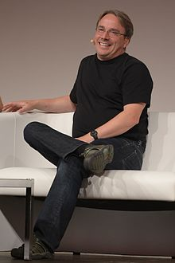
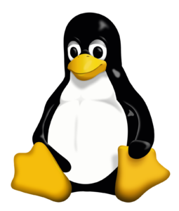

# Linux မှာသုံးတဲ့ GNU General Public License အကြောင်း အပိုင်း(၂)

GNU Project ကို ၂၇ရက်နေ့ စက်တင်ဘာလ ၁၉၈၃ခုနှစ်မှာ Richard Stallman က Massachusetts Institute of Technology (MIT) မှာအစပြုခဲ့ ပါတယ်။ အဲ့ဒီ Project ဟာ software တွေကို အခမဲ့အသုံးပြုလို့ရအောင်၊ တဘက်ကလည်း developer တွေက programmer တွေက ကုမ္ပဏီကြီး တွေအောက်မှာ အခကြေးငွေမယူပဲ ကိုယ့်ကိုကိုယ် ကိုယ်ပိုင်လွတ်လပ်စွာ ရေးလို့ရအောင်လို့ဆို တဲ့ရည်ရွယ်ချက်ပါ။ အစပိုင်းမှာတော့ အဲ့ဒီလိုမျိုးဆိုတော့ ဘယ်သူမှာ အလုပ်ဖြစ်မယ်လို့ မထင်ပါဘူး။ Project တခုအောင်မြင်ဖို့ဆို စနစ်တစ်ခုလိုတယ် ဆိုပြီး ဘယ်သူမှထင်ကြေးမပေးခဲ့ကြပါဘူး။ တနည်းအားဖြင့် Free ဆိုတဲ့ အဓိပ္ပာယ်ရဲ့အောက်မှာ လူတွေက အထင်မှားခဲ့ကြတာက မြန်မာလို့တော့ အလကားရတဲ့ software ပေါ့ဗျာ။ တန်းဖိုးမရှိဘူး ဆိုတဲ့ အဓိပ္ပာယ်မျိုးထွက် နေတော့ Richard Stallman က “Free as Freedom” ဆိုပြီး နားလည်အောင်ပြန် ပြင်ထားရပါတယ်။ ဥပမာ ဟိုအရင်က Free and Open Source Software (FOSS) ဆိုပြီး ခေါ်ဆိုခဲ့ပေမယ့် နောက်ပိုင်းမှာတော့ Free/Libre and Open Source Software (FLOSS) ဆိုပြီးပြင်ရပါတယ်။ Libre ကတော့ စပိန်စကားက ဆင်းသက်လာတဲ့ Liberty လိုမျိုး အဓိပ္ပာယ်ရတဲ့ လွတ်လပ်ခြင်းဆိုပြီး မြန်မာလို ပြန်ရမယ်ထင်ပါတယ်။ အစပိုင်းတုန်းကတော့ GNU Project ခပ်ကြောင်ကြောင်နိုင်တဲ့ အတွေးခေါ်မျိုးဖြစ်လို့ ဘယ်သူကမှာ အောင်မြင်မယ်လို့ မထင်ထားခဲ့ပါဘူး။ တချိန်ထဲမှာ ဆိုသလို Microsoft ရဲ့ Windows OS နဲ့Apple ရဲ့ Apple I/II တို့ကလည်း စျေးကွက်မှာ တော်တော်လို့နေရာရ နေပါပြီး။ အဲ့ဒီတော့ GNU Project က သာမန် လူတွေကြားထဲမှာ မထင်မရှားပါ။ MIT က နည်းပညာသမားတွေ အတွက်သာ စမ်းသပ်မှု တစ်ခုလို ဖြစ်နေခဲ့ပါတယ်။ Funding ကောင်းကောင်းမရှိတဲ့ အတွက် project ဖြစ်မြောက်ရေးမှာတော်တော်လေးကို အခက်တွေ့ခဲ့ရပါတယ်။

<figure><figcaption></figcaption></figure>

အစပိုင်းမှာတော့ GNU project က Emacs text editor လို့မျိုး open source software လေးတွေနဲ့ စခဲ့ပါတယ်။ တဖြည်းဖြည်းနဲ့ ကိုယ်ပိုင် C compiler နဲ့လိုအပ်မယ့် အပိုင်းတွေကို ကိုယ်တိုင်ရေးပါတယ်။ အဲ့ဒီနောက်မှာတော့ ကိုယ်ပိုင် kernel တစ်ခုကို ရေးဖို့ကြိုးစားရင်းကနေမှ GNU Hurd လို့ခေါ်တဲ့ microkernel တစ်ခုက ပြီးမြောက်အောင်မြင် ခဲ့ပါတယ်။ အဲ့ဒီတုန်းက GNU Hurd မှာ လိုအပ်ချက်တွေ အများကြီးရှိနေပါတယ်။ stable ဖြစ်တဲ့ kernel ရောက်တဲ့ထိ ခရီးထင်သလောက် မပေါက်ခဲ့ပါဘူး။ နောက်ပိုင်းမှာတော့ Linus Torvalds က ၁၉၉၁ခုနှစ်မှာ C language နဲ့ရေးထားတဲ့ သူ့ကိုယ်ပိုင် kernel တစ်ခုကို public ကိုချပြပါတယ်။ Linus Torvalds ရေးထားတဲ့ kernel က GNU Hurd ထက် stable ဖြစ်ပြီးခရီးပိုပြီးပေါက်ခဲ့ပါတယ်။ အဲ့ဒါကြောင့် open source software တွေ ရေးဖို့ကို Linus Torvalds ရဲ့ kernel မွေးစားလိုက်ကြပါတယ်။ Richard Stallman ကိုယ်တိုင်ကလည်း Linus Torvalds ရဲ့ kernel ကို သဘောတွေ့ခဲ့လို့GNU project က အဲ့ဒီ kernel ကိုယူသုံးခဲ့ပါတယ်။ ဒါကြောင့်လည်း နှစ်ဦး သဘောတူ GNU/Linux ဆိုပြီး အဲ့ဒီ kernel ကို အမည်သမုတ်လိုက်ကြပါတယ်။ လက်ရှိ ပြောနေကြတဲ့ Linux ဆိုတာက အဲ့ဒီ kernel ကြီးကိုခေါ်တာပါ။ အခုထိတိုင် Linux kernel ကို Linus Torvalds ကြီးက maintain လုပ်ပြီး kernel အတွက်လိုအပ်ချက်တော်တော်များများကို ဆုံးဖြတ်ချက်ပေးရပါတယ်။ ကျန်တဲ့ developer တွေ maintainer တွေက community ရဲ့ အကြံတွေကိုယူပြီး လိုအပ်သလို ပြင်ဆင်မှုတွေလုပ်ရပါတယ်။ Linux kernel အကြောင်းနဲ့ Linus Torvalds အကြောင်းကို နောက်ပိုင်း post တစ်ခုမှာ သပ်သပ်ထပ်ရေးဖို့တော့ စဉ်းစားထားပါတယ်။ အခု ဒီမှာတော့ GNU GPL အကြောင်းလေးပြန်သွားလိုက်ရအောင်ဗျာ။

<figure><figcaption></figcaption></figure>

<figure><figcaption></figcaption></figure>

တခြား စီးပွားဖြစ် software တွေကိုရောင်းစားနေတဲ့ Microsoft လို အရင်းရှင်တွေ ရန်က GNU Project ကို ကာကွယ်ဖို့ အတွက် Richard Stallman ကြီးက GNU Manifesto လို့ခေါ်တဲ့ GNU ကြေငြာစာတမ်း ကြီးထုတ်ပြန်ခဲ့ပါတယ်။ စာတမ်းမှာပါတဲ့ အဓိက လိုအပ်သော အချက်ကြီးလေးချက်ကတော့

**၁. program တစ်ခုကို မည့်သည့်ရည်ရွယ်ချက်ဖြင့်မဆို လွတ်လပ်စွာ အသုံးပြုခွင့်**\
**၂. အဲ့ဒီ program ရဲ့ အသေးစိတ် အလုပ်လုပ်ပုံကို သင်ယူလေ့လာခွင့် နှင့် လွတ်လပ်စွာ ပြန်လည်ပြင်ဆင်ခွင့်**\
**၃. program တွေကို လွတ်လပ်စွာပြန်လည် ဖြန့်ဝေခွင့်**\
**၄. လိုအပ်ပါက အဲ့ဒီ program ကို လူတိုင်းအသုံးပြုလို့ရစေရန် ပိုမိုကောင်းမွန်သော version တွေကို လွတ်လပ်စွာ ပြင်ဆင် ဖန်တီးခွင့်**

အထက်ဖော်ပြပါ အချက်တွေကိုလိုက်နာဖို့က အသုံးပြုသူတွေ အနေနဲ့ source code ကို ကူးယူခွင့် မြင်နိုင်ခွင့်ရှိဖို့ လိုအပ်ပါတယ်။ ပုံမှန်အားဖြင့် source code ဆိုတာမျိုးက Microsoft လို platform မှာ မြင်နိုင်ခွင့် ပြင်နိုင်ခွင့် မရှိပါဘူး။ Microsoft ကတော့ source code တွေကို သူတို့ကိုယ်တိုင်ပဲ လိုသလို ပြင်ပြီး Windows Update တွေ hotfix တွေ service pack တွေမှာ ထည့်ပေးပါတယ်။ အဲ့ဒီတော့ အသုံးပြုသူ တွေက source code ကို compile လုပ်ပြီးတော့မှ ထွက်လာတဲ့ executable file တွေကိုပဲ ရပါတယ်။ အသုံးပြုသူ တွေက run ပြီး အသုံးပြုလို့ပဲရပါတယ်။ Reversed Engineering ကိုသိလို့ နားလည်လို့ executable file ကနေ source code ပြန်ပြောင်းပြီး ကြည့်မယ်ဆိုရင်တောင် Microsoft ရဲ့ End User Agreement ကို ချိုးဖောက် ရာကြတဲ့ အတွက် Microsoft က အဲ့ဒီ အသုံးပြုသူကို တရားစွဲဆိုခွင့် ရှိပါတယ်။ အဲ့ဒါကြောင့် closed source code လို့ခေါ်ပါတယ်။ Microsoft က အသုံးပြုသူ ဆီကနေ ငွေယူပြီး အကုန်လုံးကို ချုပ်ကိုင်ထားတဲ့ သဘောပါ။ Software Freedom Activist တွေက အဲ့ဒါကို လုံးဝ သဘောမတွေ့ပါဘူး။ Microsoft ကလည်း Open Source community ကို အပုတ်ချပြောဆိုတာ တွေလည်းရှိခဲ့ပါတယ်။

GNU ကြေငြာစာတမ်း အတိုင်းလိုက်နာဖို့ ဆိုရင် ဥပဒေနည်းလမ်းအရ တရားဝင် license တစ်မျိုးလိုမယ် ဆိုတာကိုလည်း Richard Stallman သိနေခဲ့ပါတယ်။ အဲ့ဒီ license အောက်မှာ ထုတ်တဲ့ software တွေလည်း free အသုံးပြုခွင့် ရရမယ့် အပြင် တခြားလူတွေက source code ကို မြင်နိုင်ပြင်နိုင်အောင်လို့ Open Source ဖြစ်ရမယ့်လို့လည်းဆိုပါတယ်။ နောက်တစ်ပိုင်းမှာတော့ GNU GPL version 1, 2, 2.1, 3 တို့အကြောင်းအသေးစိတ်နဲ့ version အသစ်တွေဖြစ်လာပုံ အကြောင်း ဘာကြောင့် version အသစ်တွေကို Richard Stallman ပြင်ဆင်ခဲ့ရတယ်ဆိုတဲ့ အကြောင်းကို ဆက်ပြီးရေးသွားပါ့မယ်။
