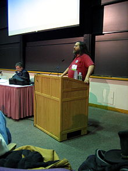

# Linux မှာသုံးတဲ့ GNU General Public License အကြောင်း အပိုင်း(၃)

GNU project ကိုကာကွယ်ဖို့ GPL သို့မဟုတ် GNU GPL ကို Richard Stallman က ၁၉၈၉ခုနှစ်မှ GNU project ရဲ့ တစိတ်တပိုင်း အနေနဲ့ စတင်မိတ်ဆက်ပေး ခဲ့ပါတယ်။ အချိန်တော်တော်လေး ကြာမှ GNU GPL ကို စတင်ရေးသားခဲ့တာ ကြည့်ချင်အားဖြင့် GNU project ဟာ အတိုင်းအတာ တစ်ခုထိကို လူသိများပြီးတော့ လူတွေကစတင် အသုံးပြုနေပြီဆိုတာကိုပြနေပါတယ်။ Open Source ဖြစ်တဲ့အတွက် တခြား ကုမ္ပဏီကြီးတွေရဲ့ အသုံးချမူကို မခံအောင် ကိုယ်ပိုင် license တစ်မျိုး စတင်ဖို့လိုအပ်လာပါတယ်။ ဒီလို GPL လို license ရှိလို့လည်း Open Source community ကလည်း သက်တမ်းရှည် ခဲ့တာပါ။ Richard Stallman ကြီးရဲ့ အမြော်အမြင်ကြီးမူ ကိုလည်း ဒီတစ်ခုတည်းနဲ့တင် အထင်ကြီးလေးစား ရမှာပါ။ လိုရင်းဖြစ်တဲ့ GNU GPL v1 အကြောင်းကိုစလိုက်ရအောင်ဗျာ။

## GNU GPL v1

ပထမဦးဆုံး GNU GPL version 1 ကို Richard Stallman က ၂၅ရက်နေ့ဖေဖဝါရီလ ၁၉၈၉ခုနှစ်မှာ စတင်ပြီး မိတ်ဆက်လိုက်ပါတယ်။ အဓိက ကတော့ Free Software နဲ့ Open Source တွေရဲ့ ဖြစ်လာနိုင်တဲ့ ပြဿနာ နှစ်ရပ်ကို ကြိုတင်ကာကွယ်ဖို့ ဖြစ်ပါတယ်။ ပထမတစ်ချက် ကတော့ Open Source သမားတွေရေးထားတဲ့ software တွေကိုလိုအပ်သလို ပြင်ဆင်ပြီးတော့ source code ကို ပြန်ပြီးတော့ နောက်လူတွေကို ပြန်မပေးတော့ပဲ executable file ကိုပဲ public ကို ပြန်ရောင်းမှာ စိုးရိမ်တဲ့အတွက် Richard Stallman က GNU GPL v1 license ရဲ့ အပိုင်းကြီး ၃ အပိုင်းငယ် က နဲ့ခ (Section 3a and 3b) မှာ GPL v1 ကို အသုံးပြုလိုတယ်ဆိုရင်တော့ executable file ကို သာမက source code ကိုပါ တခြားလူတွေ မြင်နိုင်ပြင်နိုင်အောင် ချပြရမယ် လို့ဆိုပါတယ်။

နောက်တချက် ဒုတိယ အချက်ကတော့ GPL v1 ရဲ့ အောက်မှာ register လုပ်ထားတဲ့ software နဲ့source code တွေကို တခြား code တွေနဲ့ရောရင် ဖြစ်လာမယ့် အရှုပ်အရှင်းတွေကို ရှင်းလင်းအောင် လုပ်ထားတဲ့ အပိုင်းဖြစ်ပါတယ်။ အဲ့ဒါ ကတော့ ဘာလဲဆိုတော့ GNU GPL v1 ရဲ့ အပိုင်းကြီး ၂ အပိုင်းငယ် ခ နဲ့အပိုင်းကြီး ၄ (Section 2b and 4) တို့မှာ အခုလိုပြောပါတယ်။ GNU GPL v1 အောက်မှာ register လုပ်ထားတဲ့ software နဲ့source code ကို တခြား code တစ်ခုနဲ့ပေါင်းပြီးတော့ software တစ်ခုဖြစ်အောင် ရေးတဲ့နေရာမှာ အဲ့ဒီလာပေါင်းမယ့် code ကလည်း GPL လို့ခပ်ဆင်ဆင် license ဖြစ်တဲ့ BSD တို့ MIT တို့လို license အောက်မှာ register လုပ်ထားတဲ့ သို့မဟုတ် GPL အောက်မှာ register လုပ်ထားတဲ့ source code နဲ့သာပေါင်းပိုင်ခွင့်ရှိပါတယ်။ အဲ့ဒါမှ မဟုတ်ပဲ စီးပွားဖြစ်ရောင်းစား နေတဲ့ source code (ဥပမာ Microsoft လို ကုမ္ပဏီက ယူသုံးပြီးတော့) အခကြေးငွေယူပြီးတော့ပြန်ရောင်းလို့မရပါဘူး။ အဲ့လိုလုပ်တယ်ဆိုရင်တော့ GPL v1 ကိုချိုးဖောက်ရာကြတဲ့အတွက် တရားစွဲခွင့်ရှိအောင် လုပ်ထားတာပါ။

အဲ့ဒီတော့ ရှင်းပါတယ် GNU Manifesto ထဲမှာ ပြောတဲ့ အဓိက အချက်လေးချက်ကိုပဲ အထောက်အပံ့ ပေးထားတဲ့ သဘောမျိုးပါ။ GNU Manifesto ထဲက အချက်တွေကို အရှေ့ရှင်းပြီးတဲ့အတွက် ပြန်မရှင်းတော့ပါဘူး။ အကျဉ်းချုပ်လိုက်ရင်တော့ GPL v1 မှာဆိုထားတာက GPL v1 ကိုအသုံးပြုချင်ရင် open source ဖြစ်ရမယ်။ လိုသလိုပြင်ဆင် သည်ဖြစ်စေ တခြား source code နဲ့ပေါင်းပြီးတော့ software တစ်ခုရေး လိုသည်ဖြစ်စေ လာပေါင်းမယ် source code က GPL v1 နဲ့ သို့မဟုတ် BSDလို MITလို license တမျိုးမျိုးရဲ့ အောက်မှာ register လုပ်ထားတာဖြစ်ရမယ်။ အဲ့လိုမှ ပြင်ပြီးနောက် GPL v1 ကိုပဲ ဆက်ပြီးလိုက်နာနိုင်မှာဖြစ်တဲ့အတွက်ကြောင့်လို့ဆိုပါတယ်။ GPL v1 ထဲမှာဘာတွေ ပါလည်း အင်္ဂလိပ်လို အသေးစိတ်သိချင်ရင်တော့ ဒီ [link](https://www.gnu.org/licenses/old-licenses/gpl-1.0-standalone.html) ကိုသာ တချက်လောက်ကြည့် လိုက်ပါတယ်။ အချိန်နည်းနည်းပေးပြီး ဖတ်ကြည့်သင့်ပါတယ်။

<figure><figcaption></figcaption></figure>

## GNU GPL v2

ဇွန်လ ၁၉၉၁ ခုနှစ်မှာတော့ Richard Stallman ကြီးက GNU GPL v2 ကို ထပ်မံထုတ်ရပါတယ်။ GPL v1 ကနေပြီး ကွာခြားသွား တာသိပ်မရှိပေမယ့် အပိုင်းကြီး ၇ (Section 7) မှာပါတဲ့ “Liberty or Death” ဆိုပြီး Richard Stallman ကတင်စားပြောဆိုတဲ့ အချက်ကိုထပ်ထည့် လိုက်တာပါပဲ။ မြန်မာလိုဆို ရရင်တော့ အသားထဲကလောက် မထွက်အောင်လို့ အဖြူဆိုလည်း အဖြူ ၊ အမဲဆိုလည်း အမဲဆိုတာမျိုး ဖြစ်သွားအောင် အခမဲ့ open source ကဆင်းသက်လာတဲ့ software တွေက အခမဲ့ open source ပဲဖြစ်ရမယ်ပေါ့ဗျာ။ အဲ့ဒီတုန်း Richard Stallman က Microsoft တို့လို ကုမ္ပဏီကြီးတွေက စလိုက်တဲ့ patent ဆိုတဲ့ copyright law တွေကိုလည်း လွတ်လွတ်ကင်းကင်းဖြစ်အောင် ထည့်သွင်း စဉ်းစားရတယ်တဲ့။ ဆိုပါတော့ဗျာ လူတစ်ယောက်က free software တစ်ခုကို သူ့နာမည်နဲ့ patent လုပ်လိုက်ရင် အဲ့ဒီလူက နောက်လူတွေ ပြန်ပြီး ဖြန့်ဝေလို့ မရအောင်ပိတ်ပင် လို့ရတယ်ဗျ။ ကိုယ်ပိုင်တဲ့ဟာ မဟုတ်ပဲနဲ့ patent လုပ်လိုက်ရုံနဲ့ရတဲ့ ဥပဒေရဲ့ဘက် လိုက်မှုလိုဆိုရမှာပါ။ ဟိုအရင်တုန်းက Microsoft က IBM ရဲ့ program တစ်ခုကို ယူပြီးတော့ သူ့နာမည်အောက်မှာ patent လုပ်ပြီး Microsoft product တစ်ခုအနေနဲ့ ရောင်းဘူးတယ်ဗျ။ အဲ့ဒါကတော့ အကုန်လုံးသိပြီးသား ဖြစ်တဲ့ Microsoft ရဲ့ CMD ပါ။ အဲ့လိုမဖြစ်အောင်လို့ Richard Stallman က GPL v2 ထုတ်ရပါတယ်။

GPL v2 ရဲ့လိုရင်းကတော့ GPL v2 ကိုမလိုက်နာရင် အဲ့ဒီ license ကို အသုံးပြုခွင့် မရှိသလို၊ အသုံးပြုသူ ကလည်း ပြန်ပြီးတော့ patent လုပ်လို့မရပါဘူး။ အဲ့ဒီ တစ်ချက်ထည့် ဖို့ကို GPL v2 ကို ထုတ်ပြန်ခဲ့ပါတယ်။ ဒီလောက်ဆိုရင် အဲ့ဒီတုန်းက ကုမ္ပဏီကြီးတွေ ဘယ်လောက်တောင် အနိုင်ကျင့် ဘိုကျနေတာ လည်းဆိုတာကို ခန့်မှန်းလို့ရပါတယ်။ အဲ့ဒါကိုကြည့်ခြင်းအား ဖြင့် Richard Stallman ကြီးက ဘယ်လောက်တောင် လွတ်လပ်ခြင်းကို မြတ်နိုးပြီး အကာကွယ်ပေးခဲ့တယ်ဆိုတာကို မြင်နိုင်ပါတယ်။ GPL v2 ကို အင်္ဂလိပ်လို အသေးစိတ်ဖတ်ချင်ရင်တော့ ဒီ [link](https://www.gnu.org/licenses/old-licenses/gpl-2.0-standalone.html) ကနေတဆင့်ဖတ်လို့ရပါတယ်။

နောက်တပိုင်း မှာတော့ GPL v2.1 နဲ့ GPL v3 အကြောင်းကို ဆက်ချင်ပါတယ်။ အဲ့ဒီ နှစ်ခုကနည်းနည်း ရှင်းရမှာများလို့ပါ။ Open Source အတွက် အချိုးအကွေ့တစ်ခုဖြစ်သလို၊ open source သမားတွေကိုယ်တိုင် အမြင်မတူတာတွေ ထိပ်တိုက်တွေ့တာမျိုး တွေရှိလာပါတယ်။ စိတ်ဝင်စားဖို့လည်းကောင်း ပါတယ်။
