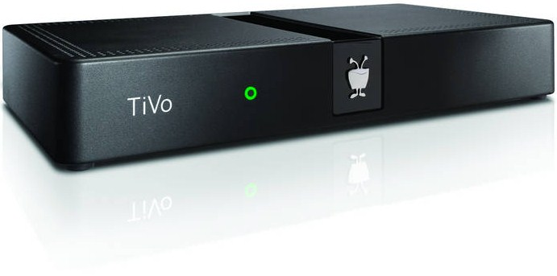

# Linux မှာသုံးတဲ့ GNU General Public License အကြောင်း အပိုင်း(၄)

GNU GPL v2 ကို ဇွန်လ ၁၉၉၁ခုနှစ် မှာစတင်မိတ်ဆက် တုန်းက Library General Public License ကိုပါ တခါတည်း တွဲပြီးတော့ပါ လာပါတယ်။ LGPL လို့လည်း ခေါ်ပါတယ်။ LGPL ကတော့ C programming မှရှိတဲ့ Library တွေအတွက် အဓိကရည်ရွယ် ခဲ့တာပါ။ Library ထဲက class တွေက မျှဝေသုံးစွဲတဲ့ အခါမှာ ပြဿနာနည်း အောင်လုပ်ထားတဲ့ license တစ်မျိုးဖြစ်ပါတယ်။ နောက်ပိုင်းမှာတော့ LGPL ကို Lesser General Public License လို့နာမည်ပြောင်းလဲခေါ်ဆိုခဲ့ပါတယ်။

## GNU LGPL v2.1

ဖေဖဝါရီလ ၁၉၉၉ ခုနှစ်မှာတော့ GNU LGPL v2.1 ကို Lesser General Public License အနေနဲ့ GNU GPL v2 ကနေ ခွဲထွက်လာတဲ့ version တစ်ခုလည်း ဖြစ်ပါတယ်။ v2.1 မှာတော့ Lesser ဆိုတဲ့ အဓိပ္ပာယ်အတိုင်း license ရဲ့ တင်းကျပ်မှု ကိုနည်းနည်းလျှော့ပေး လိုက်တဲ့သဘောပါ။ အထက်မှာရှင်းပြခဲ့သလို LGPL ရဲ့ အစမှာ C Library အတွက် ၁၉၉၁မှာ သီးသန့် အနေနဲ့ထုတ် ခဲ့တာပါ။ ၁၉၉၉ ခုနှစ်ရောက်မှ လိုအပ်ချက်အရ v2.1 အနေနဲ့ခွဲထွက် version ထွက်လာရတာပါ။ အားလုံးကို အခမဲ့နဲ့သာ ဖြစ်သင့်တယ်လို့ဆိုတာတဲ့ Copyleft လို အစွန်းလည်း မရောက်ရအောင်၊ ပြီးတော့ GPL လောက်မတင်းကျပ်တဲ့ BSD တို့ MIT တို့လို license မျိုးဖြစ်အောင် ဒီ version ကဖြေရှင်း ပေးတဲ့ သဘောပါ။ LGPL v2.1 ကို C Library လို software libraries တွေမှာသုံးတာ များပါတယ်။ ဘယ်လိုနေရာမှာ ဖြေလျှော့ပေးထား လဲလို့ဆိုရင် ဒီ license အမျိုးအစားက proprietary လို့ခေါ်တဲ့ ကုမ္ပဏီတစ်ခုနာမည် သို့မဟုတ် ပုဂ္ဂိုလ်တစ်ဦး နာမည်အောက်မှာ register လုပ်ထားတဲ့ တခြား software ရဲ့ source code တွေနဲ့ပေါင်းပြီး သုံးခွင့်ပြုပါတယ်။ Lesser ဆိုတဲ့ အတိုင်း software တစ်ခုလုံးကို Free Software တို့လို လွတ်လပ်ခွင့် လုံးလုံးလျားလျား မရနိုင်တော့တဲ့ သဘောမျိုးပါ။ ပြောချင်တာကတော့ software တစ်ခုရဲ့ LGPL v2.1 အောက်မှာ ထုတ်ထားတဲ့ အပိုင်းကိုသာ ပြင်ဆင်ခွင့်ရှိပြီးတော့ proprietary အပိုင်းကတော့ ၎င်းကို ပိုင်တဲ့ ပုဂ္ဂိုလ်သို့မဟုတ် ကုမ္ပဏီကသာဆုံးဖြတ်ခွင့်ရမှာဖြစ်ပါတယ်။ နည်းနည်းတော့လည်း မျက်စိလည် ချင်စရာကြီးပါ။ GNU GPL version တိုင်းက ခပ်တိုတိုနဲ့ လိုရင်းကိုသာ ထည့်ထားတဲ့ အတွက် ဟာကွက်ဆိုတာမျိုးကလည်းရှိနိုင်သလို အဓိပ္ပာယ် နှစ်ခုထွက်နိုင်တဲ့ ဟာမျိုးတွေလည်းပါလာနိုင်တယ် ဆိုတာကတော့ မလွှဲမသွေပါပဲ။ GNU LGPL v2.1 ကို အင်္ဂလိပ်လို အသေးစိတ်ဖတ် လိုတယ်ဆိုရင်တော့ ဒီ [link](https://www.gnu.org/licenses/old-licenses/lgpl-2.1-standalone.html) ကတဆင့်သွားပြီးဖတ်ကြည့်လို့ ရပါတယ်။ GNU GPL v2 နဲ့GNU LGPL v2.1 တွေကိုနောက်ပိုင်း အသုံးပြုသူအနေနဲ့ နောက်ပိုင်း version တွေကို ပြောင်းချင်ရင်လည်း ပြောင်းလို့ရအောင် လုပ်ပေးထားတဲ့ အချက်တွေကို ထည့်သွင်းပေးထားပါတယ်။

<figure><figcaption></figcaption></figure>

## GNU GPL v3

GNU GPL v3 ကိုတော့ ၂၉ရက်နေ့ ဇွန်လ ၂၀၀၇ ခုနှစ်မှ အထပ်ထပ် ပြန်လည်ပြင်ဆင် ပြီးတော့ အပြီးသတ်နိုင် ခဲ့ပါတယ်။ v3 ကို Richard Stallman ကဘာလို့ထပ်မံ ပြင်ဆင်ပြောင်းထုတ် ရလဲဆိုတော့ TiVo ဆိုတဲ့ cable TV ကုမ္ပဏီတစ်ခုက Linux Kernel နဲ့GNU software တွေကို သူ့ product မှာယူသုံးပါတယ်။ အဲ့ဒီတုန်းကတော့ GPL v2 အောက်မှာ ထုတ်လိုက်တာဖြစ်တဲ့ အတွက် TiVo ကလို သလိုပြင်ဆင် ပြီးတော့ ပြင်ဆင်ထားပြီး source code ကို license ရဲ့လိုအပ်ချက် အရ public ကိုပြန်ထုတ်ပေးရပါတယ်။ ပြန်ထုတ်ပေးတဲ့အခါမှာ TiVo က kernel နဲ့ software ကိုသာထုတ်ပေးပြီး TiVo ရဲ့ hardware driver တွေကို မထုတ်ပေးခဲ့ပါဘူး။ digital signature ဆိုတဲ့ hardware လုံခြုံရေးစနစ် တစ်ခုကိုလည်းသုံးပြီး driver တွေရဲ့ source code တွေကိုလည်း ပိတ်ထားလိုက်ပါတယ်။ အဲ့ဒီတော့ နောက်လူတွေက TiVo ရဲ့ software တွေရဲ့ source code ကိုမြင်နိုင် ပြင်နိုင်ပြီး ပြင်ပြီးသား software တွေကို TiVo ရဲ့ hardware တွေမှာ ပြန်သုံးလို့မရပါဘူး။ တခြား third party hardware တွေမှာသာသုံး လို့ပဲရပါတယ်။ TiVo က hardware ကို ထုတ်တဲ့အတွက် သူ့ hardware ကို Digital Right Management အလိုအရ ကာကွယ်လို့ ရတယ်လို့ဆိုပါတယ်။ အဲ့ဒါကို Richard Stallman ကလက်မခံပါဘူး။ ကန့်ကွက်ဆန့်ကျင် ပြီးတော့ TiVo နဲ့ထိပ်တိုက်တွေ့ ခဲ့ပါတယ်။ Richard Stallman ကတော့ ထုံးစံအတိုင်း အဲ့ဒီဆန့်ကျင်ပွဲကို Tivoization လို့နာမည်ပေးပြီး GPL v3 ထုတ်ဖို့ကို အားချင်းကြံဆောင် တော့တာပါပဲ။ Linux kernel ကိုရေးတဲ့ Linus Torvalds ကတော့ TiVo ရဲ့လုပ်ရပ်ဟာ မမှားဘူး။ TiVo ကထုတ်တဲ့ TiVo ရဲ့ hardware ကို TiVo ကကာကွယ်ပိုင်ခွင့် ရှိတယ်လို့ ဆိုပါတယ်။ kernel နဲ့ software ကိုပဲ GPL v2 အောက်မှာထားသင့် တယ်လို့လည်းသူကဆိုပါတယ်။ တခြား Linux kernel ရဲ့ developer တွေနဲ့ open source သမားတွေကလည်း Tivoization ကိုထောက်ခံတဲ့သူနဲ့ မထောက်ခံတဲ့သူဆိုပြီး အဖွဲ့တွေကွဲကုန်ပါလေရော။ အဲ့ဒါကို Linus Torvalds ကထောက်ပြပါတယ်။ Tivoization က open source နဲ့Linux ကမ္ဘာကို နှစ်ဖွဲ့သာကွဲစေပြီး အကျိုးအမြတ်မရှိ ကြောင်းကိုလည်း ထုတ်ဖော်ပြောကြားပါတယ်။ အဲ့ဒါကြောင့်လည်း Linus Torvalds ကသူ့ရဲ့ Linux kernel ကို GPL v2 အောက်မှာပဲ ဆက်ပြီးတော့ register လုပ်ထားပါတယ်။ GPL v3 ကိုလိုက်မပြောင်းပါဘူး။ နောက်ဆုံးတော့ TiVo က Linux Kernel နဲ့GNU software တွေကို GPL ရဲ့လိုအပ်ချက်တွေ ကို မလိုက်နာနိုင်တာကြောင့် ဆက်ပြီး မသုံးတော့ပါဘူး။ သူတို့စီးပွားရေးလုပ်ငန်းမှာ ဘယ်လိုမှ အမြတ်အစွန်းရ နိုင်တော့မှာ မဟုတ်ဘူးလို့လည်း TiVo ကဆိုပါတယ်။ အဲ့ဒီတော့ GPL v3 က Tivoization လိုမျိုး ထပ်မဖြစ်အောင်လို့ ထပ်ဖြည့်ထပ်ပြင်ပြီးတော့ version ကို upgrade လုပ်လိုက်ရတယ်လို့ အကျဉ်းချုပ်ရတော့မှာပါ။ GNU GPL v3 ကို အင်္ဂလိပ်လို အသေးစိတ်ဖတ်လို လေ့လာလိုတယ်ဆိုတော့ ဒီ [link](https://www.gnu.org/licenses/gpl-3.0-standalone.html) ကနေတဆင့် ဖတ်လို့ရပါတယ်။ GNU GPL v3 က open source software တော်တော်များများ အတွက် လိုက်လျှောညီထွေမူရှိစေခဲ့ပါတယ်။ ဥပမာပြောရရင်တော့ Apache License, version 2 တို့GNU Affero GPL တို့license မျိုးအတွက် အတော်လေးအဆင်ပြေခဲ့ပါတယ်။ GPL v2 တုန်းကတော့ အဲ့ဒီ license တွေနဲ့ အတူသုံးဖို့ရာ လိုအပ်တွေရှိနေခဲ့ပါတယ်။

<figure><figcaption></figcaption></figure>

GNU General Public License အကြောင်း ကတော့ ဒီလောက်ဆိုရင်တော့ သိသင့်သလောက် သိပြီးလေ့လာလိုက် ကြရမယ်လို့ မျှော်လင့်ရပါတယ်။ အကြောင်းအရာကိုက နည်းနည်းလေးတဲ့အတွက် ဖတ်ရင်းနဲ့ နည်းနည်းတော့ပျင်းရတယ် ထင်ပေမယ့်လည်း ဖတ်ပြီးရင် Linux မှာပြောပြောနေတဲ့ GNU GPL ဆိုတာဘာလဲ ဘယ်လိုသုံးရသလဲ ဆိုတာကိုတော့ လေ့လာခွင့်ရတဲ့အတွက် အရှုံးရှိမယ်တော့ မထင်ပါဘူး။ version တစ်ခုစီမှာ ပေးထားတဲ့ link လေးတွေကနေ တဆင့် လည်း အင်္ဂလိပ်လို လိုက်ဖတ်ကြည့်သင့်ပါတယ်။ Microsoft ရဲ့ End User Agreement တွေလောက်လည်း မရှည်သလို အရမ်းလည်း မရှုပ်ဘူးလို့ စာရေးသူထင်ပါတယ်။ လိုရင်းတိုရှင်းကိုသာ ထည့်သွင်း ထားတဲ့အတွက် အချိန်နည်းနည်းပေးဖို့ပဲလိုပါတယ်။ နောက်ပိုင်း ကိုယ်ပိုင် software လေးတွေကို GNU GPL အောက်မှာ ထုတ်ချင်တယ် ဆိုရင်လည်း သုံးလို့ရတာပေါ့။ ဒီ GNU GPL post ကိုတော့ဒီမှာပဲ ရပ်လိုက်ပါတော့မယ်။
