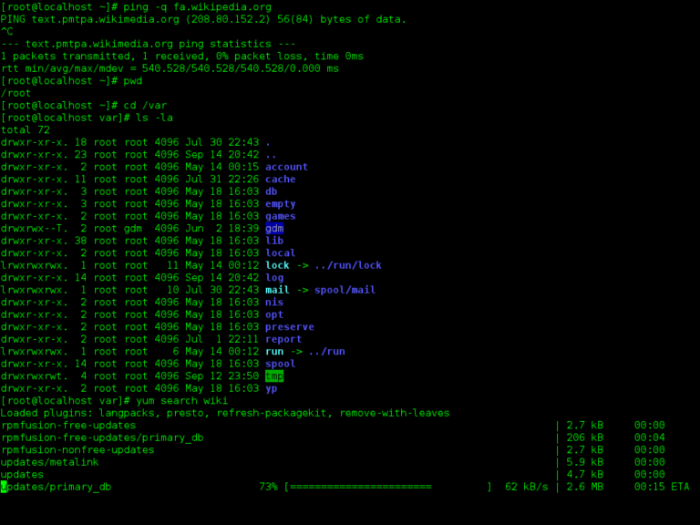
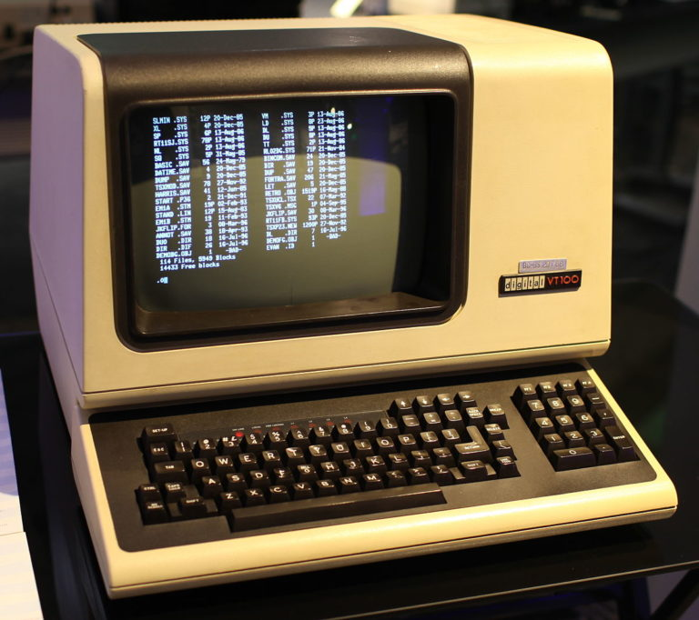
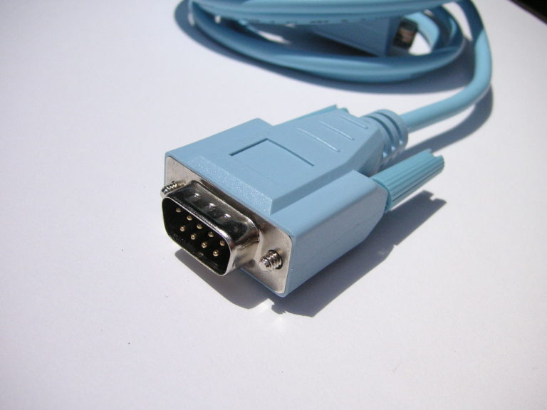
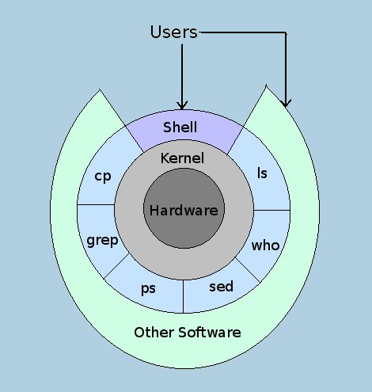

# GNU/Linux မှာသုံးတဲ့ CLI ကိုဘယ်လိုခေါ်ကြသလဲ

GNU/Linux နဲ့ Unix ကိုသုံးတော့မယ်ဆိုရင်တော့ တခြားလူသုံးများတဲ့ OS တွေနဲ့ မတူတာကတော့ CLI က command တွေကို တွင်တွင်ကျယ်ကျယ် အသုံးပြုရတယ်ဆိုတာကတော့ သိပြီးကြမှာဖြစ်ပါတယ်။ GNU/Linux distro တွေတော်တော်များကတော့ အခုနောက်ပိုင်းမှာ အသုံးပြုသူ end user တွေ အဆင်ပြေအောင်တော့ GUI ဘက်မှာတော်တော်လေးကို အလုပ်ဖြစ်အောင် ထည့်ပေးလာကြသော်လည်း CLI command တွေတော့ မကြာခဏ အသုံးပြုနေရဆဲပါ။ စာရေးသူ အမြင်အားဖြင့် CLI command တွေနဲ့ ကလည်း Linux မှာ အလုပ်ပိုပြီးတော့ တွင်ကျယ်တယ်လို့ထင်ပါတယ်။ တနည်းအားဖြင့် command လေး ၃ ကြောင်း ၄ ကြောင်းလောက်နဲ့ ပြီးမည့်ဟာကို GUI မှာဆိုရင်တော့ အဆင့်ပေါင်းများစွာ လုပ်ရပါတယ်။ ဘယ်လိုပဲပြောပြော CLI ကိုတော့ Linux သုံးနေသရွေ့တော့ သုံးနေရအုံးမှာပါ။ ပြီးတော့ command တွေနဲ့ ရင်းနှီး ကျွမ်းဝင်သွားတဲ့ အခါ ကိုယ်သုံးတဲ့ distro က backend မှာဘယ်လို အလုပ်လုပ်သလဲ ဆိုတာကိုလည်း ရိပ်စားမိလာမှာဖြစ်ပါတယ်။ အဲ့ဒီတော့ CLI command တွေကိုတာ ခက်တယ်ဆိုပေမယ့်လည်း အကျွမ်းဝင်အောင်တော့ Linux သုံးမယ်ဆိုရင် များများအသုံးပြုသင့်ပါတယ်။ အခုဒီတစ်ခေါက်ကတော့ Unix နဲ့ GNU/Linux မှာ သုံးတဲ့ CLI ကို ဘယ်လိုခေါ်ကြသလဲဆိုတာကို ရှင်းပြချင်တာပါ။ အမျိုးမျိုးခေါ်ကြပါတယ်။ တချို့က Terminal လို့ခေါ်တယ်… တချို့က Console လို့လည်းခေါ်တယ်… တချို့ကြတော့လည်း Shell ဆိုပြီးတော့ ခေါ်ကြပြန်တယ်။ အကုန်လုံးကတော့ အသုံးအနှံးအရကတော့ အတူတူပါပဲ။ မူရင်းအဓိပ္ပါယ်ကတော့ အစပိုင်းမှာလုံးဝကွာခြားပါတယ်။

<figure><figcaption></figcaption></figure>

ဆိုပါတော့… Terminal ဆိုတဲ့ မူရင်း အဓိပ္ပါယ်ကတော့ ဟိုအရင်တုန်းက Mainframe ကွန်ပြူတာမှာ သုံးတဲ့ အသုံးအနှံးတစ်ခုဖြစ်ပါတယ်။ Mainframe ခေတ်တုန်းက အဲ့ဒီ ကွန်ပြူတာကြီးကို အသုံးပြုချင်တယ်ဆိုရင် Terminal တစ်ခုကိုသွားပြီးတော့ ချိတ်ဆက်အသုံးပြုကြပါတယ်။ Terminal ဆိုတာလည်း နောက်ပိုင်းမှာ dumb terminal လို့လည်းခေါ်ကြပါတယ်။ အခြေခံအားဖြင့် Terminal ဆိုတာကလည်း display တစ်ခုပါမယ်… keyboard ပါမယ်ပေါ့။ Processing ကတော့ mainframe ကလုပ်တယ်ဆိုတော့ အဲ့ဒီ terminal ကို dumb terminal လို့ခေါ်တာပါ။ ပုံမှန်အားဖြင့် အဲ့ဒီ terminal ကနေ screen အမဲကြီးပေါ်မှာ command တွေရိုက်ပြီးတော့ mainframe ကြီးကို အသုံးပြုခဲ့ရပါတယ်။ အခုနောက်ပိုင်းတော့လည်း mainframe တွေမရှိတော့ပေမယ့် အဲ့ဒီ terminal ဆိုတဲ့ အခေါ်ကို Unix နဲ့ GNU/Linux မှာ CLI screen မဲမဲကြီးကို terminal လို့ အစွဲပြုပြီးတော့ ခေါ်ဆိုကြပါတယ်။ မူရင်း terminal ဆိုတဲ့ အသုံးအနုံး အစား endpoint ဆိုတာကို ပြောင်းပြီးတော့ သုံးကြပါတယ်။

<figure><figcaption></figcaption></figure>

ဟုတ်ပြီ… ဒါဆိုရင် console ဆိုတာကရောဘယ်လိုဖြစ်တာလဲ။ ဘာလို့ console လို့ ခေါ်ကြတာလဲ။ မူရင်း အဓိပ္ပာယ်ကတော့ console ဆိုတာ computing device တွေပေါ်က console serial port သို့မဟုတ် အဲ့ဒီ console serial port မှာသုံးတဲ့ console cable (Cisco မှာတော့ rollover cable လို့လည်းခေါ်ပါတယ်။) ကိုရည်ညွန်းခြင်းသာဖြစ်ပါတယ်။ အရှေ့မှာပြောခဲ့တဲ့ mainframe ခေတ်ကိုသာပြန်သွားရမှာဖြစ်ပါတယ်။ mainframe တွေကို ချိတ်ဆက်ဖို့ကို terminal ကနေ console cable ကိုအသုံးပြုရပါတယ်။ Speed အားဖြင့် ဒီဘက်ခေတ် Ethernet cable တွေလောက်တော့ မမြန်ပါဘူး။ အဲ့ဒီတုန်းကတော့ မရှိသုံး console serial port တွေကို အသုံးပြုကြပါတယ်။ အခုအချိန်ထိကို console serial port နဲ့ console cable တွေကို network device တော်တော်များများမှာ initial configuration အတွက်နဲ့ out-of-band management အတွက် အသုံးပြုနေဆဲပါ။ Unix နဲ့ GNU/Linux မှာတော့ CLI ကို console လို့ အဲ့ဒီ console connection ကိုအစွဲပြုပြီးတော့ ခေါ်ကြပါတယ်။ နောက်ပိုင်းမှာ PS4 နဲ့ Xbox device တွေကိုလည်း console လို့ခေါ်ကြပါတယ်။

<figure><figcaption></figcaption></figure>

နောက်ဆုံးတစ်ခုက… Shell ဆိုတာပဲဖြစ်ပါတယ်။ မူရင်းအဓိပ္ပာယ်ကတော့ shell ဆိုတာက OS တစ်ခုမှာ kernel ကို အပြင်ကနေ အုပ်ထားတဲ့ interface layer တစ်ခုဖြစ်ပါတယ်။ Computing မှာ အများသိထားတဲ့ concept ကတော့ Hardware ကို အပြင်ကနေ Kernel အုပ်ထားပါတယ်။ အဲ့ဒီ Kernel ကိုတော့ Shell ဆိုတဲ့ဟာနဲ့ အပြင်ကနေထပ်ပြီးအုပ်ထားပါတယ်။ Shell ကိုအပြင်ကနေအုပ်ထားတာကတော့ Application ပဲဖြစ်ပါတယ်။ ဆိုလိုချင်တာကတော့ Computing မှာ system တစ်ခုကို hardware တွေနဲ့ တည်ဆောက်ထားပါတယ်။ motherboard တို့ CPU တို့ RAM တို့နဲ့ တခြား chip set ပေါင်းများစွာကို အကျဉ်းချုပ်ပြီးတော့ hardware လို့ခေါ်ပါတယ်။ နောက် hardware က ဒီအတိုင်းဆိုရင် device မဖြစ်ပါဘူး… သူ့ကိုထိန်းချုပ်မယ့် programming code လိုပါတယ်။ အဲ့ဒီ code ကို kernel လို့ခေါ်ပါတယ်။ တခါတခါ kernel code ဆိုပြီးတော့လည်း ခေါ်ကြပါတယ်။ ဥပမာ Unix နဲ့ GNU/Linux မှာ kernel ကို C programming code တွေနဲ့ ရေးထားပါတယ်။ အဲ့ဒီ kernel ကနေမှတဆင့် hardware resource တွေကို ဘယ်လို ထိန်းချုပ်မလဲဆိုတာကို ပြောပါတယ်။ kernel မရှိရင် hardware က သူ့ဟာသူ သီးသန့်ရပ်တည်ပါတယ်။ ဟုတ်ပြီ… Shell ဆိုတာကတော့ kernel နဲ့တွဲပြီးတော့ အလုပ်လုပ်ဖို့အတွက် interface တစ်ခုသာဖြစ်ပါတယ်။ Shell မှာမှ Graphical User Interface (GUI) နဲ့ Command Line Interface (CLI) ဆိုပြီးတော့ နှစ်မျိုးထပ်ရှိပါတယ်။ အဲ့ဒီ interface ပေါ်မှာမှ တခြား application တွေကို end user တွေ software developer တွေက run ကြရပါတယ်။ အဲ့ဒီတော့ ရှင်းပြပြီးတဲ့အတိုင်း shell ဆိုတာ UNIX နဲ့ GNU/Linux မှာ CLI ကို ခေါ်ဝေါ်သုံးစွဲတယ်ဆိုတာကို ရိပ်စားမိမယ်ထင်ပါတယ်။ CLI မှာမှ customised လုပ်ထားတဲ့ CLI shell အမျိုးမျိုး GNU/Linux မှာရှိပါတယ်။

<figure><figcaption></figcaption></figure>

အားလုံးကိုဇာတ်ပေါင်းထုတ်ကရရင်တော့ terminal, console နဲ့ shell ဆိုတာ အချိန်တွေပြောင်းလာသရွေ့ အခေါ် အဝေါ် အမျိုးမျိုးကနေဆင်းသက်လာတဲ့ jargon အသုံးလေးတွေဖြစ်ပါတယ်။ ဆိုပါတော့… လက်ရှိ လူတိုင်းအိမ်မှာ သုံးတဲ့ ADSL modem/router ဟာ တကယ်တော့ modem/router သာမဟုတ်ပဲနဲ့ switch လည်းဟုတ်ပါတယ်… wireless access point လည်းဟုတ်ပါတယ်… DHCP server လည်းဟုတ်သလို… basic firewall လည်းဟုတ်ပြန်ပါတယ်။ ဟိုရှေးရှေးတုန်းကတော့… အဲ့ဒါတွေအကုန်လုံးက သီးသန့် device တွေဖြစ်ပါတယ်။ အခုနောက်ပိုင်းတော့ အကုန်လုံးကို device တစ်ခုထဲမှာပေါင်းထည့်လိုက်ပြီးတော့ အကြမ်းအားဖြင့် ADSL modem/router… cable modem ဆိုပြီးတော့ ခေါ်ဆိုသမုတ်ကြပါတယ်။ ထိုနည်းတူ… Unix နဲ့ GNU/Linux က CLI ကို terminal, console နဲ့ shell ဆိုပြီးတော့ ပေါင်းစုံခေါ်ဆိုသမုတ်ကြတာဖြစ်ပါတယ်။ အသုံးမဝင်ပေမယ့်လည်း ဗဟုသုတ အနေနဲ့ ဒီ post ကို စေ့စေ့ပေါက်ပေါက်ရေးလိုက်ပါတယ်။
