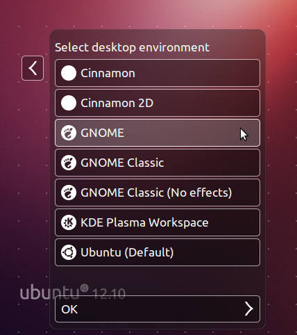
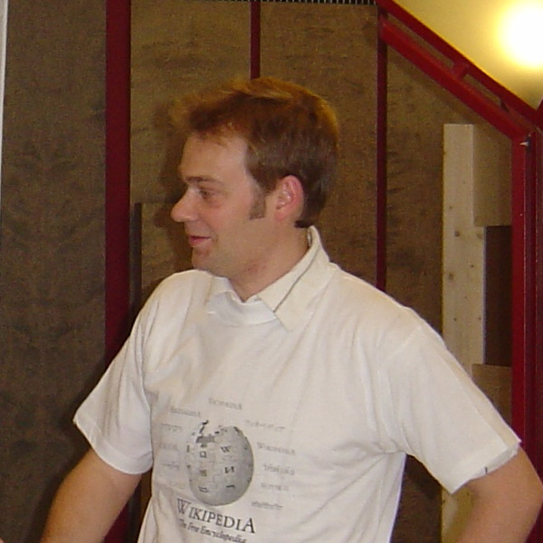
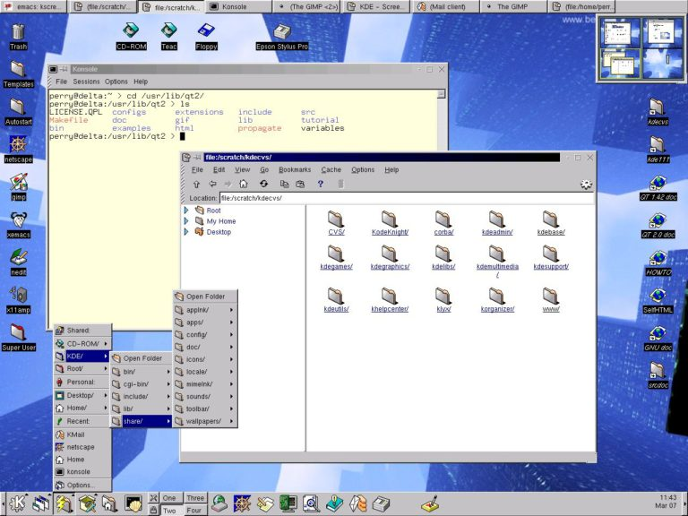
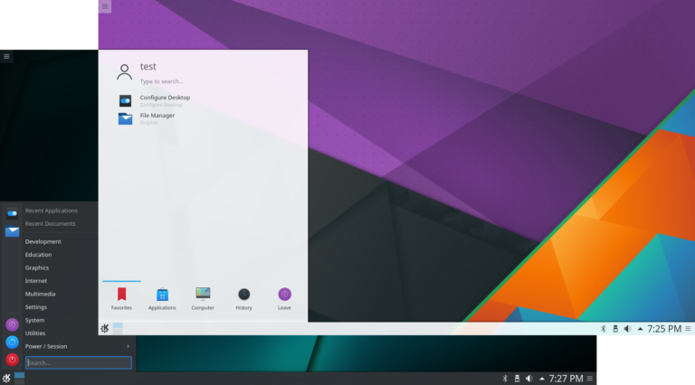
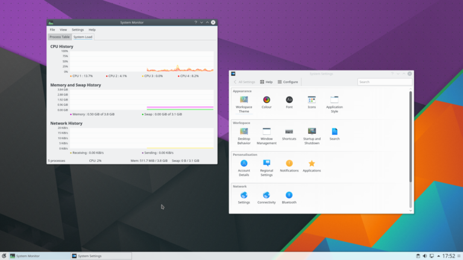
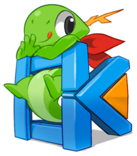
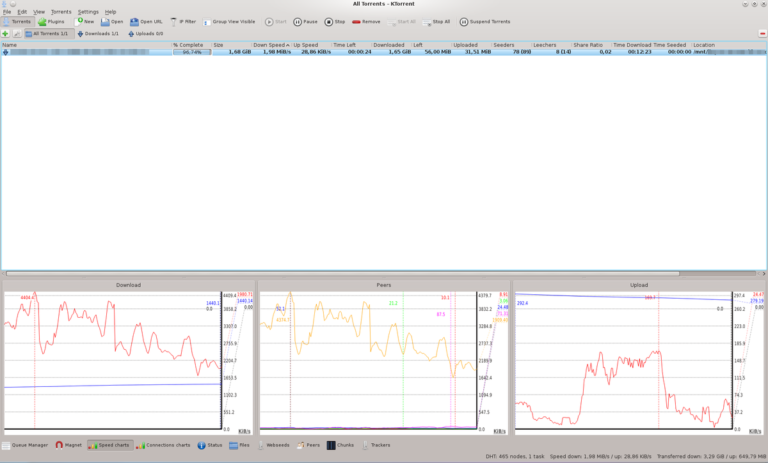
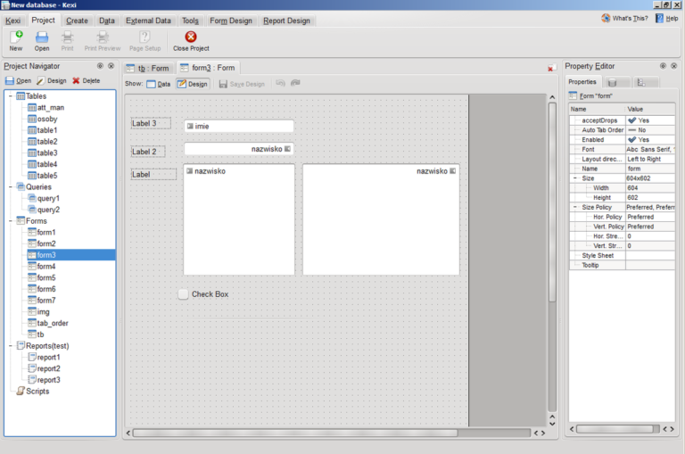
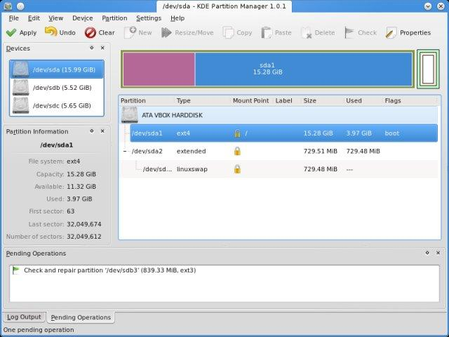

# GNU/Linux Desktop Environment များအကြောင်း အပိုင်း (၂)

ဒီအပိုင်းမှာ KDE အကြောင်းကို အနည်းငယ် ဆွေးနွေးလိုပါတယ်။ KDE အကြောင်းလေးမစခင်မှာ ကိုယ်ကြိုက်တဲ့ Desktop Environmen ေတွကို နဂိုအတိုင်းပါလာတဲ့ Official DE ေပါ်မှာ install လုပ်လို့ရလားဆိုတဲ့ မေးခွန်းပါ။ ဆိုကြပါစို့ ကိုယ်က Ubuntu 16.04 LTS ကို Official Unity 7 ပါလာတဲ့ edition ကို install လုပ်ထားတယ်။ ဒါပေမယ့် ကိုယ်က Unity ကို မကြိုက်ဘူး ဆိုပါတော့။ အစကနေ ပြီး install မလုပ်ချင်ပဲ GNOME 3 ကို ပြောင်းသုံးချင်တယ်ဆိုရင် GNOME 3 ကို ကိုယ်လက်ရှိ သုံးနေတဲ့ စက်ပေါ်မှာ အပေါ်ကနေထပ်လောင်း install လုပ်ချင်တယ် ဆိုပါတော့။ ရပါတယ်။ Install လုပ်လို့ရပါတယ်။ အဲ့ဒါဆိုရင် Unity 7 နဲ့ GNOME 3 နှစ်ခုထဲက တစ်ခုကို login လုပ်တဲ့အခါမှာ ရွေးပြီးတော့ login လုပ်လို့ရပါတယ်။ ပြဿနာက တခါတခါ ကိုယ်အသစ် တင်လိုက်တဲ့ DE က Official လာတဲ့ program bundle နဲ့ အဆင်မပြေတာမျိုးတွေ ဖြစ်တတ်ပါတယ်။ Troubleshoot လုပ်ပြီးတော့ ပြင်သုံးရင်တော့လည်း အဆင်ပြေနိုင်သလို… တခါတခါကြရင်တော်တော်လေး ကို မလိုအပ်ပဲနဲ့ စိတ်ရှုပ်ရပါတယ်။ စာရေးသူ အနေနဲ့ အဲ့ဒါကြောင့် အဲ့လို အပေါ်က DE ကို install လုပ်ပြီးသုံးတာကို အားမပေးပါဘူး။ GNOME 3 ကို ကြိုက်ရင် Ubuntu GNOME Official ကိုသာ clean install လုပ်သင့်ပါတယ်။ Data တွေကို backup လုပ်ရတာ restore လုပ်ရတာ အချိန်ကုန်ပေးမယ့်… အပေါ်က DE ကို install လုပ်လို့ အဆင်မပြေရင် မလိုအပ်ပဲနဲ့ အချိန်ကုန်နိုင်ပါတယ်။ တစ်ခုရှိတာက ကိုယ်ကြိုက်တဲ့ distro မှာ တခါတခါ ကိုယ်ကြိုက်တဲ့ DE က official အနေနဲ့ မရှိတာမျိုးတော့လည်း ရှိနိုင်ပါတယ်။ အဲ့လိုအခါမျိုးမှာ များသောအားဖြင့်တော့ community က maintain လုပ်ထားတဲ့ DE တွေကိုရှာ ပြီးတော့ download လုပ်လို့တော့ရပါတယ်။ Official DE လောက်တော့လည်း အဆင်ပြေချင်မှ ပြေပါလိမ့်မယ်။ တက်နိုင်ရင်တော့ Official DE ထဲက မတူတဲ့ flavour နဲ့ လာတဲ့ DE အမျိုးအစားကိုသာ သုံးသင့်ပါတယ်။ များသောအားဖြင့်တော့ Official DE ေတာ်တော်များများကို distro တိုင်းလိုလိုမှာ ရွေးစရာ အမြဲရှိ နေတတ်ပါတယ်။အရှေ့မှာတုန်းက မရှင်းလိုက်ရလို့ ဒီတစ်ခုမှာ နည်းနည်းလေး ဆွေးနွေးတဲ့ သဘောပါ။ ဒီတစ်ခုမှာတော့ KDE အကြောင်းကို ဆွေးနွေးသွားပါ့မယ်။

<figure><figcaption></figcaption></figure>

## KDE

KDE ကလည်း လူကြိုက်များ လူသုံးများတဲ့ DE ဖြစ်တဲ့အပြင် GNOME ထက်တောင် စောထွက်တဲ့ DE တစ်ခုပါ။ ၁၉၉၆ ခုနှစ်လောက်မှာ Matthias Ettrich ဆိုတဲ့ ဂျာမနီ နိုင်ငံက ကျောင်းသား တစ်ယောက်ကစတင်လိုက်တာပါ။ သူက Unix မှာ desktop experience ကို တော်တော်လေး မကြိုက်ပုံရပါတယ်။ နည်းပညာလောက အစပိုင်းဖြစ်တဲ့ ၁၉၉၀ ခုနှစ်များမှာ geek တွေအများကြီး ထွက်လာခဲ့ပုံရပါတယ်။ အဲ့ဒီတုန်း ရှိပြီးသား နည်းပညာ တွေကို မကြိုက်တာနဲ့ အစကနေ ပြန်ပြီးရေးလိုက်မယ် ဆိုတာမျိုးက ပုံမှန် geek တွေရဲ့ ထူးခြားတဲ့ အရည်အသွေး တမျိုးလို့ဆိုရပါလိမ့်မယ်။ သူက Unix ဟာဒီထက်ကောင်းတဲ့ desktop experience ပေးသင့်တယ်ဆိုပြီး KDE ကိုစခဲ့တာပါ။ K ကတော့ Kool (အင်္ဂလိပ် စာလုံး cool) ကိုရွည်ညွန်းပြီးတော့ DE ကတော့ Desktop Environment ပါ။ ဆိုလိုရင်းအတိုင်း အစပိုင်းမှာ DE တစ်ခုကို တည်ဆောက်ဖို့ ရည်ရွယ်ခဲ့ပေမယ့် KDE ဟာ အခုနောက်ပိုင်းမှာ community သို့မဟုတ် project တစ်ခုအနေနဲ့သာ ရည်ညွန်းပါတယ်။ ဇူလိုင်လ ၁၂ ရက်နေ့ ၁၉၉၈ခုနှစ်မှာတော့ ပထမဆုံး KDE 1.0 ကို စတင်မိတ်ဆက်ပေးပါတယ်။ KDE ကိုတော့ Qt application framework နဲ့ တည်ဆောက်ထားတာဖြစ်ပြီး အဲ့ဒီ အချိန်က Qt ဟာ proprietary ဖြစ်တဲ့အတွက် Free and Open Source အတွက် သိပ်မကိုက်ဘူးလို့ဆိုရမှာ ဖြစ်ပါတယ်။ ဇွန်လ ၁၉၉၉ ခုနှစ် လောက်မှာတော့ Qt widget toolkit version 2 ဟာ QPL ဆိုတဲ့ open source license အောက်မှာ မှတ်ပုံပြန်တင်လိုက်ပါတယ်။

<figure><figcaption></figcaption></figure>

<figure><figcaption></figcaption></figure>

နိုဝင်ဘာလ ၂၄ရက်နေ့ ၂၀၀၉ခုနှစ်မှာတော့ KDE ကို DE တစ်ခုတည်းအတွက် မဟုတ်ပဲ ဒီထက်ကျယ်ပြန့်တဲ့ project တစ်ခုဖြစ်အောင်လို့ KDE project ရဲ့ workflow နဲ့ scope ကို အသစ် ပြန်လည် သတ်မှတ်လိုက်ကြပါတယ်။ Qt 4 ကနေ Qt 5 ကို ပြောင်းတဲ့ အခါမှာ ဒီဟာ ပြန်ပြောင်းသတ်မှတ်လိုက်တာလည်း ဖြစ်ပါတယ်။ ပါဝင်တဲ့ အပိုင်းတွေကတော့ KDE Plasma၊ KDE Frameworks နဲ့ KDE Applications ဆိုပြီးတော့ သုံးပိုင်းခွဲ လိုက်ပါတယ်။ Qt 4 မှာတော့ KDE SC4 (KDE Software Compilation 4) ဆိုပြီးတော့ ခေါ်ပါတယ်။ အဲ့ဒီတုန်းကတော့ Plasma Workspaces၊ KDE Applications နဲ့ KDE Platform လို့ခေါ်ခဲ့ပါတယ်။ Qt5 ကနေစလို့ အောက်မှာ ဖော်ပြထားတဲ့ အတိုင်းသာ သတ်မှတ်လိုက်ပါတော့တယ်။

<figure><figcaption></figcaption></figure>

* KDE Plasma ကတော့ အဓိကအားဖြင့် unified environment တစ်ခုဖြစ်လာဖို့ အတွက် နဲ့ maintain လုပ်ဖို့ အတွက် အားစိုက်ထုတ်ရပါတယ်။ Plasma ရဲ့ ထုတ်ကုန်တွေကတော့ desktop မှာသုံးဖို့အတွက် Plasma Desktop၊ netbook တွေမှာ သုံးဖို့အတွက် Plasma Netbook၊ TV နဲ့ set-top box တွေမှာသုံးဖို့ Plasma Media Center၊ tablets မှာသုံးဖို့ Plasma Active အပြင် smartphone ေတွ သယ်ဆောင်ရလွယ်ကူတဲ့ touch device တွေမှာ သုံးဖို့ Plasma Mobile ဆိုပြီးတော့ workspaces တွေကို ထပ်မံ အသေးစိတ်ခွဲထားပြန်ပါတယ်။ ဒီလောက်ဆို Plasma ရဲ့ ဦးတည်ရာကို ရိပ်စားမိမယ်ထင်ပါတယ်။ Desktop တစ်ခုတည်း အတွက် မဟုတ်ပဲ media နဲ့ mobile device တွေအတွက်ပါ အာရုံထား ပြီးတော့ သွားနေတဲ့ project တစ်ခုပါ။

<figure><figcaption></figcaption></figure>

* KDE Frameworks ဟာ KDE platform မှာ KDE application တွေ run ဖို့အတွက် လိုအပ်တဲ့ libraries တွေနဲ့ services တွေကို စုစည်းပေးထားတာဖြစ်ပါတယ်။ Qt5 ကို ရောက်တော့ KDE frameworks ရဲ့ ချဥ်းကပ်ပုံဟာ ပိုပြီးတော့ modular ဖြစ်လာပါတယ်။ ဆိုလိုချင်တာက KDE ဟာ အခြေခံ အုတ်မြစ်မှာ C++ နဲ့ တည်ဆောက်ထားသော်လည်း Qt5 ရောက်လာတဲ့ အချိန်မှာတော့ တခြား programming language တွေနဲ့ တွဲပြီးတော့ အလုပ်လုပ်နေပါပြီ။ Binding နဲ့ Integration ပိုင်းမှာ ပိုပြီးကောင်းလာတဲ့အတွက် developer တွေအနေနဲ့ ရွေးချယ်စရာများလာပြီး တိုးတက်မှု အဟုန်ကလည်း ပိုမိုမြန်ဆန်လာပါတယ်။ ဥပမာ Python၊ Ruby၊ C# နဲ့ Perl တို့လို နောက်ပိုင်းမှာ အသုံးများလာတဲ့ language တွေနဲ့ တွင်တွင်ကျယ်ကျယ် binding လုပ်လို့ developer တွေအတွက် အလုပ် ပိုဖြစ်လာတယ်လို့ ထင်ပါတယ်။

<figure><figcaption></figcaption></figure>

* KDE Applications ဆိုတာကတော့ KDE Frameworks ကိုသုံးပြီးတော့ KDE မှာသုံးဖို့အတွက် application ကိုရည်ညွန်းခြင်းဖြစ်ပါတယ်။ ဥပမာ KDE အတွက် သီးသန့်ရေးထားတဲ့ application တွေဖြစ်တဲ့ KTorrent, Kexi နဲ့ KDE Partition Manager တို့လို KDE Frameworks ေပါ်မှာရေးထား နာမည်ကြီးတဲ့ application ဖြစ်ပါတယ်။

<figure><figcaption></figcaption></figure>

<figure><figcaption></figcaption></figure>

<figure><figcaption></figcaption></figure>

KDE ကို စာရေးသူအနေနဲ့ သဘောသိပ်မတွေ့ပါဘူး။ Graphic ပိုင်းမှာအမြဲတမ်း အရှေ့ရောက်နေပေမယ့် Desktop Environment တစ်ခုအနေနဲ့ GNOME လောက် မကျစ်လစ်ဘူးလို့ ထင်မိပါတယ်။ Feature တွေတော့ အများကြီးပါလာတတ်ပါတယ်။ KDE ဟာ DE တစ်ခုတည်းကို အားစိုက်တာမဟုတ်တဲ့ အတွက် သူ့ Desktop Experience ဟာ နည်းနည်းလေး တော့ ပွစာကြဲနေတတ်ပါတယ်။ စာရေးသူ မကြိုက်တတ်လို့လည်း ဖြစ်နိုင်ပါတယ်။ သို့သော် KDE ဟာ open source community အတွက်အများကြီး contribute လုပ်တဲ့ အပြင် လက်ရှိအချိန်ထိ အရှိန်ကောင်းနေသေးတဲ့ project တစ်ခုဖြစ်ပါတယ်။ Distro တော်တော်များများမှာ KDE flavour က official အနေနဲ့ ရှိနေတတ်ပါတယ်။ KDE အကြောင်းကို ဒီမှာပဲရပ်လိုက်ပါ့မယ်။ နောက်တစ်ပိုင်းမှာတော့ Budgie ဆိုတဲ့ Desktop Environment အကြောင်းကို ဆက်ပြီး မိတ်ဆက်ပေးချင်ပါတယ်။
