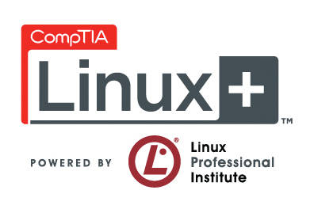
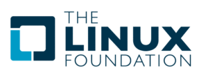
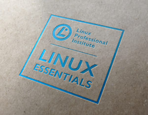

# အသုံးဝင်သော Linux Certification များအကြောင်း အပိုင်း (၁)

Linux certification တွေအကြောင်းရေးမယ်ဆိုတော့ ဘယ်လို certification တွေကပိုပြီး အသုံးဝင်သလဲဆိုတာနဲ့brand တွေကိုဘက်မလိုက်ပဲ အလုပ်ဖြစ်မယ့် certification တွေအကြောင်းစပြီးစုဆောင်းရပါတော့တယ်။ ဆိုပါတော့ Red Hat လို certification တွေက စာရေးသူအမြင်မှာတော့ ဘက်လိုက်သလို ခံစားရပါတယ်။ သူကတော့ သူ့brand ကို promote လုပ်ဖို့နဲ့ product ကြော်ငြာလုပ်ဖို့ကို certification exam တွေမှာ ထည့်သွင်းစဉ်းစားပါလိမ့်မယ်။ အဲ့ဒါဟာလည်း သဘာဝကျတယ်လို့ဆိုရမှာပါ။ Microsoft တို့Cisco တို့certification exam တွေဖြေခဲ့ဖူးတဲ့လူတိုင်းသိပါတယ်။ Certification တွေဟာ သူတို့ product တွေကို promote လုပ်ဖို့ကို ကြိုးစားကြပါတယ်။ ဥပမာ Cisco ရဲ့ CCNA certification ဆိုပါတော့… Cisco က Certification ဖြစ်တဲ့အတွက် Cisco ရဲ့ proprietary protocol ဖြစ်တဲ့ routing protocol တွေ အကြောင်းကိုသာ Chapter တိုင်းလိုလို ထည့်သွင်းမိတ်ဆက်ပေး ပြီးတော့ စာမေးပွဲမှာလည်း သူနဲ့ပတ်သတ်တဲ့ မေးခွန်းတွေမေးတာမို့လေ့လာသင်ကြားရတဲ့ သူမှာ အဲ့ဒီ Cisco ရဲ့routing protocol တွေနဲ့သာ ပိုပြီးရင်းနှီးသွားဖို့ရှိပါတယ်။ Routing protocol တွေရဲ့ concept နဲ့ဘယ်လိုအလုပ်လုပ်သလဲဆိုတာကို ရနိုင်ပေမယ့် brand အစွဲတစ်ခုအနေနဲ့ Cisco router တွေနဲ့သာ အကျွမ်းဝင်ပြီး Juniper တို့Vyos တို့လို router တွေနဲ့ဆို နည်းနည်းလေးစိမ်းနေနိုင်ပါတယ်။ အဲ… တစ်ခုရှိတာကာတော့ router product တော်တော်များများဟာ Linux platform ကိုသုံးတာပါ။ အဲ့ဒီတော့ Linux နဲ့ရင်းနှီးပြီးသားဆိုရင်တော့ command syntax တွေကပိုပြီး လွယ်မယ်လို့ထင်ပါတယ်။ ဒါက proprietary certification တွေမှာဘက်လိုက်နိုင်တဲ့ အကြောင်းကိုနည်းနည်းလေးရှင်းပြတာပါ။

နောက်ဆုံးတော့ brand တွေကိုမမှီခိုတဲ့ FLOSS community ကပေးတဲ့ certification အကြောင်းတွေ ကိုရေးဖို့ကိုသာ ဆုံးဖြတ်လိုက်ပါတော့တယ်။ အဲ့ဒီတော့ ကိုယ်က brand တစ်ခုအတွက် Linux certification လုပ်ရမှာဆိုရင်တော့ ဒီ post ကသိပ်အဆင်မပြေပါဘူး။ ဒီ post မှာရေးမယ့် certification တွေ ကတော့ Linux Professional Institute တို့ CompTIA တို့ The Linux Foundation တို့ကလုပ်ပေးထားတဲ့ certificate တွေဖြစ် ပါတယ်။ ဘယ် GNU/Linux distro ရယ်လို့ အစွဲမရှိစေပဲ Linux ဆိုတဲ့ platform တစ်ခုကို သင်ယူလေ့လာဖြစ်ပါတယ်။ နောက်တစ်ခုရှိတာက post မှာပါမယ် စာမေးပွဲတွေက sysadmin တို့ network admin တို့ virtualization specialist တွေအတွက်ပါ။ coding သမားတွေ programming သမားတွေ အတွက်တော့ Linux မှာအသုံးများတဲ့ language တွေအတွက် သီးသန့်စာမေးပွဲတွေရှိပါတယ်။ ဒီ post ကတော့ Linux ဆိုတာဘာလဲ၊ ဘယ်လိုသုံးရသလဲ၊ ဘယ်လို manage လုပ်သလဲဆိုတာတွေကို cover ဖြစ်မှာပါ။ အခြေခံလိုအပ်မှုတွေအတွက် အလွယ်ဆုံး beginner အဆင့် certification ကနေစပြီးတော့ တဖြေးဖြေး ပိုပိုမြင့်လာတဲ့ certification တွေအကြောင်းကို တဆင့်ပြီး တဆင့်ရှင်း ပြသွားပါ့မယ်။ Certification တွေရဲ့ provider သုံးခုကို အခြေခံပြီးတော့ပြောသွားပါ့မယ်။

<figure><figcaption></figcaption></figure>

<figure><figcaption></figcaption></figure>

<figure><figcaption></figcaption></figure>

### **အခြေခံအဆင့် certification များ**

**LPI Linux Essentials**\
ပထမဆုံးကတော့ Linux Professional Institute (LPI) ဆိုတဲ့ certification provider ဖြစ်ပါတယ်။ အခြေခံအကျဆုံး beginner အဆင့်ကို စလုပ်မယ် ဆိုရင်တော့ စာရေးသူအနေနဲ့ Linux Professional Institute ရဲ့ LPI Linux Essentials ကိုဖြေဖို့ကို တိုက်တွန်းပါတယ်။ LPI Linux Essentials ကိုတော့ နောက်တဆင့်မြင့်တဲ့ Linux certification တွေအတွက်လည်း လိုအပ်သလို Linux စသုံးတဲ့လူတွေအတွက်လည်း သင်ကြားမူတစ်ခု စတင်ဖို့ကို ရည်ညွန်းပါတယ်။ အခြေခံအကျဆုံး Linux ရဲ့မရှိမဖြစ်လိုအပ်တဲ့ အရာတွေကို လေ့လာရင် certification တစ်ခုပြီးသွားမယ့် စာမေးပွဲဖြစ်ပါတယ်။ LPI Linux Essentails စာမေးပွဲကိုဖြေမယ်ဆိုရင်အောက်က အချက်တွေကို သိထားသင့်ပါတယ်။

<figure><figcaption></figcaption></figure>

* **LPI Linux Essentials ရဲ့လက်ရှိ version** လက်ရှိမှာတော့ version 1.5 ကိုရောက်နေပါပြီ။ ICT industry ရဲ့လိုအပ်ချက်တွေကို ဖြည့်ဆည်းဖို့ရာ version တွေကို ပုံမှန် update လုပ်ရပါတယ်။ တခါတလေ certification exam တွေကို update လုပ်တဲ့အခါမှာ မေးခွန်းပုံစံတွေပါပြောင်းလဲ သွားတတ်တာမို့ သတိပြုစေချင်ပါတယ်။ ကိုယ်က ဘယ် version ကိုဖြေဆိုမလဲဆိုတာလည်းသိထားရပါမယ်။ တချို့ certification တွေမှာ version တွေ retired ဖြစ်သွားတာတွေရှိပါတယ်။ အဲ့ဒါတွေကိုလည်း သတိပြုစေချင်ပါတယ်။ Exam code ကတော့ 010-150 ဆိုတာနဲ့ရှာရပါမယ်။
* **LPI Linux Essentials မဖြေခင်လိုအပ်ချက်များ** ဒီစာမေးပွဲဖြေဆိုဖို့အတွက်ဆို ရှေ့မှာကိုယ်က ဘာစာမေးပွဲမှ ဖြေဆိုအောင်မြင်ထားစရာမလိုပါဘူး။ အခြေခံစာမေးပွဲဖြစ်တဲ့အတွက် ကိုယ်အဆင်သင့် ဖြစ်ပြီဆိုတာနဲ့test center တစ်ခုမှာ register လုပ်ပြီးဖြေဆိုလိုက်ရုံပါပဲ။
* **LPI Linux Essentials ရဲ့ မေးခွန်းပုံစံနဲ့ဖြေဆိုချိန်** LPI 010-150 ကိုဖြေဆိုမယ်ဆိုရင်တော့ multiple-choice လို မေးခွန်းမျိုးအခု ၄၀ ကို မိနစ် ၆၀ အတွင်းမှာပြီးအောင်ဖြေဆိုရမှာဖြစ်ပါတယ်။
* **LPI Linux Essentials ရဲ့ အကြုံဝင် သက်တမ်း** Lifetime တသက်စာလုံလောက်ပါတယ်တဲ့ဗျာ။ တခါဖြေပြီးတာနဲ့သက်တမ်းကုန်ဆုံးသွားတာမျိုးမရှိ သက်တမ်းသတ်မှတ်ချက်မရှိပါဘူး။ အသစ်ထွက်လာတဲ့ နည်းပညာပိုင်းတွေကိုတော့ ကိုယ်ပိုင်လေ့လာသင်ယူသင့်ပါတယ်။ certification ဆိုတာမျိုးက လုပ်ငန်းခွင်ဝင်တဲ့အခါမှာ ကိုယ်သိထားတယ် ဆိုတာမျိုးကိုပြဖို့အတွက်သာဖြစ်ပါတယ်။ ကျွမ်းကျင်မှုဆိုတာကတော့ ကိုယ်နဲ့သာဆိုင်ပါတယ်။ ကိုယ်ဘယ်လောက် အပြင်မှာလေ့လာနိုင်သလဲ၊ ဘယ်လောက်အတွေ့အကြုံရှိ သလဲဆိုတာနဲ့သာဆိုင်ပါတယ်။
* **LPI Linux Essentials အတွက်ပြင်ဆင်စရာ အပိုင်းများ** ဒီစာမေးပွဲကိုဖြေဆိုမယ်ဆိုရင်တော့ Linux နဲ့open source community အကြောင်းကိုတော့ အနည်းအကျဉ်းသိရှိထားရပါမယ်။ Linux ဆိုတာဘာလဲ၊ ဘယ်ကစသလဲ၊ ဘယ်သူတွေကစခဲ့တာလဲ၊ open source community မှာ Linux သမားတွေ ဘယ်လိုအပြန်အလှန် support ပေးကြသလဲဆိုတာမျိုးကိုလောက်တော့ သိထားရပါမယ်။ နာမည်ကြီးတဲ့ distro အကြောင်းလေးတွေလည်း သိထားတော့ အဲ့ဒါမျိုးမေးခွန်းတွေအတွက် အဆင်သင့်ဖြစ်ပြီးသားပေါ့။ နောက်ပြီး Linux မှာပါတဲ့ အစိတ်အပိုင်းလေးတွေကိုလည်း အခြေခံအားဖြင့်သိထားရပါမယ်။ ဥပမာ Linux kernel ဆိုတာဘာလဲဆိုတာမျိုးဆိုပြောတာပါ။ အရေးအကြီးဆုံးနဲ့အခြေခံအဆင့်မှာထဲက မရှိမဖြစ်လိုအပ်တဲ့ skill ဖြစ်တဲ့ command line တွေကိုလည်း အလုပ်ဖြစ်အောင်သုံးနိုင်တဲ့အထိတော့ သိထားရပါမယ်။ command တိုင်းရဲ့argument တွေ option တွေအားလုံးကို မမှတ်မိရင်တောင်မှ နေ့စဉ်သုံး command တွေဖြစ်တဲ့ ls တို့cd တို့touch တို့tar တို့လို မသုံးမဖြစ် သုံးနေရတဲ့ command တွေနဲ့တော့ ရင်းနှီးနေရပါမယ်။ သိနေတာထက် အသုံးချတတ်လောက်အောင်ကို command တွေနဲ့ရင်းနှီးနေရင် တော့ပိုကောင်း ပါတယ်။ ဒါ့အပြင် Microsoft မှာလို GUI ကနေပြီးတော့ system administration နဲ့configuration လုပ်တာမျိုးက Linux မှာရှားပါတယ်။ Linux မှာတော့ command တွေကနေ တဆင့် administrative task တွေတော်တော်များများ ကိုလုပ်ဆောင်ရပါတယ်။ အဲ့ဒါကြောင့် Linux ရဲ့ security နဲ့administration အကြောင်းလည်း တစေ့တစောင်း သိထားရပါမယ်။ user နဲ့group တွေကို ဘယ်လို manage လုပ်တယ်ဆိုမျိုးနဲ့ file/folder တွေရဲ့permission ကို command line မှာဘယ်လို လုပ်သလဲဆိုမျိုးကို အနည်းအကျဉ်းတော့ သိထားရပါမယ်။ အဲ့ဒီတော့ ဒီ LPI Linux Essentials မှာ Linux command line တွေတော်တော်များများ လေ့လာသင်ယူ ရမှာဖြစ်ပါတယ်။ အဲ့ဒီ command တွေကလည်း နေ့စဉ်နဲ့အမျှသုံးနေရ မှာမို့သိကိုသိထားရမှာ လည်းဖြစ်ပါတယ်။

ဒါကတော့ Linux မှာအခြေခံအကျဆုံး beginner အဆင့်မှာလေ့လာလို့ရတဲ့ certification အကြောင်းဖြစ်ပါတယ်။ တခြား training နဲ့ certification provider တွေမှာလည်း ခပ်ဆင်ဆင် စာမေးပွဲတွေရှိပါတယ်။ အခြေခံအဆင့်မှာတော့ တစ်ခုနဲ့တစ်ခုအရမ်းကြီးကွာခြားမူ မရှိသလောက်ပါပဲ။ Linux ကိုစနစ်တကျလေ့လာ ချင်တယ်ဆိုရင်တော့ LPI Linux Essentials လောက်ကိုတော့ လေ့လာ သင့်ပါတယ်။ လုပ်ငန်းခွင်အတွက် ဖြေဆိုသင့်ပါတယ်။ အခုနောက်ပိုင်းမှာတော့ Cisco ကလည်း Linux course တွေကို စတင်ပြီးမိတ်ဆက်လာပါပြီ။ အခြေခံအဆင့်မှာတော့ Cisco ရဲ့ course နာမည်ကတော့ NDG Linux Essentials လိုခေါ်ပါတယ်။ သူလည်း LPI Linux Essentials နည်းတူ command line တွေနဲ့ ဘယ်လို administrate လုပ်သလဲဆိုတဲ့ အခြေခံအဆင့်ကို cover ဖြစ်ပါတယ်။ တနည်းအားဖြင့် Cisco ရဲ့ NDG Linux Essentials ဆိုတာလည်း LPI Linux Essentials စာမေးပွဲအတွက် ပြင်ဆင်ပေးတဲ့ training material တစ်ခုပါပဲ။ နှစ်ခုထဲက ကိုယ်ကြိုက်တဲ့ တစ်ခုကို လေ့လာလို့ ရပါတယ်။

နောက်အပိုင်းတွေမှာတော့ ဒီထက်တဆင့်မြင့်သွားတဲ့ Linux စာမေးပွဲတွေအကြောင်းကိုဆက်ရေးပါ့မယ်။ administrator အဆင့် specialist အဆင့် စာမေးပွဲတွေ အတွက်တော့ နောက်တပိုင်းမှာ ဆက်လက် ဖတ်ရှုပေးပါ။
