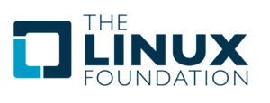

# အသုံးဝင်သော Linux Certification များအကြောင်း အပိုင်း (၅)

ဒီတခါတော့ LPI မဟုတ်တဲ့ တခြား အဖွဲ့ ပေးတဲ့ certification အကြောင်းလေးတွေ ရေးချင်ပါတယ်။ နောက်တစ်ခုက စာရေးသူ ဒီ certification တွေအကြောင်းရေးနေတာ စာဖတ်သူတွေ ဗဟုသုတ ရစေလိုသော စေတနာကြောင့်သာ ဖြစ်ပါတယ်။ ဒီ certification တွေကို promote လုပ်ဖို့ဆိုတဲ့ ရည်ရွယ်ချက်လည်းမရှိသလို ကြော်ငြာ ဝင်တာလည်းမဟုတ်ပါဘူး။ မသိသေးတဲ့ သူတွေသိနိုင်အောင်လို့ ဒီအကြောင်းလေးတွေ ရေးခြင်းသာဖြစ်ပါတယ်။ certification တွေ test centre တွေနဲ့ ဘယ်လိုမှ ပတ်သတ်မှုမရှိ ကြောင်းလေးကို စကားချပ် အနေနဲ့ အရင်ပြောပါရစေ။ Red Hat တို့ SUSE တို့ certification တွေအကြောင်းကို မရွေးချယ်ရတဲ့ အကြောင်းကိုလည်း ပထမဆုံး အပိုင်းမှာရှင်းပြထားပါတယ်။ အခုပြောတဲ့ LPI နဲ့ Linux Foundation ကတော့ FLOSS community ရဲ့ certification တွေဖြစ်တာကြောင့် FLOSS ကို support လုပ်တဲ့ အနေနဲ့ မြန်မာနိုင်ငံမှာ လူတွေသိအောင် ရေးခြင်းသာဖြစ်ပါတယ်။ LPI အကြောင်းလည်း ရေးတာကုန်ပါပြီ။ ဒီတပိုင်းမှာတော့ Linux Foundation ကပေးတဲ့ certification တွေအကြောင်းရေးမှာ ဖြစ်ပါတယ်။

Linux Foundation က certification တွေအကြောင်းမရေးခင် Linux Foundation အကြောင်းလေးကို နည်းနည်းလေး ပြောပြချင်ပါတယ်။ Linux Foundation ဟာ Linux ရဲ့ god ဖြစ်တဲ့ Linus Torvalds ကို ပြန်ပြီးအလုပ်ခန့်ထားတဲ့ အဖွဲ့ပါ။ Linux Foundation ရဲ့ အဓိက လုပ်ငန်းကတော့ Linux project တွေနဲ့ တခြား အရေးကြီးတဲ့ project တွေကို စမ်းသပ်တီထွင်နေတဲ့ အဖွဲ့လည်း ဖြစ်ပါတယ်။ အဲ့ဒီလို R\&D လုပ်ငန်းကြောင့်လည်း Linux က software နဲ့ security ပိုင်းမှာ အရှေ့ကို ကြိုပြီးရောက်နေတတ်ပါတယ်။ အဲ့ဒါကြောင့်လည်း IBM, Intel, Microsoft, NetApp စသဖြင့် ကုမ္ပဏီကြီးတွေရဲ့ ကျောထောက်ခံရထားတဲ့ အဖွဲ့လည်းဖြစ်ပါတယ်။ တဘက်မှာလည်း ICT industry ကလိုအပ်နေတဲ့ Linux သမားများစွာကို မွေးထုတ်ဖို့ရည်ရွယ်ပြီးတော့ certification တွေ training တွေ e-learning တွေကို လုပ်ထားပေးပါတယ်။ ဒီ post မှာတော့ Linux Foundation ကလုပ်ပေးထားတဲ့ certificate သုံးခုအကြောင်းကို အကျဥ်းချုပ်ပြီတော့ပြောပြချင်ပါတယ်။

<figure><figcaption></figcaption></figure>

## အခြေခံအဆင့် e-learning နဲ့ certification/affiliation

သတင်းကောင်း အနေနဲ့ အခြေခံအဆင့်မှာတော့ online ကနေ အခမဲ့ enrol လုပ်ပြီးတော့ e-learning လို training ကို နာရီ ၄၀ ကနေ ၅၀ အထိ အချိန်ပေးပြီးကိုယ်တိုင် လေ့လာလို့ရအောင်လုပ်ပေးထားပါတယ်။ အဲ့ဒီ training ပြီးလို့ official certificate/affiliation လိုချင်ရင်တော့ $99 ပေးရပါ့မယ်။ မလိုဘူး လေ့လာရုံသက်သက် ဆိုရင်လည်း အခမဲ့လေ့လာလို့ရပါတယ်။ တစ်ပြားမှပေးစရာမလိုပါဘူး။ donate လုပ်ချင်ရင်လည်း website ပေါ်ကနေကိုယ်နိုင်သလောက် လှူလို့ရပါတယ်။

<figure><figcaption></figcaption></figure>

စိတ်ဝင်စားတယ်ဆိုရင်တော့ ကိုယ်တိုင် ဒီ [link](https://training.linuxfoundation.org/linux-courses/system-administration-training/introduction-to-linux) ကနေ enrol လုပ်ပြီးတော့ အခမဲ့ စတင်လေ့လာလို့ရပါပြီ။ training မှာတော့ slide တွေ tutorial video တွေကို အင်္ဂလိပ်လို လေ့လာနိုင်မှာဖြစ်ပါတယ်။ enrol လုပ်ဖို့အတွက် email တစ်ခုတော့လိုပါလိမ့်မယ်။

## ကျွမ်းကျင်မှုအဆင့် training နဲ့ certification များ

ကျွမ်းကျင်မှုအဆင့်မှာတော့ Sysadmin နဲ့ Engineer ဆိုပြီးနှစ်ပိုင်းခွဲထားပါတယ်။ အောက်မှာတော့ Sysadmin နဲ့ Engineer စာမေးပွဲတွေ အကြောင်းကို အကျဉ်းချုပ်ရေးပါ့မယ်။

### Linux Foundation Certified System Administrator (LFCS)

LFCS အတွက်တော့ Linux Foundation က self-paced 100% online course နဲ့ exam ကိုတွဲပြီးတော့ ရောင်းပါတယ်။ လက်ရှိမှာတော့ self-paced online course ကုိ LFS201 ဆိုပြီး တော့ ခေါ်ပါတယ်။ ကိုယ်ဟာကို online ကနေလေ့လာ သင်ယူရမှာဖြစ်ပြီးတော့ course အစအဆုံးအတွက် ၁၂ လအချိန်ရပါတယ်။ အဲ့ဒါပြီးတာနဲ့ စာမေးပွဲစဖြေလို့ရပါပြီ။ LFCS ကတော့ system administration အပိုင်းကုိ cover လုပ်ပေးပါတယ်။ အောက်မှာတော့ LFCS အတွက် သိစရာအကြောင်းလေး တွေကိုဖော်ပြပေးပါ့မယ်။

<figure><figcaption></figcaption></figure>

#### LFCS မဖြေဆိုခင်လိုအပ်ချက်များ

Linux Foundation ကတော့ LFCS အတွက် self-paced online course နဲ့ exam voucher ကို $499 နဲ့ရောင်းပါတယ်။ online course ကိုအရင်လုပ်စေချင်တဲ့အတွက် တွဲရောင်းတာလည်း ဖြစ်နိုင်ပါတယ်။ ဒါပေမယ့် ကိုယ်ဟာကို အပြင်မှာလေ့လာပြီးတော့ exam voucher ပဲဝယ်မယ်ဆိုလည်း ရပါတယ်။ exam voucher ကတော့ $300 ပေးရမှာဖြစ်ပါတယ်။ ဝယ်ပြီးရင် ၁၂လ အချိန်အတွင်းမှာ ဖြေရမှာဖြစ်ပါတယ်။ စျေးတော့ နည်းနည်းကြီးပေမယ့် သူ့ရဲ့ exam format ကြောင့်လို့ တော့ နားလည် လက်ခံလို့ရပါတယ်။

#### LFCS မေးခွန်းပုံစံ နဲ့ ဖြေဆိုချိန်

LFCS ဖြေဆိုရာမှာတော့ ကိုယ်က test centre ကိုသွားစရာမလိုပဲနဲ့ ကိုယ့် ကွန်ပြူတာမှာပဲဖြေဆိုရမှာပါ။ မေးခွန်းပုံစီကို သေချာမပြောပြပေးထားပဲ မေးသမျှတွေကို ကိုယ်ဘယ်လောက်လုပ်တတ်သလဲ ပေါ်မှာ မူတည်ပြီးတော့ အမှတ်ပေးသွားမှာဖြစ်ပါတယ်။ အဲ့ဒါကို remote session ကနေတဆင့် စောင့်ကြည့်တဲ့သူက စောင့်ကြည့်သွားမှာဖြစ်ပါတယ်။ ဖြေဆိုချိန်ကတော့၂နာရီ အချိန်ရပါတယ်။ အနည်းဆုံး ၇၄ရာခိုင်နုန်းတော့ ရမှာအောင်မှာဖြစ်ပါတယ်။ အောင်လား မအောင်ဘူးလားဆိုတာကတော့ ၃ ရက်လောက်တော့ စောင့်ပြီးမှသိရမှာဖြစ်ပါတယ်။ အောင်ရင်တော့ Linux Foundation ကနေကိုယ့်ကို certificate လှမ်းပို့ပေးမှာဖြစ်ပါတယ်။ အဲ… နောက်တစ်ခုက exam voucher ဝယ်တဲ့အခါမှာ ကိုယ်က ဘယ် distribution နဲ့ ဖြေမလဲဆိုတာကို ရွေးလို့ရပါတယ်။ ရွေးလို့ရတဲ့ distro ၃ခုကတော့ CentOS, Ubuntu နဲ့ openSUSE တို့ဖြစ်ပါတယ်။

#### LFCS ရဲ့ အကြုံဝင် သက်တမ်း

LFCS ကတော့ ၂နှစ်ပဲ အချိန်ရမှာဖြစ်ပါတယ်။ LPI စာမေးပွဲတွေထက်တော့ အချိန်နည်းပါတယ်။

LFCS အကြောင်းကို ထပ်ပြီးသိချင်သေး ရင်တော့ ဒီ [link](https://training.linuxfoundation.org/certification/lfcs) ကနေသာ အင်္ဂလိပ်ဖတ်ပြီးတော့ လေ့လာလို့ရပါတယ်။

### Linux Foundation Certified Engineer (LFCE)

LFCE အတွက်ကတော့ Linux Foundation က exam voucher ကိုပဲ သက်သက်ရောင်းပါတယ်။ အောက်မှာတော့ LFCE အတွက် သိစရာအကြောင်းလေး တွေကိုဖော်ပြပေးပါ့မယ်။

<figure><figcaption></figcaption></figure>

**LFCE မဖြေဆိုခင်လိုအပ်ချက်များ**

Linux Foundation ကတော့ LFCE အတွက် exam voucher ကို $300 နဲ့ရောင်းပါတယ်။ ဝယ်ပြီးရင် ၁၂လ အချိန်အတွင်းမှာ ဖြေရမှာဖြစ်ပါတယ်။ လိုအပ်မယ် training course တွေတော့ရှိပါတယ်။ Self-paced online course တွေလည်းရှိသလို အတန်းတွေဖွင့်ပေးပြီး ၃ ရက်ပြတ် ၄ရက်ပြတ်သင်တန်းတွေလည်းရှိပါတယ်။ မြန်မာနိုင်ငံမှာ တော့အဲ့လိုသင်တန်းတွေလာဖွင့်သလားဆိုတာကတော့ စာရေးသူလည်း သေချာမသိပါဘူး။

#### LFCE မေးခွန်းပုံစံ နဲ့ ဖြေဆိုချိန်

LFCE ဖြေဆိုရာမှာတော့ ကိုယ်က test centre ကိုသွားစရာမလိုပဲနဲ့ ကိုယ့် ကွန်ပြူတာမှာပဲဖြေဆိုရမှာပါ။ LFCS နည်းတူ remote session ကနေတဆင့် စောင့်ကြည့်တဲ့သူက စောင့်ကြည့်သွားမှာဖြစ်ပါတယ်။ ဖြေဆိုချိန်ကတော့၂နာရီ အချိန်ရပါတယ်။ အနည်းဆုံး ၇၄ရာခိုင်နုန်းတော့ ရမှာအောင်မှာဖြစ်ပါတယ်။ အောင်လား မအောင်ဘူးလားဆိုတာကတော့ ၃ ရက်လောက်တော့ စောင့်ပြီးမှသိရမှာဖြစ်ပါတယ်။ အောင်ရင်တော့ Linux Foundation ကနေကိုယ့်ကို certificate လှမ်းပို့ပေးမှာဖြစ်ပါတယ်။ LFCS လိုပဲ exam voucher ဝယ်တဲ့အခါမှာ ကိုယ်က ဘယ် distribution နဲ့ ဖြေမလဲဆိုတာကို ရွေးလို့ရပါတယ်။ ရွေးလို့ရတဲ့ distro ၃ခုကတော့ CentOS, Ubuntu နဲ့ openSUSE တို့ဖြစ်ပါတယ်။

#### LFCE ရဲ့ အကြုံဝင် သက်တမ်း

LFCE ကလည်း ၂နှစ်ပဲ အချိန်ရမှာဖြစ်ပါတယ်။ ၂နှစ်ပြီးတဲ့အခါမှာတော့ Linux Foundation ကတခြား certification လိုက်ဖြေရင်းနဲ့ renew လုပ်လို့ရပါတယ်။ အသေးစိတ်သိချင်ရင်တော့ အောက်မှာပေးထားတဲ့ နေရာမှာ ကလစ်ပြီးသွားရောက်ဖတ်ရှု လေ့လာလို့ရပါတယ်။

LFCE အကြောင်းကို အသေးစိတ် ထပ်ပြီးသိချင်သေး ရင်တော့ ဒီ [link](https://training.linuxfoundation.org/certification/lfce) ကနေသာ အင်္ဂလိပ်ဖတ်ပြီးတော့ လေ့လာလို့ရပါတယ်။

Linux certification တွေအကြောင်းတော့ ဒီမှာပဲ နိဂုံးချုပ်လိုက်ပါတော့မယ်။ သိချင်တဲ့ အချက်တော်တော်များများကိုတော့ စာရေးသူ ရေးသွားတဲ့ အထဲမှာ ပါမယ်လို့မျှော်လင့်ပါတယ်။ ပထမဆုံး အပိုင်းမှာပြောခဲ့သလိုပဲ ကျွမ်းကျင်မှု နဲ့ အတွေ့အကြုံ အပိုင်းမှာတော့ ကိုယ်နဲ့သာ ဆိုင်ပါလိမ့်မယ်။ certification ဆိုတာကတော့ လုပ်ငန်းခွင် အတွက် ရင်းနှီးမြုပ်နှံမှု တစ်ခုအနေနဲ့ ဖြေဆိုရတာပါ။ စျေးမပေါပါဘူး။ စျေးအရမ်းကြီးပါတယ်။ အဲ့ဒီတော့ ဒီအတိုင်းလေ့လာဖို့ဆိုရင်တော့ Linux မှာ အခမဲ့ လေ့လာလို့ရတဲ့ နည်းတွေအများကြီးပါ။ နည်းနည်းရှာလိုက်တာနဲ့ အင်တာနက်ပေါ်အများကြီးတွေ့နိုင်ပါတယ်။ စာရေးသူ အမြင်ကတော့ Linux certification တွေကိုဖြေဆို လိုက်တာဟာ FLOSS community ကို တိုက်ရိုက် သို့မဟုတ် သွယ်ဝိုက်သောနည်းနဲ့ ထောက်ပံ့ရာ ရောက်ပါတယ်။ Software နဲ့ OS ကို ကန့်သတ်ချက်မရှိပဲ အခမဲ့အသုံးပြုခွင့် ပေးထားပြီးသားဖြစ်တဲ့အတွက် သင်ကြားမှု လေ့လာမှု အပိုင်းမှာ အများကြီး သက်သာပါတယ်။ စာရေးသူအမြင်မှာတော့ Linux certification တွေကုိ ကိုယ့်အတွက်တစ်ခုတည်းအတွက် မဟုတ်ပဲနဲ့ Linux ရဲ့ Open Source community ကိုပါ အထောက်အပံ့ပေးရာ ဖြစ်ပါတယ်။ ဒီမှာပဲ Linux certification တွေအကြောင်းရေးတာကို ရပ်လိုက်ပါတော့မယ်။

<figure><figcaption></figcaption></figure>

