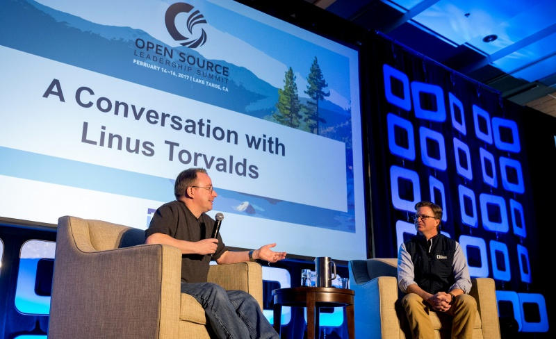
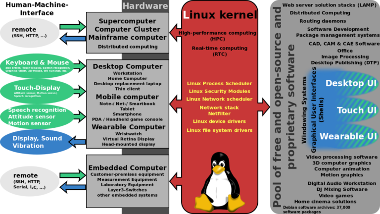

# Linux Kernel အကြောင်း သိကောင်းစရာ အပိုင်း (၃)

အရှေ့တပိုင်းမှာတော့ Linux kernel စတင်ခဲ့ပုံ တစိတ်တပိုင်းနဲ့ kernel ကို ရေးဖို့ အထောက်အကူ ဖြစ်စေခဲ့တဲ့ C programming စတင်ပုံ အကြောင်းအပြင် Unix ဆိုတဲ့ ရှေ့ဆောင် OS တစ်ခုရဲ့ အကျဉ်;ချုပ်ကို ဖော်ပြပေးခဲ့ပြီးပါပြီ။ ဒီ အပိုင်းမှာတော့ Linux kernel မှာ Linus Torvalds က တင်လာတဲ့ patch တွေကို ဘယ်လို စီမန်ခန့်ခွဲ သလဲဆိုတာရယ်၊ မတူတဲ့ distro တွေ Linux kernel ကိုအသုံးပြုပြီးတော့ အဆင့်ဆင့် ပုံပြောင်း အဆင့်မြင့်လာကြသလဲဆိုတာကို အကျဉ်းသဘောမျိုး ပြောပြချင်ပါတယ်။ နောက်ပိုင်းတော့ distro တစ်ခုစီမှာ မတူတဲ့ flavour တွေနဲ့လာသော လူကြိုက်များ လူသုံးများတဲ့ desktop environment တွေအကြောင်းကို အသေးစိတ်ရေးပါ့မယ်။ အရှေ့ပိုင်းမှာလည်း distro တော်တော်များများ အကြောင်းကို ကြုံရင် ကြုံသလို ရေးထားခဲ့ဘူးပါတယ်။ ဒီတစ်ခုကတော့ Linux kernel ရဲ့ သမိုင်းဝင် အဖြစ်လေးတွေနဲ့ သိထားသင့်တဲ့ အကြောင်းအရာလေးတွေကို ဦးစားပေး ပြီးတော့ ရေးချင်ပါတယ်။

## Linux kernel ရဲ့ development life-cycle တိုးတက်လာပုံ

Open Source ရဲ့ project တစ်ခုဖြစ်တဲ့ Linux kernel ဟာ အခုနှစ် ၂၀၁၇ခုနှစ်မှာတော့ ၂၅နှစ်တင်းတင်းပြည့်ခဲ့ ပါပြီ။ Operating System တစ်ခုဖြစ်ဖို့ မရှိမဖြစ်လို့အပ်တဲ့ Linux kernel ကိုအခုလို အခြေအနေထိရောက်လာအောင် ဘယ်သို့ဘယ်ပုံ Linus Torvalds တစ်ယောက် ချုပ်ကိုင်ထားသလဲဆိုတာတော့ စိတ်ဝင်စားဖို့ကောင်းပါတယ်။ ပုံမှန် software development တွေမှာတော့ developer တွေဟာ အခန်းတစ်ခုထဲမှာ ထိုင်ပြီးတော့ အလုပ်အတူတူလုပ်ကိုင် ပြီးတော့မှ ကောင်းမွန်ပြည့်စုံတဲ့ application တစ်ခုကိုရပါတယ်။ Linux project မှာတော့ အဲ့လိုမဟုတ်ပဲ ထူးခြားတာကတော့ Linux kernel ကို contribute လုပ်တဲ့ developer တွေဟာ လူမျိုးပေါင်းစုံ နိုင်ငံပေါင်းစုံ နေရာပေါင်းစုံကနေပြီးတော့ patch တွေကို submit လုပ်ကြပါတယ်။ အဲ့လို submit လုပ်လာတဲ့ code တွေကိုမှ maintainer တွေက စစ်ဆေးပြီး Linus Torvalds ဆီကိုရောက်ပါတယ်။ Linus Torvalds ကနေ တဆင့် လက်ရှိ kernel code တွေနဲ့ ဘယ်လိုလုပ်ရင် သင့်တော်မလဲဆိုတာကို ကြည့်ပြီးတော့မှ merge လုပ်ပါတယ်။ စမ်းသပ်လို့ အကုန်အဆင်ပြေရင်တော့ kernel ရဲ့ version အသစ်တစ်ခုအနေနဲ့ release လုပ်ပါတယ်။ ပြောသလောက် လွယ်ပေမယ့် တကယ် လက်တွေ့မှာတော့ အလွန်ရှုပ်ထွေးတဲ့ change process တစ်ခုပါ။ kernel development ရဲ့ ပထမ ၅နှစ် ၁၀နှစ်တွင်း မှာတော့ အဲ့ဒီ process ပိုင်းမှာ တော်တော်လေးကို အချိန်ကုန်ခဲ့ရပါတယ်။ Linus Torvalds ကိုယ်တိုင်က development cycle မှာ update တွေ patch တွေကို ပြင်ဆင်ရေးသားရတာ အဲ့ဒီလောက် အချိန်မကုန်ပဲနဲ့ release လုပ်ဖို့ကို contributor တွေစီကနေပြီး code collection၊ version control နဲ့ code တစ်ခုရဲ့ အားနည်းချက် အားသာချက်တွေကို ငြင်းခုန်နေကြရင်းနဲ့ပဲ အချိန်တော်တော်လေး ကုန်ခဲ့ရတယ်လို့ဆိုပါတယ်။ အဲ့ဒီလို ပြဿနာတွေကို ဖြေရှင်းဖို့ကို Linus Torvalds က ရိုးရှင်းပြီး အလုပ်ဖြစ်တဲ့ Git ဆိုတဲ့ version control system (VCS) ကို ၇ရက်နေ့ ဧပြီလ ၂၀၀၅ခုနှစ်မှာ စတင်မိတ်ဆက်ပေးခဲ့ပါတယ်။ နောက်ပိုင်းမှာတော့ တစ်ခြား developer တွေက ဆက်ပြီးတော့ ကောင်းသတဲ့ကောင်းအောင်လို့ ပြင်ဆင်ခဲ့ကြပါတယ်။ အခုအချိန်မှာတော့ Git Repository တွေကို hosting လုပ်ပေးထားတဲ့ GitHub ဆိုတဲ့ distributed version control နဲ့ source code management (SCM) system ဟာဆိုရင်ဖြင့် developer တိုင်း မရှိမဖြစ်အသုံးပြုကြတဲ့ collaboration platform တစ်ခုပါ။ တချို့ကလည်း GitHub ဟာ version control နဲ့ collaboration ပါမကပဲ publishing tool ပါလုပ်နိုင်တဲ့ 3-in-1 platform လို့လည်းဆိုပါတယ်။ Linux kernel မှာလည်း Git Repository တွေကိုသုံးပြီးတော့ kernel ကို လိုအပ်တဲ့ နေရာတွေကို ပြင်ဆင်ပြီးတော့ collaborate လုပ်ကြပါတယ်။ Linux kernel နဲ့ ပတ်သတ်တဲ့ ပြောင်းလဲလာပုံ အဆင့်ဆင့်ကိုသိချင်ရင်တော့ [www.kernel.org](http://www.kernel.org/) ဆိုတဲ့ website မှာ သွားရောက်ကြည့်ရှုလို့ရပါတယ်။

<figure><figcaption></figcaption></figure>

Linus Torvalds က ပြီးခဲ့ Open Source Leadership Summit 2017 မှာတော့ သူရဲ့ leadership ပုံစံကို ရှင်းပြပါတယ်။ သူဟာ trust system တစ်ခုကို ၂၅ နှစ်ကြာအောင်တည်ဆောက်ခဲ့ရပါတယ်တဲ့။ အစပိုင်းမှာတော့ contributor တွေ developer တွေကြားမှာတော်တော်လေးကို ပြဿနာများခဲ့ပြီး အချိန်တစ်ခုကို ဖြတ်သန်းလာခဲ့ပြီးနောက်ပိုင်းမှာတော့ အမာခံ maintainer တွေနဲ့ ယုံကြည်စိတ်ချရတဲ့ contributor အဝန်းအဝိုင်းတစ်ခုကို တည်ဆောက်နိုင်ခဲ့ပါတယ်တဲ့။ အဆင့်ဆင့်မှာ trust system ရဲ့ ကောင်းမွန်မှုကြောင့် သူဆီကို ရောက်လာတဲ့ patch တွေဟာဆိုရင် ပြန်ပြီးတော့ အများကြီး စိစစ်စရာမလိုတော့ဘူးလို့လည်း ဆိုပါတယ်။ Maintainer တွေရဲ့ အရေးကြီးပုံ နဲ့ ဘယ်လောက်ထိယုံကြည် ရသလဲဆိုတာကိုလည်း ရှင်းပြသွားခဲ့ပါတယ်။ သူ့ကတော့ သန့်စင်ပြီးသား patch ကို သက်ဆိုင်တဲ့ နေရာမှာ merge လုပ်ပေးရုံပါပဲလို့လည်း ပြောပါတယ်။ နောက်ပြီးတော့ သူအနေအားဖြင့် Git နဲ့ပတ်သတ်ပြီးတော့လည်း credit မလိုချင်ပါဘူးတဲ့… သူက ပထမဆုံး ၆လလောက်သာ Git ကို အသက်သွင်းပေးခဲ့ပြီတော့ development အဆင့်မှာတော့ တခြားဆက်လုပ်ကြတဲ့ developer ကို credit ပေးခဲ့ပါတယ်။

<figure><figcaption></figcaption></figure>

အခုချိန်မှာတော့ Linux kernel ရဲ့ project မှာ လွန်ခဲ့တဲ့ ၁၁ နှစ်လောက်ကစပြီးတော့ ပါဝင်ခဲ့တဲ့ company ပေါင်း ၁၃၀၀ ကျော်က developer ဦးရေ ၁၃၅၀၀ ကျော်တော်ရှိနေပါပြီတဲ့ဗျာ။ အဓိက sponsor လုပ်တဲ့ company တွေထဲမှာလည်း ထိပ်ဆုံးမှာတော့ Intel, Red Hat, Linaro, Samsung, SUSE, IBM, Renesas, Google, AMD, Texas Instruments နဲ့ ARM တို့ပါဝင်နေပါတယ်။ Linux ရဲ့ တိုးတက်နှုန်းကလည်း အခုလို contributor များစွာ၊ sponsor များစွာနဲ့ အရင်ထက်အများကြီးကို မြန်ဆန်လာပါတယ်။ နောက်ပြီးတော့ Linux platform က developer တွေဟာလည်း အရင်ကလို Open Source project တွေရဲ့ ထုံးစံအတိုင်း အခဲ့မဲ့ဆိုတာမျိုးတွေဟာလည်း မရှိသလောက်နည်းလာပါပြီ။ ICT industry အနေနဲ့ Linux platform မှာ ကျွမ်းကျင်သူတွေကို အသိအမှတ်ပြုတဲ့ သဘောမျိုးလည်းဖြစ်ပါတယ်။ အဲ့ဒါကြောင့်လည်း Linux နဲ့ ပတ်သတ်တဲ့ skills set တွေဟာအခုချိန်မှာ ပိုပြီးတော့ demanding ဖြစ်ပါတယ်။ တကယ်လည်း အသုံးဝင်တာကြောင့် Linux ကို SysAdmin တစ်ယောက်အနေနဲ့ပဲဖြစ်ဖြစ် DevOps တစ်ယောက်အနေနဲ့ပဲဖြစ်ဖြစ် Network Admin တစ်ယောက် အနေနဲ့ပဲဖြစ်ဖြစ် သိထားသင်တဲ့ environment တစ်ခုဖြစ်ပါတယ်။

## GNU/Linux Distribution များဆင့်ပွား ဖြစ်စဥ်

Operating System တစ်ခုရဖို့ အတွက်က အမှန်မှာတော့ kernel တစ်ခုတည်းနဲ့ မပြီး ပါဘူး။ အဲ့ဒီ kernelနဲ့ အလုပ်တွဲလုပ်တဲ့ package management system (PMS) လိုပါတယ်။ တနည်းအားဖြင့် kernel အပေါ်ကနေပြီးတော့ သက်ဆိုင်ရာ လုပ်ငန်းများကို လုပ်ဆောင်ဖို့အတွက် module တွေကိုထပ်ထည့်ပေးရပါတယ်။ အဲ့ဒီ module တစ်ခုစီမှာလည်း သက်ဆိုင် dependencies တွေ version control တွေကိုစစ်ဆေးဖို့ လိုအပ်ပါက main package/module မသွင်းခင်မှာ တခြား dependencies တွေကို အရင် download လုပ်ပြီး install လုပ်ပေးတာကတော့ package management system (PMS) ပဲဖြစ်ပါတယ်။ package တို့ module တို့ ဆိုတဲ့ နေရာမှာလည်း ကိုယ်လိုချင်တဲ့ လုပ်ငန်းဆောင်တာပေါ်မှာ မူတည်ပြီးတော့ အလုပ်လုပ်တဲ့ နေရာကွာသွားပါတယ်။ ဥပမာ language fonts နဲ့ ပတ်သတ်တဲ့ package တွေမှာဆို ဆိုင်ရာ fonts များကိုထည့်သွင်းပေးထားပါတယ်။ Display နဲ့ ပတ်သတ်တဲ့ package ဖြစ်တဲ့ X org လိုမျိုးမှာလည်း screen ပေါ်မှာ စာလုံးတွေ ရုပ်ပုံတွေမြင်နိုင်ဖို့ကို လုပ်ပေးတဲ့ graphic နဲ့ ဆိုင်တဲ့ လုပ်ဆောင်ချက်တွေလုပ်ပေးပါတယ်။ Distro ပေါ်မှာမူတည်ပြီးတော့ နဂိုအတိုင်းပါလာတဲ့ desktop environment တွေကလည်း ကွာသွားပြန်ပါတယ်။ ဆိုလိုချင်တာက kernel တစ်ခုတည်းနဲ့ ပြီးတဲ့ ကိစ္စမဟုတ်တဲ့အတွက် ဟန်ချက်ညီညီ အလုပ်လုပ်ဖို့ဆိုတာတော့ တခါတခါ တော်တော်ခက်တဲ့ အရာလည်းဖြစ်ပါတယ်။ အဲ့ဒါကြောင့် တချို့နေရာတွေမှာ GNU/Linux OS တွေမှာ driver ပြဿနာလေးတွေ အနည်းအကျဥ်းတော့ ရှိနိုင်ပါတယ်။ GNU/Linux distro ပေါ်မှာမူတည်ပြီးတော့မှ သူနဲ့ပါလာတဲ့ package manager တွေ၊ desktop environment တွေ၊ device driver တွေ စသည့်ဖြင့် အားလုံး ကွာခြားနိုင်ပါသေးတယ်။ နောက်တခါ device driver နဲ့ software ရဲ့ license ပေါ်မှာမူတည်ပြီးတော့ proprietary driver နဲ့ package အမျိုးအစားတွေ GNU/Linux မှာပါဝင် တတ်ပါတယ်။ အဲ့လိုမျိုး proprietary driver နဲ့ package တွေကိုတော့ closed-source ပုံစံလာပြီးတော့ binary file တွေအနေနဲ့ သာ ရနိုင်ပါတယ်။ အဲ့ဒီလို proprietary အနေနဲ့ထုတ်လာတဲ့ binary file တွေကို binary blobs လို့လည်းခေါ်ပါတယ်။

<figure><figcaption></figcaption></figure>

Linux kernel ရဲ့အစပိုင်းမှာတော့ minimal tools တွေနဲ့သာလာတဲ့ Boot-root၊ လူတိုင်းသုံးလို့ရအောင် ပေးထားပြီး ၁၉၉၂ ခုနှစ်လောက်က ထွက်လာတဲ့ MCC Interim Linux နဲ့ Softlanding Linux System (SLS)၊ ပြီးတော့ စီးပွားဖြစ် ထုတ်လာတဲ့ Yggdrasil Linux/GNU/X ဆိုတာမျိုးတွေ ရှိကြပါတယ်။ အဲဒါတွေပြီးတော့ ၁၉၉၃ ခုနှစ်လောက်မှာ Slackware ဆိုတဲ့ distro က SLS ကို အခြေခံပြီး ထွက်လာပါတယ်။ Slackware ဟာလည်း ပုံမှန် စနစ်တကျ maintain မလုပ်နိုင်လို့ဆိုပြီးတခါ Debian သက်တမ်းရှည် distro ကြီးတစ်ခုကို Ian Murdock က ၁၉၉၃ခုနှစ် နှစ်ကုန်လောက်မှာ ထပ်လောင်း တည်ဆောက်ခဲ့ပါတယ်။ လက်ရှိ Debian ကို အခြေခံထားတဲ့ distro ဆိုတာလည်း အများကြီးရှိလာပါပြီ။ မရှေး မနှောင်းဆိုသလို Red Hat ကလည်း Linux kernel ကိုသုံးပြီး ကိုယ်ပိုင်သီးသန့်ပုံစံနဲ့ commercial distro တစ်ခုကို ထုတ်ခဲ့ပါတယ်။ အခုချိန်မှာတော့ ပုံစံမျိုးစုံနဲ့ GNU/Linux distro ပေါင်း ၆၀၀ ကျော်လောက်ရှိမယ်လို့ဆိုပါတယ်။ တချို့ distro တွေမှာဆို binary file ကိုရဖို့ ကိုယ်ဟာကို source code ကနေမှ compile လုပ်ရပါတယ်။ ဥပမာ Gentoo လို distro မျိုးမှာဆို ကိုယ်လိုအပ်သလောက် အပိုင်းရဲ့ source code ကိုရယူပြီးတော့မှ compile လုပ်ပြီး bin file ကနေတဆင့် install လုပ်ရပါတယ်။ Distro တစ်ခုစီမှာ အစွဲမရှိပဲနဲ့ ကိုယ်နည်းကိုယ့်ဟန်နဲ့ Linux kernel ပေါ်မှာ system တည်ဆောက်ချင်ရင်တော့ Linux From Scratch (LFS) လို stripped လုပ်ထားတဲ့ အမျိုးအစားတွေလည်းရှိပါတယ်။ စိတ်ဝင်စားရင်တော့ [www.linuxfromscratch.org](http://www.linuxfromscratch.org/) မှာ သွားပြီးတော့ လေ့လာလို့ရပါတယ်။ LFS မှာ Linux kernel နဲ့ အလုပ်လုပ်ဖို့ အနည်းဆုံး လိုအပ်မယ့် compiler တွေ component တွေကိုထည့်ထားပေးပါတယ်။

<figure><figcaption></figcaption></figure>

ဒီအပိုင်းမှာတော့ Linux kernel ရဲ့ development life cycle နဲ့ ecosystem ကို နည်းနည်းလေး မိတ်ဆက်ပေးထားပါတယ်။ တခြား Operating System တွေနဲ့ မတူထူးခြားတာကတော့ developer တွေ contributor တွေပေါင်းများစွာကနေ trust system တစ်ခုထဲမှာ ပါဝင် အလုပ်လုပ်ကြပြီး အောင်မြင်တဲ့ project အသွင်ကိုပြောင်းလဲလာတာပဲဖြစ်ပါတယ်။ မလွယ်ကူလှတဲ့ change process၊ change management system တစ်ခုအောက်မှာ Linux ဟာ ၂၅နှစ်ကြာ ရှင်သန် ရင့်ကျက်လာခဲ့ပါတယ်။ တိုးတက်မှုပေါင်းများစွာနဲ့ ရှေ့ဆောင် system အဖြစ် အခုချိန်ထိ နေရာယူထားဆဲပါ။ Desktop မှာ Windows နဲ့ MacOS ကနေ နေရာယူထားတုန်းဖြစ်ပေမယ့်… server နဲ့ service platform တွေမှာတော့ Linux ဟာ Windows တို့ Apple တို့ ထက် အရှေ့အများကြီး ရှိနေတယ်လို့တော့ စာရေးသူထင်ပါတယ်။ ဒီနှစ်ပိုင်းတွေထဲမှာတော့ GNU/Linux desktop ကို အသုံးပြုသူများလာ နိုင်စရာရှိတယ်လို့တော့ ခန့်မှန်းချက်ထုတ်ထားပါတယ်။ မည်သို့ပင် ဖြစ်စေ Open Source project ဖြစ်တဲ့ Linux ကတော့ လက်ရှိမှာ computing လောကကြီးကို အများကြီး ပြောင်းလဲတိုးတက်စေခဲ့ပါတယ်။ လက်တွေမှာတော့ Linux kernel ရဲ့ကောင်းမွေတွေကြောင့် virtualisation platform တွေ၊ cloud computing platform တွေ နဲ့ containerization တွေဟာ နောင်အနာဂတ်မှာ မရှိမဖြစ် ဆက်လက်တိုးပွား ကောင်းမွန်လာမယ်ဆိုတာကိုတော့ နည်းပညာလောကထဲက လူတိုင်း ရိပ်စားမိကြမှာပါ။ ဒီ post ကိုတော့ အခုဒီ အပိုင်းနဲ့တင် အဆုံးသတ်လိုက်ပါ့မယ်။ Linux kernel နဲ့ ပတ်သတ်တာလေးတွေကို စာဖတ်သူတွေ အနေနဲ့ ဒီ post မှာ လေ့လာခွင့် အနည်းငယ်ရလိမ့်မယ်လို့ မျှော်လင့်မိပါတော့တယ်။
