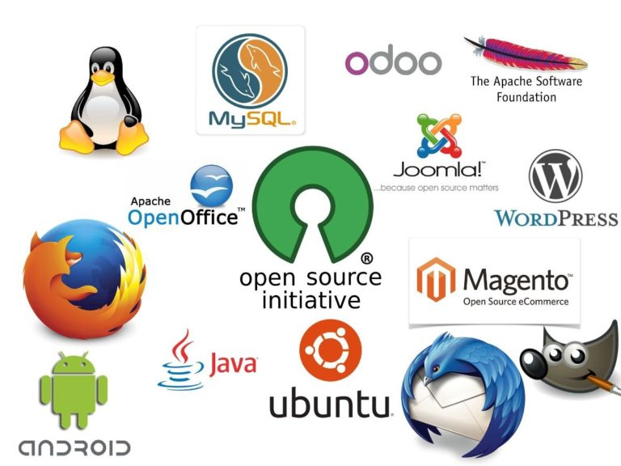
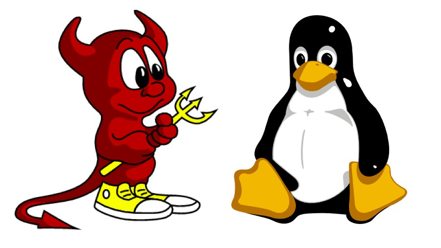
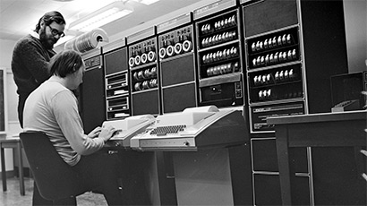
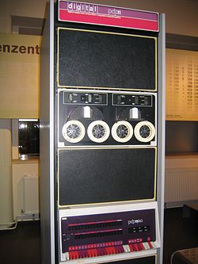
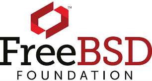
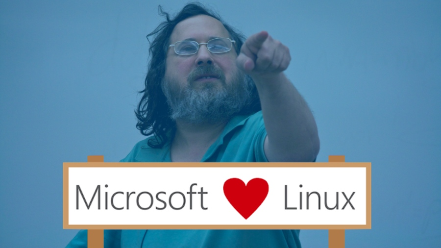

# Open source သင်ခန်းစာများ အပိုင်း(၁)

Open source နဲ့ ပတ်သတ်ရင် စာရေးသူဆီမှာ ပြောစရာတွေ အမြဲတမ်း ရှိနေတတ်ပါတယ်။ နည်းပညာလောကထဲက မိတ်ဆွေတွေနဲ့ တွေ့တိုင်း Linux အကြောင်း၊ open source အကြောင်းကို ကလေးတစ်ယောက်လို မနားတမ်းပြောတတ်တဲ့ အကျင့်ကြီးကလည်းပါလို့နေပါပြီ။ ကိုယ့်ဟာကိုလည်း တခါတလေ နားထောင်တဲ့လူ စိတ်ပျက်သွားမှာ စိုးရိမ်လို့ အရှိန်လျှော့ရတာလည်း အကြိမ်ကြိမ်ပါပဲ။ တခါတခါတော့လည်း ငါ inspired ဖြစ်သလို၊ နည်းပညာလောကထဲက ငါ့မိတ်ဆွေတွေလည်း inspired ဖြစ်မှာပဲ၊ စိတ်ဝင်စားကျမှာပဲ၊ အသုံးတည့်ကြမှာပဲ ဆိုပြီးတော့ ကိုယ့်ဟာကို ဖြည့်တွေးမိပါတယ်။ ဘယ်လိုပဲဖြစ်ဖြစ် လွတ်လပ်စွာ သုံးစွဲခွင့်ပေးထားတဲ့ software တွေအကြောင်း စာရေးသူ လွတ်လပ်စွာပြောဆိုရေးသားခွင့် ရှိတာကိုတော့ မည်သူမှ မေးခွန်းထုတ်မယ်လို့ မထင်ပါ။ Open source မှာရှိတဲ့ story တွေဟာ စိတ်ဝင်စားဖို့ကောင်းသလို၊ စိတ်ခွန်အားလည်း ရစေပါတယ်။ အစကတည်းက Free Software တို့ Open Source တို့ ဆိုတဲ့ title နဲ့လာပြီဆိုရင် နည်းပညာလောကမှာ အလွယ်တကူ ပယ်လိုက်ကြပါတယ်။ မည်သို့ပင်ဖြစ်စေကာမူ လက်ရှိမှာတော့ နည်းပညာလောကထဲမှာ အခက်အခဲဆုံးသော ပြဿနာတွေကို open source community ကြီးပဲဖြေရှင်းပေးနေရတာ နှစ်အနည်းလောက်တောင် ရှိတော့မယ်လို့ ထင်ပါတယ်။ ဒီလို story မျိုးမှ စိတ်မဝင်စားရင်၊ inspired မဖြစ်ရင် စာရေးသူတို့ဆီမှာ ပြောစရာ နည်းပညာနဲ့ပတ်သတ် story ကောင်းကောင်း ရှိနိုင်မှာမဟုတ်ပါဘူး။ အခြားသော နည်းပညာနယ်ပဲထဲက tech giant တွေဖြစ်တဲ့ Microsoft တို့ Apple တို့လို story တွေဟာ စာရေးသူအတွက်တော့ လောဘနဲ့ အတ္တတို့ ဖွဲ့စည်းထားပုံရလို့ ဘယ်တော့မှ ဘဝင်မကျခဲ့တာအမှန်ပါ။

Linux နဲ့ သူ့ environment မှာသုံးတဲ့ tools တွေနဲ့ အထိအတွေ့ ရှိခဲ့သော်လည်း Open source တို့ Linux တို့ဆိုတဲ့ အသံကြားရုံနဲ့ စိတ်လှုပ်ရှားခဲ့တာမျိုး ဘယ်သောအခါမှာ မရှိခဲ့ဘူးပါ။ ဒီနောက်ပိုင်းနှစ်တွေမှာ open source အကြောင်းတွေရှာဖတ်တယ်၊ သိလည်းသိချင်တယ်၊ အများကြီးလည်း သိဖို့ကျန်နေသေးတယ်လို့ ကိုယ်ကိုကိုယ် ထင်မိပါတယ်။ Open source မှာရတဲ့ အသိပညာ အတတ်ပညာ တွေဟာ စာရေးသူအတွက်တော့ နည်းပညာလောကထဲမှာ လေ့လာသင်ယူ နိုင်မှု အရှိန်အဟုန်တွေကို တွန်းတင်ပေးသလိုလည်းခံစားမိပါတယ်။ ဒါ့အပြင် Linux ရယ်လို့ ဖြစ်လာဖို့ အတွက် အများကြီးအရေးပါတဲ့ Free Software ဆိုတဲ့ movement နဲ့ GNU GPL ဆိုတဲ့ philosophical thought process ကိုလည်း အရမ်းကိုသဘောကျပါတယ်။ မည်သို့ပင် ခံယူချက်တွေ မတူလို့ ကွဲကြပြဲကြရှိခဲ့သော်လည်း နောက်ဆုံး ရလဒ်က စုပေါင်းအားဆိုတဲ့ synergy ကြောင့်သာ လက်ရှိ open source ဆက်လက်ရပ်တည် နေတာကိုတော့ ငြင်းလို့ မရပါဘူး။

<figure><figcaption></figcaption></figure>

အမှန်တကယ်တော့ ဒီ post မှာရေးချင်တဲ့ အကြောင်းအရာက BSD ပါ။ နောက်ပြီးတော့ BSD ဟာ Linux နဲ့ဘယ်လို ကွာသလဲ၊ ဘယ်လို တူသလဲဆိုတဲ့ အကြောင်းလေးတွေကို ဆွေးနွေးပြချင်တာပါ။ BSD အကြောင်းကို ဦးတည်ပြီးရေးဖို့ဆိုရင် အကြောင်းအရာတော်တော်များများက GNU/Linux နဲ့ ခပ်ဆင်ဆင်သွားတူနေတာကို တွေ့ပါလိမ့်မယ်။ သို့သော် Linux ရဲ့ story ကစိတ်လှုပ်ရှားစရာကောင်းပါတယ်။ BSD ကတော့ နည်းပညာနယ်ပယ် ပုံစံခွက်ထဲက ထွက်လာတဲ့ ပုံစံမှန်တဲ့ operating system တစ်ခုလို့ဆိုရင်လည်း မမှားပါဘူး။ နှစ်ပိုင်းအရတော့ BSD က GNU/Linux ထက် ၂၁၊ ၂၂ နှစ်လောက်တော့ ပိုစောမယ် ထင်ပါတယ်။ BSD ဖြစ်ပေါ်လာပုံကလည်း Linux အလားတူ စိတ်ဝင်စားစရာတွေအများကြီးရှိလို့နေပါတယ်။ နှစ်ခုလုံးကို ယှဉ်ကြည့်လိုက်ပြန်တော့လည်း open source ကနေ သင်ယူစရာ သင်ခန်းစာတွေ မကုန်နိုင်အောင်ပါပဲ။ ဒါကြောင့် ခေါင်းစဉ်ကို open source သင်ခန်းစာများ ဆိုပြီးတော့ ကယောင်ကတန်း ပေးလိုက်တာပါ။

<figure><figcaption></figcaption></figure>

Linux အကြောင်းတွေ ရေးတာများလာလို့ အခြား open source အကြောင်းလေးတွေ ရေးမယ်ဆိုပြီး စိတ်ကူးတာတော့ ကြာပါပြီ။ BSD ကနေတဆင့် ပေါက်ဖွားလာတဲ့ အချို့အချို့သော project လေးတွေကလည်း လက်ရှိအချိန်ထိ နည်းပညာနယ်ပယ်ထဲမှာ တွင်တွင်ကျယ်ကျယ် အသုံးတည့်လို့နေတုန်းပါ။ စာရေးသူကိုယ်တိုင် လက်ရှိမှာ BSD က tools လေးတွေအချို့ကို နေ့စဉ်အသုံးပြုနေရလို့ stable ဖြစ်မဖြစ်ဆိုတာကို ပိုပြီးတော့သိလို့လာပါတယ်။ ဒီလိုနဲ့ ဒီ post ကိုရေးဖို့ စပြီးတော့ စဉ်းစားမိခဲ့တာပဲဖြစ်ပါတယ်။ တချိန်တည်းမှာပဲ… BSD ဆိုတဲ့ အကြောင်းအရာချရေးဖို့က စာရေးသူအတွက် တော်တော်လေးလည်း တာဝန်ကြီးပါတယ်။ လိုအပ်တဲ့ အချက်အလက်နဲ့ ဖြစ်စဉ်တွေ မပြည့်စုံမှာကိုလည်း အနည်းငယ်စိတ်ပူမိပါတယ်။ BSD အကြောင်းလေးလည်း ပြောရင်း Linux နဲ့ဘယ်လိုခြားနားသွားသလဲဆိုတာကိုလည်း နှုိင်းယှဉ်ရအောင်လို့ပါ။ ကဲ… BSD ကို အကျဉ်းချုပ် မိတ်ဆက်ပေးလိုက်ရအောင်…

### BSD ဆိုသည်မှာ

BSD ဆိုတာကတော့ Berkeley Software Distribution ကိုအတိုခေါက်ပြီးခေါ်ဆိုထားတာပါ။ Berkeley ဆိုတာက University of California, Berkeley မှာ ၁၉၇၇ခုနှစ်တုန်းက အစပျိုးခဲ့တာကြောင့်ပါ။ မူလကတော့ AT\&T သို့မဟုတ် Bell Labs ကစတင်ခဲ့တဲ့ Unix ကို ချဲ့ထွင်ပြီးတော့ open source ဆိုတဲ့ခေါင်းစဉ်အောက်မှာ university က research လုပ်တဲ့အခါ အသုံးပြုနိုင်အောင်လို့ ကြိုးပမ်းအားထုတ်ခဲ့ကြတာပါ။ အဲ့ဒါကြောင့် Research Unix ရယ်လို့လည်း အစောပိုင်းမှာတုန်းက ခေါ်ဆိုခဲ့ကြပါတယ်။ တဖြေးဖြေးနဲ့ Berkeley Unix လို့လည်း ခေါ်ပါတယ်။ Berkeley မှာအသုံးပြုတဲ့ Unix ပေါ့လေ။ BSD Unix လို့လည်း တချို့က ခေါ်ကြပြန်ပါတယ်။ နာမည်တွေအများကြီးရှိသော်လည်း BSD လို့ဆိုလိုက်ရင် အကုန်လုံးကို ခြုံငုံမိမယ်လို့ထင်ပါတယ်။

<figure><figcaption></figcaption></figure>

BSD အစပြုပုံက ၁၉၇၄ ခုနှစ်ထဲမှာ Bob Fabry ဆိုတဲ့ computer science professor က Unix ရဲ့ distribution အချို့ကို Bell Labs ကနေ မှာယူလိုက်ပါတယ်။ အဓိက ကတော့ သူတို့ university lab ထဲမှာအသုံးပြုနေတဲ့ PDP-11/45 minicomputer ပေါ်မှာတင်ပြီးတော့ သုံးလို့ရအောင်လို့ ရည်ရွယ်တာပါ။ PDP-11/45 minicomputer လို့ဆိုသော်လည်း အရွယ်အစားအရတော့ လက်ရှိ စာရေးသူတို့ အသုံးပြုနေတဲ့ personal computer (PC) ဆိုတာထက် အစပေါင်းများစွာကြီးပါတယ်။ ၁၉၇၀ ခုနှစ်တွေထဲ မှာတော့ Digital Equipment Corporation (DEC) ကထုတ်တဲ့ PDP-11 ဟာ computer science သမားတွေအတွက် အကောင်းဆုံး အစွမ်းဆောင်နိုင်ဆုံးသော computing powerhouse တစ်ခုပါ။ တန်ဖိုးကလည်း များလွန်းလို့ Berkeley လိုနေရာမျိုးမှာတောင် စက်ကတစ်လုံးတည်းရှိပြီးတော့ သူတို့ computer science faculty က အခြားသော faulty တွေဖြစ်တဲ့ mathematics နဲ့ statistics သမားတွေနဲ့ မျှပြီးတော့သုံးရပါတယ်။ တစ်နေ့ကို computer science ရဲ့ ဝေစု ၈နာရီ ကို မနက် သို့မဟုတ် ညပိုင်း အားရင်အားသလို အလှည့်ကျအသုံးပြုရပါတယ်။ အဲ့လိုနဲ့ တစ်နှစ်ကြာတဲ့အချိန်မှာ Bell Labs က Ken Thompson ဆိုတဲ့ ပုဂ္ဂိုလ်က Berkeley မှာ အချိန်ပိုင်း professor လာလုပ်တုန်း Version 6 Unix ကို lab computer ပေါ်တင်ပေးခဲ့ပါတယ်။ ပြီးတော့ Pascal ဆိုတဲ့ programming language တစ်ခုကို အစပျိုးဖြစ်ခဲ့ပါတယ်။ နောက်ပိုင်းမှာတော့ အဲ့ဒီ university ကျောင်းကနေ ကျောင်းပြီးထားတဲ့ ကျောင်းသားဟောင်း Chuck Haley နဲ့ Bill Joy တို့ဟာ Pascal ကိုပိုကောင်းအောင် ပြင်ဆင်ပြီးတော့မှ ex (EXtended) ဆိုတဲ့ text editor တစ်ခုကို အဲ့ဒီ Pascal platform နဲ့ပဲ ရေးခဲ့ကြပါတယ်။ GNU/Linux မှာ GNU Emacs text editor ကနေစလိုက်သလိုမျိုးပဲ BSD မှာလည်း ex text editor ကနေ အစပျိုးခဲ့လို့ ဒီနေရာမှာ မှတ်သားစရာ တစ်ခုက BSD တို့ GNU/Linux တို့လို operating system တစ်ခုလုံးဖြစ်ဖို့အတွက် text editor လို project သေးသေးလေးတွေ မျိုးစေ့ချဖို့အတွက် မရှိမဖြစ်လိုအပ်တယ် ဆိုတာပါပဲ။ ex text editor နည်းတူ အခြားသော software တွေကို တခြား university တွေကလည်း စိတ်ဝင်စားလို့ Bill Joy က တစုတစည်းတည်းဖြစ်အောင်လို့ ပထမဆုံး BSD ဖြစ်တဲ့ 1BSD ကို အားလုံးအတွက် ၁၉၇၈ ခုနှစ်မှာ ထုတ်ဝေလိုက်ပါတယ်။ အဲ့ဒီတုန်းက Version 6 Unix မှာ အသုံးပြုလို့ရတဲ့ add-on software တွေအနေနဲ့တာထုတ်ဝေခဲ့တာဖြစ်ပြီး၊ operating system တစ်ခုဖြစ်ဖို့ရာ အတွက်တော့ အများကြီး လိုပါသေးတယ်။ 4.3BSD ထိတိုင်အောင် proprietary ဖြစ်တဲ့ AT\&T Unix code နဲ့ သူ့ရဲ့ software license အောက်မှာပဲ BSD ဟာထုတ်ဝေခဲ့တာပါ။

<figure><figcaption></figcaption></figure>

AT\&T ရဲ့ license အောက်ကနေထွက်ဖို့အတွက် ၁၉၈၉ခုနှစ်မှာ ကိုယ်ပိုင် source code နဲ့ BSD license ဆိုပြီးတော့ open source license တခုကို စတင်ပြုစုပျိုးထောင် လိုက်ကြပါတော့တယ်။ ဒါကတော့ BSD ရဲ့ ခရီးစဉ် အစပိုင်းဖြစ်ပြီးတော့ အဲ့ဒီနောက်ပိုင်းမှာတော့ Unix System Laboratories (USL) က licensing နဲ့ ပတ်သတ်တဲ့ lawsuit နဲ့တရားစွဲလို့ တရားစီရင်ရေး ခရီးကြမ်းကို ၂နှစ် ၃နှစ် လောက်ကြာအောင် ဆက်လှမ်းရပါတယ်။ တရားစွဲထားတဲ့ ကိစ္စတွေ ၁၉၉၄ ခုနှစ်အစပိုင်းလောက်မှာ အဆုံးသတ်နိုင်ခဲ့ပြီးတော့၊ နှစ်အလယ်လောက်မှာတော့ 4.4BSD ဆိုပြီးနောက်ဆုံးသော release နှစ်ခုကိုထက်ထုတ်လိုက်ပါသေးတယ်။ BSD က 4.4BSD-Lite Release 2 မှာတင်အဆုံးသတ်သွားပါတယ်။ 4.4BSD မှာ version နှစ်မျိုးနဲ့ထွက်လာခဲ့ပါတယ်။ တစ်ခုကို 4.4BSD-Lite လို့ခေါ်ပြီး၊ နောက်တစ်ခုကတော့ 4.4BSD-Encumbered ဆိုပြီးတော့ပဲဖြစ်ပါတယ်။ အမှုတွေနဲ့ရင်ဆိုင်လိုက်ရလို့ 4.4BSD-Lite မှာ AT\&T က code တွေမပါအောင် ပြန်လုပ်ထားရပါတယ်။ နောက် တစ်ခုဖြစ်တဲ့ 4.4BSD-Encumbered ကတော့ AT\&T license အောက်မှာထုတ်ခဲ့တာဖြစ်ပါတယ်။ 4.4BSD-Lite Release 2 ပြီးတော့ ထက်မထွက်လာတဲ့ အတွက် community ထဲကလူတွေ BSD-Lite ရဲ့ code-base ပေါ်မှာအခြေခံပြီးတော့ အဆင့်ဆင့်ပွားထုတ်လိုက်တာဖြင့် FreeBSD၊ NetBSD၊ OpenBSD နဲ့ DragonFly BSD တို့ဆိုပြီးတော့ ထွက်ပေါ်လာကြပါတယ်။ Linux ရဲ့ distro တွေမှာလိုပဲ အခြားအခြားသော BSD ရဲ့ variants တွေရှိပါသေးတယ်။ Linux မှာလောက်တော့ အများကြီးမရှိပါဘူး။ FreeBSD တို့၊ OpenBSD တို့လောက်တော့ လူသိမများကြပါဘူး။

<figure><figcaption></figcaption></figure>

အထက်မှာပြောသွားတဲ့ BSD ရဲ့ variants တွေအကုန်လုံးဟာ BSD license ကို အသုံးပြုထားတာဖြစ်တဲ့အပြင် permissive ဆိုတဲ့ အမျိုးအစား ထဲမှာပါလို့ source code ကို လွတ်လပ်စွာ အသုံးပြုခွင့်ပေးထားပါတယ်။ GNU GPL ထက်စာရင် BSD license က ပိုပြီးတော့တိုလည်းတိုတယ်၊ ရှင်းရှင်းနဲ့ လိုရင်း ဖြစ်အောင် စာကြောင်း ၃ ကြောင်းထဲထည့်ထားပါတယ်။ 3-Clause BSD License လို့ အင်္ဂလိပ်လို သိထားကြပါတယ်။ နောက်ပိုင်းမှာ အချိန်ရရင်ဖြင့် open source မှာ အခြားအသုံးပြု လို့ရတဲ့ license တွေအကြောင်းလည်း တစ်ခုခြင်းစီ ရေးသွားပါ့မယ်။ အခုတော့ BSD အကြောင်း ဆက်ပြီးတော့ ပြောပါ့မယ်။ BSD-Lite ရဲ့ source code ကို open source/ free ရတဲ့ variants တွေသာယူသုံးတာ မဟုတ်ပဲ၊ အဲ့ဒီအချိန်တုန်းထဲကစလို့ proprietary တွေဖြစ်တဲ့ Apple တို့၊ Microsoft တို့၊ Cisco တို့၊ Juniper တို့ ကလည်း BSD-Lite ရဲ့ code-base ကိုလိုသလောက် အသုံးချခဲ့ကျပါတယ်။ ဘယ်လောက်တောင်ဖြစ်သွားသလဲဆိုရင် Unix က စီးပွားဖြစ်ထုတ်တဲ့ Solaris လို operating system မျိုးမှာတောင်မှ BSD ရဲ့ code တွေယူသုံးလားတာတွေခဲ့ရပါတယ်။ BSD အတွက်တော့ ထိုထိုသော proprietary company ကြီးတွေက အပြန်အလှန်သဘောနဲ့ ထိရောက်ရဲ့ contribution မျိုး ပြန်လည်ပေးဆက်ခဲ့တာမရှိပါဘူး။ ဒီနေရာမှာ စာရေးသူတို့ လေ့လာသင်ယူရမည့် သင်ခန်းစာကတော့ open ဖြစ်သော်လည်း control မရှိတဲ့ license မျိုးကို proprietary တွေအခုလိုမျိုး အနိုင်ကျင့်တတ်ပါတယ်။ ဒါကြောင့်လည်း Richard Stallman (RMS) က source code ကိုယူသုံးပြီးရင် လိုက်နာရမည့် ဘောင်လေးတွေကို သူ့ရဲ့ GNU GPL မှာထည့်သွင်းလာခဲ့တာပဲဖြစ်ပါတယ်။ open source သမားတွေစိတ်နာမယ်ဆိုလည်း စိတ်နာချင်စရာကြီးပါ။ ထိုထိုသောအကြောင်းတွေကြောင့်လည်း စာရေးသူတို့ အခုမြင်နေရတဲ့ Microsoft Loves Linux ဆိုတာကြီးက မိအေးနှစ်ခါနာများ ဖြစ်နေမလာဆိုပြီးတော့ စိတ်ပူနေရပါတယ်။ သို့သော် လက်ရှိမှာတော့ Microsoft ဟာ Linux community အတွက် major contributor အနေနဲ့ ရပ်တည်နေပါတယ်။ Linux ဘက်ကလည်း Canonical လို company ကြီးတွေက Microsoft ရဲ့ subsystem ဖြစ်တဲ့ WSL အတ္ွက် သူ့ရဲ့ distro အခွဲတစ်ခုပမာ active project တွေ အများကြီးလုပ်ပေးနေပါတယ်။ အလုပ်အတွက် Windows ကိုမရှိမဖြစ်အသုံးပြုနေရသေးတဲ့ developer တွေနဲ့ DevOps သမားတွေအတွက် WSL ကထွက်ပေါက်တစ်ခုပါ။ WSL မှာလည်း အများကြီးတိုးတက်စရာတွေ ကျန်နေသေးတယ်လို့ စာရေးသူထင်မိပါတယ်။

<figure><figcaption></figcaption></figure>

BSD အကြောင်းနဲ့ open source သင်ခန်းစာလေးတွေ အကြောင်းကို ဒုတိယပိုင်းမှာ ဆက်ပြီးတော့ ရေးသွားချင်ပါတယ်။ Topic ကနည်းနည်းလေး အရေးပါလို့ post တစ်ခုထဲနဲ့ မလုံလောက်မှာကိုလည်း ဂရုစိုက်ရပါတယ်။ စာအရမ်းကြီးရှည် သွားရင်လည်း ဖတ်ရတာ ပျင်းသွားမှာစိုးပါတယ်။ အဲ့ဒီတော့ ဒီ post ကို ဒီမှာတင်ပဲရပ်လိုက်ပါတော့မယ်။
