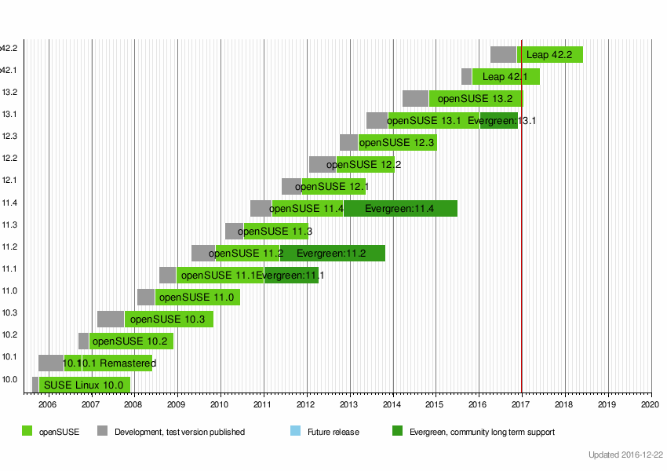

# လူသုံးများ ရေပန်းစားသော GNU/Linux Distro များ အပိုင်း (၆)

**၆. openSUSE**

openSUSE ကိုတော့ SUSE Linux လို့ခေါ်တဲ့ ဥရောပတခွင်မှာ နာမည်ကျော်ကြားတဲ့ distro ကနေ community အတွက် open source project တစ်ခုအနေနဲ့ပြန်ထွက်လာတဲ့ distro တစ်ခုပါ။ Red Hat ရဲ့ RPM ကိုအမှီပြုထားပြီး Slackware ဆိုတဲ့ ရှေးဟောင်း distro တစ်ခုကို အခြေခံပြီး ပြန်လည် စမ်းသစ်ထားတာပါ။ SUSE ရဲ့ အရှည်ကတော့ ဂျာမန်လို Software und System-Entwicklung ကိုယ်စားပြုထားပြီး အင်္ဂလိပ်လိုတော့ software and systems development လို့ အဓိပ္ပာယ်ပါတယ်။ သူ့ကို developer တွေ နဲ့system administrator တွေအတွက် အဆင့်မြင့်နည်းပညာတွေအသုံးပြုထားတဲ့ distro တစ်ခုလည်းဖြစ်ပါတယ်။ SUSE Linux ကိုတော့ ၁၉၉၂ခုနှစ်မှာ ဂျာမနီက Linux ကိုရူးသွပ်ကြသူ တွေ ဖြစ်တဲ့ Roland Dyroff, Thomas Fehr, Hubert Mantel နဲ့Burchard Steinbid ဆိုသူ လေးယောက်ကစတင်လိုက်ကြပါတယ်။ Fehr တစ်ယောက်တည်း software engineer အဖြစ်အလုပ်လုပ်နေပြီးတော့ ကျန်တဲ့ သုံးယောက်ကတော့ အဲ့ဒီ ကုမ္ပဏီထောင်တုန်းက ကျောင်းသားတွေပဲရှိပါသေးတယ်။ SUSE ကတော့ ဥရောပမှာ တစ်ခုသော စီးပွားဖြစ်ထုတ်လုပ်တဲ့ အောင်မြင်သော distro တစ်ခုဖြစ်ပါတယ်။ ပထမ ကတော့ community အတွက် ထုတ်ပေးတာမျိုးမရှိပဲနဲ့နောက် Novell က ၂၀၀၃ခုနှစ်မှာ ဝယ်လိုက်ပြီးနောက် ၂၀၀၅ခုနှစ်မှာ openSUSE distribution နဲ့ openSUSE project က community အတွက်ချပေးလိုက်ပါတော့တယ်။ အဲ့ဒါကြောင့် ၂၀၀၅ နောက်ပိုင်းမှာ Novell ရဲ့ openSUSE certification နဲ့distro ရဲ့ အောင်မြင်မှုစတင်ရရှိလာခဲ့ပါတယ်။ စာရေးသူရဲ့ ပထမဆုံး Linux ကိုတော့ ၂၀၀၈ခုနှစ်မှာ openSUSE နဲ့စတင်လေ့လာတွေ့ရှိခဲ့ရပါတယ်။ အဲ့ဒီတုန်းကတော့ openSUSE က graphic ပိုင်းမှာ တခြား distro တွေအတိုင်းသိပ်မကောင်းတော့ စာရေးသူအနေနဲ့သိပ်မကြိုက်ပါဘူး။ နောက်ပိုင်းမှ နားလည်လိုက်ရတာကတော့ Linux ကို အလှအတွက်အသုံးပြုတာမဟုတ်ဘူး developer တွေ sysadmin တွေအတွက်အဆင်ပြေအောင် လုပ်ထားတယ်ဆိုတာသိရတာပါ။ openSUSE ကို စတင်အသုံးပြုကတည်း အဆင်ပြေပြေသုံးနိုင်တဲ့ YaST နဲ့YaST2 ကို သတိထားမိပါတယ်။ YaST ကတော့ Yet another Setup Tool ရဲ့ အတိုကောက်ပါ။ SUSE ကမိတ်ဆက်ပေးလိုက်တဲ့ Linux မှာ အဆင်ပြေပြေ အသုံးပြုနိုင်တဲ့ tool ပါ။

<figure><figcaption></figcaption></figure>

Novell ရဲ့ ဆုံးဖြတ်ချက်တစ်ခုကြောင့် FLOSS community က openSUSE တော်တော်လေး ဝေဖန်ခဲ့ကြပါတယ်။ ဖြစ်ပုံက ၃ရက်နေ့ နိုဝင်ဘာလ ၂၀၀၆ မှာ Novell က Microsoft နဲ့စာချုပ်တစ်ခု လက်မှတ်ထိုးလိုက်ပါတယ်။ ၂၅ရက် ဇူလိုင်လ ၂၀၁၁ခုနှစ်မှာ အဲ့ဒီ စာချုပ်ကိုပဲ ထပ်မံတိုးချုပ်လိုက်ပါတယ်။ စာချုပ်အရ Microsoft က openSUSE ရဲ့ product တွေကို Microsoft အတွက် အလုပ်ဖြစ်အောင် ပူးတွဲလုပ်ဆောင်ရမှဖြစ်မှာပါ။ ပြီးတော့ product တွေကိုလည်း Microsoft ရဲ့ သတ်မှတ်ထားတဲ စည်းမျဉ်းအတိုင်း patent လုပ်ဖို့ရာဖြစ်ပါတယ်။ အဲ့ဒီတော့ ပြီးခဲ့တဲ့တစ်လက Microsoft က Linux Foundation ကို platinum partner အနေနဲ့ပူးပေါင်းခဲ့တာ ပထမဆုံး အကြိမ်လို့တောင်ပြောလို့မရပါဘူး။ ၂၀၀၆ မှာကတည်းက Microsoft က Linux ရဲ့ product တွေကိုကပ်ကြွေနေပြီ လက်ဝါးကြီးအုပ်ဖို့ ကြိုးစားနေခဲ့တာပါ။ နောက်တခါ Novell က SUSE ကို Attachmate Group ထပ်မံပြီးတော့ရောင်းလိုက်ပါတယ်။ နောက်ပိုင်းမှာတခါ ၂၀၁၄ခုနှစ်မှာ Micro Focus ဆိုတာနဲ့လည်း ပူးပေါင်းလိုက်တဲ့အတွက် openSUSE community အတွက် တော်တော်လေးကို အခက်ကြုံရပါတယ်။ ဒါကိုကြည့်ခြင်းအားဖြင့် Open Source မှာလည်း license တွေ နဲ့စီးပွားဖြစ်လုပ်တဲ့အခါမှာ လောဘသမားတွေရဲ့ အမြတ်အစွန်းထုတ်လိုမူနဲ့ထိပ်တိုက်ရင်ဆိုင်ရတာကို လေ့လာတွေ့ရှိရပါတယ်။ ဆုံးဖြတ်ချက်တွေမှားရင်လည်း distro ရဲ့ အနာဂတ်အတွက် ထိခိုက်ရပါတယ်။ အခုချိန်ထိတော့ Red Hat ကတော့ Enterprise မှာ အောင်မြင်နေဆဲပါ။ ၂၀၁၄ခုနှစ် ၂၀၁၅ ခုနှစ်ထိတော့ VMware ရဲ့ virtual appliance တွေကို SUSE နဲ့လာပါတယ်။ နောက်ပိုင်းတော့ စာချုပ်ကိစ္စ license ကိစ္စ တွေကြောင့်ထင်ပါတယ် SUSE နဲ့မလာတော့ဘူးလို့စာရေးသူသတိထားမိပါတယ်။

<figure><figcaption></figcaption></figure>

**openSUSE ရဲ့ အားသာချက်များ**

သုံးရတာလွယ်ကူတဲ့ YaST လို tool တွေရှိတဲ့အတွက် Microsoft မှာ Control Panel လို အကုန်စုစည်းပေးထားတာကြောင့် Linux စတင်အသုံးပြုတွေတော့ အဆင်ပြေမှာပါ။ RPM ကိုအသုံးပြုထားတဲ့ အတွက် software တွေ package တွေတော်တော်များကို အသုံးပြုလို့ပါတယ်။ openSUSE community နဲ့သူ့ documentation ကကောင်းလို့ပြဿနာ ဖြစ်တာနဲ့ရှာရ ဖွေရ လွယ်ပါတယ်။ အစကတည်း SUSE က documentation ကောင်းတာနဲ့နာမည်ရပြီးသားပါ။

**openSUSE နဲ့ ဆင်တူတဲ့ distro များ**

Slackware ကနေဆင်သက်လာတဲ့အတွက် Slackware နဲ့တော့ နီးစပ်ပါတယ်။ openSUSE ကတော့ သူ့ဟာသူ အသစ်ထုတ်ပြင်ဆင်ရင်းနဲ့ကိုယ်ပိုင်သီးခြား ပုံစံမျိုးဖြစ်နေပါတော့တယ်။ YaST ကိုလည်း SUSE ကလွဲလို့တခြား distro မှာ အသုံးပြုတယ်လို့တော့ မထင်ပါဘူး။

**လက်ရှိ openSUSE version နဲ့release cycle**

openSUSE ကတော့ server အတွက်ကော desktop အတွက်ပါထုတ်ပါတယ်။ KDE နဲ့ကော Gnome နဲ့ကော ကိုယ်ကြိုက်တဲ့ desktop ကိုရွေးပြီး အသုံးပြုလို့ရပါတယ်။ Factory ဆိုတဲ့ project အောက်မှာ အသစ်တွေကို တောက်လျှောက်ထည့်သွင်းပြီးတော့ rolling release ဆိုတဲ့ Tumbleweed edition နဲ့ထုတ်ပါတယ်။ အဲ့ဒါကတော့ အသစ်ကို ထွက်ထွက်ခြင်းစမ်းသပ်ချင်တယ်၊ ပြဿနာများလည်းရတယ် stable မဖြစ်လည်းရတယ်ဆိုတဲ့ လူတွေအတွက်ပါ။ rolling ဆိုတာ အချိန်တိုအတွင်းမှာ release အများကြီးထုတ် တယ်လို့ပြောချင်တာပါ။ နည်းပညာသမားတွေ တော်တော်များသိပါတယ် အဲ့ဒီ rolling ဆိုတာကိုတော့။ နောက်တမျိုးကတော့ Leap လို့ခေါ်တဲ့ edition ပါ။ သူကတော့ stable ဖြစ်ပြီးသား package တွေကိုသာ ထည့်ပေးပြီး အသုံးပြုသူတွေ အဆင်ပြေအောင် လုပ်ပေးထားတဲ့ edition ပါ။ openSUSE စတင်သုံးမယ်ဆိုရင်တော့ Leap ကိုသာ သုံးသင့်ပါတယ်။ လက်ရှိ version ကတော့ openSUSE Leap 42.2 ဖြစ်ပါတယ်။ Leap ကိုတော့ ၂၀၁၅ခုနှစ် နှောင်းပိုင်းမှာ စတင်ထုတ်လိုက်ပြီး 42.1 လို့ခေါ်ပါတယ်။ အောက်မှာတော့ openSUSE version နဲ့release တွေကို ဖော်ပြထားတဲ့ ပုံဖြစ်ပါတယ်။

<figure><figcaption></figcaption></figure>

စာကြွင်း။ ။ အခုအချိန်မှာတော့ openSUSUE ရဲ့ နောက်ဆုံးထွက်တဲ့ version က Leap 15.1 ဖြစ်ပါတယ်။ openSUSE ဟာ မကြာသေးခင် ဟိုတလော လောက်ကမှ proprietary တွေလက်ထဲမှာ အရှုပ်တွေရှင်းပြီးတဲ့နောက် ကိုယ်ပိုင်ပြန်လည် ရပ်တည်ခွင့် ရခဲ့တဲ့ အတွက် Leap 42.3 အပြီးမှာတော့ SUSE Linux Enterprise (SLE) ပေါ်မှာ ပြန်လည် အခြေခံပြီးတော့ ထုတ်လိုက်တဲ့အတွက် version ကို Leap 42 ကနေ Leap 15 ပြန်ဖြစ်သွားတယ် လို့ စာရေးသူထင်ပါတယ်။

\[14/07/2020] စာကြွင်း။ ။ ဒီလထဲမှာ နောက်ဆုံး openSUSE ရဲ့ Leap 15.2 ထွက်ပါတယ်။ General availability release date ကတော့ 02/07/2020 ဖြစ်ပါတယ်။ သိပြီးကြတဲ့အတိုင်း Tumbleweed မှာတော့ rolling release ဖြစ်တဲ့အတွက် တောက်လျှောက်ဆိုသလို အပြောင်းအလဲတွေရှိနေပြီးတော့ Leap မှာတော့ လုံးဝ stable ဖြစ်ပြီဆိုတဲ့ အရာတွေကိုပဲထည့်သွင်းပေးထားပါတယ်။ ဒီ Leap 15.2 release မှာ အကြီးဆုံးအပြောင်းအလဲတစ်ခုဟာ Linux kernel 5.3.18 ကို ထည့်သုံးထားဖြစ်ပြီးတော့ ဒီ့မတိုင်မီ kernel 4.12 နေရာမှာအစားထိုးပြီးတော့ ပြောင်းလဲထည့်သွင်းထားတာလည်းဖြစ်ပါတယ်။ ဒီအတွက် Linux kernel 5.3.18 ရဲ့ ကောင်းအမွေတွေ အကုန်လုံးကို ခံစားရပြီးတော့ အခြားအခြားသော hardware compatibility support တွေ အများကြီးနဲ့ ဒီ release ဟာ နည်းပညာလောကထဲက လူတွေရဲ့ စိတ်အာရုံကို ဖမ်းစားစေခဲ့ပါတယ်။ ဒီ distro မှာပါဝင်တဲ့ desktop environment တွေမှာလည်း အပြောင်းအလဲတွေ အများကြီးလုပ်ခဲ့ပါတယ်။ ဥပမာ Xfce 4.12 နေရာမှာ Xfce 4.14 ကိုအသုံးပြုထားပြီးတော့ ပိုမိုသစ်ဆန်းတဲ့ GTK3 toolkit ကိုပြောင်းလဲအသုံးပြုထားပါတယ်။ သို့သော် KDE နဲ့ GNOME မှာတော့ minor feature update မျိုးရှိပြီးတော့ အခြားအပြောင်းအလဲ အများကြီး မရှိပါဘူး။ နောက်ပြီး Sway 1.4 tiling Wayland compositor ကို နာမည်ကျော် i3 window manager အစား ထည့်သွင်းအသုံးပြုပါတယ်။ အခြားသော Linux community တွေမှာတော့ i3 window manager ဟာ တစ်ခေတ်ထလို့နေပြန်ပါသေးတယ်။ Application တွေမှာလည်း သင့်တော်တဲ့ version update တွေအပြင် openSUSE installer ဖြစ်တဲ့ Calamares မှာလည်း user-friendly ဖြစ်လာအောင် လုပ်ထားတဲ့ အပြောင်းအလဲတွေကို လုပ်ထားပါတယ်။ အားလုံးခြုံငုံပြီး ကြည့်ရင်တော့ distro-hopper တစ်ယောက်အနေနဲ့ ၂၀၂၀ ခုနှစ် COVID-19 ရာသီခွင်မှာ မစမ်းမဖြစ် စမ်းရမယ့် Linux distribution တစ်ခုဖြစ်ပါတယ်။

\[17/01/2021] စာကြွင်း။ ။ CentOS 8 ကို Red Hat ကပြီးခဲ့တဲ့နှစ်ကုန်ခါနီးလောက်မှာ အပြီးသတ်ဖို့ သတင်းထွက်လာတဲ့နောက်မှာ စာရေးသူ စဉ်းစားမိတာတစ်ခုက CentOS ချက်ချင်းလက်ငင်း အစားထိုးနိုင်မည့် distro များရှိသေးလားလို့ပါ။ CentOS 7 ကတော့ အသက်ကျန်သေးလို့ ဆက်ပြီး သုံးချင်ရင်သုံးနိုင်သေးသော်လည်း ၂၀၂၄ခုနှစ်မှာ သက်တမ်းကုန်ဆုံးမှာဖြစ်တဲ့အတွက် ၄နှစ်သာသာလောက်ကျန်တယ်လို့ ဆိုနိုင်ပါတော့တယ်။ Rocky Linux ရဲ့ CentOS ကိုအစားပေးမည့် project ကစိတ်ဝင်စားဖို့ ကောင်းသော်လည်း လူအားငွေအား အများကြီးထည့်ပြီး အချိန်တော်တော်လေးပေးမှာသာ ရုပ်လုံးပေါ်လာမည့် သဘောဖြစ်နေပါတယ်။ Rocky Linux project ကိုလည်း တချိန်က CentOS Linux project ကိုစတင်ခဲ့တဲ့ Gregory Kurtzer ကပြန်လည် ဦးဆောင်မှာဖြစ်ပြီးတော့ အလားအလာတော့ အများကြီးရှိပါတယ်။ နောက်ပြီးတော့... သူ အခုနောက်ပိုင်း interview အချို့မှာ CentOS 8 ရဲ့ သက်တမ်း မကုန်ခင် ၂၀၂၁ အကုန်ပိုင်းလောက်မှာ အဆင်သင့်ဖြစ်နိုင်ဖို့တော့ မျှော်လင့်တယ်လို့ တော့ဆိုပါတယ်။ သို့သော်... အကြောင်းတွေ အမျိုးမျိုးကြောင့် နှောင့်နှေးမှုတွေလည်း အများကြီးရှိနိုင်ပါတယ်။ ဟုတ်ပြီ... ဒါဆိုရင် ဘယ်လိုမျိုး distro အဆင်ပြေနိုင်မလဲလို့ စဉ်းစားမိတိုင်း OpenSUSE ကို စာရေးသူရဲ့ ခေါင်းထဲမှာ ထပ်ခါထပ်ခါပေါ်လာတာကြောင့် lab နဲ့ production တွေမှာ ပြန်လည်သုံးဖို့ရာ ဖြစ်လာပြန်ပါတယ်။ OpenSUSE ဟာ Linux မှာရှိတဲ့ distro တွေထဲမှာတော့ အစဉ်အလာကောင်းတဲ့ distro တစ်ခုပါ။ နောက်ပြီးတော့... Red Hat မှာလိုပဲ OpenSUSE အတွက် enterprise offering ဖြစ်တဲ့ SUSE Linux Enterprise Server ဟာလည်း အခုချိန်ထိ Germany နဲ့ ဥရောပနိုင်ငံ အချို့များမှာ တွင်တွင်ကျယ်ကျယ် အသုံးပြုနေဆဲပါ။ လွန်ခဲ့ တပတ်နှစ်ပတ်လောက်က podcast တစ်ခုနားထောင်ရင်းနဲ့ OpenSUSE အကြောင်းပြောတာကြားလို့ လိုက်နားထောင်ကြည့်တာ၊ OpenSUSE community က SUSE Linux Enterprise Linux နဲ့ OpenSUSE ကိုဘယ်သူတွေအသုံးပြုနေသေးသလဲဆိုတာကို စာရင်းကောက်ပြီးတော့၊ ဘယ်နိုင်ငံ ဘယ်အသက်အရွယ်အပိုင်း ဘယ်လောက်သုံးဖြစ်နေသေးသလဲဆိုတာကို တစ်ခုချင်းစီသေချာ သုံးသပ်ပြတာဖြစ်နေပါတယ်။ အမေရိကန် နဲ့ ကနေဒါ နိုင်ငံတွေမှာ အသုံးပြုနှုန်းဟာ ဥရောပနိုင်ငံတွေထက် ပိုများတာကိုတွေ့ ရပြီး၊ အသက်အရွယ်အပိုင်းမှာတော့ အသက် ၄၀ နဲ့ အထက် ပိုင်းမှာ ပိုပြီးတော့ သုံးတာကိုလည်း စိတ်ဝင်စားစွာတွေ့ရှိရပါတယ်။ သုံးတဲ့ နေရာမှာလည်း production နဲ့ လက်တွေ့မှာ နေ့စဉ်အသုံးပြုဖို့အတွက် setup လုပ်ထားတဲ့ environment မျိုးတွေမှာ အသုံးပြုကြောင်းကိုလည်း သိရှိရတယ်။ တော်တော်လေးကို စိတ်ဝင်စားဖို့ကောင်းပါတယ်။ အထက်မှာပြောသလိုပဲ... စာရေးသူအထင်တော့ CentOS ကို အစားထိုးဖို့ရာ OpenSUSE ရဲ့ Leap ကို server အနေနဲ့ အသုံးပြုကြမယ်ထင်ပါတယ်။ Tumbleweed ကိုတော့ Desktop မှာအသုံးနိုင်ပြီးတော့ Desktop Environment တော်တော်များများကိုလည်း သူ့ရဲ့ DVD image ထဲမှာထည့်သွင်းပေးထားပါတယ်။ SUSE Linux Enterprise နဲ့ OpenSUSE ရဲ့ ဆက်နွယ်ပုံက Red Hat နဲ့ CentOS နှစ်ခုရဲ့ ဆက်နွယ်ပုံနဲ့ မတူပဲနဲ့ တော်တော်လေးကို အဆင်ပြေတဲ့ workflow တစ်ခုပါ။ သို့သော်... သတိထားရမှာတစ်ခုက OpenSUSE မှာ အခြားသော distro တွေနဲ့ အများကြီးကွဲပြားတဲ့ YaST လိုမျိုး implementation နဲ့ Zypper လိုမျိုး package manager တွေကို အသုံးပြုထားပါတယ်။ Zypper ရဲ့ အနောက်မှာတော့ RPM ပါ။ ဒီနှစ်ထဲမှာတော့ စာရေးသူ စိတ်ထင်အရတော့... OpenSUSE ဟာ distrowatch မှာ တခေတ်ပြန်ထမယ်လို့တော့ ထင်ပါတယ်။ အထူးသဖြင့် web hosting company တွေတော်တော်များများဟာ CentOS ကိုအားကိုး ကြပါတယ်။ အခုလိုမျိုး Red Hat ရဲ့ CentOS ကိုအဆုံးသတ်လိုက်ပုံနဲ့တော့ OpenSUSE ဟာ ဖြစ်နိုင်စရာ အများကြီးရှိတဲ့ ရွေးချယ်စရာ တစ်ခုပါ။
