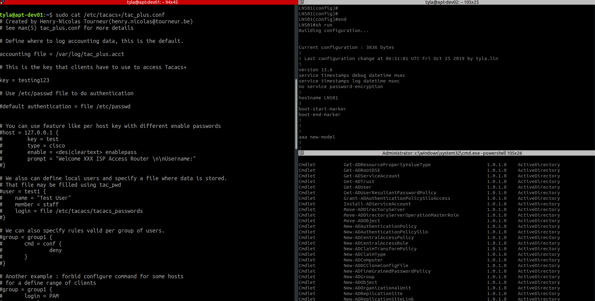

# TACACS+ နဲ့ Windows AD ကိုတွဲပြီး အသုံးပြုနည်း – အပိုင်း (၁)

## Centralized AAA process တစ်ခု setup လုပ်ဖို့ အကြောင်း

ဒီရက်ပိုင်းထဲမှာ စာရေးသူ အလုပ်နဲ့ ပတ်သတ်ပြီးတော့ ဘယ်လို Directory Services တွေကို production environment ထဲမှာ အသုံးပြုလို့ရသလဲဆိုတာကို လိုက်ရှာကြည့်ပါတယ်။ လက်ရှိ အလုပ်ထဲမှာ အသုံးပြုလို့ရအောင်လို့ စာရေးသူကိုယ်တိုင် TACACS+ ကို Ubuntu 18.04 LTS မှာတင်ပြီးအသုံးပြုနေတာ ၉ လကျော် ၁၀လ တောင်ရှိတော့မယ်ထင်ပါတယ်။ ဘာပြဿနာမှ ထွေထွေထူးထူး မရှိလို့ တော်တော်လေး အဆင်ပြေနေပါတယ်။ အစကနဦးပိုင်းမှာထဲက အလုပ်မှာ network device ပေါင်း ၅၀ ကနေ ၁၀၀ လောက်ရှိတဲ့ အထဲမှာ user login ရဲ့ authentication၊ authorization နဲ့ accouting (AAA) ကို centralized မလုပ်ထားလို့တော်တော်လေး လက်ဝင်ခဲ့ရပါတယ်။ AAA process ကို network device တစ်ခုချင်းစီမှာ local database နဲ့ local syslog ကိုပဲ အားကိုးခဲ့ရလို့ အချိန်လည်းကုန်၊ လူလည်း ပင်ပန်းနဲ့ ခရီးသိပ်မရောက်ခဲ့ ရပါဘူး။ တခါက privilege 15 local user account ရဲ့ password ကို ပြောင်းဖို့ကို ၂ ရက်လောက် အချိန်ယူပြီးတော့ တစ်ခုချင်းစီ လိုက်ပြီးတော့ လိုက်ပြောင်းရပါတယ်။ တော်တော်လည်းအချိန်ကုန်သလောက်၊ စိတ်လည်းတော်တော် ပင်ပန်းကြီးစွာ ပြီးအောင်လုပ်ခဲ့ရလို့ စာရေးသူစဉ်းစားမိတာတစ်ခုက အဲ့ဒီထက်လွယ်တဲ့ နည်းလမ်းများရှိမလား၊ နည်းလမ်း ရှိခဲ့ရင် ဘာဖြစ်လို့များ လွယ်အောင် မလုပ်သလဲဆိုပြီးတော့ အတွေးလေးဝင်လာမိပါတယ်။ စာရေးသူ ကိုယ်တိုင်ကလည်း အဲ့လိုမျိုး manual လုပ်ရတဲ့ အလုပ်တွေကို (လူကလည်း ငပျင်းမို့) မနှစ်မြို့ပါ။ automate လုပ်လို့ရတာမှန်သမျှကို မရရတဲ့ နည်းနဲ့ လူသက်သာအောင် လုပ်ထားချင်တာမို့ အမြဲတမ်းဆိုသလို နည်းလမ်းရှာတတ်တဲ့ သဘောလည်းရှိပါတယ်။ ဒါ့အပြင် human error ကြောင့် manual process တချို့တွေမှာ အမှားပိုပြီးတော့များနိုင်ပါတယ်။

အဲ့ဒီလိုနဲ့ centralized AAA server ကိုဘာဖြစ်လို့ အလုပ်မှာ မသုံးသလဲဆိုတာကို စူးစမ်းရင်းနဲ့ သိလိုက်ရတာကတော့ budget constraint ရှိနေလို့ Cisco တို့၊ Huawei တို့၊ HPE တို့ မှာရနိုင်တဲ့ user management application တွေကို အသုံးမပြုနိုင်တာကို သိလိုက်ရပါတယ်။ Networking infrastructure ထဲမှာက multi-vendor devices တွေကို အသုံးပြုလို့ cross-platform support/compatibility အတွက်လည်း implementation အပိုင်းမှာ အခက်အခဲအချို့ရှိနေတာကို သွားတွေ့ရပါတယ်။ အဲ့ဒီတော့ စာရေးသူအတွက် open-source ကမ္ဘာကနေ ရနိုင်တဲ့ solution တွေကို ရှာဖွေစမ်းသပ်ရင်းနဲ့ အလုပ်မှာ စတင် စမ်းသပ်အသုံးပြုဖြစ်တယ်လို့ ဆိုရမှာ ဖြစ်ပါတယ်။ ကိုယ့်အတွက်တော့ open-source ရဲ့ solution တွေကို production environment မှာ ဘယ်လိုအသုံးပြုနိုင်သလဲဆိုတာကို အလုပ်မှာ management နဲ့ principal network architect တွေကို စပြီးတော့ pitch လုပ်ရပါတော့တယ်။ စာရေးသူကိုယ်တိုင်က open-source သမားတစ်ယောက်ဖြစ်နေလို့ ကိုယ့်ဟာကို အလုပ်ဖြစ်နိုင်တယ်လို့တော့ ယုံကြည်နေမိပါတယ်။ Management ကတော့ open-source နဲ့ Linux မှာ free ရနိုင်ပေမယ့်လည်း GUI မပါလို့ Windows မဟုတ်လို့ဆိုပြီးတော့ သိပ်ပြီးတော့ လက်မခံချင်ခဲ့ပါဘူး။ နောက်ဆုံး တော့ budget မတက်နိုင်သေးလို့ စာရေးသူရဲ့ proposal ကိုလက်ခံလိုက်ရပါတယ်။

<figure><figcaption></figcaption></figure>

အစပိုင်းမှာတော့ ဘယ်ကနေဘယ်လို စရမှန်း ရေရေရာရာ မသိခဲ့သလို၊ ဘယ်လိုမျိုး ပုံစံမျိုးနဲ့ centralized AAA server ကိုအသုံးပြုပြီးတော့ network devices တွေကို authenticate၊ authorize လုပ်သလဲဆိုမျိုး သေချာရှင်းရှင်းလင်းလင်း မသိခဲ့ပါဘူး။ Open-source solution တွေကို production environment မှာဘယ်လို အသုံးပြုနိုင်သလဲဆိုတာကိုပဲ စိတ်အားထက်သန်စွာ စမ်းသပ်ချင်စိတ် တစ်ခုတည်းနဲ့ လုပ်ခဲ့တာပါ။ ကိုယ်တိုင်က proprietary မှာရနိုင်တဲ့ solution မှန်သမျှကို အယုံအကြည်သိပ်မရှိလို့ open-source က ရနိုင်တာတွေ အားလုံးကို လိုက်လံ ရှာဖွေခဲ့ရပါတယ်။ ပထမဆုံး အနေနဲ့ CentOS 7 ပေါ်မှာ FreeRADIUS ကိုတင်ပြီးတော့ run ကြည့်တာ အဆင်တော့ပြေပါရဲ့၊ သို့သော် network က multi-vendor devices တွေကို အသုံးပြုထားလို့ တချို့ vendor တွေက RADIUS နဲ့ အလုပ်သိပ်မဖြစ်ဘူးထင်ပါတယ်။ ဒါနဲ့ TACACS+ တို့၊ Diameter တို့ကို စတင်စမ်းသပ်ဖို့ ဖြစ်လာပြန်ပါတယ်။ ဒီလိုနဲ့ပဲ TACACS+ ကို CentOS 7 ပေါ်မှာစတင် အသုံးပြုနိုင်ဖို့ ကြိုးစားကြည့်ပါတယ်။ CentOS 7 မှာပါလာတဲ့ default repo မှာ TACACS+ package ကို YUM နဲ့ ရှာကြည့်တာမရှိလို့၊ Ubuntu 18.04 LTS မှာ ရှာကြည့်လို့ သွားတွေ့တာနဲ့ Ubuntu distro ကို အသုံးပြုဖို့ရာ ဖြစ်လာပါတော့တယ်။ အကျဉ်းချုပ်အားဖြင့်တော့ TACACS+ ကို Ubuntu 18.04 LTS နဲ့ staging အဆင့်မှာ ပုံစံမျိုးစုံ စမ်းသပ်လို့အောင်မြင်တာနဲ့ production environment မှာစတင် အသုံးပြုဖြစ်တာ အခုဆို တစ်နှစ်တောင်ပြည့်ပါတော့မယ်။

## TACACS+ ကို AAA process အတွက် Standalone setup လုပ်ပုံ

TACACS+ ကို install လုပ်ဖို့အတွက် စာရေးသူ Ubuntu 18.04 LTS ကိုအသုံးပြုပါတယ်။ Ubuntu 18.04 LTS ကို fresh install လုပ်ပြီးတော့နဲ့ အောက်ကအတိုင်း update ၊ upgrade လုပ်ပါ။

```
tyla@apt-dev01:~$ sudo -i

[sudo] password for tyla: # type your sudo user account password

root@apt-dev01:~# apt update

root@apt-dev01:~# apt upgrade -y
```

ပြီးတာနဲ့ TACACS+ ကို apt install command နဲ့အောက်ပါအတိုင်း စတင် install လုပ်လို့ရပါပြီ။

```
root@apt-dev01:~# apt -y install tacacs+
```

TACACS+ ကို install လုပ်ပြီးတာနဲ့ လက်ရှိ local user database နဲ့ တွဲဖက် အသုံးပြုပုံကို အောက်ပါအတိုင်း တွေ့ရမှာဖြစ်ပါတယ်။ အဓိက အနေနဲ့ USERS ACCOUNTS HERE ဆိုတဲ့ section မှာ ကိုယ့်ရဲ့ local user account နဲ့ သက်ဆိုင်ရာ group ကို member အားဖြင့် ထည့်လိုက်ရုံပါပဲ။ ဥပမာ အနေနဲ့ user “juno” ကို TACACS+ server မှာ system user အနေနဲ့ထည့်တာ ကိုပြထားပါတယ်။ user “tyla” ကတော့ Ubuntu installation လုပ်ကတည်း က sudoer အနေနဲ့ထည့်ထားတဲ့ user account ဖြစ်ပါတယ်။ GROUPS HERE ဆိုတဲ့ section မှာတော့ သက်ဆိုင်ရာ group တခုချင်းစီရဲ့ attributes/properties တွေကို အောက်ကအတိုင်းတွေရမှာ ဖြစ်ပါတယ်။ tac\_plus.conf ရဲ့ configuration တစ်လိုင်းချင်းစီရဲ့ ဆိုလိုရင်းကိုတော့ အသေးစိတ်မသွားတော့ပါဘူး။ self-descriptive ဖြစ်ပြီးသားမို့ရှင်းပါတယ်။

```
root@apt-dev01:~# useradd juno

root@apt-dev01:~# passwd juno
New password: 
Retype new password: 
passwd: password updated successfully

root@apt-dev01:~# vi /etc/tacacs+/tac_plus.conf 

# Created by Henry-Nicolas Tourneur(henry.nicolas@tourneur.be)
# See man(5) tac_plus.conf for more details

# Define where to log accounting data, this is the default.

accounting file = /var/log/tac_plus.acct

# This is the key that clients have to use to access Tacacs+

key = testing123

# Use /etc/passwd file to do authentication
    
#default authentication = file /etc/passwd
 

# You can use feature like per host key with different enable passwords
#host = 127.0.0.1 {
#        key = test 
#        type = cisco
#        enable =  enablepass
#        prompt = "Welcome XXX ISP Access Router nnUsername:"
#}

# We also can define local users and specify a file where data is stored.
# That file may be filled using tac_pwd
#user = test1 {
#    name = "Test User"
#    member = staff
#    login = file /etc/tacacs/tacacs_passwords
#}

# We can also specify rules valid per group of users.
#group = group1 {
#	cmd = conf {
#		deny
#	}
#}

# Another example : forbid configure command for some hosts
# for a define range of clients
#group = group1 {
#	login = PAM
#	service = ppp
#	protocol = ip {
#		addr = 10.10.0.0/24
#	}
#	cmd = conf {
#		deny .*
#	}
#}

user = DEFAULT {
	login = PAM
	service = ppp protocol = ip {}
}

# Much more features are availables, like ACL, more service compatibilities,
# commands authorization, scripting authorization.
# See the man page for those features.

#*************************
#***USERS ACCOUNTS HERE***
#*************************
user = tyla {
	 member = admin
}

user = juno {
	member = restrict
}

#*************************
#***   GROUPS HERE     ***
#*************************
group = admin {
	default service = permit
	login = file /etc/passwd
	service = exec {
		priv-lvl = 15
	}
}

group = restrict {
        default service = deny
        login = file /etc/passwd
	service = exec {
        priv-lvl = 15
        }
        cmd = enable {
                permit .*
        }
	cmd = system {
		permit .*
	}
        cmd = show {
                permit .*
        }
	cmd = display {
		permit .*
	}
        cmd = exit {
                permit .*
        }
	cmd = quit {
		permit .*
	}
	cmd = ping {
		permit .*	
	}
	cmd = traceroute {
                permit .*
        }
}

root@apt-dev01:~# systemctl restart tacacs+
```

လက်ရှိမှာတော့ network ပေါ်မှာ networking devices တွေကို login လုပ်ပြီးတော့ management လုပ်တဲ့ network engineer အများကြီး မရှိသေးပါဘူး။ နောက်တဆင့်အနေနဲ့ future proof ဖြစ်အောင်လို့ Junior Network Engineerတွေနဲ့ တခြား Sysadmin တွေပါ ဝင်ရောက်ကြည့်ရှုပြီးတော့ troubleshoot လုပ်ချင်တယ်ဆိုရင်တော့ လက်ရှိ setup ဖြစ်တဲ့ standalone TACACS+ server က နောင်တချိန်မှာ အလုပ်သိပ်ဖြစ်မှာ မဟုတ်ပါဘူး။ ဒါ့အပြင် အလုပ်မှာ စာရေးသူလိုရင် လိုသလို service တစ်ခုပြီး တစ်ခု deploy လုပ်လာလိုက်တာ အခုဆို manage လုပ်ရမယ့် service တွေဟာလည်း TACACS+ တစ်ခုတည်းမဟုတ်တော့လို့၊ တစုတစည်း တည်း user တွေကို manage လုပ်ဖို့ရာ directory services တွေကို ထပ်မံ ရှာပုံတော်ထွက်ရပြန်ပါတယ်။ ထုံးစံအတိုင်း open-source မှာရနိုင်တဲ့ solution တွေကိုပဲ အားစိုက်ပြီးတော့ ရှာဖွေခဲ့ပါတယ်။ Distro အနေနဲ့တော့ CentOS 7 ကို production မှာသုံးရတာ အကြိုက်တွေ့လို့ ဦးစားပေးပြီးတော့ စမ်းသပ်ပါတယ်။ နောက်ဆုံး အဆင်မပြေတော့မှ alternative အနေနဲ့ Ubuntu/Debian ဘက်ကိုလှည့်ပါတယ်။ တချို့ package တွေအတွက် တော့ dpkg ဟာပိုလို့ အဆင်ပြေပါတယ်။ ကိုယ်သုံးမယ့် ဟာပေါ်မှာမူတည်ပြီးတော့ အဆင်ပြေသလို distro ကို စာရေးသူ အသုံးပြုပါတယ်။ ပထမဆုံး အနေနဲ့ OpenLDAP ကို standalone အနေနဲ့ စမ်းသပ်ကြည့်ပါတယ်။ လုံးဝ အဆင်မပြေတာနဲ့ပဲ SAMBA ကို OpenLDAP နဲ့တွဲပြီးတော့ အသုံးပြုကြည့်တာလည်း ထင်သလောက် ခရီးမရောက်ခဲ့ပါဘူး။ WebUI အနေနဲ့တော့ LAM တို့ phpLDAPadmin တို့ ကို အသုံးပြုပြီးတော့ စမ်းသပ်ကြည့်ပါတယ်။ ဒါလည်း အဆင်ပြေတာနဲ့ အဆင်သင့် ပြင်ထားဆင်ထားပြီးသားဖြစ်တဲ့ Zentyal 6.0 Development Edition နဲ့ Red Hat ရဲ့ FreeIPA တို့ဘက်ကို တချက်လောက်တော့ ကြည့်မှဖြစ်မယ်ဆိုပြီးတော့၊ တခုပြီးတော့ တခု စမ်းသပ်ကြည့်ရပါတယ်။ အထူးသဖြင့် ဒီလို အဆင်သင့် ထုတ်ပြီးပိုးပြီးသား solution တွေဟာ deployment အတွက်တော့ အချိန်တော်တော်သက်သာသွားပြီး အလုပ်ပိုပြီးဖြစ်တာကို သွားတွေ့ရပါတော့တယ်။ Zentyal 6.0 ဟာ Ubuntu 18.04 LTS မှာ အခြေခံထားပြီးတော့ FreeIPA ကိုတော့ CentOS 7 ပေါ်မှာ စာရေးသူ တင်ပြီးတော့ အသုံးပြုကြည့်တာလည်း ဖြစ်ပါတယ်။ နှစ်ခုလုံး အစပိုင်းမှာ အားလုံး အဆင်ပြေသလို ရှိသော်လည်း နှစ်ရက်သုံးရက်လောက် စမ်းသပ်ရင်း ကနေ တစ်ခုမဟုတ် တစ်ခုတော့ ထပြီး ဖောက်ပါတယ်။ system/package update တစ်ခါနှစ်ခါ လုပ်ပြီးသွားရင် ပုံမှန် အလုပ်လုပ် နေတဲ့ directory service က error တစ်ခုမဟုတ် တစ်ခုတက်လာတတ်ပါတယ်။ နောက်ဆုံးမှာတော့ စာရေးသူ လုံးဝ လက်လျှော့ လိုက်ပြီးတော့ Windows 2019 ADDS ကိုပဲ directory service အနေနဲ့ သုံးတော့မယ်လို့ ဆုံးဖြတ်လိုက်ရပါတော့တယ်။ အဲ့ဒီလိုနဲ့ အောက်ကအတိုင်း Windows 2019 ADDS ကိုပဲ TACACS+ integration မှာသုံးရပါတော့တယ်။ Windows 2019 ADDS မှာ primary domain controller နဲ့ secondary domain controller ကိုဘယ်လို setup လုပ်သလဲဆိုတာကိုတော့ ဒီ post မှာ မထည့်တော့ပါဘူး။ Windows Sysadmins တိုင်း ဘယ်လို install လုပ်ရသလဲ၊ ADDS role ကို ဘယ်လို add လုပ်သလဲဆိုတာ သိနိုင်မယ်လို့ စာရေးသူ ယူဆပါတယ်။ ဒီတော့… နောက်တဆင့်မသွားခင်မှာ Windows 2019 ADDS ကိုအရင် setup လုပ်ပါ။ ပြီးတော့မှ… နောက်အဆင့်ကို ဆက်သွားပါ။ Windows 2019 ADDS ရဲ့ domain name ကိုတော့ စာရေးသူ gnu.net အနေနဲ့ ဒီ tutorial ထည့်သွင်း အသုံးပြုထားပါတယ်။

## Domain ကို join ဖို့လိုအပ်တဲ့ package များအား Ubuntu မှာ install လုပ်ပုံ

```
tyla@apt-dev01:~$ sudo -i

[sudo] password for tyla: # type your sudo user account password

root@apt-dev01:~# apt -y install realmd sssd sssd-tools libnss-sss libpam-sss adcli samba-common-bin oddjob oddjob-mkhomedir packagekit
```

## DNS setting ကို domain controller ဆီသို့ ထောက်ပြပေးပုံ

```
root@apt-dev01:~# vi /etc/netplan/50-cloud-init.yaml

# This file is generated from information provided by
# the datasource.  Changes to it will not persist across an instance.
# To disable cloud-init's network configuration capabilities, write a file
# /etc/cloud/cloud.cfg.d/99-disable-network-config.cfg with the following:
# network: {config: disabled}
network:
    ethernets:
        ens160:
            addresses:
            - 192.168.105.11/24
            gateway4: 192.168.105.254
            nameservers:
                addresses:
                - 192.168.105.16 # Pointing to Windows AD Primary DC
                - 192.168.105.17 # Pointing to Windows AD Secondary DC
    version: 2

root@apt-dev01:~# netplan apply
```

## Realm နဲ့ domain name အားစစ်ဆေးပုံ

```
root@apt-dev01:~# realm discover gnu.net

gnu.net
  type: kerberos
  realm-name: GNU.NET
  domain-name: gnu.net
  configured: kerberos-member
  server-software: active-directory
  client-software: sssd
  required-package: sssd-tools
  required-package: sssd
  required-package: libnss-sss
  required-package: libpam-sss
  required-package: adcli
  required-package: samba-common-bin
  login-formats: %U
  login-policy: allow-realm-logins
```

## Realm နှင့် domain အား ချိတ်ဆက်ပုံ

```
root@apt-dev01:~# realm join GNU.NET

Password for Administrator: # type Windows AD domain administrator password
```

## Domain user account အား စစ်ဆေးပုံ

```
root@apt-dev01:~# id tyla.lin # verify with your domain user account

uid=1396801106(tyla.lin) gid=1396800513(domain users) groups=1396800513(domain users),1396800572(denied rodc password replication group),1396800512(domain admins),1396801113(enabler),1396801107(sudoers)
```

## FQDN ကို login တွင် ဖယ်ရှားပုံ

```
root@apt-dev01:~# vi /etc/sssd/sssd.conf

[sssd]
domains = gnu.net
config_file_version = 2
services = nss, pam

[domain/gnu.net]
ad_domain = gnu.net
krb5_realm = GNU.NET
realmd_tags = manages-system joined-with-adcli
cache_credentials = True
id_provider = ad
krb5_store_password_if_offline = True
default_shell = /bin/bash
ldap_id_mapping = True
use_fully_qualified_names = False # change True to False
fallback_homedir = /home/%u@%d
access_provider = ad
```

အခုဆိုရင်တော့ TACACS+ ကို run ထားတဲ့ Ubuntu 18.04 LTS box ဟာ GNU.NET ဆိုတဲ့ domain ကို join ပြီးသွားပါပြီ။ TACACS+ server ကို ssh နဲ့ ဝင်တဲ့အခါမှာ အောက်ကအတိုင်း ဝင်လို့ရပါပြီ။

```
tyla@ubuntu:~$ ssh tyla.lin@192.168.105.11 # tyla.lin is Windows AD username 
tyla.lin@192.168.105.11's password: # type in the Windows AD user password
tyla.lin@apt-dev01 ~$
```

ဒီ post မှာတော့ ဒီလောက်နဲ့ပဲရပ်လိုက်ပါတော့မယ်။ နောက် post မှာတော့ TACACS+ နဲ့ Windows AD ကိုဘယ်လို integration လုပ်ပုံဆက်ရှင်းပါ့မယ်။
