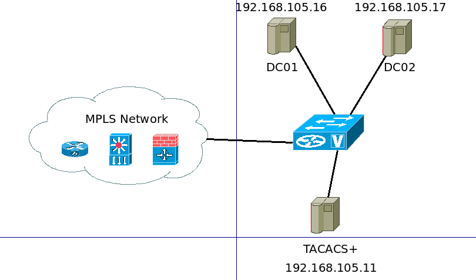

# TACACS+ နဲ့ Windows AD ကိုတွဲပြီး အသုံးပြုနည်း – အပိုင်း (၂)

အရှေ့ post မှာ TACACS+ server ကို standalone setup ဘယ်လို လုပ်သလဲဆိုတာကို ရှင်းပြပြီးသွားပါပြီ။ အခြေခံအားဖြင့် authentication အတွက် Ubuntu 18.04 LTS local user login database ဖြစ်တဲ့ /etc/passwd file ကို အသုံးပြုပြီးတော့၊ authorization အတွက်တော့ /etc/tacacs+/tac\_plus.conf file ကိုအသုံးပြုထားတာပဲဖြစ်ပါတယ်။ configuration အကုန်လုံးက server ဘက်မှာပဲ ပြီးပါသေးတယ်။ Network devices တွေအတွက်တော့ ဘယ်လို configure လုပ်သလဲဆိုတာကို နောက်ဆုံးမှာ ရှင်းသွားပါ့မယ်။ devices config အတွက်တော့ TACACS+ standalone နဲ့ TACACS+ Windows AD မှာပါ အကုန်လုံးတူပါတယ်။ ဘာမှပြောင်းစရာမလိုပါဘူး။ အဲဒီအတွက် နောက်ဆုံးမှာ ရှင်းတာဖြစ်ပါတယ်၊။ ဒီအဆင့်မှာတော့ Ubuntu 18.04 box ဟာ Windows 2019 AD ကို join ပြီးဖြစ်ပါတယ်။ အခု domain joined Linux TACACS+ server ကို Windows AD နဲ့ ဘယ်လို integrate လုပ်သလဲဆိုတာကို ဆက်ရှင်းသွားပါ့မယ်။ Integration အပိုင်းမှာတော့ ပုံစံမျိုးစုံနဲ့ လုပ်လို့ရပါတယ်။ စာရေးသူ အခုရှင်းမယ့် ပုံစံကတော့ အနည်းငယ် လက်ဝင်ပေမယ့် အလုပ်ဖြစ်ပါတယ်။ နောက်ပြီးတော့ စာရေးသူသတိထားမိတာ တစ်ခုက Internet ပေါ်မှာ စာရေးသူ လုပ်ချင်တဲ့ ပုံစံမျိုး ရအောင်လို့ setup လုပ်ဖို့ရာ ပြီးပြည့်စုံတဲ့ tutorial မရှိပါဘူး။ ဟိုနည်းနည်းဖတ် ဒီနည်းနည်းရှာနဲ့ပဲ မရရအောင်လို့ ကြံဖန်ပြီးတော့ လုပ်ရပါတော့တယ်။ အဲ့ဒီအတွက် အလုံးစုံ ရိုးရှင်းတဲ့ integration process တော့ မဟုတ်ပါဘူး။ သို့သော် အလုပ်ဖြစ်ပြီးတော့ နားလည်ရလွယ်တဲ့ solution တစ်ခုပါ။ Linux မှာရနိုင်တဲ့ tools တွေကိုပဲ ကိုယ်လိုချင်တဲ့ပုံစံ ဖြစ်အောင် လုပ်ရတာဖြစ်တဲ့အတွက် စိတ်ဝင်စားဖို့တော့ကောင်းပါတယ်။ အကျဉ်းချုပ်အားဖြင့်တော့ Linux ရဲ့ PAM ရယ်၊ bash script တစ်ခုရယ်၊ crontab နဲ့ built-in Linux command သုံးလေးငါးခုလောက်ကို လှည့်ပြီးတော့ သုံးထားတာ လည်းဖြစ်တဲ့အတွက် ဘာမှထက်ပြီးတော့ ထွေထွေထူးထူး install လုပ်စရာ မရှိပါဘူး။ သို့သော် တစ်ခုချင်းစီရဲ့ အလုပ်လုပ်ဆောင်ပုံနဲ့ ဘယ်လိုမျိုး အသုံးပြုရတာလဲဆိုတော့ အနည်းငယ်သိဖို့တော့လိုပါလိမ့်မယ်။ စာရေးသူ တတ်နိုင်သလောက်တော့ တစ်ခုချင်းစီကို အကျဉ်းချုပ်ပြီးတော့ ရှင်းသွားပါ့မယ်။

## Windows AD တွင် user group ကို setup လုပ်ပုံ

user group ၃ ခုဖြစ်တဲ့ enabler၊ temper၊ reader တို့ကို အောက်ကအတိုင်း Windows AD ရဲ့ domain controller ပေါ်မှာ PowerShell နဲ့ create လုပ်လိုက်ပါ။

```
# adding "enabler" security group to Windows AD domain
PS C:Userstyla.GNU> New-ADGroup -Name "enabler" -SamAccountName enabler -GroupCategory Security -GroupScope Global -DisplayName "enabler" -Path "CN=Users,DC=GNU,DC=NET" -Description "Privilege 15 admins"

# adding "reader" security group to Windows AD domain
PS C:Userstyla.GNU> New-ADGroup -Name "reader" -SamAccountName reader -GroupCategory Security -GroupScope Global -DisplayName "reader" -Path "CN=Users,DC=GNU,DC=NET" -Description "Restricted read-only users"

# adding "temper" security group to Windows AD domain
PS C:Userstyla.GNU> New-ADGroup -Name "temper" -SamAccountName temper -GroupCategory Security -GroupScope Global -DisplayName "temper" -Path "CN=Users,DC=GNU,DC=NET" -Description "Temporary Privilege 15 access to edge devices"
```

Windows AD မှာ domain user groups တွေကို create လုပ်ပြီးသွားတာနဲ့ ကိုယ်လိုချင်တဲ့ user account တွေကို အောက်ကအတိုင်း ဖန်းတီးပြီးတော့ ကိုယ်ကြိုက်တဲ့ group မှာထည့်လိုက်ပါ။

```
# Import Active Directory Module in PowerShell
PS C:Userstyla.GNU> Import-Module ActiveDirectory                             

# Add new AD user account
PS C:Userstyla.GNU> New-ADUser tyla.lin -UserPrincipalName tyla.lin@gnu.net

# Set newly created AD user account's password
PS C:Userstyla.GNU> Set-ADAccountPassword -Identity tyla.lin                  
Please enter the current password for "CN=tyla.lin,CN=Users,DC=gnu,DC=net"    
Password:                                                                       
Please enter the desired password for "CN=tyla.lin,CN=Users,DC=gnu,DC=net"    
Password: ***********                                                           
Repeat Password: *********** 

# Enable the new AD user account
PS C:Userstyla.GNU> Enable-ADAccount -Identity tyla.lin                       

# Verify the new AD user account
PS C:Userstyla.GNU> Get-ADUser tyla.lin                                       

DistinguishedName : CN=tyla.lin,CN=Users,DC=gnu,DC=net                        
Enabled           : True                                                        
GivenName         :                                                             
Name              : tyla.lin                                                    
ObjectClass       : user                                                        
ObjectGUID        : fa260d1c-3de5-4939-b6b7-052ff5ce0e2f                        
SamAccountName    : tyla.lin                                                    
SID               : S-1-5-21-3725648376-1897747198-2438019021-1119              
Surname           :                                                             
UserPrincipalName : tyla.lin@gnu.net    

# Add the newly created AD user account to enabler AD security users group
PS C:Userstyla.GNU> Add-ADGroupMember -Identity enabler -Member tyla.lin

# Verify the enabler group's membership
PS C:Userstyla.GNU> Get-ADGroupMember enabler                                 

distinguishedName : CN=tyla.lin,CN=Users,DC=gnu,DC=net                        
name              : tyla.lin                                                    
objectClass       : user                                                        
objectGUID        : fa260d1c-3de5-4939-b6b7-052ff5ce0e2f                        
SamAccountName    : tyla.lin                                                    
SID               : S-1-5-21-3725648376-1897747198-2438019021-1119
```

အခုဆိုရင်တော့ Windows AD မှာ သက်ဆိုင်ရာ AD group နဲ့ user တွေကိုပြင်ဆင်ပြီးသွားပါပြီ။ အောက်ကပုံမှာတော့ စာရေးသူရဲ့ network topology အကြမ်းဖြစ်ပါတယ်။

<figure><figcaption></figcaption></figure>

Windows AD ရဲ့ domain controller ပေါ်မှာ group နဲ့ user တွေလည်း ဖန်းတီးပြီးပြီ၊ TACACS+ တင်ထားတဲ့ Linux box ကိုလည်း အဲ့ဒီ GNU.NET ဆိုတဲ့ domain ကို join ပြီးသွားပြီဆိုရင် တော့၊ domain user နဲ့ group တွေကို Linux ကနေ မြင်ရ မမြင်ရဆိုတာကို တချက်တော့ verify လုပ်ရပါ့မယ်။ ဒီအဆင့်က အရေးကြီးပါတယ်။ Linux box ကနေ Windows AD ရဲ့ user နဲ့ group ကို မမြင်ရရင်တော့ နည်းနည်းပါးပါး troubleshoot လုပ်ရပါလိမ့်မယ်။ အားလုံးအဆင်ပြေရင်တော့မှ နောက်တဆင့်ကို ဆက်သွားပါ။

```
tyla@apt-dev01:~$ sudo -i

[sudo] password for tyla: 

root@apt-dev01:~# getent passwd tyla.lin

tyla.lin:*:1396801106:1396800513:Tyla Lin:/home/tyla.lin@gnu.net:/bin/bash

root@apt-dev01:~# getent group enabler

enabler:*:1396801113:tyla.lin,tom.cruise
```

အထက်ကအတိုင်းတွေ့ရတယ်ဆိုရင်တော့ အားလုံးအဆင်ပြေပါပြီ။ နောက်တဆင့်မှာတော့ tac\_plus.conf ကို local user database ဖြစ်တဲ့ /etc/passwd အစား PAM ကိုအသုံးပြုဖို့အတွက် အနည်းငယ် ပြင်ဆင်ဖို့လိုပါလိမ့်မယ်။

```
root@apt-dev01:~# vi /etc/tacacs+/tac_plus.conf 

# Created by Henry-Nicolas Tourneur(henry.nicolas@tourneur.be)
# See man(5) tac_plus.conf for more details

# Define where to log accounting data, this is the default.

accounting file = /var/log/tac_plus.acct

# This is the key that clients have to use to access Tacacs+

key = testing123

# Use /etc/passwd file to do authentication
    
#default authentication = file /etc/passwd
 

# You can use feature like per host key with different enable passwords
#host = 127.0.0.1 {
#        key = test 
#        type = cisco
#        enable =  enablepass
#        prompt = "Welcome XXX ISP Access Router nnUsername:"
#}

# We also can define local users and specify a file where data is stored.
# That file may be filled using tac_pwd
#user = test1 {
#    name = "Test User"
#    member = staff
#    login = file /etc/tacacs/tacacs_passwords
#}

# We can also specify rules valid per group of users.
#group = group1 {
#	cmd = conf {
#		deny
#	}
#}

# Another example : forbid configure command for some hosts
# for a define range of clients
#group = group1 {
#	login = PAM
#	service = ppp
#	protocol = ip {
#		addr = 10.10.0.0/24
#	}
#	cmd = conf {
#		deny .*
#	}
#}

user = DEFAULT {
	login = PAM
	service = ppp protocol = ip {}
}

# Much more features are availables, like ACL, more service compatibilities,
# commands authorization, scripting authorization.
# See the man page for those features.

#*************************
#***USERS ACCOUNTS HERE***
#*************************
user = tyla.lin {
	 member = enabler
}

user = tom.cruise {
	member = reader
}

#*************************
#***   GROUPS HERE     ***
#*************************

group = enabler {
 default service = permit
 login = PAM
 service = exec {
 priv-lvl = 15
 }
}

acl = temper_acl {
 permit = 192.168.105.0/24
 deny = .*
}

group = temper {
 acl = temper_acl
 member = enabler
}

group = reader {
 default service = deny
 login = PAM
 service = exec {
 priv-lvl = 15
 }
 cmd = enable {
	permit .*
 }
 cmd = system {
	permit .*
 }
 cmd = show {
	permit .*
 }
 cmd = display {
	permit .*
 }
 cmd = exit {
        permit .*
 }
 cmd = quit {
	permit .*
 }
 cmd = ping {
	permit .*	
 }
 cmd = traceroute {
        permit .*
 }
}

root@apt-dev01:~# systemctl restart tacacs+
```

ဒီနေရာမှာ ဘာဖြစ်လို့ group သုံးခု ဖြစ်တဲ့ enabler၊ temper နဲ့ reader တို့ကိုတည်ဆောက်ပြီးတော့ configure လုပ်ရသလဲဆိုတာအနည်းငယ်ရှင်းဖို့လိုပါလိမ့်မယ်။ enabler ဆိုတဲ့ group ကိုတော့ network အတွင်းမှာ ကြိုက်တဲ့ core ရော access devices တိုင်းကို privilege 15 နဲ့ အကန့်အသတ် မရှိ ဝင်လို့ရဖို့လိုတဲ့ super users တွေအတွက်ရည်စူးပါတယ်။ reader ဆိုတဲ့ဟာကတော့ core ရော access devices တိုင်းကို privilege 15 နဲ့ သတ်မှတ်ထားတဲ့ commands တွေကိုပဲ run လို့ရအောင် authorization မှာလုပ်ထားတာဖြစ်ပါတယ်။ Troubleshoot လုပ်ဖို့လိုရင် လိုသလောက် ကိုယ်ကြိုက်တဲ့ commands တွေကို ထက်ပြီးတော့ထည့်လို့ရအောင် privilege 15 ပေးထားတာလည်း ဖြစ်ပါတယ်။ နောက်ဆုံးတစ်ခုကတော့ temper ဖြစ်တဲ့ group ဖြစ်ပြီး temporarily privilege 15 ကို access device တွေပေါ်မှာပဲ initial setup လုပ်တဲ့အခါအသုံးပြုလို့ရအောင်ရည်ရွယ်ပါတယ်။ စာရေးသူ အနေနဲ့ level 1 network support team က initial device setup လုပ်ဖို့လိုတယ်ဆိုရင် privilege 15 ကို access devices တွေကို ပေးဖို့အတွက် သီးသန့် တတိယ group ကို ဖန်းတီးထားတာလည်းဖြစ်ပါတယ်။ ဒီထက်ကောင်းအောင်တော့ authorization ကို implement လုပ်လို့ရပါတယ်။ အခုလက်ရှိမှာတော့ team ရဲ့ လိုအပ်ချက်တွေအပေါ်မှာ မူတည်ပြီးတော့ လက်ရှိ staging မှာ အခုလို setup လုပ်ထားတာဖြစ်ပါတယ်။

အခုဆိုရင် စာရေးသူတို့ လက်ရှိ tac\_plus.conf ကိုအခြေခံပြီးတော့ template တစ်ခုတည်ဆောက်ပါ့မယ်။ ဒီ template ဟာ tac\_plus.conf ရဲ့ မပြောင်းတဲ့ အပိုင်းတွေကိုရွေးယူပြီးတော့ ထက်ထည့်လာမယ့် အစိတ်အပိုင်းတွေနဲ့ ပေါင်းသွားမှာပါ။ နောက်အဆင့်မှာ ဘာဖြစ်လို့ template လိုသလဲဆိုတာကိုတွေ့ပါလိမ့်မယ်။ tac\_plus\_template.conf ကို /etc/tacacs+ ရဲ့အောက်မှာ ဖန်းတီးရမှာဖြစ်ပါတယ်။ နောက်တခု သတိထားရမှာက ဒီ template ကိုသုံးမယ်ဆိုရင် user ကိုသာ အထည့်အသွင်း ပြုလုပ်ဖို့အတွက်ဖြစ်ပြီး၊ group ကို တော့ enabler၊ temper နဲ့ reader ဆိုပြီး အသေထားဖို့အတွက် ရည်ရွယ်ပါတယ်။ Group အပြောင်းအလဲ အတွက်ပါ လိုမယ်ဆိုရင်တော့ automate လုပ်မယ့် bash script ကို အနည်းငယ်ပြင်ဆင်ရပါလိမ့်မယ်။

```
root@apt-dev01:/etc/tacacs+# cat tac_plus_template.conf 
# Created by Henry-Nicolas Tourneur(henry.nicolas@tourneur.be)
# See man(5) tac_plus.conf for more details

# Define where to log accounting data, this is the default.

accounting file = /var/log/tac_plus.acct

# This is the key that clients have to use to access Tacacs+

key = testing123

# Use /etc/passwd file to do authentication
    
#default authentication = file /etc/passwd
 

# You can use feature like per host key with different enable passwords
#host = 127.0.0.1 {
#        key = test 
#        type = cisco
#        enable =  enablepass
#        prompt = "Welcome XXX ISP Access Router nnUsername:"
#}

# We also can define local users and specify a file where data is stored.
# That file may be filled using tac_pwd
#user = test1 {
#    name = "Test User"
#    member = staff
#    login = file /etc/tacacs/tacacs_passwords
#}

# We can also specify rules valid per group of users.
#group = group1 {
#	cmd = conf {
#		deny
#	}
#}

# Another example : forbid configure command for some hosts
# for a define range of clients
#group = group1 {
#	login = PAM
#	service = ppp
#	protocol = ip {
#		addr = 10.10.0.0/24
#	}
#	cmd = conf {
#		deny .*
#	}
#}

user = DEFAULT {
	login = PAM
	service = ppp protocol = ip {}
}

# Much more features are availables, like ACL, more service compatibilities,
# commands authorization, scripting authorization.
# See the man page for those features.

# Additional 

group = enabler {
 default service = permit
 login = PAM
 service = exec {
 priv-lvl = 15
 }
}

acl = noc_acl {
 permit = 192.168.105.0/24
 deny = .*
}

group = temper {
 acl = noc_acl
 member = enabler
}

group = reader {
 default service = deny
 login = PAM
 service = exec {
 priv-lvl = 15
 }
 cmd = enable {
	permit .*
 }
 cmd = system {
	permit .*
 }
 cmd = show {
	permit .*
 }
 cmd = display {
	permit .*
 }
 cmd = exit {
        permit .*
 }
 cmd = quit {
	permit .*
 }
 cmd = ping {
	permit .*	
 }
 cmd = traceroute {
        permit .*
 }
}
```

နောက်တဆင့်အနေနဲ့ စာရေးသူ bash script တစ်ခုကို အောက်က အတိုင်း bash shell မှာရှိတဲ့ tools တွေပဲယူသုံးပြီးတော့ Windows AD domain controller ရဲ့ group နဲ့ user တွေကို လိုအပ်သလို အချက်အလက်တွေကို ရယူပါတယ်။ file နာမည်ကိုတော့ sync\_users.sh ဆိုပြီးတော့ /opt အောက်မှာ သွားပြီးတော့ ဖန်တီးတည်ဆောက်ထားပါတယ်။

```
root@apt-dev01:~# vi /opt/sync_users.sh

#!/bin/sh

# clear DNS cache which is always the best practice to deal with nameservers
systemd-resolve --flush-cache

# housekeeping items in prior to retrieve the info from Windows AD domain controller
if tac -d /tmp/tacacs; then
 tac -e /tmp/tacacs/enabler.txt && rm /tmp/tacacs/enabler.txt
 tac -e /tmp/tacacs/temper.txt && rm /tmp/tacacs/temper.txt
 tac -e /tmp/tacacs/reader.txt && rm /tmp/tacacs/reader.txt
else
 mkdir /tmp/tacacs
 chmod 600 /tmp/tacacs
fi

# again clear sssd cache for users and groups in case of removing users and groups
sss_cache -UG

# count number of users in each group
enablerCount=$(getent group enabler | cut -d':' -f4 | sed s/,/"n"/g | wc -w)
temperCount=$(getent group temper | cut -d':' -f4 | sed s/,/"n"/g | wc -w)
readerCount=$(getent group reader | cut -d':' -f4 | sed s/,/"n"/g | wc -w)

# add member entries in enabler group 
for x in $(seq $enablerCount); do
 enabler=$(getent group enabler | cut -d':' -f4 | cut -d',' -f$x)
 echo "user = $enabler {ntmember = enablern}n" >> /tmp/tacacs/enabler.txt
done

# add member entries in temper group
for y in $(seq $temperCount); do
 temper=$(getent group temper | cut -d':' -f4 | cut -d',' -f$y)
 echo "user = $temper {ntmember = tempern}n" >> /tmp/tacacs/temper.txt
done

# add member entries in reader group 
for z in $(seq $readerCount); do
 reader=$(getent group reader | cut -d':' -f4 | cut -d',' -f$z)
  echo "user = $reader {ntmember = readern}n" >> /tmp/tacacs/reader.txt
done

# merge tac_plus_template.conf with all enabler, temper and reader entries
cat /etc/tacacs+/tac_plus_template.conf /tmp/tacacs/enabler.txt /tmp/tacacs/temper.txt /tmp/tacacs/reader.txt > /tmp/tacacs/tac_plus.new 2>/dev/null

# check if the existing tac_plus.conf is different from the new one and if it is, replace the old one with the new then reload TACACS+ daemon
if diff /tmp/tacacs/tac_plus.new /etc/tacacs+/tac_plus.conf; then
 exit 0
else
 cp /tmp/tacacs/tac_plus.new /etc/tacacs+/tac_plus.conf
 systemctl reload tacacs+
fi
```

Script တော့ရပြီ၊ သို့သော် အဲ့ဒီ script ကို automate လုပ်ဖို့ဆိုရင် crontab ကို အသုံးပြုဖို့လိုပါလိမ့်မယ်။ အောက်မှာတော့ crontab ကိုဘယ်လိုတည်ဆောက်သလဲဆိုတာကို ဖော်ပြထားပါတယ်။ စာရေးသူ ငါးမိနစ်တစ်ခါ cron ကို အဲ့ဒီ script သွားပြီးတော့ run ခိုင်းပါတယ်။ အဲ့ဒီတော့ ငါးမိနစ်တခါတော့ Windows AD နဲ့ user account နဲ့ group membership ကို sync သွားဖြစ်နေမှာပါ။

```
root@apt-dev01:/etc/tacacs+# crontab -e
# Edit this file to introduce tasks to be run by cron.
# 
# Each task to run has to be defined through a single line
# indicating with different fields when the task will be run
# and what command to run for the task
# 
# To define the time you can provide concrete values for
# minute (m), hour (h), day of month (dom), month (mon),
# and day of week (dow) or use '*' in these fields (for 'any').# 
# Notice that tasks will be started based on the cron's system
# daemon's notion of time and timezones.
# 
# Output of the crontab jobs (including errors) is sent through
# email to the user the crontab file belongs to (unless redirected).
# 
# For example, you can run a backup of all your user accounts
# at 5 a.m every week with:
# 0 5 * * 1 tar -zcf /var/backups/home.tgz /home/
# 
# For more information see the manual pages of crontab(5) and cron(8)
# 
# m h  dom mon dow   command
*/5 * * * * root /opt/sync_users.sh
```

ဒါဆိုရင်တော့ server ဘက်မှာလုပ်စရာရှိတာ အကုန်လုပ်ပြီးသွားပါပြီ။ network device တွေပေါ်မှာ ဘယ်လိုမျိုး AAA ကို configure လုပ်သလဲဆိုတာကို ဆက်ပြီးတော့အောက်မှာရှင်းပါ့မယ်။ စာရေးသူ အတွက်တော့ အဓိကအားဖြင့် vendor သုံးခုသော network devices တွေကို manage လုပ်ရပါတယ်။ Cisco၊ Huawei နဲ့ HPE procurve တွေအတွက်လိုအပ်တဲ့ AAA configuration တွေကကို အောက်မှာ ဖော်ပြပေးထားပါတယ်။ မိမိတို့ production environment မှာ AAA configuration ကို အသုံးမပြုခင်မှာ staging မှာသေချာ စမ်းသပ်ပြီး ကိုယ်တိုင်သေချာပြီဆိုတော့မှ production မှာ rollout လုပ်ပါ။ Networking devices တွေမှာ TACACS+ နဲ့ RADIUS အတွက် integration လုပ်ဖို့လိုတဲ့ AAA statements တွေဟာ နှစ်ဘက်ခွန်ဓားသွား နဲ့တူပါတယ်။ သတိအထူးပြုပါရန် စာရေးသူ ဒီနေရာမှာ အသိပေးချင်ပါတယ်။

Cisco router နဲ့ switch တွေအတွက်တော့ အောက်က AAA configuration ကို အသုံးပြုရပါ့မယ်။

```
!
conf t
 !
 aaa group server tacacs+ tac
  server-private 192.168.105.11 key testing123
  ip tacacs source-interface Loopback0
 !
 aaa new-model
 !
 aaa authentication login default group tac local
 aaa authentication enable default none
 !
 aaa authorization commands 15 default group tac if-authenticated
 aaa authorization config-commands 
 !
 aaa accounting update newinfo periodic 5
 aaa accounting exec default start-stop group tac
 aaa accounting commands 2 default start-stop group tac
 aaa accounting commands 15 default start-stop group tac
 aaa accounting send stop-record authentication failure
 aaa accounting network default start-stop group tac
 aaa accounting connection default start-stop group tac
 aaa accounting system default start-stop group tac
 aaa session-id common
 !
 line vty 0 4
 login authentication default
 exit
 !
```

Huawei router နဲ့ switch တွေအတွက်တော့ အောက်က AAA configuration တွေကို ထည့်သွင်းရပါလိမ့်မယ်။

```
sys

 hwtacacs-server template ts-aaa
   hwtacacs-server authentication 192.168.105.11
   hwtacacs-server authorization 192.168.105.11
   hwtacacs-server accounting 192.168.105.11
   hwtacacs-server shared-key cipher testing123
   
 aaa
   authentication-scheme hwtc-tc
     authentication-mode hwtacacs local
 ssh authentication-type default password

 aaa
    authorization-scheme hwtc-tc
      authorization-mode hwtacacs if-authenticated
      authorization-cmd 15 hwtacacs local

 aaa
    accounting-scheme hwtc-tc
       accounting-mode hwtacacs
	   accounting realtime 1
	   accounting start-fail online
    recording-scheme hwtc-tc
       recording-mode hwtacacs ts-aaa
    cmd recording-scheme hwtc-tc  
	
 aaa
    domain default_admin  
      authentication-scheme hwtc-tc
      accounting-scheme hwtc-tc
      authorization-scheme hwtc-tc
      hwtacacs-server ts-aaa
```

HPE procurve ဆိုရင်တော့ အောက်ကအတိုင်း configure လုပ်ရပါ့မယ်။

```
sys

hwtacacs scheme hwtac
primary authentication 192.168.105.11
primary authorization 192.168.105.11
primary accounting 192.168.105.11
nas-ip 192.168.105.3
key authentication simple testing123
key authorization simple testing123
key accounting simple testing123
user-name-format without-domain

domain aaa
authentication login hwtacacs-scheme hwtac local
authorization login hwtacacs-scheme hwtac local
accounting login hwtacacs-scheme hwtac local
authorization command hwtacacs-scheme hwtac local
accounting command hwtacacs-scheme hwtac
authentication default hwtacacs-scheme hwtac local
authorization default hwtacacs-scheme hwtac local
accounting default hwtacacs-scheme hwtac local

domain default enable aaa

role default-role enable 

line vty 0 4
authentication-mode scheme
user-role network-operator
command authorization
command accounting
```

ဒါဆိုရင် အားလုံး အဆင်သင့်ဖြစ်ပါပြီ။ TACACS+ နဲ့ Windows AD တို့ရဲ့ integration process ပြီးပါပြီ။ Standalone TACACS+ မှာပဲ ဖြစ်ဖြစ်၊ TACACS+ Windows AD integration မှာပဲဖြစ်ဖြစ် network devices တွေဘက်မှာတော့ အားလုံးအတူတူပါပဲ။ အားလုံးပဲ အလွယ်တကူ setup လုပ်နိုင်မယ်လို့ မျှော်လင့်ပါတယ်။
