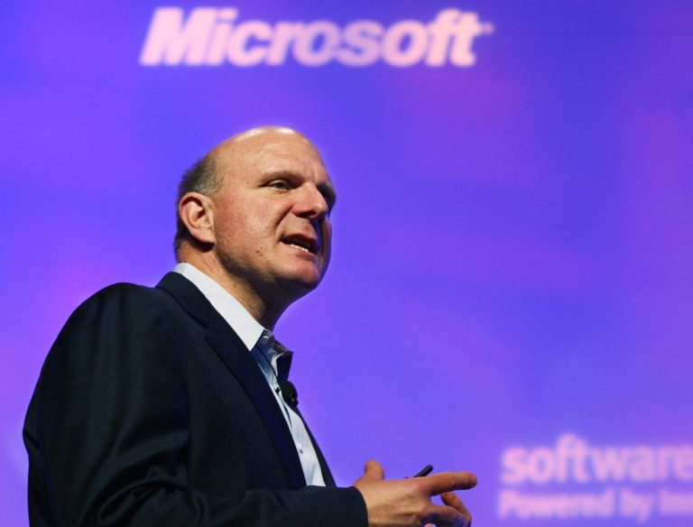
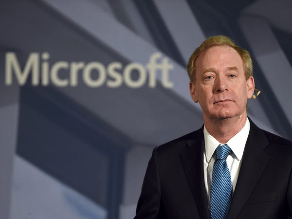
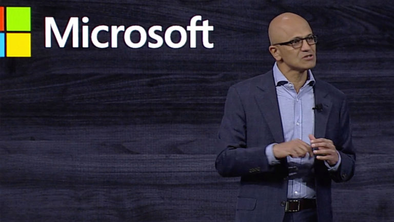
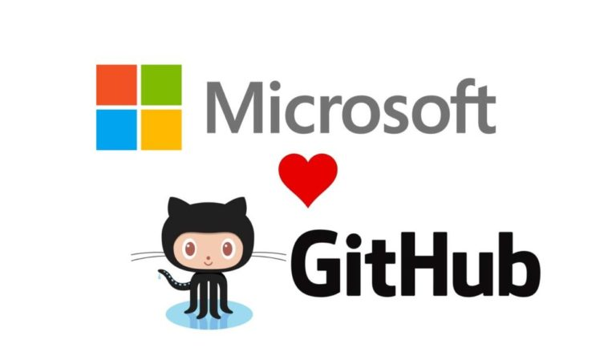

# “မှားတဲ့ဘက်မှာ” – အပိုင်း (၁)

စာရေးသူတို့ ငယ်ငယ်တုန်းက အလွန်ကြိုက်တဲ့ သီချင်းတစ်ပုဒ် ရှိခဲ့ပါတယ်။ ခေါင်းစဉ်မှာပါတဲ့အတိုင်း ဆရာ စောဘွဲ့မှူး ရေးဖွဲ့ထားတဲ့ “မှားတဲ့ဘက်မှာ” ဆိုတဲ့ သီချင်းပါ။ ဆရာ စောဘွဲ့မှူးတို့ကို မမှီပေမယ့်လည်း သူ့ရဲ့ သီချင်းလေးတွေနဲ့ ကြီးပြင်းလာရတဲ့ စာရေးသူတို့ ငယ်ငယ်တုန်းတုန်းက ဘဝမှာ သူ့သီချင်းထဲ တည်ဆက်ပြီးတော့ ဆိုထားတဲ့ ဒဏ္ဍရီပုံပြင်ဆန်ဆန် စာသားလေးတွေနဲ့မို့ ရင်ဘတ်ထဲမှာ ခံစားလာတတ်ရတာပါ။ ခံစားချက် ခပ်ဆန်းဆန်းလေးတွေ ပေးတတ်တာကြောင့် ကလေးတစ်ယောက် အနေနဲ့ အားလုံး နားမလည်သေးသော်လည်း ပုံပြင်ကလေးတစ်ပုဒ်ကို နားထောင်နေရသလိုမျိုး ခံစားရတာကြောင့် လူကြီးတွေ အဲ့ဒီသီချင်းတွေကို ဖွင့်တိုင်း ငြိမ်ငြိမ်လေး လိုက်ပြီးတော့ နားထောင်ခဲ့ရာကနေပြီးတော့ အဲ့ဒီသီချင်းတွေနဲ့ပဲ ကြီးပြင်းခဲ့ရတာပဲဖြစ်ပါတယ်။ ဥပမာ ဆရာစောဘွဲ့မှူးရဲ့ နောက်သီချင်းတစ်ပုဒ်ဖြစ်တဲ့ “ကိုပေါ” ဆိုတဲ့သီချင်းဆိုရင် ကြေကွဲစရာ ပုံပြင်တိုတစ်ပုဒ်ကို ခပ်မြူးမြူးလေး ဆိုပြသွားတဲ့ လက်ရာပါပဲ။ ပြီးတော့… ဒဿနလေးတွေ အချစ်သီချင်းလေးတွေကို ဖွဲ့ဆိုတတ်တဲ့ ထူးအိမ်သင် သီချင်းတွေကို မြတ်နိုးတတ်လာခဲ့ပြန်ပါတယ်။ အဲ့ဒီနောက်မှာတော့… နောက် မျိုးဆက်သစ်တစ်ခု ဖြစ်တဲ့ Iron Cross (IC) ရဲ့ လေးဖြူ၊ အငဲ၊ မျိုးကြီး တို့ရဲ့ ခပ်ပြင်းပြင်း rock အချစ်သီချင်း တွေနဲ့ လူပျိုဘဝကို ဖြတ်သန်းရပြန်တယ်ပေါ့။ အဲ့ဒီနောက်မှာတော့ အထက်တန်း ကျောင်းသားဘဝ ခပ်ကြောင်ကြောင် ပေါက်တတ်ကရ ဒိုးလုံး ရဲ့ မြန်မာလူမှုအဆင့်အတန်းနဲ့ သင့်တော်တဲ့ မြန်မာမှုပြုထားတဲ့ alternative လေးတွေကို အရိုးများထိအောင်ရူးရ ပါရော။ မရှေးမနှောင်းမှာပဲ ဘယ်ကမှန်းမသိတဲ့ အဆိုတော်ကြီး ရင်ဂိုရဲ့ သားတော်မောင် ဟန်ထူးလွင် (ခေါ်) ကျားပေါက် မိတ်ဆက်ပေးတဲ့ Guitar ကို round chord သုံးကွက်ကိုင် လေးကွက်ကိုင် ထင်ရာဆိုင်း punk တွေနဲ့ စာရေးသူ “ပိုးဟပ်” ဘဝမှာ တော်တော်လေး ဟိုရောက်ဒီရောက် ဖြစ်ခဲ့ရပြန်ပါတယ်။ အခုနောက်ပိုင်းမှာတော့ သီချင်းတွေနားမထောင် ဖြစ်တာတော်တော်လေးကို ကြာနေပါပြီ။ စာရေးသူလည်း ခေတ်နဲ့ ရင်ဘောင်တန်းပြီးတော့ နောက်ထွက်သီချင်းတွေကို နားထောင်ဖြစ်အောင် ကြိုးစားသော်လည်း ရင်ဘတ်ထဲမဝင်တော့တာကြောင့် ဆက်ပြီးတော့ နားမထောင်ဖြစ်တော့ပါ။ စတတ် နောက်တတ်တဲ့ မိတ်ဆွေတွေကတော့ အဲ့ဒါ အသက်ကြီးသွားလို့တဲ့။ မည်သို့ပင်ဖြစ်စေကာမူ… ဒီတလော သီချင်းဟောင်းလေးတွေကို နားထောင်ချင် ဆန္ဒရှိတာနဲ့ ပြန် နားထောင်ဖြစ်နေတုန်းပါ။ အဲ့ဒီထဲမှာ… “မှားတဲ့ဘက်မှာ” ဆိုတာကိုလည်း ပြန်နားထောင်ဖြစ်လို့ ဒီတလော စာရေးသူတို့ tech industry မှာလည်း ဖြစ်ပျက်နေတဲ့ အကြောင်းအရာ တစ်ခုနဲ့ သွားပြီး တိုက်ဆိုင်နေတာရှိလို ဒီ စာရေးဖို့ဖြစ်လာတယ်လို့ ဆိုရမှာပါပဲ။

<figure><figcaption></figcaption></figure>

<figure><figcaption></figcaption></figure>

လွန်ခဲ့တဲ့ ၂ ပတ်လောက်က Microsoft ရဲ့ လက်ရှိ president ဖြစ်သူ Brad Smith က interview တစ်ခုမှာအခုလိုပြောခဲ့ပါ။ “ရာစုနှစ်အစမှာ Open source ဆိုပြီးတော့ အရှိန်ကောင်းနေတဲ့အချိန် Microsoft ဟာ သမိုင်းရဲ့ မှားတဲ့ဘက်မှာ နေခဲ့ကြတယ်။” နောက်ပြီးတော့ ထပ်ပြောသွားတဲ့စကားကတော့ “သတင်းကောင်းတစ်ခုကတော့ ရှည်ကြာတဲ့ဘဝ တစ်သက်တာဖြစ်ခဲ့မယ်ဆိုရင်တော့ ခင်ဗျား ပြောင်းလဲချိန်တန်ပြီဆိုတာကို ခင်ဗျားသင်ယူနိုင်ပါလိမ့်မယ်။” စာရေးသူ ပထမစပြီးတော့ အဲ့ဒီသတင်းကို ကြားခါစက နည်းနည်းတောင်ကြောင်သွားတယ်။ လက်ရှိ Microsoft ရဲ့ president ပြောနေတာလား၊ ဟိုအရင်တုန်း president လုပ်ခဲ့တဲ့ တစ်ယောက်ပြောနေတာလားဆိုတာကို မသဲကွဲလို့ပါ။ နောက်တော့မှ… သတင်းတွေသေချာလိုက်ဖတ်ကြည့်လိုက်တော့မှ Microsoft ရဲ့ လက်ရှိ president ဆိုတာကို သေချာသွားပါတော့တယ်။ အဲ့ဒီလိုမျိုး Microsoft ဘက်က ဝင်ခံတဲ့ စကားမျိုးကို တချိန်တုန်း Microsoft ရဲ့ CEO ဖြစ်တဲ့ Steve Ballmer လည်းပြောခဲ့ဘူးလို့ပါ။ ထို Steve Ballmer ဆိုတဲ့ ပုဂ္ဂိုလ်ကတော့ တချိန်တုန်းက Linux ကို ကွန်မြူနစ် သူခိုးတွေ၊ open source ဟာ Microsoft ရဲ့ intellectual property (IP) အတွက်တော့ cancer တစ်ခုပဲဆိုပြီးတော့နှစ်နှစ်ကာကာ ပြောခဲ့တဲ့ ခပ်ဆိုးဆိုး ခပ်ကြောင်ကြောင် Microsoft ရဲ့ leader တစ်ယောက်ပဲဖြစ်ပါတယ်။ သူ့လက်ထက်မှာ Microsoft ဟာ tech industry မှာတော်တော်လေး အရှိန်ကောင်းနေတုန်းမို့ Linux ကို နည်းနည်းလေးလူပြောများလာတာကို သိတာနဲ့ ပြိုင်ဘက်ရန်သူ တစ်ယောက်လို ဆက်ဆံခဲ့တဲ့ အချိန်တွေပါ။ အဲ့ဒီအချိန်မတိုင်ခင်ကတော့ Linux ကို လူအနည်းစုသာသိကြားပြီးတော့ အသုံးပြုတဲ့လူသိပ်မရှိသေးတဲ့အတွက် အဖက်တောင်လုပ်ဖော်မရပါဘူး။ တဖြည်းဖြည်းနဲ့ Linux community နဲ့ user base ကောင်းလာတဲ့ အချိန်မှာတော့ Steve Ballmer ကအခုလို ဗလိုင်းကြီး ဝင်သမတဲ့ အချိန်တွေပဲဖြစ်ပါတယ်။ ၂၀၁၆ခုနှစ်မှာတော့ Steve Ballmer ဆိုတဲ့ ပုဂ္ဂိုလ်ပဲ Linux ကို cancer လို့မထင်တော့တဲ့ အကြောင်းကို ပြောင်းပြန်တဖန်ပြောပြန်တယ်။ အချိန်အားဖြင့်တော့ Microsoft Loves Linux ဆိုပြီးတော့ စတင်လာခဲ့ရာကနေပြီးတော့ ၂၀၁၆ခုနှစ်မှာတော့ MS SQL ကို Azure ရဲ့ Linux platform တွေပေါ်မှာတင်ပြီးတော့ run လို့ရအောင် port လုပ်တဲ့သတင်းထွက်လာတာနဲ့ အချိန်ပါ။ Server နဲ့ Cloud ဘက်မှာ ဘယ်လိုမှပြိုင်လို့ မရနိုင်တာသိတာနဲ့ Microsoft တဖြေးဖြေးချင်း လျော့လာတဲ့ အချိန်ပဲဖြစ်ပါတယ်။ ပြီးတော့ Microsoft ရဲ့ leadership မှာလည်း အတွေးအမြင်အသစ်နဲ့ နောက်မျိုးဆက်သစ် လက်ရှိ CEO ဖြစ်တဲ့ Satya Nadella လက်ထက်မှာတော့ Open Source နဲ့ Linux community အပေါ်မှာထားတဲ့ Microsoft ရဲ့ အမြင် အများကြီးကွာခြားသွားတာကို တွေ့ရမှာပဲဖြစ်မှာပါ။

<figure><figcaption></figcaption></figure>

Open source နဲ့ Linux ဘက်အခြမ်းမှာတော့ Microsoft ရဲ့ Microsoft Loves Linux ဆိုတဲ့ ချဉ်းကပ်ပုံကို အမြင်နှစ်မျိုး ရှိနေပြန်ပါတယ်။ ဒီနေရာမှာ စာရေးသူ အနေနဲ့ မတူတဲ့ အမြင်တွေအားလုံးကို ပြန်လည်သုံးသပ်ပြီးတော့ ဒီ post မှာ ဆင်ခြင်သုံးသပ်ကြည့်ချင်လို့ပါ။ စာရေးသူ တကိုယ်ရေမြင်တဲ့ အမြင်ကြောင့်လည်း အနည်းငယ် ဘက်လိုက်ချင် လိုက်နိုင်သော်လည်း စာရေးသူဘက်က အရိုးသားဆုံး ကြိုးစားပြီးတော့ ဝေဖန်သုံးသပ်သွားပါ့မယ်။ လက်တွေ့မှာ မတူတဲ့ ဆန့်ကျင်ဘက်နှစ်ခုကို နှိုင်းယှဉ်တဲ့အခါမှာတော့ အဖြူအမည်း လိုမျိုး နှစ်ခုတည်း ထွက်တာမဟုတ်ပါ။ တကယ်တော့ ဆန့်ကျင်ဘက်လို့ အလွယ်လေးပြောလိုက်ရင် အမှားနဲ့ အမှန်ဆိုပြီး နှစ်ခုတည်း ရှိသယောင်ဖြစ်သော်လည်း လက်တွေ့ဘဝမှာတော့ သက်တံ့ရောင်စဉ်သမျှ အရောင်စုံ ရှိလို့သာနေပါတော့တယ်။ သို့သော် ဘဝမှာ အရောင်စုံ အကြောင်းစုံ ကိုသိဖို့ နားလည်ဖို့ရာ အတွက်တော့ ထင်သလောက်မလွယ်ပြန်ပါဘူး။ အဲ့ဒါကြောင့်လည်း ဒီဘက်ခေတ် အထိတိုင်အောင် လူသားမျိုးဆက်တွေဟာ များပြားလွန်းလှတဲ့ data တွေကို စုစည်းပြီးသည့်တိုင်၊ ရထားတဲ့ data တွေကို analysis ပြန်လုပ်ပြီးကာမှ အနီးစပ်ဆုံးကို တွက်ချက်ယူရပါတယ်။ ထွက်လာတဲ့ အဖြေဟာ မှန်လားမှားလားဆိုတာကတော့ တသတ်မှတ်တည်း မဟုတ်ပြန်ပါဘူး။ အဲ့ဒီတော့… စာရေးသူ စဉ်းစားမိတာတစ်ခုက အကြောင်းအရာ တစ်ခုမှာ ဆန့်ကျင်ဘက်ဆိုတာ နှစ်ဘက်တည်း ရှိနိုင်တဲ့ ကိစ္စမဟုတ်ဘူးဆိုတာ ရှင်းပါတယ်။ သို့သော်… ဆင်ခြေသုံးသပ်ရမယ့် အခြေအနေတရပ်မှာတော့ လူတွေဟာ အကောင်းဆုံးအဆိုးဆုံး အစွန်းနှစ်ဘက်မှာ ရပ်ပြီး အကျိုးအကြောင်းဝေဖန်ဖို့အတွက် အားထုတ်လေ့ရှိတယ်။ လက်ရှိ tech industry ထဲမှာ ဖြစ်နေပြောနေတဲ့ open source ဘက်က ပိုမှန်သလား၊ Microsoft လို propriety တွေဘက်ကမှန်သလားဆိုတာကိုလည်း ထိုနည်းတူ အစွန်းနှစ်ဘက်ကနေရပ်ပြီးတော့ တွေးနိုင်မြင်နိုင်မှ သဘာဝကျမယ်လို့ စာရေးသူမြင်ပါတယ်။ အဲ့ဒီတော့… အစွန်းဘက်နှစ်ခုစလုံးက အမြင်နှစ်ခုကို အရင်တင်ပြပါ့မယ်။ ပြီးနောက် စာရေးသူဘက်က သိထားတဲ့ နှစ်ဘက်စလုံးက ‘ရ’ ထားတဲ့ data တွေပေါ်မှာ မူတည် ပြီးတော့ ကိုယ်ပိုင်တွေးဟန်လေးကို နောက်ဆုံးမှာ ရှင်းလင်းလိုပါတယ်။

### လက်ရှိ Open Source မှာရှိတဲ့ အယူနှစ်မျိုး

ပထမဆုံး အမြင်တစ်ခု open source သမားတွေဘက်မှာ Microsoft ရဲ့ လက်ရှိ အနေအထားကို အချဉ်ပေါက်နေတဲ့ အဖွဲ့ဘက်က အမြင်ပါ။ ဒီအဖွဲ့မှာတော့… open source ရဲ့ အကောင်းဆုံး အနှစ်တွေကို Microsoft လို proprietary တွေဘက်က EEE ဆိုတဲ့အတိုင်း Embrace, Extend and Extinguish လုပ်ဖို့အတွက် လက်ရှိ Microsoft Loves Linux ဖြစ်ရတာလို့ ယုံကြည်တဲ့ ရှေးရိုးစွဲ open source သမားတွေပါဝင်ပါတယ်။

ဟိုဘက်အစွန်းဘက်မှာတော့… ဒုတိယတစ်ဖွဲ့ဖြစ်တဲ့ Microsoft ဟာ တကယ်ကြီးကို ပြောင်းသွားပါပြီ၊ ဟိုတချိန်က Microsoft မဟုတ်တော့တာ သေချာပါတယ်ဆိုတဲ့အဖွဲ့ပါ။ ဒီအဖွဲ့မှာလည်း Microsoft ဘက်က marketing ဆန်ဆန်လေသံနဲ့ ပြောတဲ့လူရှိသလို၊ open source သမား Linux သမားတွေလည်း တော်တော်များများပါဝင်ပါတယ်။ အကြမ်းဖျင်းအားဖြင့်တော့… ဒီဒုတိယအဖွဲ့ထဲက လူတွေဟာ tech industry ထဲမှာတိုးတက်ဖို့ရာ ဘယ်လိုနည်းနဲ့ တိုးတက် တိုးတက် နည်းပညာလောကတစ်ခုလုံးအတွက် အမြတ်ထွက်တယ်လို့ မြင်တဲ့ တစ်စုပါ။ စာရေးသူ အတွက်တော့နှစ်ဘက်လုံး ပြောတဲ့အသံ တင်ပြတဲ့ပုံစံ မျိုးစုံကို ကြားနားပြီး မြင်တွေ့ ပြီးတဲ့နောက် ကိုယ်ဉာဏ်မှီသလောက်လေး တွေးကြည့်မိတာ ရောရောထွေးထွေး ခံစားချက်များနဲ့ နှစ်ဘက်လုံးနဲ့ မတူတဲ့ အရောင်နောက်တစ်မျိုး ထပ်ရပြန်ပါတယ်။ ကိုယ်မှန်သလား မှားသလားဆိုတာတော့ နောင်အနာဂတ်မှာ ဖြစ်လာမယ့် open source သမိုင်းဖြစ်စဉ်ကသာ သက်သေထူနိုင်မယ့် ကိစ္စမို့ လွန်လွန်ကြူးကြူး မငြင်းခုံလိုတော့ပါ။ လက်ရှိမှာတော့ ဟိုတချိန် နှစ်ပေါင်းသုံးဆယ်အတွင်း open source နဲ့ Linux သမိုင်းမှာဖြစ်ခဲ့တဲ့ ဖြစ်စဉ်တွေကို ကြည့်ရပြီးမြင်ရပြီး သကာလ Microsoft ရဲ့ president ကြီး Brad Smith က သူအနေနဲ့တော့ Microsoft ဟာ သမိုင်းရဲ့ “မှားတဲ့ဘက်မှာ” နေခဲ့တယ်လို့ ဆိုပါတယ်။ စာရေးသူတို့လည်း နောင်အနှစ်နှစ်ဆယ်သုံးဆယ်စာ open source ရဲ့ ခရီးစဉ်ဘယ်လိုရှိနိုင်မလဲဆိုတာ ကိုအရင်တွေးကြည့်ပြီး ပြေးကြည့်လိုက်ရအောင်…

### ပထမအယူသည်းခြင်းတစ်မျိုး – M$ ရဲ့ “မှားတဲ့ဘက်မှာ” နဲ့ EEE strategy

ဟိုတချိန်တုန်းကလည်း လုပ်ခဲ့တယ်၊ အခုလည်း ထပ်ပြီးတော့ သမိုင်းကို ပုံစံတူနောက်တစ်ခါ ပုံတူဆွဲတဲ့ Microsoft ရဲ့ EEE strategy ကတော့ Microsoft နည်းတူ အခြားသော proprietary tech giant တွေအကုန်လုံးနည်းပါးလုပ်တဲ့ marketing strategy တစ်ခုပါ။ ဘယ်လိုမှ ယှဉ်ပြိုင်ပြီးတော့ နိုင်နိုင်ခြေမရှိရင် ရှိသမျှ resource ကို ဆန့်ကျင်ဘက် campaign မှာသုံးမည့်အစား တဘက်လှည့်နဲ့ Embrace လုပ်ပြီးတော့ သိမ်းယူတဲ့ strategy ဟာ ခေတ်သစ်စီးပွားရေး အမြင် အရကြည့်ရင် အများကြီး တွက်ခြေ ကိုက်သလို၊ လုပ်သင့် လုပ်ထိုက်တဲ့ လမ်းစဉ်တစ်ခု ဆိုတာကတော့ မိတ္တဗလဋီကာကျမ်းကြေတဲ့ လူတိုင်းသိပါတယ်။ တဘက်မှာ မှန်ပြီးတော့ တရားမျှတသလား ဆိုတော့လည်း မဟုတ်ပြန်ပါဘူး။ သို့သော်… လုပ်ငန်းဆောင်တာများကို ပြီးမြောက်အောင်မြင်စွမ်းဆောင်နိုင်တဲ့ strategy မို့ လုပ်သင့်လုပ်ထိုက်တဲ့ ကိစ္စတစ်ခုပါ။ ဒါကြောင့်လည်း နှစ်ပေါင်းများစွာ tech industry မှာ proprietary တွေဟာ resource ရှိရင် ရှိသလောက် EEE strategy တွေကို အသုံးပြုကြပါတယ်။ အပေါ်ယံအားဖြင့်တော့ အဆီတွေဖုံးလို့ မတွေ့နိုင်တဲ့ ဘေးဖြစ်ဆိုးကျိုးတွေရှိနိုင်သော်လည်း underdog (အင်အားနည်းတဲ့သူ) တွေမှာတော့ ဆုပ်လည်းဆူး စားလည်းရှုး ရမယ့် အဖြစ်မို့ ဒီအတိုင်းသာ မြိုချလိုက်ရပါတော့တယ်။ ဒီတော့… လူအများရှေ့မှာ စကားလုံး ချိုချိုလေးတွေသုံးပြီးတော့ အနောက်ဘက်မှာ တဘက်လှည့်နဲ့ ကောက်ကျစ်လိုက်ရုံနဲ့ ကိစ္စအားလုံးကို အောင်နိုင်မယ်ဆိုတာလည်းသိပါတယ်။ ဒါကြောင့်လည်း Microsoft Loves Linux လို့ ကြားတိုင်းလည်း အပုတ်နံ့ထွက်လွန်လို့။ Microsoft လို proprietary tech giant ဟာလက်ရှိ open source မှာရှိိတဲ့ project တွေရဲ့ အကြီးဆုံး contributor လို့ ကြားရတိုင်း ထမင်းလုံးသစ္စေ ခြောက်သလိုပဲ ကိုယ့်ဟာကို မယုံနိုင်ပါဘူး။ ပြီးတော့လေ… Microsoft က open source code တွေကို hosting လုပ်တဲ့ GitHub ကို ဘယ်လောက်နဲ့ဘယ်လို ဝယ်လိုက်တာ၊ သိပ်မကြာပါဘူး… Microsoft ကပဲ NPM ကို GitHub ရဲ့ ခေါင်းစဉ်အောက်မှာဝယ်လိုက်တာဖြင့် တချိန်က မျက်လှည့်ဆရာ David Copperfield လေယာဉ်ပျံတစ်စီးလုံးကို ကိုယ့်မျက်စိရှေ့မှာတင် ဖျောက်ပြသွားတာထက်ကို ရှင်းသေးတယ်။ အခုပြောသမျှတွေအကုန်လုပ်ပြီးသွားရင်တော့ Embrace ကနေ နောက်တဆင့်ကို ထက်တက်ပါတော့တယ်။

<figure><figcaption></figcaption></figure>

<figure><figcaption></figcaption></figure>

နောက်အဆင့်အနေနဲ့ Extend လုပ်ဖို့အတွက် ကြိုးပမ်းရပါတော့တယ်။ အခုပဲကြည့်လေ… GitHub ရဲ့ pricing နဲ့ policy မှာ free account users တွေကို team အတွင်းမှာသုံးဖို့ အတွက် private repo တွေမှာ unlimited collaboration ပေးလုပ်မယ်ဆိုတာမျိုး ကြားသိရတော့… လုံးဝ open source လုပ်ထားပြီး free tier မှာ feature အများကြီးပေးသုံးထားတဲ့ GitLab လို platform ကို ယှဉ်ပြိုင်ဖို့အတွက် ငွေကြေးအများကြီး အကုန်ကျခံထားတဲ့ GitHub လို platform မှာ extend လုပ်လာတဲ့သဘောမျိုးပါ။ GitLab ဟာ Europe မှ developer နှစ်ယောက်ကအခြားသော developer တွေ အသုံးပြုနိုင်အောင်လို့ ဖန်တီး ဖော်စပ်ထားတဲ့ passion project တစ်ခုပါ။ Microsoft က GitHub ကိုဝယ်လိုက်ပြီးတော့ နောက်မှာတော့ နာမည်အရမ်းရလာတဲ့ platform တစ်ခုလို့ ဆိုရမှာဖြစ်ပါတယ်။ အထင်ကရ open source project တော်တော်များများလည်း Microsoft GitHub ကိုဝယ်တော့မယ်ဆိုတဲ့ သတင်းကိုကြားကြားချင်း source code တွေအားလုံးကို GitLab ရဲ့ platform ပေါ်ကိုစတင်ပြောင်းရွေ့ လာပါတော့တယ်။ Open source ရဲ့ spirit လို့ပဲဆိုရမှာပါ။ နောက်တစ်ခုအနေနဲ့… Microsoft ရဲ့ WSL 2 ဟာဖြင့် Linux ရဲ့ Desktop app တွေကို DirectX ရဲ့ အကူအညီနဲ့ GPU passthru လုပ်တော့မယ်ကြားသိရပါတယ်။ အချို့ကလည်း လောင်ပြောင်တဲ့သဘောနဲ့… နောက်ဆုံးတော့ Linux ရဲ့ Desktop app တွေကို Windows ရဲ့ subsystem ပုံစံ Linux platform ပေါ်မှာအသုံးပြုနိုင်တော့မယ်လို့ နောက်ပြီးရေးကြပုံက ဟာသတစ်ခုပါ။ ဆိုတော့ကာ… Microsoft ရဲ့ extend အဆင့်မှာ WSL 2 ဆိုပြီးတော့များ လုပ်နေသလားလို့ ထင်မှတ်ရပါတယ်။ အဲ့ဒီကနေမှ Linux user တွေကို Microsoft ဟာ တဖြည်းဖြည်း Linux platform ကိုလုံးဝ အသုံးပြုစရာ မလိုတော့ပဲနဲ့ Linux ecosystem မှာရနိုင်တဲ့ tools တွေကို WSL မှာသုံးလို့ရနိုင်လုပ်ပေးခြင်းအာဖြင့် Linux ဆိုတဲ့ platform တစ်ခုလုံးကို မျိုးပြုတ်အောင် extinguish လုပ်နိုင်တယ်လို့ ယူဆချက်များ community ထဲမှာ သတင်းထွက်လို့နေပါတယ်။

ဒီတပိုင်းမှာတော့… ပထမအယူသည်းခြင်း အဖွဲ့ရဲ့ တွေးပုံမြင်ပုံကို တင်ပြသွားဖြစ်ပါတယ်။ နောက်တပိုင်းမှာတော့ ဟိုဘက်အမြင် ဒုတိယအယူသည်းခြင်းဖြင့် စိတ်အေးအေးထားတတ်တဲ့ အဖွဲ့ဘက်နေပြန်ပြီးတော့ တွေးကြည့်မြင်ကြည့် ဆက်လက်တိုင်ပင်ကြည့်ချင်လို့ပါ။ နောက်ဆုံးပိတ်မှာတော့… စာရေးသူကိုယ်ပိုင် အမြင်နှစ်ခုကြား ဉာဏ်မှီသလောက် ကိုယ်ပိုင် သုံးသပ်ချက်ပုံစံလေး ကို အနည်းငယ် ဆက်ပြီးတော့ ရှင်းလင်းလိုပါတယ်။
