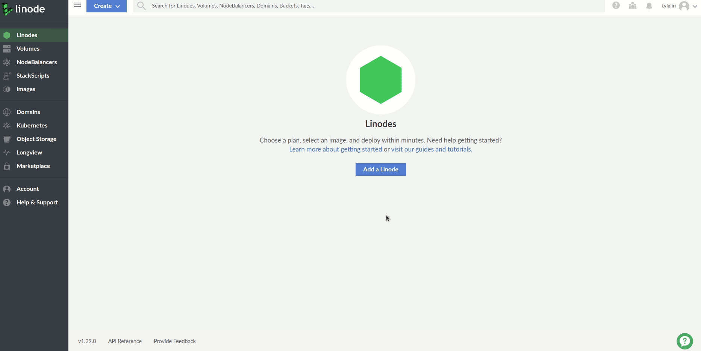
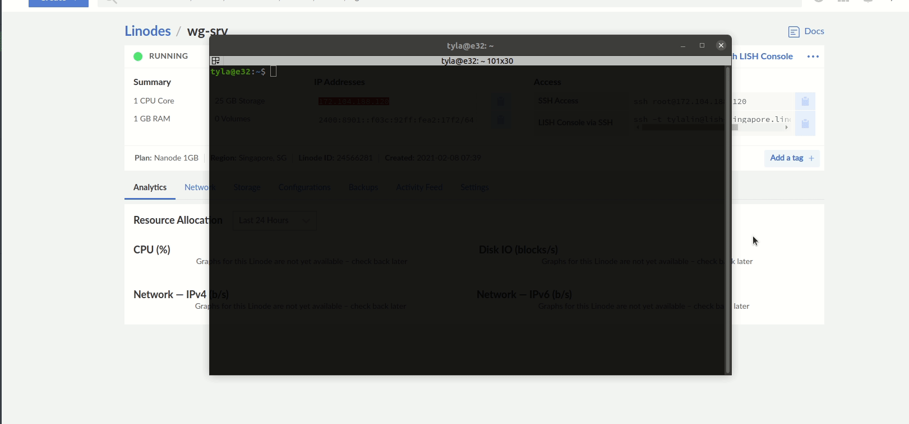
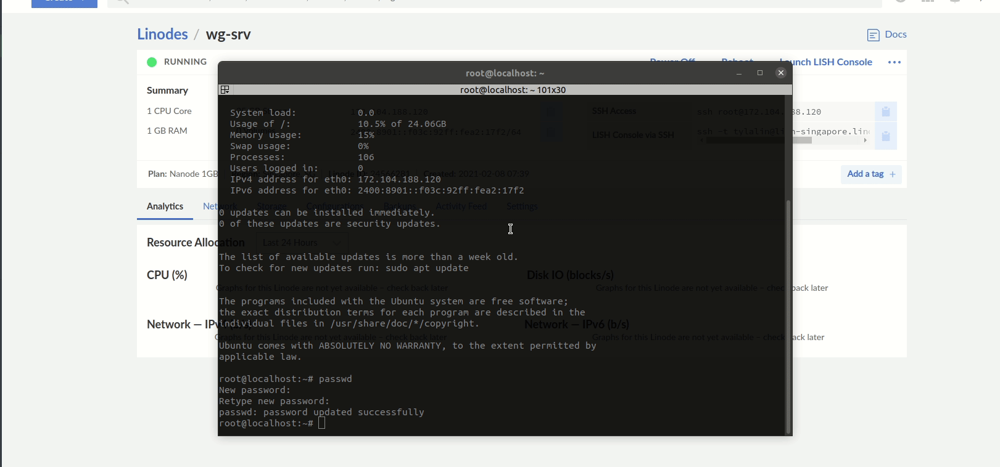

# Linode VPS မှာကိုယ်ပိုင် Wireguard VPN server တစ်ခုတည်ဆောက်ပုံ

အခုလိုမျိုး Facebook ကို block လိုက် ဟိုဟာကို block လိုက် ဒီဟာကို block လုပ်လိုက်နဲ့ လုပ်နေတဲ့ မြန်မာနိုင်ငံရဲ့ အရေးပေါ်အခြေအနေမျိုးမှာ အသုံးတည့်တဲ့ Wireguard ကို Linode ရဲ့ VPS တစ်ခုမှာ ဘယ်လိုမျိုးကိုယ်တိုင် setup လုပ်ပြီးတော့ ကိုယ့်အသိုင်းအဝိုင်း နဲ့  ရင်းနှီးတဲ့ မိတ်ဆွေအလွယ် သုံးနိုင်အောင် ဘယ်လို setup လုပ်နိုင်သလဲဆိုတာကို မျှဝေလိုပါတယ်။ စာရေးသူ ကိုယ်တိုင်လည်း Singapore မှာ VPS တစ်လုံးကိုယ်တိုင် ထောင်ထားပြီးတော့ အမျိုးတွေနဲ့ အသိမိတ်ဆွေတွေကို ပြန်လည်မျှဝေ သုံးစေခြင်းဖြင့် free VPN ဆိုတဲ့ ရန်ကနေကင်းဝေးအောင် ကူညီနိုင်ပါတယ်။ Free VPN တွေရဲ့ nature အရ free ဖြစ်တဲ့အတွက် တစ်ခုခုကနေ revenue ရမှ ရပ်တည်နိုင်မယ့်  သဘောပါ။ Browsing history တွေ log လုပ်တာပဲဖြစ်ဖြစ်၊ အခြားသော ငွေရှာနိုင်မည့် နည်းလမ်းတွေကို တနည်းမဟုတ် တနည်းနဲ့ လုပ်ရစမြဲမို့ လုံခြုံရေး အပိုင်းမှာ အပြည့်အဝစိတ်ချရတာမျိုး မရှိတာတော့ အမှန်ပါ။ အခုလိုမျိုး မြန်မာနိုင်ငံမှာ စစ်တပ်က အာရုံသိမ်းပြီးတော့ ဗရုတ်သုတ်ခ တွေတစ်ခုပြီးတစ်ခု လျှောက်လုပ်နေတော့ မြန်မာပြည်သူတွေမှာလည်း ရရာ free VPN တွေကို အသုံးပြုရပါတော့တယ်။ နောက်တစ်ခုက free VPN တွေဟာ သုံးတဲ့ လူတွေများလာတာနဲ့ အမျှ သတ်မှတ်ထားတဲ့ bandwidth တွင်းမှာ traffic တွေဟာ အပြိုင်အဆိုင် contend လုပ်တဲ့အတွက် အားလုံးအတွက် နှေးလာပါတော့တယ်။ ကိုယ်ပိုင် VPN server ရှိခြင်းဖြင့် ရနိုင်တဲ့ အကျိုးကျေးဇူးကတော့ ကိုယ်နိုင်သလောက် လူဦးရေအတွက်ကိုသာ VPN connection လာချိတ်တဲ့အတွက် free VPN ထက်မြန်မယ်၊ လုံခြုံစိတ်ချရပါ့မယ်။ နောက်ပြီးတော့ သိပြီးကြတဲ့အတိုင်း Wireguard ဟာ lightweight ဖြစ်တဲ့အတွက် အခြားသော VPN server တွေနဲ့ မတူတာက resource intensive မဖြစ်ပါဘူး။ 

ဟုတ်ပြီ... အကုန်အကျဘယ်လောက်ရှိသလဲဆိုတော့ Linode ကို အကောင့် အသစ်စစဖွင့်ချင်း $100 ဖိုးစာကို ရက် ၆၀အတွက် free ရပါလိမ့်မယ်။ စာရေးသူရဲ့ ကြိုက်နှစ်သက်ဆုံး ဖြစ်တဲ့ Jupiter Broadcast ရဲ့ Linux Action News ကနေပြီးတော့ပေးထားတဲ့ ဒီ link လေး [https://www.linode.com/lp/podcasts/?ifso=lan](https://www.linode.com/lp/podcasts/?ifso=lan) အသုံးပြုတော့ အကောင့်အသစ်ဖွင့်ပြီးတော့ claim လိုက်ရုံပါပဲ။ ဒီ link ကို အသုံးပြုချင်းအားဖြင့်လည်း Linux Action News podcast ကို အထောက်အကူ ပြုရာဖြစ်ပါတယ်။ $100 ဖိုးဆိုတာ Linode မှာအများကြီး သုံးရပါတယ်။ AWS မှာလိုမျိုး pricing structure မရှုပ်ထွေးတဲ့ အတွက် ရိုးရှင်းပါတယ်။ အခြေခံအကျဆုံး $5 VPS တစ်ခုကို Singapore မှာ setup လုပ်တဲ့ပုံစံကို ပြပါ့မယ်။ ပြီးတော့ အဲ့ဒီ VPS ပေါ်မှာ Wireguard ကို install လုပ်ပုံနဲ့ setup လုပ်ပုံကို ပြပါ့မယ်။ $5 တန် VPS ကို အသုံးပြုတဲ့အတွက် VPN user ၁၀ ယောက်ကနေ အယောက် ၃၀ လောက် ထိအတွက်သာကောင်းပါလိမ့်မယ်။ ဒီထက်များမယ်ဆိုရင်တော့... အခြားသော VPS သို့မဟုတ် dedicated VPS လိုမျိုးတွေကို အသုံးပြုရပါလိမ့်မယ်။ စာရေးသူ စမ်းကြည့်သလောက်တော့ Singapore မှာ VPS ကို ထားတာ အခြားသော Asia zone မှာရှိတဲ့ အခြားသော region တွေထက် ကောင်းသော VPN performance ကိုရပါတယ်။ မြန်မာနိုင်ငံနဲ့ အနီးဆုံးဖြစ်တဲ့အပြင် marine fibre backbone ကို ကြည့်လိုက်ရင်ဖြင့် တိုက်ရိုက်ဆက်သွယ်ထားတဲ့ fibre backbone မှာ bandwidth အများဆုံးနိုင်ငံလည်း ဖြစ်ပါတယ်။ ဒီအတွက် Singapore ကို strategically အရ ရွေးချယ်ခဲ့တာလည်းဖြစ်ပါတယ်။ ကဲ... internet ရတုန်းလေး စလိုက်ရအောင်ဗျာ။ 

### Linode ပေါ်မှာ VPS တစ်ခု ဖန်တီးပုံ

Cloud မှာ VPS တစ်ခုကို ဖန်တီးတဲ့အခါ မှာတစ်ခုနဲ့ တစ်ခု ခပ်ဆင်ဆင်တူကြပါတယ်။ ဒီတစ်ခုမှာတော့ basic VPS တစ်ခုကို ဘယ်လိုမျိုး တည်ဆောက်သလဲဆိုတာ အောက်မှာ gif ပုံထဲမှာ ကြည့်လိုက်ပါ။ အချိန်နည်းနည်း သက်သာအောင်လို့ ပုံတစ်ခုချင်းစီမသွားတော့ပါဘူး။ 



အထက်မှာပြထားတဲ့ အတိုင်း Linode ပေါ်မှာ VPS တစ်ခုကို ဖန်တီးဖို့ရာ အတွက်က မခက်ပါဘူး။ ကိုယ်သုံးမယ် Linux distribution ကိုရွေးမယ်၊ Region ကိုရွေးမယ် VPS ရဲ့ အရွယ်အစား၊ နာမည် နဲ့ login လုပ်ဖို့ လိုအပ်တဲ့ root ရဲ့ password နဲ့ key authentication အတွက် ကိုယ့်ရဲ့ ssh key တွေကိုထည့်ပေးလိုက် ပြီးတော့ create လုပ်လိုက်ရုံပါပဲ။ ပြီးရင် ကိုယ်ရဲ့ VPS ကို provisioning၊ booting နဲ့ running ဆိုပြီးတော့ တစ်ခုချင်းစီပြပါလိမ့်မယ်။ သူချပေးလိုက် public IP address ကို မှတ်ထားလိုက်ပြီးတော့ အခုဆိုရင် server ထဲကို root account နဲ့ အောက်ကအတိုင်း ssh login ဝင်လို့ရပါပြီ။ 



စာရေးသူ ရဲ့ ssh key ကို ဒီ VPS ကို create လုပ်တုန်းက tick လုပ်ပြီးထည့်ထားတဲ့အတွက် root ရဲ့  password ကို login လုပ်တဲ့အခါမှာ မမေးပါဘူး။ Cloud မှာ အခုလိုမျိုး VPS တစ်ခုလုပ်တဲ့အခါမှာ ကိုယ့် VPS လုံခြုံရေးအတွက် ssh configuration မှာ လိုအပ်တဲ့ ပြင်စရာလေးတွေ အချို့ရှိနေပါတယ်။ ပထမတစ်ခုက အထက်မှာလိုမျိုး root account ကို production မှာ remote login မပေးထားသင့်ပါဘူး။ ကိုယ့်ရဲ့ ကိုယ်ပိုင် account ကို VPS ထဲ ဝင်ပြီးတာနဲ့ ချက်ချင်း create လုပ်သင့်ပါတယ်။ ပြီးရင်အဲ့ဒီ account ကို sudo ဆိုတဲ့ group ထဲမှာထည့်ပေးလိုက်ရုံဖြင့် ကိုယ့် account က sudoer ဖြစ်သွားပါတယ်။ 



ကိုယ့် account နဲ့ VPS ထဲကို ssh ဝင်လို့ ရမရ အရင်စမ်း ကြည့်ပါ။ ဝင်လို့ရပြီဆိုတာနဲ့ ကိုယ် ssh ပတ်သတ်တဲ့ remote login လုံခြုံရေးအတွက် စတင်လုပ်စရာရှိတာတွေကို လုပ်လို့ ရနိုင်ပါပြီ။ အောက်ကအတိုင်း တဆင့်ပြီးတော့ တဆင့်လုပ်သွားလိုက်ပါ။ 

```bash
root@wg-srv:~# nano /etc/ssh/sshd_config

       $OpenBSD: sshd_config,v 1.103 2018/04/09 20:41:22 tj Exp $

# This is the sshd server system-wide configuration file.  See
# sshd_config(5) for more information.

# This sshd was compiled with PATH=/usr/bin:/bin:/usr/sbin:/sbin

# The strategy used for options in the default sshd_config shipped with
# OpenSSH is to specify options with their default value where
# possible, but leave them commented.  Uncommented options override the
# default value.

Include /etc/ssh/sshd_config.d/*.conf

#Port 22
#AddressFamily any
#ListenAddress 0.0.0.0
#ListenAddress ::

#HostKey /etc/ssh/ssh_host_rsa_key
#HostKey /etc/ssh/ssh_host_ecdsa_key
#HostKey /etc/ssh/ssh_host_ed25519_key

# Ciphers and keying
#RekeyLimit default none

# Logging
#SyslogFacility AUTH
#LogLevel INFO

# Authentication:

#LoginGraceTime 2m
PermitRootLogin no
#StrictModes yes
#MaxAuthTries 6
#MaxSessions 10

#PubkeyAuthentication yes

# Expect .ssh/authorized_keys2 to be disregarded by default in future.
#AuthorizedKeysFile     .ssh/authorized_keys .ssh/authorized_keys2

#AuthorizedPrincipalsFile none

#AuthorizedKeysCommand none
#AuthorizedKeysCommandUser nobody

# For this to work you will also need host keys in /etc/ssh/ssh_known_hosts
#HostbasedAuthentication no
# Change to yes if you don't trust ~/.ssh/known_hosts for
# HostbasedAuthentication
#IgnoreUserKnownHosts no
# Don't read the user's ~/.rhosts and ~/.shosts files
#IgnoreRhosts yes

# To disable tunneled clear text passwords, change to no here!
PasswordAuthentication no
#PermitEmptyPasswords no

# Change to yes to enable challenge-response passwords (beware issues with
# some PAM modules and threads)
ChallengeResponseAuthentication no

# Kerberos options
#KerberosAuthentication no
#KerberosOrLocalPasswd yes
#KerberosTicketCleanup yes
#KerberosGetAFSToken no

# GSSAPI options
#GSSAPIAuthentication no
#GSSAPICleanupCredentials yes
#GSSAPIStrictAcceptorCheck yes
#GSSAPIKeyExchange no

# Set this to 'yes' to enable PAM authentication, account processing,
# and session processing. If this is enabled, PAM authentication will
# be allowed through the ChallengeResponseAuthentication and
# PasswordAuthentication.  Depending on your PAM configuration,
# PAM authentication via ChallengeResponseAuthentication may bypass
# the setting of "PermitRootLogin without-password".
# If you just want the PAM account and session checks to run without
# PAM authentication, then enable this but set PasswordAuthentication
# and ChallengeResponseAuthentication to 'no'.
UsePAM yes

#AllowAgentForwarding yes
#AllowTcpForwarding yes
#GatewayPorts no
X11Forwarding yes
#X11DisplayOffset 10
#X11UseLocalhost yes
#PermitTTY yes
PrintMotd no
#PrintLastLog yes
#TCPKeepAlive yes
#PermitUserEnvironment no
#Compression delayed
#ClientAliveInterval 0
#ClientAliveCountMax 3
#UseDNS no
#PidFile /var/run/sshd.pid
#MaxStartups 10:30:100
#PermitTunnel no
#ChrootDirectory none
#VersionAddendum none

# no default banner path
#Banner none

# Allow client to pass locale environment variables
AcceptEnv LANG LC_*

# override default of no subsystems
Subsystem       sftp    /usr/lib/openssh/sftp-server

# Example of overriding settings on a per-user basis
#Match User anoncvs
#       X11Forwarding no
#       AllowTcpForwarding no
#       PermitTTY no
#       ForceCommand cvs server

root@wg-srv:~# su - tyla
tyla@wg-srv:~$ mkdir .ssh
tyla@wg-srv:~$ logout
root@wg-srv:~# cp .ssh/authorized_keys /home/tyla/.ssh/authorized_keys
root@wg-srv:~# cd /home/tyla/.ssh
root@wg-srv:/home/tyla/.ssh# chown tyla:tyla authorized_keys 
root@wg-srv:/home/tyla/.ssh# ll
total 12
drwxrwxr-x 2 tyla tyla 4096 Feb  7 21:40 ./
drwxr-xr-x 4 tyla tyla 4096 Feb  7 21:40 ../
-rw------- 1 tyla tyla  389 Feb  7 21:40 authorized_keys

root@wg-srv:/home/tyla/.ssh# systemctl restart sshd
root@wg-srv:/home/tyla/.ssh# systemctl status sshd
● ssh.service - OpenBSD Secure Shell server
     Loaded: loaded (/lib/systemd/system/ssh.service; enabled; vendor preset: enabled)
     Active: active (running) since Sun 2021-02-07 21:53:32 UTC; 7s ago
       Docs: man:sshd(8)
             man:sshd_config(5)
    Process: 2001 ExecStartPre=/usr/sbin/sshd -t (code=exited, status=0/SUCCESS)
   Main PID: 2013 (sshd)
      Tasks: 1 (limit: 1074)
     Memory: 1.4M
     CGroup: /system.slice/ssh.service
             └─2013 sshd: /usr/sbin/sshd -D [listener] 0 of 10-100 startups

Feb 07 21:53:31 wg-srv systemd[1]: Starting OpenBSD Secure Shell server...
Feb 07 21:53:32 wg-srv sshd[2013]: Server listening on 0.0.0.0 port 22.
Feb 07 21:53:32 wg-srv sshd[2013]: Server listening on :: port 22.
Feb 07 21:53:32 wg-srv systemd[1]: Started OpenBSD Secure Shell server.
Feb 07 21:53:37 wg-srv sshd[2014]: Unable to negotiate with 167.99.41.124 port 45520: no matching key exchange method found. Their offer: diffie-hellman-group14-sha1,diffie-hellman-group-exchange-sha1,diff>
lines 1-17/17 (END)
```

အထက်က အဆင့်မှာတော့ /etc/ssh/sshd\_config ဆိုတဲ့ ssh daemon configuration file ကို nano နဲ့ဖြစ်ဖြစ်၊ vim နဲ့ ဖြစ်ဖြစ် edit လုပ်ရပါလိမ့်မယ်။ line number 36 မှာ PermitRootLogin yes ဆိုတဲ့ နေရာမှာ no လို့ပြောင်းပေးပါ။ ဒီတစ်ခုကတော့ root account နဲ့ ssh remote login ပေးမလုပ်ဘူးလို့ sshd ကို ပြောလိုက်တာပါ။ ပြီးရင် line number 60 မှာ PasswordAuthentication yes ကို no လို့ထပ်ပြောင်း ပေးရပါ့မယ်။ ဒါကတော့ password နဲ့ ssh remote login ပေးမလုပ်တော့ဘူးလို့ သတ်မှတ်ပေးလိုက်ပါ။ ဒီအတွက် ကိုယ့်ရဲ့ ssh key ကို root user account ကနေပြီးတော့ ကိုယ့် user အသစ်ရဲ့ /home/tyla/.ssh အောက်မှာ cp နဲ့ copy ကူးယူပြီးတော့ chown နဲ့ ကိုယ်ပိုင် ဖြစ်အောင်ပြောင်းပေးရပါ့မယ်။ ဒီအဆင့်က အရေးကြီးပါတယ်။ ဒီလိုလုပ်ပြီးတဲ့ အခါမှ systemctl restart sshd နဲ့ ssh daemon ကို restart ချပေးလိုက်ပါ။ အခုဆိုရင်တော့... ကိုယ့် account နဲ့ ssh authentication လုပ်ဖို့ အဆင့်သင့်ဖြစ်ပါပြီ။ SSH login လုပ်လို့ ရမရ အရင်ဆုံး စမ်းကြည့်ပါ။ အားလုံး အဆင်ပြေရင်တော့ Wireguard ကို စတင်ပြီးတော့ install လုပ်နိုင်၊ configure လုပ်နိုင်ပါပြီ။ 

### Wireguard ကို VPS ပေါ်မှာ VPN Server အနေနဲ့ configure လုပ်ပုံ

