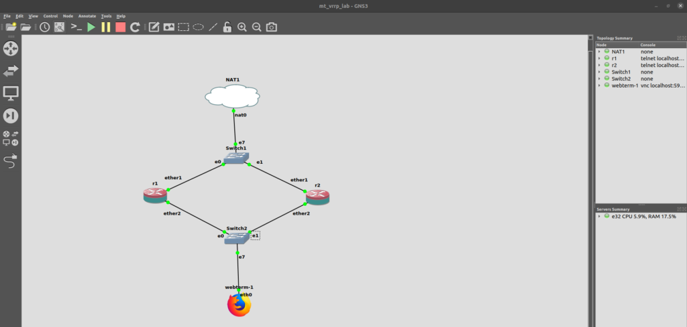
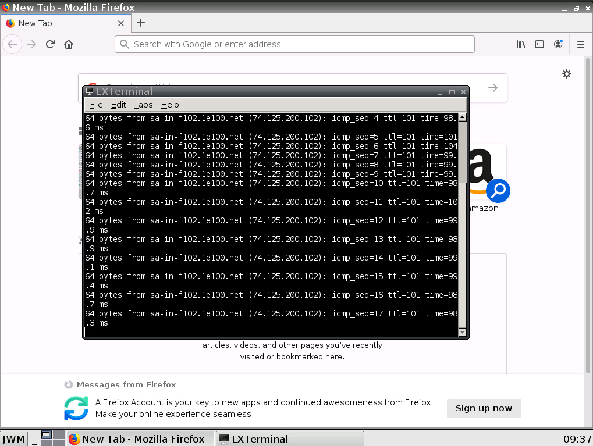

# VRRP ကို MikroTik မှာ setup လုပ်ပုံ

Keepalived အကြောင်းရေးတုန်းက VRRP ကို networking မှာကျယ်ကျယ်ပြန့်ပြန့် အသုံးပြုတဲ့အကြောင်းကိုထည့်သွင်း ရှင်းပြခဲ့ပါတယ်။ Network engineer တစ်ယောက်အနေနဲ့ VRRP concept ကို အနည်းဆုံးသိကြပါတယ်။ ကိုယ့် network မှာအသုံးပြုတဲ့ vendor ပေါ်မှာမူတည်ပြီးတော့ configure လုပ်တဲ့ပုံတော့ ကွာကြပါတယ်။ အပေါ်ယံအားဖြင့် သဘောသဘာဝတူကြပါတယ်။ Cisco IOS မှာသုံးတဲ့ command line နဲ့ MikroTik RouterOS မှာသုံးတဲ့ command line ကွာခြားပေမယ့်လည်း လိုရင်းတော့တူကြပါတယ်။

စာရေးသူ ဒီ post မှာတော့ MikroTik ကို GNS3 မှာကြိုတင်ပြင်ဆင်ထားပြီးတော့ lab တစ်ခုတည်ဆောက်ပြီးတော့ တဆင့်ချင်း ရှင်းပြခြင်းပါတယ်။ RouterOS ရဲ့ version 6.43.8 ကိုအသုံးပြုထားပြီးတော့၊ GNS3 မှာအလွယ်တကူ ရနိုင်တဲ့ webterm ကိုတော့ client အနေနဲ့ အသုံးပြုသွားမှာဖြစ်ပါတယ်။ Internet connection အတွက်တော့ NAT cloud ကိုအသုံးပြုမှာပါ။ အောက်မှာတော့ network topology ကို GNS3 မှာမြင်ရတဲ့ပုံစံဖြစ်ပါတယ်။

<figure><figcaption></figcaption></figure>

ပုံမှာတွေ့ရတဲ့အတိုင်း လိုအပ်တဲ့ appliance ကို GNS3 project မှာတည်ဆောက်ပြီးရင်တော့၊ webterm client ကို စပြီး configure လုပ်ပါ့မယ်။ Webterm ကို configure လုပ်ဖို့အတွက်တော့ appliance ကိုအရင် stop လုပ်ထားဖို့လိုပါတယ်။ ပြီးရင် Firefox icon နဲ့ webterm ပေါ်မှာ right-click လုပ်ကာ၊ “Edit config” ဆိုတဲ့ option ကိုရွေးပေးပြီး အောက်ကအတိုင်း configure လုပ်ရပါ့မယ်။

```
#
# This is a sample network config, please uncomment lines to configure the network
#

# Uncomment this line to load custom interface files
# source /etc/network/interfaces.d/*

# Static config for eth0
auto eth0
iface eth0 inet static
	address 192.168.0.100
	netmask 255.255.255.0
	gateway 192.168.0.1
	up echo nameserver 1.1.1.1 > /etc/resolv.conf

# DHCP config for eth0
#auto eth0
#iface eth0 inet dhcp
```

Webterm ရဲ့ eth0 interface မှာ IP address ကို 192.168.0.100/24 သတ်မှတ်ပေးပြီး၊ gateway ကို 192.168.0.1 ဆိုပြီး configure လုပ်လိုက်တာပါ။ နောက်အဆင့်အနေနဲ့ MikroTik router နှစ်လုံးမှာ ပထမတစ်လုံးကို r1 လို့ခေါ်ပြီး၊ နောက်တစ်လုံးကိုတော့ r2 လို့ခေါ်လိုက်ပါတယ်။ Router နှစ်ခုလုံးပေါ်မှာ အရင်ဆုံး NAT cloud ကနေ internet connection ရသလားလို့ အရင်စစ်ကြည့်လိုက်ပါ။ အလွယ်ဆုံး အနေနဲ့ google.com ကို ping ကြည့်လိုက်ပါ။ စာရေးသူ GNS3 မှာအသုံးပြုတဲ့ MikroTik CHR appliance ရဲ့ default configuration မှာ interface တိုင်းအတွက် DHCP client ကို enable လုပ်ထားပါတယ်။ အဲ့ဒီအတွက် ဘယ် interface က NAT cloud ဘက်မှာ connect လုပ်ထား လုပ်ထား internet connection က router နှစ်ခုလုံးပေါ်မှာ ရှိရပါ့မယ်။ သို့သော်… အဲ့ဒီ router နှစ်ခုလုံးရဲ့ အနောက်မှာ webterm client ရှိနေတဲ့ network အတွက်ပါ internet ရအောင် source NAT တစ်ခု configure လုပ်ဖို့တော့လိုပါလိမ့်မယ်။ Router နှစ်ခုလုံးပေါ်မှာ အောက်က အတိုင်း /ip firewall nat ကို configure လုပ်ရပါ့မယ်။

```
/ip firewall nat
add action=masquerade chain=srcnat out-interface=ether1 src-address=\
    192.168.0.0/24
```

MikroTik ရဲ့ command line မှာတော့ အခုလို syntax တွေကို အသုံးပြုပြီးတော့ configure လုပ်ရပါတယ်။ ဒီတစ်ခုမှာတော့ source address 192.168.0.0/24 subnet ကနေလာသမျှ traffic ကို source NAT chain မှာအသုံးပြုပြီး outbound interface ether1 နဲ့ masquerade လုပ်မယ်လို့ ဆိုပြီး သတ်မှတ်ပေးထားတာပါ။ တခုသတိထားရမှာက network topology ထဲကအတိုင်း ether1 ကို upstream interface အနေနဲ့ သုံးထားပြီးတော့၊ ether2 ကို downstream interface အနေနဲ့ သုံးထားပါတယ်။ ဒီမှာတော့… source NAT ကို အသေးစိတ်မရှင်းတော့ပါဘူး။ Network Address Translation (NAT) ကိုနောက်မှပဲ post တစ်ခုမှာ သီးသန့်ရေးပါ့မယ်။

နောက်အဆင့်မှာတော့ downstream interface ether2 မှာ IP address နဲ့ VRRP ကိုအောက်ကအတိုင်း ဆက်ပြီးတော့ configure လုပ်ပါ့မယ်။ ပထမဆုံး r1 ကို အရင်ကြည့်လိုက်ရအောင်။

```
/system identity
set name=r1
/interface vrrp
add interface=ether2 name=vrrp priority=200 vrid=50
/ip address
add address=192.168.0.1 interface=vrrp network=192.168.0.1
add address=192.168.0.2/24 interface=ether2 network=192.168.0.0
```

နောက် r2 ကိုကြည့်လိုက်ရအောင်။

```
/system identity
set name=r2
/interface vrrp
add interface=ether2 name=vrrp vrid=50
/ip address
add address=192.168.0.1 interface=vrrp network=192.168.0.1
add address=192.168.0.3/24 interface=ether2 network=192.168.0.0
```

မြင်ရတဲ့အတိုင်း အရင်ဆုံး router ရဲ့ hostname ကိုပြောင်းလိုက်ပါတယ်။ ပြီးရင် /interface vrrp ကို setup လုပ်ပါတယ်။ ကိုယ်သုံးမယ့် interface ရယ်၊ ကိုယ်ပေးချင်တဲ့ နာမည်ရယ် နဲ့ virtual router ID တို့ကို ကိုယ်လိုသလို သတ်မှတ်ပေးလိုက်ပါ။ သတိထားရမှာတစ်ခုက vrid တော့တူဖို့ လိုပါတယ်။ ထူးခြားတာတစ်ခုက r1 မှာ priority=200 ဆိုပြီးတော့ အပို configure လုပ်ထားပါတယ်။ MikroTik RouterOS မှာ VRRP ရဲ့ default priority က 100 ပါ။ ဒီတော့… r1 ကို preemptive master node အနေနဲ့ ထားချင်လို့ priority ကိုပိုမြင့်တဲ့ value ထည့်ပေးလိုက်ခြင်းဖြစ်ပါတယ်။ နောက်တစ်ခုက Virtual IP (VIP) ကို 192.168.0.1 လို့ configure လုပ်ထားပါတယ်။ ဒါကတော့… MikroTik မှာ VRRP ကို configure လုပ်တဲ့ပုံစံကို ပြပေးသွားတာဖြစ်ပါတယ်။ r1 နဲ့ r2 တို့ရဲ့ နောက်ဆုံး configuration ကအောက်မှာ ပြထားတဲ့အတိုင်းဖြစ်နေရပါ့မယ်။

```
[admin@r1] > export
# aug/01/2022 07:26:38 by RouterOS 6.43.8
# software id = 
#
#
#
/interface ethernet
set [ find default-name=ether1 ] disable-running-check=no
set [ find default-name=ether2 ] disable-running-check=no
/interface vrrp
add interface=ether2 name=vrrp priority=200 vrid=50
/interface wireless security-profiles
set [ find default=yes ] supplicant-identity=MikroTik
/ip address
add address=192.168.0.1 interface=vrrp network=192.168.0.1
add address=192.168.0.2/24 interface=ether2 network=192.168.0.0
/ip dhcp-client
add disabled=no interface=ether1
/ip firewall nat
add action=masquerade chain=srcnat out-interface=ether1 src-address=\
    192.168.0.0/24
/system identity
set name=r1
```

```
[admin@r2] > export
# aug/01/2022 07:30:50 by RouterOS 6.43.8
# software id = 
#
#
#
/interface ethernet
set [ find default-name=ether1 ] disable-running-check=no
set [ find default-name=ether2 ] disable-running-check=no
/interface vrrp
add interface=ether2 name=vrrp vrid=50
/interface wireless security-profiles
set [ find default=yes ] supplicant-identity=MikroTik
/ip address
add address=192.168.0.1 interface=vrrp network=192.168.0.1
add address=192.168.0.3/24 interface=ether2 network=192.168.0.0
/ip dhcp-client
add disabled=no interface=ether1
/ip firewall nat
add action=masquerade chain=srcnat out-interface=ether1 src-address=\
    192.168.0.0/24
/system identity
set name=r2
```

Webterm client ဘက်နေစမ်းသပ်ဖို့အတွက် အရင်ဆုံး internet connection ရ မရကို အရင်ဆုံးစစ်ကြည့်လိုက်ပါ။ Client ဘက်ကနေ gateway IP 192.168.0.1 ကိုရော၊ google.com ကိုရော ping လို့ရတယ်ဆိုရင် စပြီးတော့ VRRP အလုပ် လုပ်သလားကို စမ်းသပ်ကြည့်လို့ ရနိုင်ပါပြီ။ စမ်းဖို့အတွက် webterm client မှာ terminal ကိုဖွင့်ပြီး google.com ကို အဆက်မပြတ် ping ထားပါ။ ပြီးရင် r1 ကို powered off ကြည့်လိုက်ပါ။ Ping ကတောက်လျှောက်ဆက်ပြီးတော့ response ပြန်ရနေရပါ့မယ်။

<figure><figcaption></figcaption></figure>

ဒီ post မှာတော့ VRRP ကို MikroTik RouterOS မှာ configure ဘယ်လိုလုပ်လို့ရသလဲဆိုတာ အကျဉ်းချုပ် ခပ်သွက်သွက်ကလေး ရှင်းပြပေးထားပါတယ်။ VRRP အလုပ် လုပ်မလုပ်ကိုလည်း လက်တွေ့မှာ စမ်းသပ်လို့ရအောင်လို့ GNS3 မှာ lab တစ်ခုတည်ဆောက်ပြီးလည်း ပြပေးထားတဲ့အတွက် အဆင်ပြေမယ်လို့ ထင်ပါတယ်။ ဒီ post ကိုတော့ ဒီလောက်နဲ့ပဲ ရပ်လိုက်ပါတော့မယ်။
