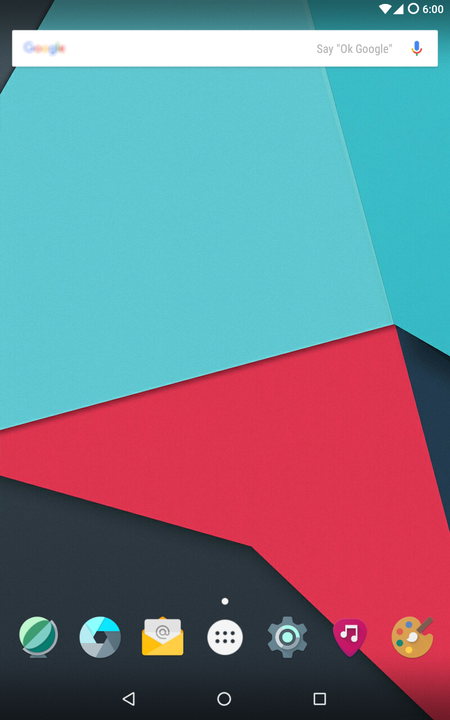
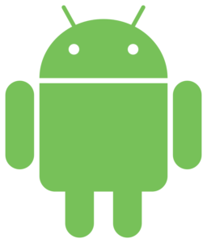
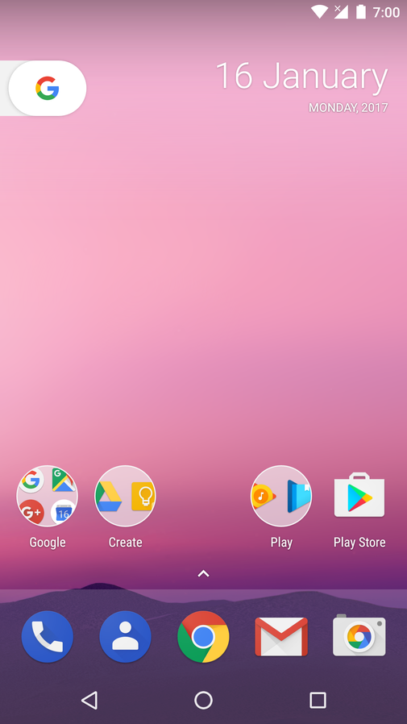
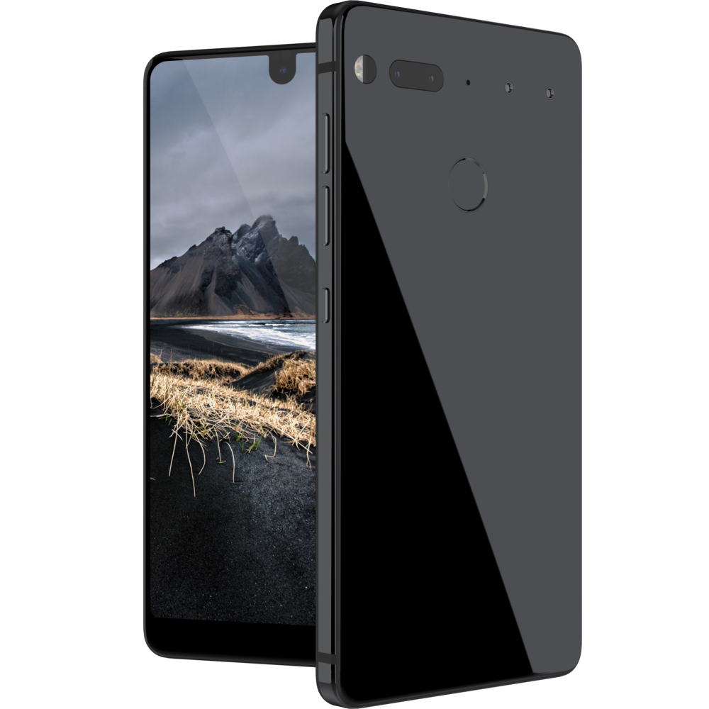
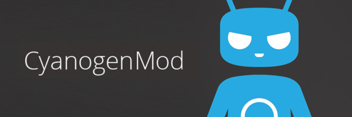

# CyanogenMod မိတ်ဆက် အပိုင်း(၁)

ဒီ CyanogenMod အကြောင်းလေးကို ရေးဖို့စိတ်ကူး ဖြစ်တာ နည်းနည်းတောင်ကြာသွားပါပြီ။ စိတ်ကသာ ဒီစာရေးဖို့ စိတ်အားထက်သန်ပြီးတော့ စိတ်မအား လူမအားတာနဲ့ မရေးဖြစ်ခဲ့တဲ့ အကြောင်းတစ်ခုပါ။ နည်းပညာလောကထဲမှာ အထူးသဖြင့် Android mobile/tablet ပိုင်းမှာ ကျွမ်းကျင်သူတွေ အနေနဲ့တော့ CyanogenMod (CM) ကို မသိတဲ့သူ မရှိပါဘူး။ CyanogenMod (CM) အကြောင်းကို ပြောမယ်ဆိုရင်လည်း သူရဲ့ အရင်းမြစ်ဖြစ်တဲ့ Android အကြောင်းကလည်း နည်းနည်းတော့ ပြောမှ ကွင်းဆက် ချိတ်မိမှာမို့ Android အကြောင်း အကျဉ်းချုပ် သဘောမျိုး ရှင်းပါ့မယ်။ ပြီးတော့မှ CM ရဲ့ ဖြစ်ပေါ်လာပုံ၊ တိုးတက်ပြောင်းလဲလာပုံ နဲ့ project ရပ်တန့်သွားပြီးတော့မှ အသက်ပြန်ဝင်လာပုံတွေကို အဆင့်ဆင့်ရှင်းပြချင်ပါတယ်။ Android သမားတွေ အတွက်တော့ ဒီ CM ဆိုတဲ့ဟာကို မိတ်ဆက်စရာ မလိုပေမယ့်လည်း မသိသေးတဲ့ စိတ်ဝင်စားတဲ့ သူတွေ အနေနဲ့တော့ CM ဘာလဲဆိုတာကို ရိပ်စားမိ အောင်လို့ မိတ်ဆက်ပေးတဲ့ သဘောမျိုးပါ။

<figure><figcaption></figcaption></figure>

## Android ကောက်ကြောင်း

ပထမဆုံး အနေနဲ့ Android အကြောင်းလေးကို စလိုက်ရအောင်ဗျာ။ သိပြီးကြတဲ့ အတိုင်း Android ဆိုတာကတော့ Google ရဲ့ mobile/tablet platform မှာသုံးတဲ့ Opearting System တစ်ခု ဖြစ်ပါတယ်။ Apple မှာ iOS ကိုသုံး သလိုပဲ၊ Apple မဟုတ်တဲ့ Samsung ၊ HTC ၊ LG ၊ Sony အစရှိတဲ့ mobile တွေမှာတော့ Android ကိုသာလက်ရှိ mobile/tablet market မှာ အသုံးများကြပါတယ်။ Microsoft ကထုတ်တဲ့ Windows Phone တွေမှာတော့ Windows 8 သို့မဟုတ် Windows 10 တွေကို အခြေခံထားတဲ့ Windows Phone OS တွေကို သုံးပါတယ်။ Ubuntu ကလည်း Unity platform ကို အခြေခံပြီးတော့ Ubutnu mobile OS ဆိုပြီးတော့လည်းလုပ်ပြီးကာမှ အကြောင်းအမျိုးမျိုးကြောင့် Unity project ကရပ်သွားပြီးတော့ Ubuntu mobile OS ကလည်း active project တစ်ခုအနေနဲ့ မရှိလောက်တော့ပါဘူး။ Europe ဘက်မှာတော့ Ubuntu mobile ကို တော်တော်လေးကို အသုံးပြုလိုက်သေးတာကိုလည်း သတိထားမိပါတယ်။ ဆိုလိုရင်းက iOS တစ်ခုတည်းသာ mobile နည်းပညာမှာ ရှေ့ရောက်နေတာမဟုတ်ပါဘူး။ စာရေးသူအမြင်အရတော့ Android ဟာအစောပိုင်းကတည်း feature စုံစုံလင်လင်နဲ့ အစဉ်အလာကောင်းလာခဲ့တာ အခုထိတိုင်လို့ဆိုရမှာ ဖြစ်ပါတယ်။ ပိုပြီးတော့ စိတ်ဝင်စားဖို့ကောင်းတာကတော့ Android ဟာ Linux kernel ပေါ်မှာ ရေးထားတဲ့ mobile platform တစ်ခုဖြစ်ပါတယ်။ Linux kernel ကတော့ solid ဖြစ်တဲ့ kernel တစ်ခု အနေနဲ့ လူသိများပြီးသား ဖြစ်ပါတယ်။ အဲ့ဒါ ကြောင့်လည်း Android မှာ native shell command တွေကို သုံးလို့ရတာဖြစ်ပါတယ်။ mobile platform တစ်ခုဖြစ်တဲ့ အတွက် ကန့်သတ်ချက်တွေတော့လည်း ရှိပါတယ်။ နောက်ပြီးတော့ Android က open source ဖြစ်တဲ့အတွက် Linux distro တွေလိုပဲ ပုံစံမျိုးစုံ နဲ့ source code ကိုယူသုံးပြီးတော့ တဆင့်ပြန်ပွားယူလို့ ရပါတယ်။ ဒီအချက်က အရေးကြီးပါတယ်။ ဘာလို့လည်းဆိုတော့ open source ဖြစ်လို့သာ အခု CM အကြောင်းကို ဆက်ရေးလို့ရတာပါ။ CM က Android မှတဆင့် fork လုပ်ထားတဲ့ project ပါ။

<figure><figcaption></figcaption></figure>

Android ကိုတော့ အောက်တိုဘာလ ၂၀၀၃ခုနှစ်မှာ Andy Rubin နဲ့ တခြားသူ့ သူငယ်ချင်း သုံးယောက် ပေါင်းပြီးတော့ စခဲ့တဲ့ project လေးတစ်ခုဖြစ်ပါတယ်။ Android ရဲ့ အစပိုင်းဖြစ်တဲ့ And ဆိုတာဘယ်ကလာ သလဲဆိုတာကတော့ စာဖတ်သူတို့ အခုဆိုရင်တော့ သိလောက်ပြီထင်ပါတယ်။ သူ့နာမည် Andy ကနေယူတော့ Android ဆိုပြီးတော့ ယူသုံးထားတာပါ။ စစချင်းမှာတော့ Andy Rubin ဟာ Android ကို digital camera တွေမှာ အသုံးပြုလို့ရအောင်လို့ firmware တစ်ခု အနေနဲ့ စတင်ခဲ့တာပါ။ Mobile/tablet market ကလည်း တချိန်တည်းမှာလို အဲ့ဒီအချိန်က တဟုန်ထိုးပြီး တိုးတက် ပြောင်းလဲလာတာမို့ Andy Rubin က Android ရဲ့ ဦးတည်ချက်က ပြောင်းပြီးတော့ mobile/tablet platform တစ်ခု အဖြစ်ကို အသွင်ပြောင်းလိုက်ပါတော့တယ်။ အဲ့ဒီ ဆုံးဖြတ်ချက်ဟာ Andy Rubin တို့ project team တစ်ခုလုံးအတွက် ကောင်းသော ပြောင်းလဲခြင်းဖြစ်လာပါတယ်။ ဒါအပြင် Andy Rubin အနေနဲ့ သူ့ရဲ့ Android ကို Google လို high tech company အကြီးစားတွေမှာ promote လုပ်ရတာ ပိုပြီးတော့ ဘောင်ဝင်လာတဲ့ သဘောမျိုးလည်းဖြစ် ပါတယ်။ Google ဟာလည်း mobile/tablet platform အတွက် OS တစ်ခုကို စိတ်ကူးနေတဲ့ အချိန်ဖြစ်တာမို့ Andy Rubin ရောင်းတဲ့ Android project ကို ၂၀၀၅ခုနှစ်မှာ ဝယ်ယူလိုက်တဲ့ အပြင် Andy Rubin တို့ project team ကိုလည်း ဆက်လက် ပြီးတော့ Google အတွက် အလုပ်လုပ်စေခဲ့ပါတယ်။ Andy Rubin တို့ Android team ကို လုပ်မြဲအတိုင်း Android ကို Google ရဲ့ စီမံချက်အောက်မှာ ဆက်လက် develop လုပ်စေခဲ့ပါတယ်။ အခုဆိုရင်တော့ Android ဟာ Google ရဲ့ အောင်မြင်ပြီးတော့ လူကြိုက်များတဲ့ product တစ်ခု အနေနဲ့ လက်ရှိမှာတော့ version 7.1 (codename Nougat) stable အထိရှိလာပါပြီ။ Andy Rubin ကတော့ Google နဲ့ မရှိတော့ပဲနဲ့ သူ့ကိုယ်ပိုင် mobile company နောက်တစ်ခုကို ထပ်ပြီးတော့ တည်ထောင် လာခဲ့ပါတယ်။ အခုဆိုရင် သူ့ရဲ့ mobile အသစ်ဖြစ်တဲ့ Essential ဟာ အမေရိကန်နိုင်ငံမှာ စတင်ဝယ်ယူလို့ရနေပါပြီ။

<figure><figcaption></figcaption></figure>

<figure><figcaption></figcaption></figure>

<figure><figcaption></figcaption></figure>

Android ဟာလည်း Linux distro တွေမှာလို version တိုင်းအတွက် codename လေးတွေပေးထားပါတယ်။ version 1.0 နဲ့ 1.1 မှာတော့ codename မရှိခဲ့ပါဘူး။ version 1.5 ကစလို့ အောက်ကအတိုင်း နာမည်လေးတွေကို အင်္ဂလိပ် အက္ခရာ အစဉ်လိုက် အတိုင်း နာမည်ပေးလာ ခဲ့ပါတယ်။

Version 1.5 = Cupcake\
Version 1.6 = Donut\
Version 2.0, 2.0.1, 2.1 = Eclair\
Version 2.2 = Froyo\
Version 2.3 = Gingerbread\
Version 3.x = Honeycomb\
Version 4.0.x = Ice Cream Sandwich\
Version 4.1.x to 4.3.x = Jelly Bean\
Version 4.4.x = KitKat\
Version 5.x = Lollipop\
Version 6.x = Marshmallow\
Version 7.x = Nougat\
Version 8.x = O (ဒီစာရေးတဲ့ အချိန်မှာ preview အနေနဲ့ပဲရှိပါသေးတယ်။)

Codename တွေအကုန်လုံးဟာ အနောက်တိုင်းသားတွေရဲ့ အချိုသရေစာမုန့်တွေပဲဖြစ်ပါတယ်။ နောက်ဆုံးက Android O ကလည်း Oreo ကိုပြောတယ်လို့ ထင်ကြေးပေးကြပါတယ်။ ဒါကတော့ Android ကို အကျဉ်းချုပ်ပြီးတော့ ရှင်းတာပါ။ Android အကြောင်းပြောမယ်ဆိုလည်း ပြောစရာကုန်မယ် မထင်ပါဘူး။ စာရေးသူ အနေနဲ့ iOS ထက်စာရင် Android ကို ပိုပြီးတော့ သဘောတွေ့ပါတယ်။ အသစ်အဆန်း feature တွေမှာ Android က iOS ထက် အမြဲတမ်းသာတယ်လို့ မြင်မိပါတယ်။ တချို့ကတော့ ပြောပါတယ်။ စစ်တမ်းတွေအရ Android ဟာ iOS လောက် မလုံခြုံဘူးလို့ဆိုပါတယ်။ Security ဘက်မှာတော့ လုံခြုံတယ် မလုံခြုံဘူးဆိုတာကတော့ အသုံးပြုတဲ့ သူနဲ့လည်း သက်ဆိုင်ပါတယ်။ တစ်ခုသတိထားရမှာက iOS အသုံးပြုသူထက် Android အသုံးပြုသူဟာ သိသိသာသာကြီးကိုများပါတယ်။ ဥပမာ တရုတ်ကထုတ်တဲ့ စျေးပေါတဲ့ mobile တွေမှာ Android ကိုသာ အသုံးပြုပါတယ်။ နောက်တစ်ခုက Android ကိုသုံးတဲ့ အသုံးပြုသူတော်တော်များများ ဟာ root ဖောက်ထားကြတာများပါတယ်။ ကျွမ်းကျင်သူကော မကျွမ်းကျင်သူပါ လိုအပ်ချက် တစ်ခုခုကြောင့် Android မှာ root ဖောက်ကြတာများပါတယ်။ အဲ့ဒါဟာ Android မှာ security breach ဖြစ်စေတဲ့ အကြောင်းအရင်းတစ်ခုလို့ စာရေးသူမြင်မိပါတယ်။

## CyanogenMod ဆိုတာ

အရှေ့မှာပြောခဲ့သလိုပဲ Android က open source ဖြစ်တဲ့အတွက် ဘယ်သူမဆို source code ကို download ဆွဲပြီးတော့ ကိုယ်ပြင်ဆင်ချင်သလိုပြင်ဆင်ပြီးတော့ ပြန်လည် ဝေမျှလို့ရပါတယ်။ Open source တို့ရဲ့ ထုံးစံအတိုင်း ပိုမိုလွတ်လပ်ခွင့် ရှိတဲ့အတွက် ပြီးတော့ ပြင်ဆင်ဖို့ကို developer တွေက အဆင်သင့်ရှိနေတတ်ပါတယ်။ အဲ့လို လွတ်လပ်ခွင့်ရှိလိုလည်း CyanogenMod လို Android ကနေ fork လာတဲ့ Custom ROM တွေထွက်ရှိလာတာဖြစ်ပါတယ်။ Custom ROM လို့ခေါ်တဲ့နေရာမှာလည်း အသုံးအနှုန်းအားဖြင့် မှန်တော့မမှန်ပါဘူး။ နည်းပညာလောကမှာ နှုတ်ကျိုးလာလို့တာ ခေါ်လာကြတဲ့ Custom ROM ဆိုတာဟာ အမှန်မှာတော့ Custom Firmware သို့မဟုတ် Custom OS လို့ခေါ်မှသာ မှန်မှာပါ။ ဘယ်လိုပဲဖြစ်ဖြစ် ဒီ post မှာတော့ နှုတ်ကျိုးနေပြီးသား ဖြစ်တဲ့ Custom ROM ရယ်လို့သာ ဆက်ပြီးတော့ သုံးနှုန်းသွားပါ့မယ်။ ဆိုလိုရင်းက CyanogenMod ဆိုတာ Android ရဲ့ Custom ROM တစ်ခုဖြစ်ပါတယ်။ နောက်ပြီးတော့ Cyanogen ဆိုကတော့ Chemistry မှာဆိုရင် အရောင်မရှိတဲ့ အဆိပ်ရှိတဲ့ မီးတောက် ဓာတ်ငွေ့တမျိုးဖြစ်ပါတယ်။ Android ရဲ့ Custom ROM ကိုရေးတဲ့ project team တွေဟာ သူတို့ကိုယ် သူတို့ နာမည်အပြောင်တွေ ပေးလေ့ရှိပါတယ်။ Cyanogen project ထဲမှာပဲ နောက်အဖွဲ့ နာမည်က Team Douche ဆိုတာလည်းရှိပါသေးတယ်။ CyanogenMod ကို ဒီနေရာကနေစပြီးတော့ CM လို့ပဲ အတိုကောက်ခေါ်ပါတော့မယ်။ အပြင်မှာလည်း CM လို့ သာ ခေါ်ဆို သုံးနှုန်းကြပါတယ်။

<figure><figcaption></figcaption></figure>

CM ကို ပထမဆုံး စတင်ထုတ်လုပ် ခဲ့တာ ၂၀၀၉ခုနှစ်ထဲမှာ HTC Dream နဲ့ HTC Magic အတွက် Android အပြင် သုံးလို့ရတဲ့ OS တစ်ခုအနေနဲ့ မိတ်ဆက်ပေးလိုက်ပါတယ်။ တကယ်တမ်းမှာတော့ HTC Dream ဟာ Android ကို ၂၀၀၈ခုနှစ်ထဲမှာ စီးပွားဖြစ်စတင်ထုတ်လုပ်တဲ့ mobile တစ်လုံးဖြစ်ပါတယ်။ ပြောရရင် CM ဟာ Android နဲ့ မရှေးမနှောင်း mobile market ထဲကို ဝင်ရောက်ခဲ့တာဖြစ်ပါတယ်။ Cyanogen ကိုစစထုတ်ချင်းမှာတော့ JesusFreke ဆိုတဲ့ nickname နဲ့ developer တစ်ယောက်က စတင်ရေးသားခဲ့ပါတယ်။ ၂၀၀၉ခုနှစ်မှာတော့ JesusFreke ကဆက်ပြီးတော့ maintain မလုပ်နိုင်တော့လို့ production ကိုရပ်လိုက်ရပြီးတော့ Steve Kondik သို့မဟုတ် nickname Cyanogen ကိုဆက်လက် maintain လုပ်စေခဲ့ပါတယ်။ Cyanogen က ဆက်ပြီး Modify လုပ်ထားလို့ CyanogenMod လို့ခေါ်ဆိုခြင်းလည်းဖြစ်ပါတယ်။ CM ဟာအဲ့ဒီမှာ စတင်မွေးဖွားလာပါတော့တယ်။ Android 2.3 Gingerbread ကို အခြေခံထားတဲ့ CM 7 မှာတော့ CM ကိုလူတွေက စပြီးတော့ စိတ်ဝင်တစားရှိလာကြပါတယ်။

<figure><figcaption></figcaption></figure>

CM ကကောင်းတာတော့ ဟုတ်ပြီ ဘာကြောင့် ဖုန်းနဲ့လာတဲ့ Android OS သို့မဟုတ် Manufacturer ကထည့်ပေးလိုက်တဲ့ mobile OS ကို မသုံးပဲ CM ကိုဘာလို့ ပြောင်းသုံးရမှာလဲ။ အဖြေကတော့ Freedom ပိုပြီးတော့ရနိုင်လို့ပါ။ CM လို Custom ROM တွေသုံးခြင်းအားဖြင့် feature အသစ်တွေ စမ်းသပ်သုံးကြည့်လို့ ရရုံသာမက ကိုယ်စိတ် ကြိုက် ပြောင်းလဲသုံးလို့ရတဲ့ ဟာတွေဟာ CM ရဲ့ အားသာချက်တွေပဲဖြစ်ပါတယ်။ နောက်ပြီးတော့ CM Custom ROM တွေတော်တော်များများဟာ root ဖောက်ပြီးသာတွေများပါတယ်။ CM Custom ROM သီးသန့်ကိုတင်ပြီးမှ root ဖောက်ချင်လည်းရပါတယ်။ တချို့ကတော့ root ဖောက်တယ်ဆိုတာ အပျက်သဘောမျိုးနဲ့ သိထား ထင်ထားကြပါတယ်။ အမှန်မှာတော့ root ဖောက်တယ်ဆိုတာ Linux distro တွေမှာလိုပဲ sudo နဲ့ command တစ်ခု run တဲ့ သဘောမျိုးတဲ့ အတူတူပဲဖြစ်ပါတယ်။ Apple က Jailbreak နဲ့တော့ မတူပါဘူး။ root ဆိုတာ Linux မှာဆို su root command ကို run ပြီးတော့ root access ပေးလိုက်တာနဲ့ အတူတူပါပဲ။ မသုံးတတ်တဲ့ end users တွေဟာ တွေ့ကရာ App တွေကို download ဆွဲပြီးတော့ root နဲ့ run လိုက်တဲ့အတွက် phone ပေါ်ကို malware တွေဟာ ရောက်လာပြီးတော့ security breach နဲ့ backdoor တွေကိုဖွင့်ပြီး user data ကို ခိုးယူတာမျိုးဖြစ်တတ်တာပါ။ နည်းပညာဘက်မှာ ကျွမ်းကျင်သူ မဟုတ်ရင်တော့ CM ကိုသုံးချင်ရင် CM ကြီးပဲ သက်သက်တင်ပြီးတော့သုံးသင့်ပါတယ်။ root မဖောက်သင့်ပါဘူး။ CM ကို flash လုပ်ပြီးရင် Manufacturer ကတင်ပေးလိုက်တဲ့ OS မတူတာနောက်တစ်ခုက Google Play Services တွေဖြစ်တဲ့ Google Play Store တို့ Google Voice Assistant တို့ လိုဟာတွေကို CM မှာ မတွေ့နိုင်ပါဘူး။ ကိုယ်က Google Play ကိုမသုံးချင်လို့ တခြား App store ကိုသုံးချင်လည်းရအောင်လုပ်ပေးထားတာပါ။ Google service တွေဟာ user ရဲ့ data ကို collect လုပ်ပြီးတော့ trace လည်းလုပ်တဲ့အတွက် သိတဲ့သူ တော်တော်များများ က မကြိုက်ပါဘူး။ ဥပမာ Google Map App ကိုသုံးနေရင် user ရဲ့ movement ကို trace လုပ်ပြီးတော့ Google Map ရဲ့ road traffic ကိုတွက်ချက်ပေးပါတယ်။ ကောင်းကျိုးလည်းရှိသလို ဆိုးကျိုးလည်းရှိပါတယ်။ CM မှာ Google Play service တွေကို သုံးချင်ရင် OpenGapp ဆိုတာရှိပါတယ်။ ဒါကိုကြည့်ခြင်းအားဖြင့် CM ကို အသုံးပြုခြင်းဟာ အားသာချက်တွေရှိသလို ပိုမိုရွေးချယ်ပိုင်ခွင့်လည်း ရှိတာကိုတွေ့နိုင်ပါတယ်။အောက်မှာတော့ ထွက်ရှိပြီးသား CM version နဲ့ သူအခြေခံထားတဲ့ Android version ကိုတွဲပြီးတော့ဖော်ပြပေးထားပါတယ်။

CyanogenMod 3 (based on Android Cupcake 1.5.x, initial release)\
CyanogenMod 4 (based on Android Cupcake 1.5.x and Android Donut 1.6.x)\
CyanogenMod 5 (based on Android Eclair 2.0/2.1)\
CyanogenMod 6 (based on Android Froyo 2.2.x)\
CyanogenMod 7 (based on Android Gingerbread 2.3.x)\
CyanogenMod 9 (based on Android Ice Cream Sandwich 4.0.x, major UI revamp)\
CyanogenMod 10 (based on Android Jelly Bean 4.1.x to 4.3.x)\
CyanogenMod 11 (based on Android KitKat 4.4.x)\
CyanogenMod 12 (based on Android Lollipop 5.0.x to 5.1.x, major UI revamp)\
CyanogenMod 13 (based on Android Marshmallow 6.0.x)\
CyanogenMod 14.1 (based on Android Nougat 7.1.x)

ဒီအပိုင်းမှာတော့ ဒီလောက်နဲ့ပဲရပ်လိုက်ပါတော့မယ်။ နောက်တစ်ခုမှာတော့ CM ရဲ့ အတက်အကျ အနိမ့်အမြင့်နဲ့ မမျှော်လင့်ပဲ အဆုံးသတ်သွားတာကို ဆက်လက်ရေးသားသွားမှာ ဖြစ်ပါတယ်။
