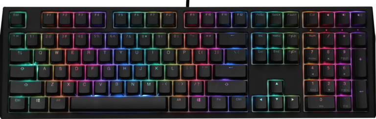
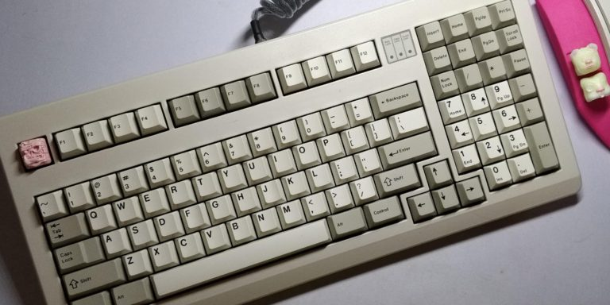
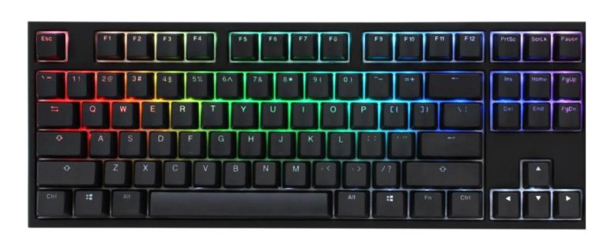
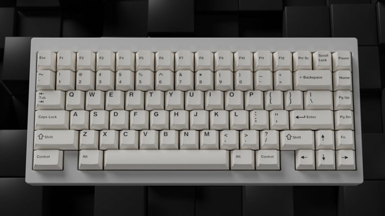
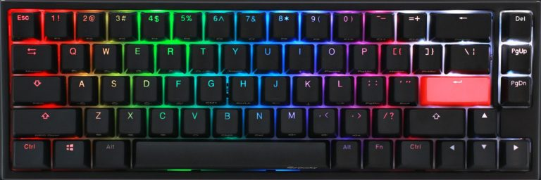
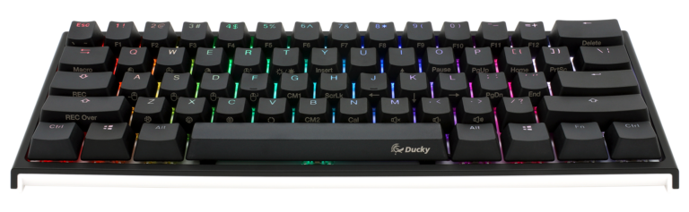
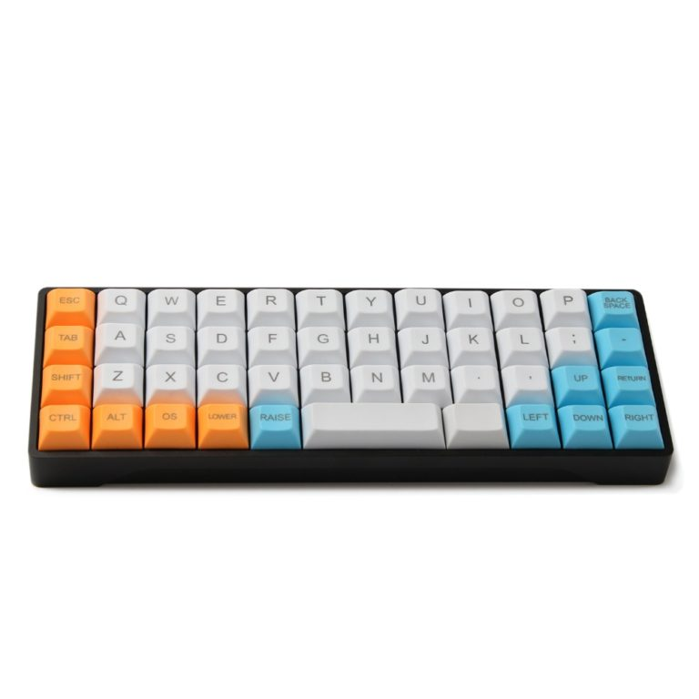

# Keyboard Size တွေအကြောင်းသိသမျှ

ဒီ COVID-19 အချိန်မှာ စာရေးသူ ဝါသနာအသစ်တစ်ခုရလိုက်ပါတယ်‌။ အဲ့ဒါကတော့… အပြင်မထွက်ရမည့်အတူတူ အိမ်မှာပဲ ဟိုဟာရှာဖတ်လိုက်ဒီဟာ ရှာဖတ်လိုက်နဲ့ ကြံကြံဖန်ဖန် ကိုယ်နေ့စဉ် computer မှာအသုံးပြုတဲ့ keyboard တွေအကြောင်းကို စပြီးတော့ စိတ်ဝင်စားစပြုလာပါတယ်။ နေ့စဉ် အိမ်မှာရော၊ ရုံးမှာပါ အသုံးပြုတဲ့ keyboard တွေအကြာင်းကို တခါမှ အခုလိုမျိုး စိတ်ဝင်တစား လိုက်ပြီးတော့ ရှာဖွေပြီးတော့ မဖတ်ဖြစ်ပါဘူး။ အခု‌တော့ နေ့စဉ်လိုလို mechanical keyboard လေးတွေ အကြောင်းနဲ့ custom build ဘယ်လိုလုပ်သလဲဆိုတာတွေ တော်တော်လေးကို စိတ်ဝင်စားဖြစ်နေပါတယ်။ သူများတွေ စိတ်ရှည်လက်ရှည် custom build လုပ်ထားတဲ့ keyboard လေးတွေကိုလည်း မျက်လုံးထဲမှာ တော်တော်လေးလည်း လှတယ်လို့ထင်ပါတယ်။ ကိုယ်တိုင်လည်း custom keyboard တစ်ခုလောက်တော့ စမ်းပြီးတော့ ကိုယ့်လက်နဲ့ ကိုယ်ခြေ စမ်းသပ် build လုပ်ဖို့လည်း စိတ်ကူးရှိနေပါတယ်။ သို့သော်လည်း custom keyboard တစ်လုံးတည်ဆောက်ဖို့ ကုန်ကျမည့်စရိတ်ကို တွက်ကြည့်လိုက်တော့ စျေးတော့ အရမ်း မပေါလွန်းပါ။ မကုန်ဘူးဆိုရင် အမေရိကန် ဒေါ်လာတန်ဖိုး ၂၀၀ ကနေ ၃၀၀ ကျော်ကျော်လောက်ထိ ဖြစ်နိုင်ပါတယ်။ ဒါတောင်မှ အခြားလိုအပ်မယ့် toolkit ဖိုးတွေထည့်မတွက်ထားသေးပါဘူး။ ဒါကြောင့်လည်း အချို့သော custom keyboard ကို build လုပ်ပြီးတော့ရောင်းတဲ့ online shop တွေမှာ keyboard တစ်လုံးကို ဒေါ်လာ ၄၀၀ ၅၀၀ ၆၀၀ အသီးသီး စျေးခေါ်ကြတာလို့နားလည်လာမိပါတယ်။ နောက်ပြီးတော့ အချို့သော YouTube channel တွေမှာလည်း keyboard တစ်လုံးတည်ဆောက်ပုံကို အသေးစိတ် အဆင့်ဆင့် ရှင်းပြထားတာမို့၊ တော်တော်လေးကို စိတ်ပြေလက်ပျောက်ရှိလှပါတယ်။ သို့ပေမယ့်လည်း အချိန်မရတာနဲ့ ကိုယ်တိုင်စိတ်ကြိုက် custom keyboard တစ်လုံးကို စိတ်ကြိုက် တည်ဆောက်ဖို့ကို ခဏလေး အချိန်ဆိုင်းပြီးတော့ အဆင့်သင့် ရိုးရိုး computer ဆိုင်တွေကနေဝယ်လို့ ရတဲ့ နာမည်ကြီး brand နဲ့ keyboard တွေကို ဝယ်ဖို့ကို စတင်လိုက်လံ ရှာဖွေရပြန်ပါတယ်။ consumer market ထဲမှာတော့ custom keyboard တွေလောက်စိတ်တိုင်းမကျပေမယ့်လည်း တန်ကြေးအားဖြင့် မဆိုးလွန်းလှဘူးလို့ ထင်မိပါတယ်။ စိတ်ထဲမှာတော့ custom keyboard တွေလောက်တော့ စိတ်အာရုံကို မဖမ်းစားနိုင်ဘူးလို့ ထင်မိလို့၊ consumer market ထဲမှာလည်း ဝယ်လို့နည်းနည်းလွယ်ပြီး custom keyboard အထာနည်းနည်းကျတဲ့ စပ်ကြားကို လိုက်ရှာလိုက်ရာကနေပြီတော့ အချို့သော စိတ်ကြိုက် brand လေးနှစ်ခု သုံးခုလောက်ကို တွေ့မိပြန်တယ်။

ဒီအထက်မှာပြောတဲ့ discovery process က မရှိဘူးဆိုရင် ၂ ပတ်ကနေ ၃ ပတ်လောက်ကြာပြီးတော့ အချိန်ရှိသမျှ keyboard နဲ့ ပတ်သတ်တဲ့ အကြောင်းအရာတွေကို ပဲလိုက်ပြီးတော့ ရှာဖတ်တတ်တဲ့ procrastination အဆင့်ကို မသိမသာရောက်လို့ လာပြန်ပါတယ်။ အထူးသဖြင့် လုပ်စရာအများကြီးရှိနေရဲ့နဲ့ keyboard အကြောင်းတွေကိုလိုက်ရှာဖတ်နေရင်း အချိန်ကိုဆွဲလာသလိုဖြစ်လာပါတယ်။ မည်သို့ပင်ဖြစ်စေ keyboard နဲ့ပတ်သတ်တဲ့ အကြောင်းအရာတွေကို လက်လှမ်းမှီသလောက် ရှာဖတ်ရင်းနဲ့ အကုန်လုံး လုံးစေ့ပတ်စေ့ သိသွားတယ်လို့ မဆိုနိုင်သော်လည်း၊ တော်တော်များများတော့ လေ့လာဖြစ်သွားပါတယ်။ ထုံးစံအတိုင်း နည်းနည်းသိရင် နည်းနည်းပြန်မျှဝေတတ်တဲ့ အကျင့်တစ်ခုကြောင့် ဒီ article လေးကို ရေးဖြစ်လို့ အကြောင်းဖြစ်လာပါတော့တယ်။ သိသလောက် ပြန်လည်မျှဝေမှာမို့ မပြည့်စုံတာလည်း ရှိနိုင်ပါတယ်။ သို့သော် သိသလောက်မျှဝေဖြစ်တော့ စာရေးသူလည်း ပိုပြီးတော့ သိလာရတာပေါ့။ ကိုယ့်လိုပဲ… mechanical keyboard crazy ဖြစ်တဲ့သူအချင်းချင်းတော့ ပြောလို့မကုန်နိုင်တဲ့ topic တစ်ခုပါ။

### Keyboard အရွယ်အစား ပေါင်းစုံ အကြောင်း

စာရေးသူတို့ နေ့စဉ်နဲ့ အမျှ PC တွေမှာ အသုံးပြုနေတဲ့ ရုံးသုံး အိမ်သုံး keyboard တွေကို 100% full-size keyboard လို့ခေါ်ပါတယ်။ Laptop မှာသုံးတဲ့ keyboard ကတော့ ကိုယ့်ရဲ့ laptop size ပေါ်မှာ မူတည်ပြီးတော့ full-size နဲ့ လာတဲ့ keyboard တွေရှိသလို၊ size သေးရင်သေးသလို keyboard size ဟာ လိုက်ပြောင်းတတ်လို့ ပုံသေး မရှိပါဘူး။ ဒါကြောင့်မို့… laptop ရဲ့ keyboard အရွယ်အစားကိုတော့ သီးသန့် သတ်မှတ်မထားတာကို တွေ့ရပါတယ်။ သို့သော် mechanical keyboard တွေမှာတော့ သူ့အရွယ်အစားပေါ်မှာမူတည်ပြီးတော့ အရွယ်အစားကို နာမည်ပုံစံအမျိုးမျိုးပေးကြပါတယ်။ ထိုထိုသော အရွယ်အစားပေါင်းစုံကိုတော့ consumer market ထဲက vendor တွေက အကုန်လိုက်ပြီးတော့ မထုတ်ပါ။ အထက်မှာပြောခဲ့သလို စပ်ကူးမတ်ကူးကြား keyboard hobbyist တွေအတွက် keyboard ကို ထုတ်လုပ်တဲ့ brand အချို့သာ demand ရှိရင်ရှိသလောက် size တော်တော်သေးတဲ့ mechanical keyboard လေးတွေကို လိုက်ထုတ်ကြပါတယ်။ keyboard အထူးအဆန်း လေးတွေကို လိုက်ပြီးတော့ ရှာရှာဖွေဖွေ မဝယ်တတ်ရင်တော့ ထိုထိုသော vendor တွေကို သိဖို့မလွယ်ပါ။ အောက်မှာတော့ keyboard အရွယ်အစားတွေနဲ့ တစ်ခုချင်းစီရဲ့ ပုံတွေကို တွဲပြီးတော့ ဖော်ပြပေးထားပါတယ်။

#### 100% full-size keyboard

<figure><figcaption></figcaption></figure>

ဒီ 100% full-size keyboard ကတော့ ပုံထဲမှာပါတဲ့အတိုင်း 104 keys အပြည့်အစုံ ပါတဲ့နေ့စဉ်အသုံးပြုနေကြ မြင်နေကြ keyboard အရွယ်ပါ။ ပုံထဲမှာပြထားတဲ့ keyboard ကတော့ Ducky ရဲ့ Shine 7 Blackout – RGB LED double shot PBT Mechanical keyboard ပဲဖြစ်ပါတယ်။ အထက်မှာပြောသွားတဲ့ consumer နဲ့ hobbyist နှစ်ခုကြားအတွက် သီးသန့်ထုတ်လေ့ရှိတဲ့ Ducky ဆိုတဲ့ Taiwanese keyboard vendor ကထုတ်ထားတဲ့ keyboard တစ်လုံး ပဲဖြစ်ပါတယ်။ ကိုယ်က mechanical keyboard enthusiast တစ်ယောက်ဆိုရင်တော့ Ducky ဆိုတဲ့ brand ကို သိကောင်းသိပါလိမ့်မယ်။ ဒါမှမဟုတ်ရင်တော့ ဒီ brand သိပ်ပြီးတော့ သိဖို့မလွယ်ပါဘူး။ RGB ဆိုတာကတော့ Red, Green နဲ့ Blue ဆိုတဲ့ LED မီးအရောင်ကို ပြောတာဖြစ်ပြီးတော့ double shoot PBT ဆိုတာက keycaps တွေကိုထုတ်လုပ်တဲ့အခါမှာ အထူးပြုလုပ်ထားတဲ့ plastic အမျိုးအစားတစ်ခုပဲဖြစ်ပါတယ်။ double shoot ဆိုတဲ့အတိုင်း plastic ကို အလွှာနှစ်ပေါင်းထပ်ပြီးတော့ ထုတ်လုပ်ထားတဲ့ PBT plastic keycaps တွေပါ။ PBT ရဲ့ အရှည်ကတော့ Polybutylene Terephthalate ဆိုတဲ့ chemical compound တစ်ခုကို အတိုခေါ်ဆိုထားတာပဲဖြစ်ပါတယ်။ Mechanical မဟုတ်တဲ့ ပုံမှန် keyboard တွေမှာအသုံးပြုတဲ့ ABS keycaps ဆိုတာကတော့ keycaps plastic ပေါ်မှာ မှင်အဖြူနဲ့ ဒီအတိုင်း ရိုက်နှိပ်ထားတဲ့အမျိုးအစားပါ။ ABS ရဲ့ အရှည့်ကတော့ Acrylonitrile Butadiene Styrene ဆိုတဲ့ chemical compound တစ်မျိုးပါ။ များသောအားဖြင့် ABS plastic keycaps တွေဟာ အသုံးပြုလာတာ ကြာတာနဲ့အမျှ အရောင်တွေ ပယ်လွှင့်သွားတတ်တဲ့အတွက် ပိုကောင်းတဲ့ keycaps တွေကိုတော့ double shoot PBT အသုံးပြုထားတာလည်းဖြစ်ပါတယ်။ အခြားသော plastic အမျိုးအစားတွေကို အသုံးပြုတဲ့ keycaps တွေလည်းရှိပါတယ်။ အချို့သော keyboard တွေမှာတော့ keycaps အမျိုးအစားတွေကို ရောနှောပြီးတော့လည်း ထည့်ရောင်းလေ့ရှိပါတယ်။ keycaps တွေကို ကိုယ်စိတ်ကြိုက် ပြောင်းလဲအသုံးပြုချင်လည်း ရနိုင်ပါတယ်။ keycaps တွေမှာလည်း profile မျိုးစုံရှိတဲ့အတွက် ကိုယ်က key caps တွေကို ဝယ်တဲ့အခါမှာလည်း ကိုယ်နဲ့ အဆင်ပြေမယ့် profile ကိုတော့ သိဖို့လိုပါလိမ့်မယ်။

#### 96% keyboard (1800 Compact)

<figure><figcaption></figcaption></figure>

ဒီ တစ်ခုကတော့ 100% full-size keyboard အတိုင်း keys ပေါင်း ၁၀၄ ခုပါသော်လည်း keys တွေတည်ဆောက်ပုံနည်းနည်းတော့ ကွာခြားသွားပါတယ်။ ပုံထဲမှာတွေ့ရတဲ့ အတိုင်း numpad ကို ဘယ်ဘက်ကို တော်တော်များများ သွပ်ပြီးတော့ထည့်လိုက်တဲ့ အတွက် desk space နည်းနည်းထွက်လာအောင်၊ compact ဖြစ်သွားအောင် 96% လုပ်လိုက်တာပဲဖြစ်ပါတယ်။ keys က full-size မှာလိုပဲအပြည့်ပါတဲ့အတွက် စာရိုက်တဲ့အခါမှာ အများကြီးကွာခြားချက် မရှိပါဘူး။ layout နည်းနည်းပြောင်းသွားလို့ အစပိုင်းမှာ ဒုက္ခနည်းနည်းများနိုင်မျိုးတော့ရှိပါတယ်။ အချို့ကတော့ 96% ကို full-size ထက်ကြိုက်နှစ်သက်တဲ့သူတွေလည်းရှိပါတယ်။

80% keyboard (Tenkeyless – TKL)

<figure><figcaption></figcaption></figure>

ဒီ keyboard အရွယ်အစားကတော့ စာရေးသူလက်ရှိ စိတ်ကြိုက်တွေ့နေတဲ့ size ပါ။ ပုံထဲမှာမြင်ရတဲ့အတိုင်း numpad ကို လုံးဝဖြုတ်ချလိုက်ပြီးတော့ desk space ကို အများကြီးထွက်လာစေတဲ့အတွက် တော်တော်လေးကို အဆင်ပြေပါတယ်။ နောက်ပြီးတော့ စာရေးသူ အနေနဲ့ numpad ကို အသုံးပြုခဲပါတယ်။ များသောအားဖြင့် function keys တွေအောက်က number keys တွေကို ပိုပြီးတော့ အသုံးပြုဖြစ်တဲ့အတွက် numpad က ကိုယ့်အတွက်တော့ အပိုပါ။ နောက်ပြီးတော့ keyboard နဲ့ mouse ရဲ့ ကြားမှာ right-hand travel လုပ်ရတဲ့ အကွာအဝေးလည်း နည်းသွားတဲ့ အတွက်ပိုပြီးတော့ ergonomic ပိုဖြစ်တယ်လို့ ခံစားရပါတယ်။ TKL ဆိုတာက Tenkeyless ပါ။ keys ၁၀ခုနည်းသွားတယ်ပေါ့လေ။ တကယ်တော့ ၁၇ခုတောင်လျော့နည်းသွားတာဖြစ်ပါတယ်။ အတိုလွယ်အောင်လို့ TKL keyboard ရယ်လို့ ခေါ်ကြပါတယ်။ ကိုယ့်အနေနဲ့ numpad ကို အသုံးမပြုဘူးဆိုရင်တော့ TKL keyboard မှာလည်း ကိုယ့်အတွက် တကယ်ကြီးကို လျော့သွားတဲ့ keys မရှိပါဘူး။ တခါတလေ IP address လို၊ subnet mask လိုမျိုးရိုက်ထည့်တာများမှပဲ numpad ကို အားရပါးရအသုံးပြုလေ့ရှိတာကြောင့် TKL ဟာ အသင့်တော်ဆုံးသော အရွယ်အစားပါ။ ပါဝင်တဲ့ keys အရည်အတွက်ကတော့ ၈၇ ခုပါ။ Vendor တစ်ခုနဲ့ တစ်ခုမတူပါဘူး။ လိုတိုးပိုလျှော့မျိုးတော့ ရှိနိုင်ပါတယ်။

#### 75% keyboard

<figure><figcaption></figcaption></figure>

75% keyboard ကတော့ 80% နဲ့ 65% ကြား size တစ်ခုပါ။ 80% မှာလိုပဲ function keys အပြည့်အစုံနဲ့ numpad ကလွဲလို့ အခြားသော keys တွေ အကုန်ပါတဲ့ size ပါ။ keys တွေရဲ့ layout ကတော့ နည်းနည်းလေး ရှုပ်ပါတယ်။ တခါတလေ WIN keys လိုဟာမျိုးကို အခြားနေရာရွှေ့လိုက်တာမျိုး၊ ဖြုတ်ထားလိုက်တာမျိုးကိုလည်း တွေရမှာဖြစ်ပါတယ်။ စာရေးသူ အနေနဲ့တော့ 80% သို့မဟုတ် 65% keyboard size မျိုးကိုပိုပြီးတော့ ကြိုက်နှစ်သက်ပါတယ်။ ပုံထဲမှာပြထားတဲ့ အတိုင်း keyboard ရဲ့ ပုံစံနဲ့ အရွယ်အစားဟာ ကြည့်လို့မကောင်းဘူး တကိုယ်ရေးမြင်မိပါတယ်။

#### 65% keyboard

<figure><figcaption></figcaption></figure>

65% keyboard size ကတော့ 80% ပြီးရင် စာရေးသူ အကြိုက်ဆုံး အရွယ်အစားပါ။ စာပွဲခုံပေါ်မှာ နေရာတော်တော်လေး ကိုသက်သာစေပြီးတော့၊ မရှိမဖြစ်လိုအပ်တဲ့ keys တွေအကုန်ပါသေးတာမို့ အဆင်ပြေပါသေးတယ်။ မြင်တဲ့အတိုင်းပဲ function keys row ကိုလုံးဝဖြုတ်ထားပြီးတော့ keyboard ရဲ့ size ဟာပိုပြီးတော့ကြည့်ကောင်းတယ်လို့ထင်ပါတယ်။ ပုံထဲမှာတော့ Ducky One 2 SF ကိုအစမ်းပြထားပေးပါတယ်။ SF ဆိုတာကတော့ Sixty Five ရဲ့ အတိုပါ။ ပုံမှန်အားဖြင့်တော့ vendor ပေါ်မှာမူတည်ပြီးတော့ keys ပေါင်း ၆၆ – ၆၈ ခုထိပါတတ်ပါတယ်။ လက်ရှိမှာတော့ Ducky က 65% keyboard လေးတွေကို တော်တော်လေး မျက်စိကျနေပါတယ်။ တော်တော်လေးကို စွဲဆောင်မူကောင်းတဲ့ size လို့စာရေးသူ ထင်မိပါတယ်။ Key caps လေးတွေလိုက်ပြောင်းပြီးတော့ အပေါ်ယံ customise လုပ်လိုက်ရင်တောင်တော်တော်လေးကို လှတဲ့ keyboard လေးတွေပါ။

#### 60% keyboard (Compact)

<figure><figcaption></figcaption></figure>

60% keyboard ကတော့ ပုံထဲကအတိုင်းတော်တော်လေး စွန့်လွှင့်လိုက်ရတဲ့ အထဲမှာပါသွားပါပြီ။ numpad မပါဘူး၊ navigation and arrow keys မပါဘူး၊ function keys row လည်း မပါတောဘူး ဆိုတော့ကာ အသုံးပြုဖို့ အနည်းငယ် အခက်ကြုံနိုင်ပါတယ်။ shortcut တွေအတွက် combo keys တွေကို အများကြီးမှတ်ရတော့မှာပါ။ အရွယ်အစားအားဖြင့်တော့ လှသော်လည်း လိုအပ်တဲ့ keys တွေတော်တော်များများ မပါတော့တဲ့အတွက် အဲ့လောက်ထိစိတ်တိုင်းမကျမိပါဘူး။ Collection အနေနဲ့ စုမယ်ဆိုရင်တော့ 60% keyboard တစ်လုံးလောက်တော့ ရှာပြီးတော့ သိမ်းထားချင်ပါတယ်။ ကိုယ်တိုင် custom build လုပ်ရင်လည်း 65% သို့မဟုတ် 60% လောက်ကို ကိုယ်တိုင် အစကနေပြီးတော့ တည်ဆောက်ချင်စိတ်တော့ဖြစ်မိပါတယ်။

#### 40% keyboard

<figure><figcaption></figcaption></figure>

နောက်ဆုံးတစ်ခုကတော့ 40% keyboard အရွယ်အစားပဲ ဖြစ်ပါတယ်။ ပုံမှာမြင်ရတဲ့အတိုင်း အရမ်းကို သွပ်ပြီးတော့ keys တွေကိုထည့်ထားတာဖြစ်လို့ အသုံးပြုတဲ့အခါမှာလည်း စာရေးသူအတွက် ဒုက္ခများမယ့် သဘောရှိပါတယ်။ တကယ်လည်း လက်တွေ့မှာအသုံးပြုမယ်ဆိုရင် နေ့စဉ်သုံးအတွက်ဘယ်လိုမှ ဖြစ်နိုင်မယ်မထင်ပါ။ keys arrangement နဲ့ ပါဝင်တဲ့ keys တွေဟာလည်း vendor ပေါ်မှာပဲ မူတည်လို့ ပုံသေဘယ်လိုမှ မရှိပါဘူး။ အချို့ brand ကထုတ်လုပ်ထားတဲ့ 40% keyboard လေးတွေကိုတော့ မျက်စိကျမိတာအမှန်ပါ။ တခါမှတော့ စမ်းပြီးတော့ မသုံးဘူးသေးတဲ့အတွက် ဘယ်လို ရိုက်လို့ ခက်နိုင်တယ်ဆိုတာ စိတ်မှန်းတစ်ခုပါ။ ဝယ်ပြီးတော့ စုမယ့် အရွယ်အစားထဲမှာ 40% လည်း တစ်လုံးလောက်ဝယ်မလားလို့ စဉ်းစားမိပါတယ်။ နေ့တိုင်း ခုံပေါ်မှာတင်ပြီးတော့ သုံးဖို့အတွက်တော့ မဟုတ်ပါဘူး။ အလှသိမ်းထားချင်တဲ့ စိတ်တစ်ခုနဲ့ပါ။

အထက်မှာပြောသွားတဲ့အတိုင်း keyboard တွေရဲ့ အရွယ်အစားတစ်ခုတည်းနဲ့တင် ပြောစရာတွေတော်တော်များနေပါပြီ။ အခြားသော key caps တွေအကြောင်း၊ mechanical switch တွေအကြောင်း၊ PCB board တွေအကြောင်း မပါသေးပါဘူး။ Keyboard တစ်လုံးမှာပါတဲ့ component တွေဟာ အများကြီးမို့ ပြောမယ်ဆိုရင် အများကြီးရှိပါတယ်။ နောက်ကိုလည်း keyboard နဲ့ ပတ်သတ်တဲ့ အကြောင်းတွေကို လမ်းကြုံရင် ကြုံသလိုရေး သွားပါ့မယ်။ ဒီ post ကိုတော့ ဒီမှာပဲ ရပ်လိုက်ပါတော့မယ်။ အားလုံးလည်း keyboard size လေးတွေအကြောင်းတော့ အကျဉ်းချုပ် ခြုံငုံမိမယ်လို့ မျှော်လင့်ပါတယ်။
