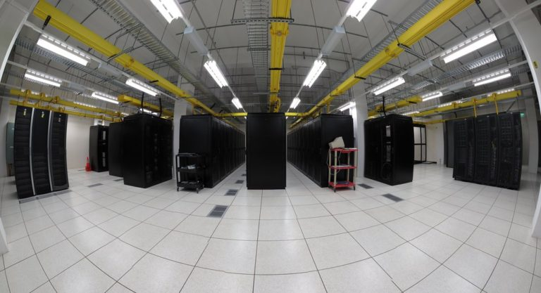
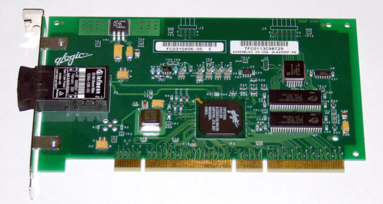

# Storage အကြောင်းတစေ့တစောင်း – အပိုင်း(၃)

ဒီအပိုင်းမှာတော့ storage အမျိုးအစား လေးတွေအကြောင်းဆက်ရေးမယ်ဆိုပြီးတော့ အာရုံနည်းနည်းများနေတာနဲ့ တတိယအပိုင်း ဆက်ရေးဖို့ နည်းနည်းကြာသွားပါတယ်။ ရေးချင်တဲ့ အကြောင်းအရာကိုလည်း မပြည့်စုံမှာကို စိုးရိမ်တာနဲ့ အချိန်ပေးပြီးတော့ အေးအေးဆေးဆေး ရေးမယ်ဆိုပြီးတော့လည်း ကိုယ့်ဟာကို ဆင်ခြေပေး နေတာနဲ့ကြားထဲမှာ တော်တော်လည်း ကြာသွားတယ်။ အရှေ့နှစ်ပိုင်းမှာတော့ HDD နဲ့ SSD တို့မှာပါတဲ့ အစိတ်အပိုင်းတွေကို ရသလောက်ရှင်းပြီးတဲ့နောက်တော့ အဲ့ဒီအစိတ်အပိုင်းတွေနဲ့ storage အမျိုးအစားပေါင်းစုံကို data ပေါင်းစုံသိမ်းဆည်းဖို့အတွက် abstract layers ဘယ်လို အဆင့်ဆင့်ထွက်လာသလဲဆိုတာနည်းနည်းလေ့လာ ကြည့်ရအောင်။

Data centre နည်းပညာတွေ cloud platform တွေ အရမ်းကို အသုံးများလာတဲ့ ဦးတည်ရာက high availability (HA) ဆိုတဲ့ လိုချင်တဲ့အချိန်မှာ အမြဲရှိနေပေးရမယ်ဆိုတဲ့လိုအပ်ချက်တစ်ခု၊ durability ဆိုတဲ့ မပျက်မစီးပဲနဲ့ ကြာကြာလည်းအသုံးခံရမယ်ဆိုတဲ့ ဆန္ဒရှိပုံ တစ်ပုံ၊ နောက် scalability ဆိုတဲ့ လိုတိုင်းသ ရနိုင်တဲ့ လိုသလောက် ဆွဲဆန့်နိုင်တဲ့ တိုးပွားမှုမျိုး ရှိမှပြည့်စုံမယ်ဆိုလို storage နည်းပညာဘက်မှာလည်း အဆင့်ဆင့်ပြောင်းလဲတိုးတက်မှုများစွာ ရှိလာခဲ့ပါတယ်။ Server တစ်လုံးကိုတည်ဆောက်တဲ့အခါမှာ သူနဲ့လာတဲ့ chassis ဆန့်သလောက် HDD တွေ၊ SSD တွေထည့်ပြီးတဲ့နောက် ထပ်ပြီးတော့ storage capacity လိုရင် scale-up လို့ခေါ်တဲ့ vertical scaling လုပ်လို့မရတော့ပါဘူး။ ဒီတော့ နောက် server တစ်လုံးထပ်တိုး ထည့်ခြင်းဖြင့် scale-out လို့ခေါ်တဲ့ horizontal scaling လုပ်ရပါတော့တယ်။ လိုတာက storage တစ်ခုပဲလိုပြီးတော့ ကျန်တဲ့ resource တွေအလုံးအလောက်ရှိတဲ့အတွက် အဲ့ဒီ resource တွေကို မလိုအပ်ပဲနဲ့ ထပ်ဝယ်ပြီးတော့ ထည့်ရတဲ့အတွက် မကိုက်ပြန်ပါဘူး။

<figure><figcaption></figcaption></figure>

နောက်တခုက server နောက်တစ်လုံးအတွက် ပေးရတဲ့ မီးခနဲ့ နေရာကလည်း ထပ်တခါကုန်စရာတွေဖြစ်လာပြန်ပါတယ်။ ဒီတော့ infrastructure သမားတွေက storage လိုရင် storage ပဲထည့်ဖို့အတွက် ကြံဆောင်ကြရာကနေပြီးတော့ direct attached storage (DAS) ဆိုပြီးတော့ ဖြစ်လာပါတယ်။ DAS အတွက် SATA၊ SCSI နဲ့ USB တို့လို interface ပေါင်းများစွာနဲ့ ထည့်ပေါင်းကြပြန်ပါတယ်။ ဒီလိုနဲ့ DAS ဟာလည်း လိုအပ်ချက်တွေများလာတဲ့ storage demand ကိုမဖြည့်ဆည်းနိုင်တဲ့အတွက် နောက်တခါ Storage Area Network (SAN) လို့ခေါ်တဲ့ enterprise အဆင့် storage တွေကို Host Bus Adapter (HBA) လိုမျိုး PCI expansion card တွေနဲ့ fibre interface ကနေပြီး ချိတ်ဆက်လို့လာပြန်တယ်။ ပြဿနာက SAN လိုမျိုး enterprise အဆင့် storage hardware solution တစ်ခုအတွက်ကုန်ကြစရိတ်ကများလွန်း ပါတယ်။ HBA card တစ်ခုတည်းကို ပဲ USD 2000 ကနေ 3000 လောက်ရှိတဲ့အတွက် small-to-medium business တွေအတွက် လက်လှမ်းမှီဖို့ နည်းနည်းခက်ပါလိမ့်မည်။ SAN တစ်ခုအတွက် သုံးရတဲ့ အခြားသော fibre-channel switch တွေ၊ fibre cable installation တွေ အားလုံးပေါင်းထည့်ရင် တော်တော်လေးကို စျေးမြောက်သွားမယ်ထင်ပါတယ်။ SAN ကိုအသုံးပြုရင် သူ့အတွက်လိုအပ်ချက်ပေါင်းများစွာရှိပါတယ်။

<figure><figcaption></figcaption></figure>

ဒီတော့ SAN ဟာ simple storage solution တစ်ခုပဲလိုတဲ့ company လေးအတွက် တွက်ချေမကိုက်လို့ နောက်တခါ Network Attached Storage (NAS) ဆိုပြီးတော့ နောက်တစ်ခုထပ်ရပြန်ပါတယ်။ NAS ဟာ SAN နဲ့ ယှဉ်လိုက်ရင် အများကြီး စျေးသက်သာလွန်ပါတယ်။ အထူးသဖြင့် SAN မှာလိုမျိုး အထူးလိုအပ်ချက်တွေဖြစ်တဲ့ အခြားသော hardware နဲ့ infrastructure တွေမလိုပါဘူး။ လက်ရှိအသုံးပြုနေတဲ့ Ethernet network မှာ ဒီအတိုင်းချိတ်ပြီးတော့ အသုံးပြုရုံပါပဲ။ Ethernet လိုဆိုတဲ့နေရာမှာ copper cable တွေဖြစ်တဲ့ ရိုးရိုး Ethernet cable တွေ၊ Coaxial cable တွေအသုံးပြုနိုင်သလိုပဲ၊ fibre cable တွေကိုလည်းလက်ရှိ network infrastructure မှာရှိရင်းအတိုင်း အသုံးပြုနိုင်တဲ့အတွက် စရိတ်အများကြီးသက်သာသွားပါတယ်။ DAS၊ SAN နဲ့ NAS သုံးခုစလုံးမှာ RAID ကိုကိုယ်ကြိုက်သလို သတ်မှတ်ထားနိုင်ပြီးတော့၊ redundancy နဲ့ performance ကိုကိုယ်လိုသလို ခြယ်လယ်လို့ ရတယ်။ RAID ကိုတကူးတက ဖန်တီးချင်တဲ့ infrastructure engineer တစ်ယောက်အတွက် ပြဿနာမရှိနိုင်သော်လည်း၊ RAID အတွက် စိတ်ရှုပ်မခံချင်တဲ့ sysadmin တစ်ယောက်အတွက်တော့ low-level hardware တွေကို RAID card တွေနဲ့ deal လုပ်ရတာ ဝန်ထုပ်ဝန်ပိုး တစ်ခုအပိုပါ။ ဒီအတွက်တော့ စိတ်ပူစရာလုံးဝမရှိပါဘူး၊ ဘာ low-level hardware ဝန်ထုပ်ဝန်ပိုး ကိုမသယ်ထားချင်ရင်ဖြင့် အားလုံးအတွက် အဆင်ပြေမည့် နည်းလမ်းရှာရင်းနဲ့ object storage ဟာ တော်တော်လေးကို အံဝင်ကွင်ကျရှိလွန်းလှပါတယ်။

ရှင်းရှင်းပြောရရင်တော့ hardware ကိုနှစ်သက်လို့ data centre ရဲ့ infrastructure engineer တွေအတွက်လည်း သူတို့နှစ်သက်ရာကို တစ်ခုတည်း အာရုံစိုက်ပြီးတော့ server တစ်လုံးရဲ့ specification နဲ့ resource တွေအပြင် storage ဆိုင်ရာ hardware installation တွေကိုပါ သီးသန့်တာဝန်ယူ နိုင်ပါတယ်။ Hardware ကို လုံးဝစိတ်မဝင်စားတဲ့ sysadmin တွေနဲ့ developer တွေအတွက်တော့ server hardware တွေနဲ့ storage ဆိုင်ရာ hardware တွေဟာ abstraction layer တစ်ခုပမာဖြစ်လို့လာနေပါပြီ။ ဒါကြောင့်လည်း Infrastructure as a Service (IaaS)တို့၊ Platform as a Service (PaaS)တို့၊ Software as a Service (SaaS)တို့ အပြင်အခြားအခြားသော as a Service တွေပေါင်းများစွာ ဖြစ်လို့လာနေတာကို ကြည့်ရင်သိနိုင် ပါတယ်။ Job role တစ်ခုက လုပ်ရမှာပျင်းတဲ့ အလုပ်တစ်ခုကို နောက် job role တစ်ခုစီကို လွှဲပြောင်းပေးလိုက် သလိုပဲ စာရေးသူတော့မြင်မိပါတယ်။ ဒီလိုမျိုး abstraction layer တွေများလာတဲ့အတွက် ကောင်းကျိုးရှိသလို၊ ဆိုးကျိုးတွေလည်း ရှိပါတယ်။ အဓိကအားဖြင့် communication ဘက်မှာအများကြီး ဂရုစိုက်ရပါတော့တယ်။ Role တစ်ခုနဲ့ တစ်ခု အသုံးအနှုံး တွေဖြစ်တဲ့ technical jargon တွေဟာ မတူနိုင်သလို ဆိုလိုရင်းလည်း ကွဲပြားနိုင်တာမို့ ရှင်းရှင်းလင်းလင်းဖြစ်ဖို့အများကြီးလိုအပ်လာပါတယ်။ ကိုယ်နဲ့ ဆိုင်ရာ functions တွေကိုပဲ ထပ်ခါထပ်ခါလုပ်ခြင်းအားဖြင့် productivity မှာလည်း industrial age က assembly line တစ်ခုလိုပဲ ပိုကောင်း ပိုသွက်လာတဲ့ သဘောရှိပါတယ်။ နောက်ဆုံးတော့ အလုပ်ခွင်ဝင်တဲ့အခါမှာ ကိုယ်လုပ်ရမယ့် job role ဟာ ကိုယ်တကယ်ကြီးကို စိတ်ဝင်စားမှာ အဓိပ္ပာယ်ရှိနိုင်မှာပါ။

<figure><figcaption></figcaption></figure>

Storage ကိုပုံစံမျိုးစုံနဲ့ production environment တစ်ခုမှာ အမျိုးမျိုးအစားစား မြင်နိုင်ပါတယ်။ အထက်မှာရှင်းပြခဲ့သလိုပဲ industry ရဲ့ လိုအပ်ချက်တွေကို ဖြည့်ဆည်းရင်နဲ့ အဆင့်ဆင့် ပုံစံပြောင်းလာခဲ့ပါတယ်။ အကြမ်းအားဖြင့်တော့ storage formats အမျိုးအစား သုံးမျိုးသုံးစားရှိတယ် လို့ဆိုလို့ရပါတယ်။ Files၊ blocks၊ objects storage ရယ်လို့ သုံးမျိုးပါ။ File storage ကတော့ system တစ်ခုမှာ files တွေ၊ folders တွေကို သူ့နေရာနဲ့သူ သိမ်းဆည်းဖို့အတွက် storage format ပါ။ Block storage ဆိုတာကတော့ block-level မှာအလုပ်လုပ်တဲ့ volumes တွေကို unique identifier နဲ့အတူ ကိုယ်သလို အသုံးပြုဖို့အတွက် အသုံးပါတယ်။ နောက်ဆုံးတစ်ခုဖြစ်တဲ့ အထက်မှာလည်း အနည်းငယ် ရှင်းပြပြီးသွားတဲ့ object storage ပါ။ သူ့မှာတော့ အရှေ့ကနှစ်မျိုး ထက်ပိုပြီးတော့ elastic ဖြစ်ဖို့အတွက် metadata တွေ identifiers တွေကို Restful API အသုံးပြုပြီးတော့ ကိုယ်သိမ်းဆည်းမယ့် data တွေကို သတ်မှတ်ထားတဲ့ discrete units ဖြစ်တဲ့ objects ပုံစံမျိုးနဲ့ သိုလှောင်နိုင်ပါတယ်။ တစ်ခုချင်းစီမှာတော့ အားနည်းချက် အားသာချက် ကိုယ်စီရှိကြပါတယ်။ နည်းနည်းလေး ပိုပြီးတော့ ရှင်းသွားအောင်လို့ တစ်ခုချင်းစီ ကို အသေးစိတ်သွားလိုက်ရအောင်။

### File Storage

File storage ဆိုကတော့ရှင်းပါတယ်။ file တွေကို စနစ်တကျသိမ်းဆည်းနိုင်အောင်လို့ file system တွေကို အသုံးပြုပြီးတော့ file တွေကို အဆင့်ဆင့် folder တွေအောက်မှာ hierarchical ဖြစ်အောင် သိုလှောင်နိုင်တဲ့ storage format တစ်ခုပါ။ ပုံမှန်အားဖြင့် file storage လိုပြောလိုက်ရင် local storage၊ DAS နဲ့ NAS ကိုမြင်နိုင်ပါတယ်။ သုံးခုလုံးအတွက် storage ကိုအသုံးပြုဖို့ရာ file system တစ်ခုခုနဲ့တော့ format ရိုက်ရပါလိမ့်မယ်။ File system ထဲမှာလည်း Linux မှာအသုံးပြုနိုင်တဲ့ ext4၊ xfs၊ btrfs၊ zfs တို့အပြင် Windows မှာသုံးတဲ့ FAT၊ NTFS နဲ့ ReFS ဆိုပြီးတော့ အမျိုးမျိုးအစားစားရှိကြပါတယ်။ Linux မှာတော့ အခုနောက်ပိုင်း နည်းနည်းလေး hot ဖြစ်နေတဲ့ file system နှစ်ခုရှိပါတယ်။ btrfs နဲ့ zfs တို့နှစ်ခုဖြစ်ပါတယ်။ Btrfs ကတော့ GNU GPL compatible ဖြစ်တဲ့အတွက် Linux community တစ်ခုလုံးရဲ့ အသည်းစွဲ အဆင့်မြင့် file system တစ်ခုဖြစ်ပြီးတော့၊ တဖက်မှာတော့ ZFS ဟာ စွမ်းဆောင်ရည် အရမ်းကောင်းပေမယ့်လည်း Oracle က ပိုင်ပြီးတော့ BSD community ကမွေးစားထား နိုင်သော်လည်း GNU GPL နဲ့ compatible မဖြစ်တဲ့အတွက် licensing မှာ Linux kernel ထဲကို ထည့်သွင်းဖို့အတွက် လုံးဝ အဆင်မပြေနေတာကို Linus Torvalds ကိုယ်တိုင်က လွန်ခဲ့တဲ့ လအနည်းအတွင်းမှာ community ကိုချပြခဲ့ပြီးပါပြီ။ ZFS ကို GNU GPL နဲ့ အဆင်ပြေအောင်လုပ်ချင်ရင်တော့ Oracle ဘက်က လိုတိုးပိုလျှော့ လုပ်ရင်ရနိုင်သော်လည်း သူတို့ဘက်က လိုလိုလားလား ဘာမှလိုက်မလုပ်ပေးတဲ့အတွက် Linus Torvalds ကြီးအချဉ်ပေါက်ပုံရတယ်။ Oracle ရဲ့ အစဉ်အလာမို့လည်း ဘယ်သူမှလည်း သိပ်မပြောကြတော့ပါ။

နောက်တစ်ခုက Linux မှာလက်ရှိထိတော့ performance နဲ့ capability နှစ်ခုလုံးမှာ ညီမျှတဲ့ file system က ext4 ပါ။ Linux ရဲ့ software RAID ဖြစ်တဲ့ MD နဲ့ တွဲပြီးတော့ အသုံးပြုနိုင်သလို၊ Logical Volume Manager (LVM) ကိုလည်း OS ထဲမှာ volume size ကို လိုသလို တိုးနိုင်ချုံ့ နိုင်တဲ့အတွက် ext4 ဟာလက်ရှိအထိတော့ သုံးနေရတုန်းပါ။ သို့သော်လည်း inode အရေအတွက်တော့ သတ်မှတ်ချက်ရှိတဲ့အတွက် file system က storage capacity မှာ တော်တော်များများထိ တိုးထည့်နိုင်သော်လည်း inode ကုန်ရင်တော့ ပြဿနာက တိုင်ပတ်ပါတော့တယ်။ ဒီအတွက်ကြောင့် XFS မှာ inode ကို သတ်မှတ်ချက်မရှိပဲနဲ့ dynamic ဖြစ်အောင် လုပ်ထားတဲ့အတွက် XFS ဟာလည်း scale-up လုပ်ချင်တဲ့ environment အတွက်တော့ ပိုပြီးတော့ အဆင်ပြေပါလိမ့်မယ်။ ဒီ file system တစ်ခုချင်းစီရဲ့ အသေးစိတ်နဲ့ inode အကြောင်းကို နောက်မှပဲ သီးသန့် article တစ်ခုအနေနဲ့ ရေးပါ့မယ်။ အခုတော့ file storage အကြောင်းဘက်ကို ပြန်သွားလိုက်ရအောင်ဗျာ။

ဟုတ်ပြီ… storage တစ်ခုကို operating system တစ်ခုမှာစတင်အသုံးပြုနိုင်အောင်လို့ file system တွေနဲ့ format ရိုက်ပြီးတဲ့နောက်မှာ local storage နဲ့ DAS အတွက်တော့ data တွေကို စတင်သိမ်းဆည်းနိုင်ပါပြီ။ IDE၊ SATA၊ mSATA၊ NVMe၊ USB စသဖြင့် ကိုယ်သုံးတဲ့ media ရဲ့ interface ပေါ်မှာမူတည်ပြီးတော့ Read/Write speed ကကွာခြားနိုင်ပါတယ်။ Scale-up လုပ်တာ များလာလေလေ performance ကျလေလေ ဖြစ်တာမို့ အများကြီး တိုးချဲ့ သိမ်းဆည်းဖို့အတွက် သိပ်မဖြစ်နိုင်ပါဘူး။ ဒါမှမဟုတ်ဘူး… scale-out လုပ်မယ်ဆိုရင်တော့ NAS လိုမျိုး သီးသန့် storage ကို scale-out လုပ်လို့ရနိင်ပါတယ်။ ရှိပြီးသား Ethernet network ကိုအသုံးချတဲ့အတွက် data transfer အတွက်တော့ Quality of Service (QoS) ကို သေချာသတ်မှတ်ပေးဖို့လိုပါလိမ့်မယ်။ ဒီလိုမှမဟုတ် flat files တွေကို network ပေါ်မှာ တစ်စုံတစ်ယောက်က transfer လုပ်လိုက်တာနဲ့ network တစ်ခုလုံး saturated ဖြစ်သွားနိုင်ပါတယ်။ NAS အတွက် network ပေါ်မှာ အသုံးပြုတဲ့ protocol တွေကတော့ NFS၊ CIFS၊ SMBတို့အပြင် အခြားသော protocol တွေလည်းရှိပါသေးတယ်။

File storage မှတ်သားစရာတစ်ခုကတော့ file system ကိုသုံးတယ်၊ အဲ့ဒီ file system ကပဲ file တွေ folder တွေကို hard disk drive တွေ solid state drive တွေပေါ်မှာ ဘယ်လိုသိမ်းဆည်း သိုလှောင်သလဲဆိုတာကို သတ်မှတ်ပေးပြီးတော့၊ limited metadata လို့ခေါ်တဲ့ ထိုထိုသော file တွေ folder တွေရဲ့ အကြောင်းကို file descriptor၊ global file table နဲ့ inode table တွေကို အသုံးပြုပြီးတော့ သိမ်းဆည်းရာ file တွေအကြောင်းကို fixed/standardised metadata အနေနဲ့ သိမ်းပါတယ်။ ဥပမာ ပြောရရင် file descriptor ဟာ global file table နဲ့ inode table ကိုကြည့်ပြီးတော့ file တွေ folder တွေရဲ့ သက်ဆိုင်ရာ file permission တွေနဲ့ အဲ့ဒီ file တွေကို ဘယ်လိုမျိုး access လုပ်နိုင်သလဲဆိုတာကို ညွှန်ပြပေးခြင်း အပြင် standard input (stdin)၊ standard output (stdout) နဲ့ standard error (stderr) တွေကိုလည်း kernel အဆင့်မှာ ပဲ့ကိုင်ပေးပါတယ်။ တစ်ခုရှိတာက Linux kernel မှာ အရာအားလုံးဟာ file တွေနဲ့ တည်ဆောက်ထားတာဖြစ်တဲ့ အတွက် file descriptor ဟာ ဘယ်လောက်တောင် အရေးပါသလဲဆိုတာ သိနိုင်တယ်။ ထားပါတော့… ဒါက file လို့ ပြောလိုက်တာနဲ့ မီးခိုးလျှောက်လိုက်ရင်နဲ့ file descriptor စီရောက်သွားတာပါ။ ဆိုလိုရင်ကတော့ file storage လို့ဆိုလိုက်ရင် ဒီ အချက်လေးတွေကို စိတ်ထဲမှာ မြင်ယောင် စေချင်တာပါ။ File storage ရဲ့ အားနည်းချက်ကတော့ performance နဲ့ ရေရှည်အတွက် Return On Investment (ROI) ratio ပါ။ performance အားဖြင့်ကော cost အားဖြင့်ကောကြည့်မယ်ဆိုရင် block storage လောက် performance ကောင်းကောင်းမရနိုင်သလို၊ ကုန်ကျစရိတ်မှာလည်း block storage လောက်မများပါဘူး။ သို့သော် object storage နဲ့ ယှဉ်လိုက်ပြန်ရင်တော့ file storage ဟာ performance အားဖြင့်ပိုသာပြီးတော့၊ large enterprise setup တွေမှာ စျေးလည်း နည်းနည်းပိုများမယ်လို့ထင်ပါတယ်။ setup လုပ်ရတာတော့ file storage ဟာ အထက်မှာပြောသလို ရှိပြီးသား local၊ DAS နဲ့ NAS တွေကို ရှိရင်း network ပေါ်မှာ အလွယ် share လိုက်ခြင်းအားဖြင့် အဆင်သင့် အသုံးပြုနိုင်ပါတယ်။ ဒါ့အပြင် file locking လို feature တွေပါတဲ့အတွက်လည်း multi-user တွေအတွက် file sharing လိုမျိုး use case တွေအများကြီးမှာထည့်သွင်း အသုံးပြုနိုင်တယ်။ ကိုယ်သုံးတဲ့ ပေါ်မှာမူတည်ပြီးတော့ သင့်တော်ရင် သင့်တော်သလို file storage format ကို cloud နဲ့ on-premise တွေမှာအသုံးပြုနိုင်ပါတယ်။

ဒီအပိုင်းမှာတော့ ဒီလောက်နဲ့ပဲရပ်လိုက်ပြီးတော့ နောက်တပိုင်းမှပဲ block storage နဲ့ object storage အကြောင်းကို ဆက်ပါတော့မယ်။ Storage format တွေအကြောင်းကို အနည်းငယ် ရိပ်ဖမ်းသံဖမ်း ရမယ်လို့ မျှော်လင့်ရင်း နဲ့ ဒီ post ကို အခုပဲအဆုံးသတ်လိုက်ပါ့မယ်။
