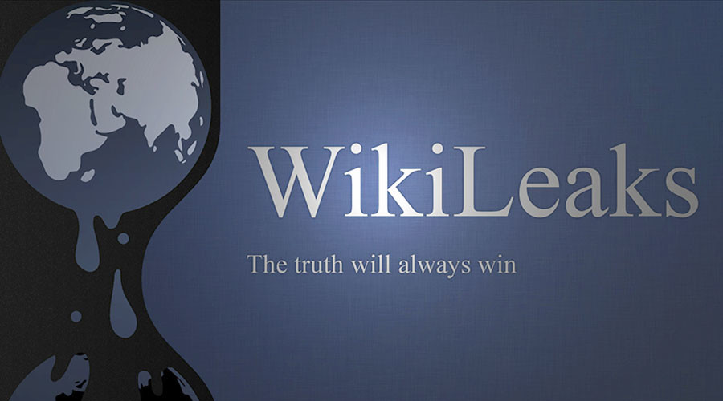
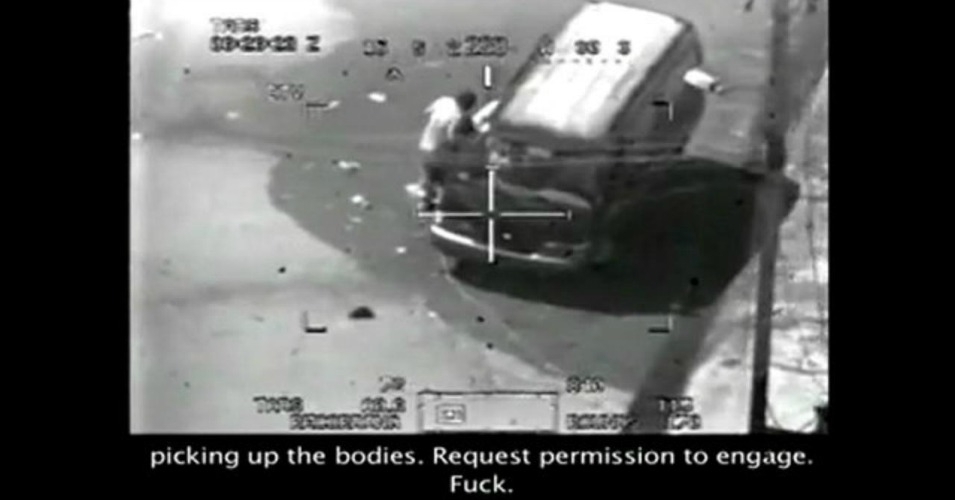
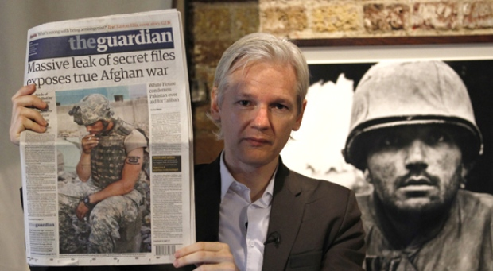
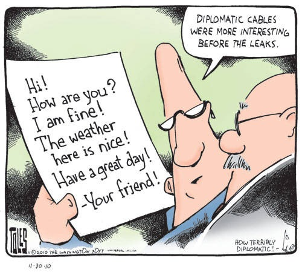
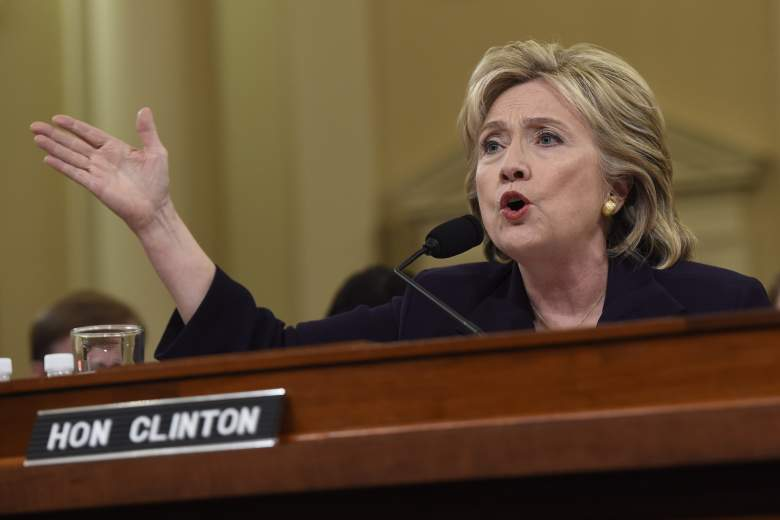

# WikiLeaks ဆိုသည်မှာ အပိုင်း (၃)

ဒီတပိုင်းမှာတော့ WikiLeaks က leak ခဲ့တဲ့ နာမည်ကြီးတဲ့ leak ၄ခုကိုဆက်လက်ဖော်ပြပေးပါ့မယ်။ အောက်ပါ leak တွေကတော့ အမေရိကန်နိုင်ငံနဲ့ အမေရိကန်အစိုးရ ကိုကမ္ဘာကမြင်တဲ့ အမြင်ကိုလုံးဝပြောင်းလိုက်နိုင်ခဲ့တဲ့ leak တွေပဲဖြစ်ပါတယ်။ ဒီအပိုင်း WikiLeaks ဆိုသည်မှာ နောက်ဆုံးအပိုင်းဖြစ်ပါတယ်။ WikiLeaks ရဲ့ leak တွေဟာကျယ်ပြန့်လွန်းလှလို့ ဒီ post ရေးဖို့ material ရှာတဲ့ နေရာမှာ စာရေးသူတော်တော် အားစိုက်ထုတ်ပြီးတော့ ရှာဖွေဖတ်ရတာတွေများပါတယ်။ အကုန်လုံးလိုက်ရေး လိုက်ဖတ်လို့လည်း မကုန်နိုင်လောက်အောင်ပါပဲ။ ဥပမာ WikiLeaks ပေါ်မှာ မြန်မာနိုင်ငံနဲ့ ပတ်သတ်တဲ့ leak တွေတော်တော်များများရှိပါတယ်။ စိတ်ဝင်စားရင်တော့ ကိုယ်တိုင်ရှာဖွေပြီးတော့ အင်္ဂလိပ်လို လေ့လာဖတ်ရှုလို့ရပါတယ်။ မြန်မာနိုင်ငံ စစ်အစိုးရနဲ့ ဒီမိုကရေစီ လူ့အခွင့်အရေးတွေနဲ့ ပတ်သတ်ပြီးတော့ diplomatic ဆိုင်ရာ အမေရိကန် နိုင်ငံခြားရေးတွေနဲ့ ဆက်သွယ်ထားတဲ့ email တွေကိုတွေ့ရှိနိုင်မှာဖြစ်ပါတယ်။

WikiLeaks ဟာ Wikipedia လိုမျိုး အချက်အလက်တွေကို စုဆောင်းပေးထားတဲ့ Wiki တစ်ခုဖြစ်ပါတယ်။ Wikipedia ကတော့ နေ့စဉ်လေ့လာဖွယ်ရာတွေကိုလေ့လာနိုင်သလို WikiLeaks ဟာလည်း နိုင်ငံတကာ အစိုးရနဲ့ အထက်တန်းလွှာလူတန်းစား တစ်ရပ်ရဲ့ ဖိနှိပ်ချုပ်ကိုင်ထားတဲ့ စနစ်ဆိုးကြီးတစ်ခုရဲ့ လျှို့ဝှက်ချက်တွေကို ရှာဖွေလေ့လာလို့ရအောင် လုပ်ပေးထားတဲ့ platform တစ်ခုပါ။ အဓိက ကတော့ သာမန်လူတွေကို information ပေးတဲ့ သဘောမျိုးပါ။ လက်ရှိအချိန်ထိတော့ WikiLeaks က အအောင်မြင်ဆုံး leak လုပ်လို့ ရတဲ့ platform တစ်ခုဖြစ်ပါတယ်။ ဒီ post မှာတော့ စာရေးသူ စိတ်ကြိုက်လည်းဖြစ် လူသိများခဲ့တဲ့ leak တွေကိုသာ ရွေးချယ်ပြီးတော့ ရေးသားထားခြင်းသာ ဖြစ်ပါတယ်။ စိတ်ဝင်စားကြမယ်လို့လည်း မျှော်လင့်ပါတယ်။

<figure><figcaption></figcaption></figure>

## မရည်ရွယ်ခဲ့သော လူသတ်ပွဲ ဗီဒီယို (Collateral Murder Video)

အမေရိကန်စစ်မြေပြင်ဖွင့်ရာ Iraq နိုင်ငံ Baghdad မြို့မှာ ဇူလိုင်လ ၁၂ ရက်နေ့ ၂၀၀၇ခုနှစ်တုန်းက ဖြစ်ခဲ့တဲ့ အဖြစ်အပျက်လေးတစ်ခုပါ။ WikiLeaks က ဥပမာသဘောမျိုးနဲ့ စစ်မြေပြင် အနေအထားနဲ့ အမေရိကန်စစ်တပ်ရဲ့ လုပ်ငန်းစဥ်တွေကို တင်ပြလိုခြင်းဖြစ်ပါတယ်။ အဲ့ဒီတုန်းက စစ်မြေပြင်မှာ မဆိုင်တဲ့ Iraq နဲ့ Iran နိုင်ငံက ပြည်သူတွေ အများကြီးရှိခဲ့ပါတယ်။ စစ်တိုက်ရင်း ဖြစ်တတ်တဲ့သဘောဆိုပေမယ့်လည်း စစ်ကာလကြာရှည်လာသည့်အလျှောက် သေဆုံးရတဲ့ ပြည်သူတွေက တော်တော်လေး များခဲ့ပါတယ်။ အမေရိကန် စစ်တပ်ပိုင်းဆိုင်ရာကတော့ အဲ့လိုမျိုး ပြည်သူတွေသေရတာကို သူတို့စစ်တပ်မှာ အင်္ဂလိပ်လိုဆိုရင် Collateral Damage ဆိုပြီးတော့ သုံးပါတယ်… မတော်တဆ တိုက်ရင်းခိုက်ရင်း သေတဲ့သဘောမျိုးကိုဆိုလိုချင်တာဖြစ်ပါတယ်။ နောက်တမျိုးကတော့ friendly fire ဆိုတာမျိုးနဲ့ လည်း ခပ်ဆင်ဆင်တူပါတယ်။ စစ်တပ်က မီဒီယာတွေကို သတင်းစာရှင်းလင်းပွဲမှာလည်း မတော်တဆသတ်မိတယ် မရွည်ရွယ်ပဲသေကုန်တယ်လို့သာ ရှင်းပါတယ်။ စိတ်မကောင်း ကြောင်း ဝမ်းနည်းကြောင်းလည်း အကြိမ်ကြိမ်ပြောပါတယ်။ လူတွေကတော့ မီဒီယာလာတဲ့ သတင်းလောက်ပဲသိရတာဖြစ်ရတဲ့အတွက် ရုပ်ရှင်တွေထဲကလိုပဲလို့ ထင်ခဲ့ကြရပါတယ်။

<figure><figcaption></figcaption></figure>

ဧပြီလ ၅ရက်နေ့ ၂၀၁၀ခုနှစ်မှာတော့ WikiLeaks ဟာ Collateral Murder ဆိုပြီးတော့ အမေရိကန်စစ်တပ် ရဟတ်ယာဉ် ပေါ်ကနေရိုက်ယူထားတဲ့ ဗီဒီယိုတစ်ခုကို leak လုပ်ပါတယ်။ ဗီဒီယိုထဲမှာ တော့ ရန်သူလို့ထင်ရတဲ့ target တစ်ခုကိုတိုက်ခိုက်ဖို့ကို အထက်အရာရှိကို ခွင့်တောင်းပြီးတော့ တိုက်ခိုက်ဖို့ပြင်တဲ့ နေရာကနေစပါတယ်။ ပြည်သူတွေလည်း အနီးနားမှာ အများကြီးရှိတဲ့ လူထူထပ်တဲ့နေရာ တစ်ဖြစ်ပါတယ်။ သို့သော်လည်း အထက်အရာရှိက ပစ်ခတ်တိုက်ခိုက်ဖို့ကို အခွင့်ပေးပါတယ်… လေတပ်တိုက်ခိုက်ရေးတပ်ကလည်း အားရပါးရစတင်ပစ်ခတ်ပါတော့တယ်။ ပစ်ခတ်ရင်းသူတို့ အချင်းချင်းပြောတဲ့ စကားသံတွေ ပါကြားနေရပါတယ်။ မြိန်ရေယှက်ရေ လူသတ်ပွဲကြီး ဆင်နွှဲနေသည့်အလား တစ်ယောက်နဲ့ တစ်ယောက်လည်း ကြွားလုံးတွေထုတ်နေတာကို ကြားရပါတယ်။ တီဗီဂိမ်းဆော့တဲ့ပုံမျိုးဖြစ်နေပါတယ်။ ဒဏ်ရာရနေတဲ့သူတွေကို ကယ်ဖို့လာတဲ့ ကားတစ်စီးပါ ပေါက်ကွဲတဲ့အထိ ပစ်ခတ်တိုက်လိုက်ပါတယ်။ အကုန်သေပါတယ်။ ဖြစ်ချင်တော့ သေဆုံးသွားတဲ့ သူတွေထဲမှာ Reuters ကသတင်းထောက်နှစ်ပါသွားပါတယ်။ ကားနဲ့လာကယ်တဲ့ ပြည်သူနှစ်ယောက်ကိုလည်း ပစ်ခတ်လို့သေဆုံးခဲ့ရပါတယ်။ Julian Assange က အဲ့ဒီ ဗီဒီယိုကို Collateral Murder ဆိုပြီးတော့ နာမည်ပေးပြီး WikiLeaks မှာတင်လိုက်ပါတယ်… Collateral Damage ဆိုတဲ့ဟာကိုသရောတဲ့ သဘောနဲ့ပါ။ ကမ္ဘာက အဲ့ဒီ ဗီဒီယိုကိုကြည့်ပြီးတော့ မေးခွန်းထုတ်စရာတွေဖြစ်လာပါတယ်။ Collateral Damage မတော်တဆသေဆုံး ပျက်စီးတယ်ဆိုတာ တကယ်ဟုတ်ပါ့မလားဆိုပြီးတော့ သံသယတွေဝင်လာပါတယ်။ အမေရိကန်စစ်တပ်နဲ့ အစိုးရမျက်နှာနာခဲ့ရပြန်ပါတယ်။

<figure><figcaption></figcaption></figure>

အမေရိကန် စုံစမ်းထောက်လှမ်းရေးကလိုက်ရှာတော့ နောက်ဆုံးမှာ Chelsea Manning ဆိုတဲ့ ရိုးရိုးစစ်သားတစ်ယောက်က WikiLeaks ကိုတင်လိုက်တယ်ဆိုတာကိုရှာဖွေတွေ့ရှိခဲ့ပါတယ်။ Chelsea Manning က လေတပ်တိုက်ခိုက်ရေးကို ထိန်းသိမ်းရေး အဖွဲ့မှာ အချိန်ပြည့် တာဝန်ကျတဲ့ စစ်သားတစ်ယောက်ပါ။ သူကအဲ့ဒီ ဗီဒီယိုကို Lady Gaga သီချင်း CD ပေါ်မှာသိမ်းပြီးတော့ အပြင်ကိုရအောင်ထုတ်ခဲ့တယ်လို့ဆိုပါတယ်။ Chelsea Manning ဟာ အသက်အားဖြင့်လည်းငယ် ရင့်လည်းမရင့်ကျက်သေးတာမို့ သူ အဲ့ဒီဗီဒီယိုကို WikiLeaks ကိုတင်ခဲ့အကြောင်းကို အွန်လိုင်းမှာသိတဲ့ လူတစ်ယောက်ကိုကြွားရာကနေ အဲ့ဒီအွန်လိုင်းကလူက အမေရိကန်အစိုးရကို သတင်းပေးခဲ့ပါတယ်။ အဲ့ဒီလူကလည်း တိုက်တိုက်ဆိုင်ဆိုင် နာမည်ကြီး Grey Hat Hacker တစ်ယောက်ဖြစ်တဲ့ Adrian Lamo ဖြစ်နေခဲ့ပါတယ်။ နောက်ဆုံးတော့ Chelsea Manning အဖမ်းခံရပါတော့တယ်။ အခုချိန်ထိ စီရင်ချက်ကို မချသေးပဲ စစ်ဆေးဆဲလို့လည်းဆိုပါတယ်။ တချို့ကလည်း Chelsea Manning ဟာ ထောင်ထဲမှာ တော်တော်လေး အနှိပ်စက်ခံရတယ်လို့ထင်ကြေးပေးကြပါတယ်။ သေချာသာတစ်ခုကတော့ အမှုကတော့ မသေးပါဘူး။ WikiLeaks ဘက်တော့ Chelsea Manning ကိုကယ်ဖို့အတွက် ရှေ့နေ စီစဉ်ပါတယ် မအောင်မြင်လိုက်ပါဘူး။ WikiLeaks သမိုင်းမှာ အထင်ကရအဖြစ်ဆုံး leak လို့ဆိုရမှာဖြစ်ပါတယ်။

## အာဖကန် အီရတ် စစ်မှတ်တမ်းများ (Afghan and Iraq War Logs)

War Logs ဆိုတာကတော့ အမေရိကန် အစိုးရ Iran နဲ့ Afghan မှာ စစ်တိုက်စဥ်တုန်းက ဖြစ်ပျက်ခဲ့တဲ့ အသေးစိတ်အကြောင်းအရာ တွေကိုမှတ်တမ်းတင်ထားတဲ့ အချက်အလက်တွေ ဖြစ်ပါတယ်။ ၂၂ရက်နေ့ အောက်တိုဘာလ ၂၀၁၀ ခုနှစ်မှာတော့ WikiLeaks ဟာ အမေရိကန် စစ်တပ်ဆိုင်ရာ ထိပ်တန်းလျှို့ဝှက်ချက် ပေါင်း ၃၉၁၈၃၂ ခုကို WikiLeaks ပေါ်မှာ အများသိ အောင်လို့တင်လိုက်ပါတော့တယ်။ ထိပ်တန်းလျှို့ဝှက်ချက် ဆိုတဲ့အတိုင်း အမေရိကန် စစ်တပ်ရဲ့ မကောင်းတဲ့ အကြောင်းတော်တော်များများ ပါတဲ့ အဲ့ဒီ war logs ဟာ အကြီးဆုံး leak တစ်ခုအနေနဲ့ သမိုင်းတွင် ကျန်ရစ်စေခဲ့ ပါတယ်။ အစောပိုင်း ဇူလိုင်လ ၂၀၁၀ ခုနှစ်မှာလည်း အာဖကန် စစ်တုန်းက စစ်မှတ်တမ်းတွေလည်း ထုတ်ပြန်ခဲ့ပြီး တဲ့အပြင် Julian Assange က တခြားနာမည်ကြီး သတင်းမီဒီယာတွေ ဖြစ်တဲ့ New York Times, the Guardian နဲ့ Der Spiegel တို့နဲ့ ပြိုင်တူဆိုသလို လူတိုင်းသိနိုင်အောင်လို့ ထုတ်ပြန်ခဲ့ပါတယ်။ စစ်မှတ်တမ်း တွေထဲမှာတော့ ထင်ရှားတဲ့ ဖြစ်ရပ်တစ်ခုကတော့ စစ်တွင်း သံသယရှိသူတွေကို အီရတ်မဟာမိတ်အဖွဲ့တွေက ရက်စက်စွာ နှိပ်စက်ပြီး စစ်ဆေးမေးမြန်းထားတာတွေကို အမေရိကန် စစ်တပ်ဘက်က မသိဟန်ဆောင် မျက်ကွယ်ပြုထားခဲ့တာပါပဲ။ အဲ့လိုရက်စက်စွာ နှိပ်စက်မှုကြောင့်လည်း မသေသင့်တဲ့ ပြည်သူထဲက ရိုးရိုးပြည်သူတွေ အများအပြား သေဆုံးခဲ့ရပါတယ်။ မတော်တဆ စစ်ရင်းဆေးရင်း သေဆုံးသွားတဲ့ဟာတွေကိုလည်း အမေရိကန် စစ်တပ်ဘက်က ဖုံးကွယ်ပေးခဲ့ပါတယ်။ နောက်ပြီးတော့ အဲ့ဒီ war logs တွေထဲမှာ အမေရိကန်အစိုးရပိုင်း အနေနဲ့ ပါကစ်စတန် စစ်တပ် ထောက်လှမ်းရေး အဖွဲ့က အာဖကန် တာလီဘန် သောင်းကျန်မှုကို အနောက်ဘက်နေ ထောက်ပန့် နေတယ်ဆိုတာကို သံသယရှိတယ် ဆိုတာမျိုးတွေ ပါလာတဲ့အတွက် သံတမန်ရေးရာမှာ အမေရိကန်အစိုးရ အနေနဲ့ မျက်နှာပျက်စရာတွေ ဖြစ်ခဲ့ရပါတယ်။

<figure><figcaption></figcaption></figure>

သမိုင်းမှာ သံတမန်ရေးရာဘက်မှာ အမေရိကန်အစိုးရအတွက် အထိခိုက်ဆုံး leak တစ်ခုလည်းဖြစ်ပါတယ်။ ကမ္ဘာအလည်မှာ မျက်နှာတော်တော်လေး နာခဲ့ရပါတယ်။ သို့သော်လည်း အမေရိကန်စစ်တပ်နဲ့ အစိုးရရဲ့ မတရားမှု အကုန်လုံးကြချပြနိုင်ခဲ့လို့ အကျိုးများခဲ့တာလည်း တဘက်မှာရှိပါတယ်။ တချိန်တည်းမှာ WikiLeaks နဲ့ Anonymous ဟာပြည်သူ့ဘက်တော်သား တဖန်ဖြစ်ခဲ့ရပြန်ပါတယ်။ Cyber/Internet သမိုင်းမှာလည်း မှတ်တိုင်တစ်ခုစိုက်ထူနိုင်ခဲ့တယ်လို့ စာရေးသူမြင်ပါတယ်။

## သံတမန်ရေးရာ အဆက်အသွယ်များ ထုတ်ပြန်ချက် (Diplomatic Cables Release)

ကမ္ဘာ့သံတမန်ရေးရာဆိုတာ အလွန်ရှုပ်ထွေးပွေလီတဲ့ သဘောရှိပါတယ်။ အထူးသဖြင့် စစ်ရေးအရပဲ ဖြစ်ဖြစ်၊ နယ်နိမိတ်နဲ့ပတ်သတ်လို့ပဲဖြစ်ဖြစ်၊ ပထမကမ္ဘာစစ် ဒုတိယကမ္ဘာစစ် တွင်းချုပ်ဆိုထားတဲ့ စာချုပ်အရပဲ ဖြစ်ဖြစ် ပတ်သက်ဆက်နွယ် ရတဲ့နိုင်ငံတွေအများကြီးရှိကြပါတယ်။ အချင်းအရာတစ်ခုကို သဘောတူသင့်သလောက်တူကြသလို၊ သဘောထားမတိုက်ဆိုင်တဲ့ အရာတွေလည်း အများရှိနိုင်ပါတယ်။ အမေရိကန်နိုင်ငံလို မဟာမိတ်များတဲ့ အင်အားကြီးနိုင်ငံမျိုးမှာဆိုရင် ပိုတောင်များပါသေးတယ်။ သံတမန်ရေးရာနဲ့ ပတ်သတ်တဲ့ ဆက်သွယ်ထားတဲ့ စာတွေ အီးမေးတွေဆိုတာလည်း တစ်နေ့ တစ်နေ့ မနည်းပါဘူး။

<figure><figcaption></figcaption></figure>

WikiLeaks က နိုဝင်ဘာလ ၂၈ရက်နေ့ ၂၀၁၀ ခုနှစ်မှာ တခြား သတင်းမီဒီယာကြီး ၅ခုနဲ့အတူ သံတမန်တွေဆက်သွယ်ထားတဲ့ စာပေါင်း ၂၂၀ ကို ပထမ တစ်သုတ်အနေနဲ့ WikiLeaks ပေါ်ကိုတင်လိုက်ပါတယ်။ စုစုပေါင်း ၂၅၁၂၈၇ ရှိသော လျှို့ဝှက်စာတွေကို နည်းနည်းခြင်းစီတင်သွားမယ်လို့လည်း ဆိုပါတယ်။ ရက်အားဖြင့် ဒီဇင်ဘာလ ၂၈ရက်နေ့ ၁၉၆၆ ခုနှစ်ကနေ ဖေဖဝါရီလ ၂၈ရက်နေ့ ၂၀၁၀ ခုနှစ်ထိ သံတမန်တွေဆက်သွယ်ထားတဲ့ စာတွေလို့လည်းဆိုပါတယ်။ အမေရိကန် သံရုံးရှိတဲ့နိုင်ငံတွေရဲ့ ကောင်းတဲ့အကြောင်းတွေရော မကောင်းတဲ့ အတင်းအဖျင်းတွေကို အဲ့ဒီစာတွေမှာတွေ့နိုင်ပါတယ်။ များသောအားဖြင့် စစ်ရေးအရ ထိန်းချုပ်ထားတဲ့ နေရာတွေမှာ ဘယ်လိုနှပ်ထားကြောင်း ဘယ်လိုဖိထားလို့ရကြောင်း ဘယ်လိုကိုင်တိုင်လိုက်လို့ အဆင်ပြေသွားကြောင်းတွေပါတာကြောင့် သံအမတ်တွေမျက်နှာပူစရာ ဖြစ်လာပါတော့တယ်။ တရားစီရင်ရေးကလိုက်တဲ့အခါမှာတော့ WikiLeaks ဟာ အဲ့ဒီစာတွေကို encrypted လုပ်ထားတဲ့ file တွေအဖြစ်နဲ့ အဲ့ဒီ file တွေကိုဘယ်မှာရှာလို့ရသလဲဆိုတာကို သိတဲ့သူတွေသာ ရနိုင်အောင် စီစဉ်ရပါတော့တယ်။ နောက်ပိုင်းကျမှ လူတိုင်းအလွယ်တကူရှာဖတ်လို့ရအောင်လို့ WikiLeaks ပေါ်မှာတင်ပါတယ်။ မြန်မာနိုင်ငံနဲ့ ပတ်သတ်တဲ့ နိုင်ငံရေး အကျဉ်းသားတွေအကြောင်းကိုလည်း ထိုသံတမန်ရေးတာ ဆက်သွယ်တဲ့စာတွေမှာ တွေနိုင်မှာဖြစ်ပါတယ်။ စိတ်ဝင်စားရင် WikiLeaks မှာရှာဖတ်ကြည့်နိုင်ပါတယ်။

## ဟေလာရီ ကလင်တန် ရဲ့ ကိုယ်ပိုင် အီးမေးဆာဗာ (Hillary Clinton’s Personal Email Server)

၂၀၁၆ ခုနှစ် နှစ်လယ်လောက်ကနေစပြီး သမ္မတရွေးကောက်ပွဲမှာ Hillary Clinton နဲ့ Donal Trump တို့ အကြိတ်အနယ် သမ္မတဖြစ်လာဖို့ကို ပြိုင်ဆိုင်နေကြပါတယ်။ အဲ့ဒီ အချိန်မှာတော့ မထင်မှတ်ထားတဲ့ leak တစ်ခုကို WikiLeaks ကလည်း အချိန်ကိုက်ဆိုသလို တင်ပါတော့တယ်။ ဖြစ်ပုံက ဇူလိုင်လ ၄ရက်နေ့ ၂၀၁၆ခုနှစ်မှာ Hillary Clinton ရဲ့ ကိုယ်ပိုင် Mail Server ကနေ ပို့ထားတဲ့ လက်ခံရရှိထားတဲ့ email တွေကို WikiLeaks ကစပြီးတော့ တင်ပါတော့တယ်။ ကိုယ်ပိုင် Mail Server ဆိုပေမယ့်လည်း Hillary Clinton နေတဲ့အိမ် မြေအောက်ခန်းမှာတင် ထားတဲ့ Mail Server ဖြစ်တဲ့အတွက် လုံခြုံရေးပိုင်းမှာတော့ အိမ်သုံး ကွန်ပြူတာတစ်လုံး အဆင့်လောက်သာ ရှိမည်လို့ စာရေးသူခန့်မှန်းကြည့်မိပါတယ်။ အဲ့ဒါကြောင့်လည်း အဲ့ဒီ Mail Server ကို hack ပြီးတော့ စက်ပေါ်က စာတွေအကုန်လုံးနီးပါး hack ခံရပါတော့တယ်။ သတင်းထွက်ထွက်ခြင်း FBI နဲ့ CIA ကလည်း Hillary Clinton ကို ခေါ်ယူစစ်ဆေးရပါတော့တယ်။ သူကိုယ်တိုင်လည်း အဲ့လိုဖြစ်မယ်မထင်လို့ သုံးခဲ့တာဖြစ်ကြောင်းလည်း ဝန်ခံခဲ့ပါတယ်။ ပိုဆိုးတာက ပို့ထားတဲ့ လက်ခံထားတဲ့ စာတွေထဲမှာ အလုပ်နဲ့ ပတ်သတ်တဲ့ classified information တွေပါတဲ့ စာတွေကိုပါတွေရှိရတာဖြစ်ပါတယ်။ အတိုက်အခံပါတီဘက်က Donald Trump တို့ကလည်း Hillary Clinton ကိုတရားစွဲဖို့ ထောင်ချဖို့ထိတိုင်အောင် တွန်းအားပေးတဲ့အထိလုပ်လာပါတော့တယ်။ ရွေးကောက်ပွဲ အောင်နိုင်ရေးအတွက် အဲ့ဒီ Mail Server နဲ့ပတ်သတ်တဲ့ စွပ်စွဲချက်တွေနဲ့ Donald Trump ကတိုက်ခိုက်ပါတယ်။

<figure><figcaption></figcaption></figure>

Hillary Clinton ဘက်ကလည်းမှားခဲ့ကြောင်းဝန်ခံပါတယ်။ အားလုံးဟာ Hillary Clinton အတွက်နောက်ကျခဲ့ပါပြီ။ Mail Server ကို ဖျက်စီးခဲ့လိုက်ပြီဖြစ်သော်လည်း မပြေးသော်လည်း ကန်ရာကရှိနေပြီလေ။ WikiLeaks က ရရှိထားတဲ email တွေ နည်းနည်းခြင်းစီတင်ပြီးတော့ လူတွေကိုချပြပါတယ်။ နောက်ဆုံးတော့ အဲ့ဒီရိုက်ခတ်မှုက Donal Trump လိုလူ သမ္မတ ဖြစ်လာတဲ့ အထိဖြစ်လာဖို့ အကြောင်းပါလာပါတော့တယ်။ မဲပေးစနစ်အားနည်းတာ တစ်ကြောင်း WikiLeaks က တင်တဲ့ leak နှစ်ခုပေါင်းပြီးတော့ အမေရိကန်နိုင်ငံရေး အလှည့်အပြောင်းတစ်ခုဖြစ်ခဲ့ရပြန်ပါတယ်။ ရွေးကောက်ပွဲ တစ်လျှောက် Hillary Clinton တို့ဘက်က WikiLeaks ကို အပြင်းအထန်ဝေဖန်ခဲ့ပါတယ်။ Russian နဲ့ပေါင်းပြီးတော့ Donald Trump မဲနိုင်အောင်လုပ်ပေးနေတာနဲ့ တူတယ်လို့လည်း စွပ်စွဲပြောဆိုမှုတွေရှိခဲ့ပါတယ်။ စာရေးသူအမြင်ကတော့ WikiLeaks ဘက်က Donald Trump အနိုင်ရအောင်ကူညီပေးတယ်လို့တော့ မထင်ပါဘူး။ အဆိုးဆုံး အနေနဲ့ ပွဲလန့်တုန်း ဖျားခင်တယ် လို့တာထင်မိပါတယ်။ လူစိတ်ဝင်စားအောင်လို့ အချိန်ကိုက် leak လုပ်တယ်လို့တော့ ထင်ကြေးပေးမိပါတယ်။ ဘယ်လိုပဲ ဖြစ်ဖြစ် WikiLeaks ဟာလက်တန်ရှည်တဲ့ အဖွဲ့အစည်းလို့တော့ ထင်မိပါတယ်။ ကမ္ဘာပေါ်မှာလူတွေများများ တော်တော်လေး လွှမ်းမိုးနိုင်ခဲ့ပါတယ်… လွှမ်းမိုးနိုင်တုန်းလည်းဖြစ်ပါတယ်။

တင်ပြခဲ့တဲ့ leak အကြောင်းတွေဟာ စိတ်ဝင်စားဖို့ကောင်းသလို စာရေးသူတို့ Information Age ထဲမှာနေထိုင်တဲ့ လူသားတွေအတွက်တော့ information ဟာ နေ့စဉ် လှုပ်ရှားရှင်သန်နေတဲ့ ဘဝတွေအတွက်တော့ သက်ရောက်မှုကောင်းကောင်းရှိတယ်လို့ စာရေးသူထင်မိပါတယ်။ Information ဆိုတာဟာ အချိန်နဲ့ နေရာပေါ်မှာမူတည်ပြီးတော့ သက်ရောက်မှုအနည်းအများတော့ ရှိပါတယ်။ ဆတိုး အရှိန်နဲ့ တိုးတက် ပြောင်းလဲလာတဲ့ နည်းပညာဆိုင်ရာ အသိပညာ အတက်ပညာတိုင်း ကို ဒီဘက်ခေတ်လူငယ်တွေက ဆရာကြီး မြို့မငြိမ်း ရဲ့ လူချွန်လူကောင်းသီချင်းထဲကလို ခေတ်မီမီ ကမ္ဘာကြီးကြည့်မြင် နိုင်ဖို့လိုအပ်ပါတယ်။ ဒီစာဖတ်သူတွေလည်း ခေတ်နဲ့ အညီ ခေတ်မီမီ ကမ္ဘာကြီးကြည့်လို့မြင်နိုင်ကြပါစေ။
